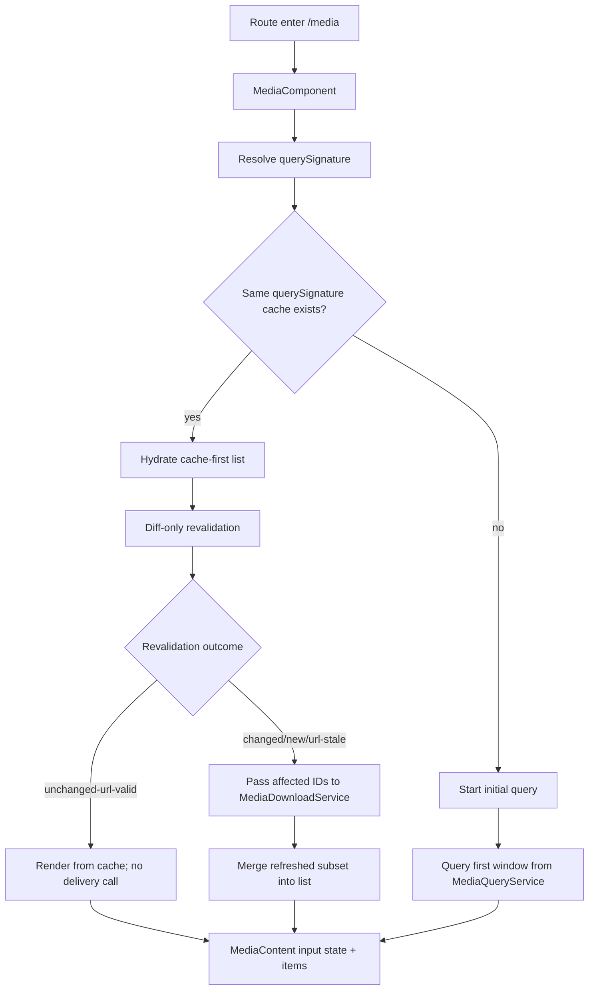
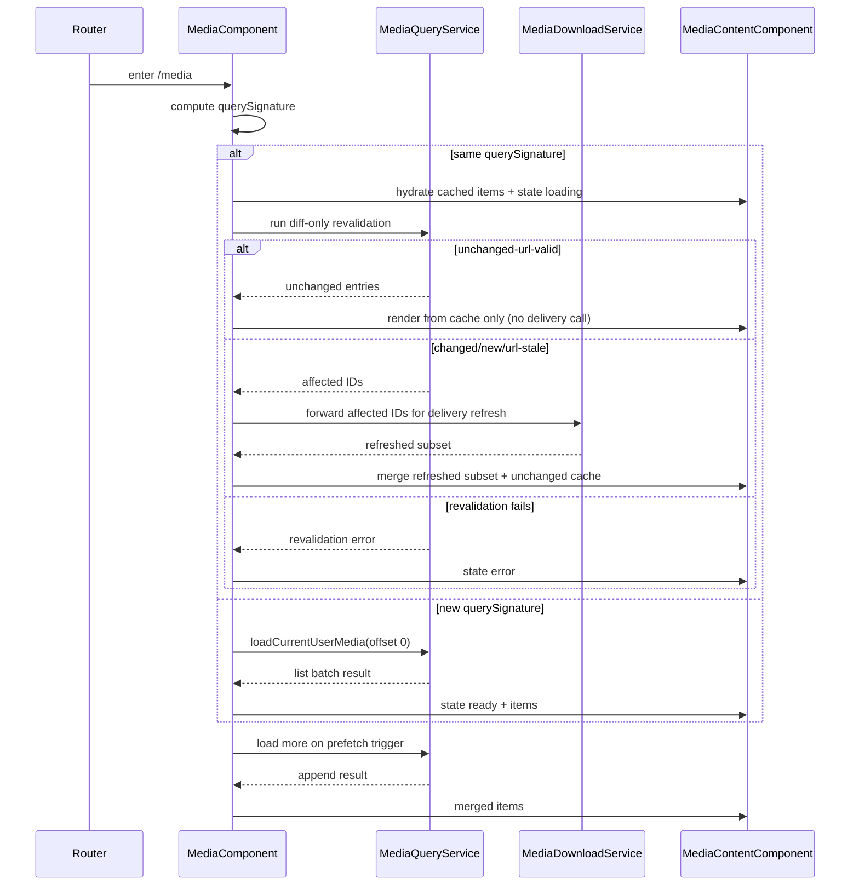

# Media Component

## What It Is

Media Component is the route-shell behavior contract for `/media`.
It MUST own shell FSM transitions, list bootstrap/pagination behavior, and escalation handling at route-shell scope.
It MUST delegate content rendering behavior to `MediaContentComponent`.

## Documentation Phase Boundary

- This refactoring pass MUST modify only the `/media` page specification set:
  - `docs/specs/page/media-page.md`
  - `docs/specs/component/media.component.md`
  - `docs/specs/component/media-content.md`
  - `docs/specs/component/media-item.md`
  - `docs/specs/component/media-display.md`
  - `docs/specs/component/media-item-quiet-actions.md`
  - `docs/specs/component/media-item-upload-overlay.md`
  - `docs/specs/component/item-grid.md` (media-path constraints only)
  - `docs/specs/component/media-page-header.md`
  - `docs/specs/component/media-toolbar.md`
- Broader documentation cleanup MUST be deferred to later phases.

## What It Looks Like

The component MUST render a stable shell structure with page header, optional `MediaToolbar`, and a content region.
The shell MUST project deterministic lifecycle states (`boot`, `initial-loading`, `ready`, `loading-more`, `append-error`, `error`, `revalidating`) to child boundaries.
Card-variant switching and operator/query command writes MUST remain shell-owned.
Visual geometry details MAY evolve independently as long as the behavior contract in this spec remains unchanged.

## Where It Lives

- Runtime file: apps/web/src/app/features/media/media.component.ts
- Template file: apps/web/src/app/features/media/media.component.html
- Parent route contract: docs/specs/page/media-page.md
- Child renderer contract: docs/specs/component/media-content.md
- Trigger: route entry to /media and user interactions that change list loading lifecycle

## Actions & Interactions

| #   | User/System Trigger                           | System Response                                                                                   | Output Contract                         |
| --- | --------------------------------------------- | ------------------------------------------------------------------------------------------------- | --------------------------------------- |
| 1   | Route enters /media                           | Shell MUST initialize and begin initial page load.                                                | state enters initial-loading            |
| 2   | Initial load succeeds                         | Shell MUST publish ready content state to child.                                                  | state enters ready                      |
| 3   | Initial load fails                            | Shell MUST publish error state with retry affordance.                                             | state enters error                      |
| 4   | User clicks retry                             | Shell MUST reset pagination and request first batch again.                                        | transition error to initial-loading     |
| 5   | User scrolls near bottom and hasMore is true  | Shell MUST request next deterministic batch.                                                      | state enters loading-more               |
| 6   | Append succeeds                               | Shell MUST merge deduplicated items and return to ready.                                          | transition loading-more to ready        |
| 7   | Append fails                                  | Shell MUST keep existing items and MUST raise recoverable page error.                             | transition loading-more to append-error |
| 8   | Auth/user context changes                     | Shell MUST reset paging and reload from offset zero.                                              | transition to initial-loading           |
| 9   | Upload completion signal arrives              | Shell MUST reset pagination and requery current route list.                                       | transition to revalidating              |
| 10  | MediaToolbar emits operator intent            | Apply command-method write (`setGroupingMode`, `setSortMode`, `setActiveFilters`, `clearFilters`) | operator/query state updated            |
| 11  | Card variant changed                          | Shell MUST persist variant setting and MUST re-render child mode.                                 | shell setting updated                   |
| 12  | Coalesced systemic media fault intent arrives | Shell MUST process one guarded shell transition for active cooldown window.                       | transition to revalidating or error     |

## Normative Boundary Contract

- This file MUST be the single source of truth for `/media` shell behavior and FSM transitions.
- `docs/specs/page/media-page.md` MUST remain the single source of truth for route composition/orchestration.
- `docs/specs/component/media-content.md` MUST remain the single source of truth for content rendering behavior.
- This file MUST NOT redefine item/domain tile visuals.

## Component Hierarchy

```text
MediaComponent
├── MediaPageHeaderComponent
├── MediaToolbar
└── MediaContentComponent
    └── ItemGridComponent + projected MediaItemComponent
```

## Data Requirements

| Field           | Source                     | Type                      | Purpose                                |
| --------------- | -------------------------- | ------------------------- | -------------------------------------- |
| mediaItems      | MediaQueryService          | ImageRecord[]             | current list payload                   |
| mediaTotalCount | MediaQueryService          | number or null            | hasMore computation                    |
| nextOffset      | pagination cursor          | number                    | next page offset                       |
| cardVariant     | CardVariantSettingsService | CardVariant               | list display mode                      |
| contentState    | internal computed state    | loading or error or ready | child renderer contract input          |
| querySignature  | MediaPageStateService      | string                    | cache namespace for route re-entry     |
| loadedWindows   | MediaPageStateService      | array                     | reused windows for same querySignature |
| indexEntries    | MediaPageStateService      | record                    | dual-staleness reconcile inputs        |



### FSM State Table

| State           | Class        | Entry Trigger                    | Exit Trigger                                                   | Forbidden Coupling                                |
| --------------- | ------------ | -------------------------------- | -------------------------------------------------------------- | ------------------------------------------------- |
| boot            | Transitional | component created                | route context resolved                                         | no item-level delivery states                     |
| initial-loading | Main         | route entry or reset             | success or failure                                             | no upload overlay state in enum                   |
| ready           | Main         | successful list resolve          | append trigger, reset, or failure                              | no media-render lifecycle states                  |
| loading-more    | Transitional | near-bottom prefetch and hasMore | append success or append failure                               | no child-level MediaDisplay transitions           |
| append-error    | Main         | append request failure           | retry append or full reset                                     | no upload lane semantics                          |
| error           | Main         | initial load failure             | retry or auth/user change                                      | no media delivery state proxy                     |
| revalidating    | Transitional | upload/auth driven refresh       | revalidation success to ready or revalidation failure to error | MUST preserve same querySignature cache namespace |

### State-to-UI Mapping Table (Mandatory)

| Shell FSM State | MediaContent-facing UI Behavior | Escalation Behavior | Escalation Trigger |
| --- | --- | --- | --- |
| `boot` | Shell MUST withhold interactive ready affordances and prepare first deterministic content projection. | Shell MUST NOT escalate. | none |
| `initial-loading` | Shell MUST project loading-state inputs to `MediaContentComponent`. | Shell MUST NOT escalate. | none |
| `ready` | Shell MUST project ready-state inputs and current items to `MediaContentComponent`. | Shell MUST remain passive for escalation until explicit fault intent arrives. | none |
| `loading-more` | Shell MUST keep existing content visible and MAY project append-progress feedback while requesting next batch. | Shell MUST NOT emit systemic escalation by default. | none |
| `append-error` | Shell MUST keep existing content visible and MUST expose recoverable append retry affordance through shell-controlled UI. | Shell SHOULD remain in recoverable mode unless a coalesced systemic fault intent arrives. | `systemicFault(intent)` from `MediaContentComponent` |
| `error` | Shell MUST project deterministic error-state inputs and retry affordance to `MediaContentComponent`. | Shell MUST represent terminal shell error for current cycle. | Revalidation failure or guarded escalation path |
| `revalidating` | Shell MUST continue rendering cached/previous stable content while refresh is in flight when available. | Shell MUST process one guarded escalation transition per cooldown window. | `systemicFault(intent)` from `MediaContentComponent` |

Escalation trigger rule:

- `systemicFault(intent)` emitted by `MediaContentComponent` MUST be treated as the child-event intent that can force a guarded parent state transition (`ready`/`append-error` -> `revalidating` or `error`).
- Per-item failures MUST NOT force parent FSM transitions directly.

### Operator/Query and Derived Ownership Contract

Lifecycle note:

- The FSM table above is lifecycle-only (`boot`, `initial-loading`, `ready`, `loading-more`, `append-error`, `error`, `revalidating`).
- Operator/query fields are deliberately separated from lifecycle transitions.

| Field              | Kind           | Write owner                                 | Read consumers          | Forbidden writers                                             |
| ------------------ | -------------- | ------------------------------------------- | ----------------------- | ------------------------------------------------------------- |
| `groupingMode`     | operator/query | `MediaComponent.setGroupingMode(...)` only  | `MediaContentComponent` | `MediaToolbar`, `MediaContentComponent`, `MediaItemComponent` |
| `sortMode`         | operator/query | `MediaComponent.setSortMode(...)` only      | `MediaContentComponent` | `MediaToolbar`, `MediaContentComponent`, `MediaItemComponent` |
| `activeFilters`    | operator/query | `MediaComponent.setActiveFilters(...)` only | `MediaContentComponent` | `MediaToolbar`, `MediaContentComponent`, `MediaItemComponent` |
| `filteredImages`   | derived        | `MediaComponent` computed derivation only   | `MediaContentComponent` | all children and toolbar                                      |
| `groupedAndSorted` | derived        | `MediaComponent` computed derivation only   | `MediaContentComponent` | all children and toolbar                                      |

Toolbar boundary:

- `MediaToolbar` emits typed intents only (`groupingChanged`, `sortChanged`, `filtersChanged`, `filtersCleared`).
- `MediaToolbar` never mutates `groupingMode`, `sortMode`, or `activeFilters` directly.

Canonical naming rule:

- Toolbar references for `/media` MUST use `MediaToolbar`.
- Non-canonical labels such as `PaneToolbar` or `ActionToolbar` MUST NOT be used as toolbar contract names in this spec.

## File Map

| File                                                 | Purpose                                  |
| ---------------------------------------------------- | ---------------------------------------- |
| apps/web/src/app/features/media/media.component.ts   | route shell orchestration and pagination |
| apps/web/src/app/features/media/media.component.html | header plus content composition          |
| apps/web/src/app/features/media/media.component.scss | page-level shell styling                 |
| docs/specs/component/media-page-header.md            | header presentation contract             |
| docs/specs/component/media-toolbar.md                | toolbar intent-only contract             |
| docs/specs/page/media-page.md                        | route-level product contract             |
| docs/specs/component/media-content.md                | child renderer state contract            |

## Wiring

MediaComponent MUST own page-level loading contract plus operator/query writes and MUST forward only stable inputs to `MediaContentComponent`.
MediaComponent MUST NOT own `MediaItem` or `MediaDisplay` delivery transitions.
Children MUST remain intent-only and read-only with respect to route lifecycle and operator/query state.



## Acceptance Criteria

- [ ] MediaComponent is the sole owner of MediaPage FSM state transitions for /media route shell behavior.
- [ ] MediaComponent exposes deterministic states boot, initial-loading, ready, loading-more, append-error, error, and revalidating.
- [ ] Route re-entry with identical querySignature hydrates from cache-first and skips full list requery.
- [ ] Revalidation after cache hydration is diff-only.
- [ ] MediaComponent reads `loadedWindows` and `indexEntries` from `MediaPageStateService` before issuing any index query.
- [ ] On revalidation, only changed/new/url-stale IDs are forwarded to `MediaDownloadService`; unchanged-url-valid IDs are rendered from cache without a delivery call.
- [ ] MediaComponent does not encode MediaDisplay delivery states in its FSM.
- [ ] MediaComponent processes only coalesced systemic media fault intents (cooldown-gated), never per-item delivery failure storms.
- [ ] Upload completion and auth changes trigger reset or revalidation through shell FSM only.
- [ ] Child MediaContentComponent receives stable state plus data inputs only.
- [ ] ng build is clean for this contract integration.
- [ ] npm run lint is clean for this contract integration.
- [x] Operator/query fields (`groupingMode`, `sortMode`, `activeFilters`) have a single writer: `MediaComponent` command methods.
- [x] `MediaToolbar` is intent-only and cannot write operator/query state directly.
- [x] `MediaContentComponent` and `MediaItemComponent` are forbidden direct writers of operator/query state.
- [x] Derived fields (`filteredImages`, `groupedAndSorted`) are computed and read-only for child consumers.
- [ ] State-to-UI mapping MUST include explicit escalation behavior for `append-error` and `revalidating`.
- [ ] Child escalation trigger MUST be explicitly defined as `systemicFault(intent)` and MUST be guarded at shell level.
- [ ] Toolbar naming MUST be canonical (`MediaToolbar`) throughout this spec.

## Canonical Name Registry Gate

- Every component name used in this spec MUST match a canonical entry in glossary/registry.
- Names that do not resolve to a canonical glossary/registry entry MUST be treated as unresolved and MUST block completion.
- This refactor pass MUST NOT create or rename glossary/registry entries outside the in-scope media-page specification set.
- If a required canonical name cannot be resolved, documentation work MUST stop with: `⚠ SPEC GAP: [missing file or ambiguous owner]`.
