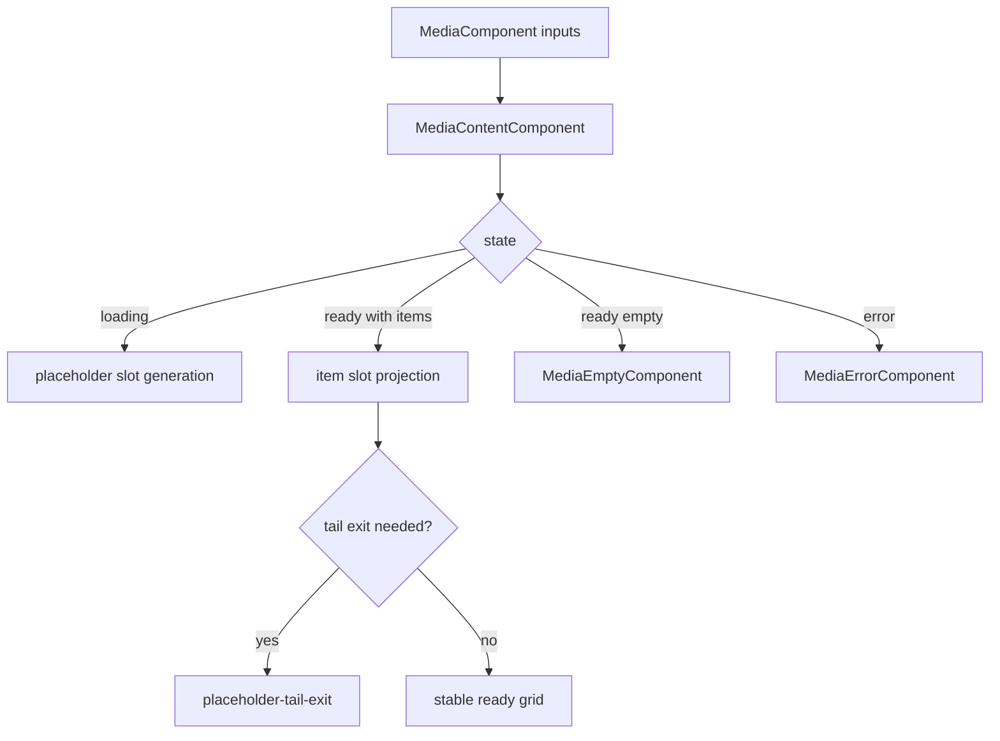
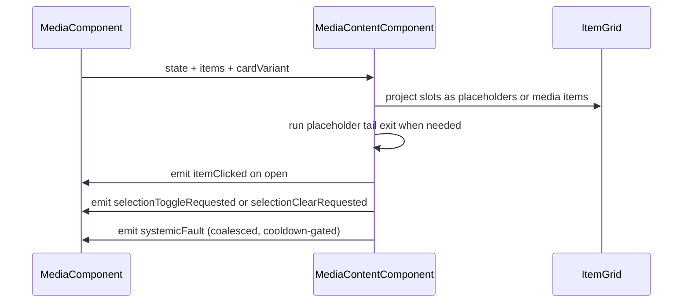

# Media Content

## What It Is

Media Content is the list-rendering behavior contract for the `/media` content region.
It MUST own content-level FSM behavior, placeholder orchestration, empty/error switching, and deterministic projection into `ItemGrid`.
It MUST NOT own route-shell transitions or cross-route pane orchestration.

## Documentation Phase Boundary

- This refactoring pass MUST modify only the `/media` page specification set:
  - `docs/specs/page/media-page.md`
  - `docs/specs/component/media/media.component.md`
  - `docs/specs/component/media/media-content.md`
  - `docs/specs/component/media/media-item.md`
  - `docs/specs/component/media/media-display.md`
  - `docs/specs/component/media/media-item-quiet-actions.md`
  - `docs/specs/component/media/media-item-upload-overlay.md`
  - `docs/specs/component/item-grid/item-grid.md` (media-path constraints only)
  - `docs/specs/component/media/media-page-header.md`
  - `docs/specs/component/media/media-toolbar.md`
- Broader documentation cleanup MUST be deferred to later phases.

## What It Looks Like

The component MUST render a stable content region with deterministic loading placeholders.
When ready data arrives, placeholder replacement MUST be deterministic and placeholder-tail-exit MUST be modeled as an explicit transitional phase.
Empty and error views MUST remain mutually exclusive with grid rendering.
Selection and context actions MUST be emitted as typed intents to the parent shell.

## Where It Lives

- Runtime file: apps/web/src/app/features/media/media-content.component.ts
- Template file: apps/web/src/app/features/media/media-content.component.html
- Parent shell contract: docs/specs/component/media/media.component.md
- Item system contract: docs/specs/component/item-grid/item-grid.md
- Trigger: MediaComponent updates state or list payload for /media content area

## Actions & Interactions

| #   | User/System Trigger                                | System Response                                                 | Output Contract                                                     |
| --- | -------------------------------------------------- | --------------------------------------------------------------- | ------------------------------------------------------------------- |
| 1   | Input state is loading                             | Render deterministic placeholder slot set                       | view enters loading-grid                                            |
| 2   | Input state is ready with items                    | Render projected media item slots                               | view enters ready-with-items                                        |
| 3   | Input state is ready with zero items               | Render empty state component                                    | view enters ready-empty                                             |
| 4   | Input state is error                               | Render error state component with retry affordance              | view enters error                                                   |
| 5   | Ready item count smaller than placeholder snapshot | Activate placeholder tail exit transition                       | view enters placeholder-tail-exit                                   |
| 6   | Placeholder exit timer completes                   | Remove tail placeholders                                        | transition placeholder-tail-exit to ready-with-items or ready-empty |
| 7   | User opens media item                              | Emit itemClicked output                                         | itemClicked event                                                   |
| 8   | User toggles item selection                        | Emit typed selection intent to parent shell                     | `selectionToggleRequested(mediaId)`                                 |
| 9   | User clicks outside grid while ready               | Emit typed clear-selection intent to parent shell               | `selectionClearRequested()`                                         |
| 10  | Coalesced systemic media fault signal is received  | Emit one shell escalation intent for the active cooldown window | `systemicFault(intent)`                                             |

## Normative Boundary Contract

- This file MUST be the single source of truth for `MediaContentComponent` render-state behavior.
- `docs/specs/component/media/media.component.md` MUST remain the single source of truth for `/media` shell FSM behavior.
- This file MUST NOT redefine route-shell state transitions.
- This file MUST NOT define item/domain tile visual details beyond content-level projection contracts.

## Component Hierarchy

```text
MediaContentComponent
├── ItemGridComponent
│   └── projected MediaItemComponent or placeholder slots
├── MediaEmptyComponent
└── MediaErrorComponent
```

## Data Requirements

| Field                           | Source                               | Type                             | Purpose                                      |
| ------------------------------- | ------------------------------------ | -------------------------------- | -------------------------------------------- |
| state                           | parent media shell                   | loading or error or ready        | primary render switch                        |
| items                           | parent media shell                   | ImageRecord[]                    | grid payload                                 |
| emptyReason                     | parent media shell                   | auth-required or no-results      | empty-state message contract                 |
| cardVariant                     | parent media shell                   | CardVariant                      | item mode mapping                            |
| loadingPlaceholderCount         | internal computed                    | number                           | deterministic placeholder slot volume        |
| loadingPlaceholderSnapshotCount | internal signal                      | number                           | tail exit baseline                           |
| placeholderExitActive           | internal signal                      | boolean                          | transitional placeholder tail phase          |
| gridSlots                       | internal computed                    | MediaContentGridSlot[]           | projected slot model                         |
| systemicFaultIntent             | MediaDownloadService boundary signal | SystemicMediaFaultIntent \| null | storm-safe coalesced shell escalation signal |

### Read-only Consumption and Typed Intent Outputs

`MediaContentComponent` MUST consume lifecycle/operator/derived inputs as read-only values.
It MUST NOT mutate route lifecycle state, operator/query state, or cross-route pane state.

Typed output intents (intent-only child contract):

- `itemClicked(mediaId: string)`
- `selectionToggleRequested(mediaId: string)`
- `selectionClearRequested()`
- `systemicFault(intent: SystemicMediaFaultIntent)`

### MediaToolbar Visual Contract Reference (Owned Spec)

- `docs/specs/component/media/media-toolbar.md` MUST be the single source of truth for `MediaToolbar` visual and intent behavior.
- This file MUST reference `MediaToolbar` ownership and MUST NOT duplicate per-control behavior tables owned by the toolbar spec.
- `MediaToolbar` remains intent-only; `MediaComponent` remains the single writer for `groupingMode`, `sortMode`, and `activeFilters`.
- Toolbar references for `/media` MUST use `MediaToolbar`; non-canonical aliases such as `PaneToolbar` and `ActionToolbar` MUST NOT be used.



### FSM State Table

| State                 | Class        | Entry Trigger                                      | Exit Trigger                              | Forbidden Coupling                    |
| --------------------- | ------------ | -------------------------------------------------- | ----------------------------------------- | ------------------------------------- |
| loading-grid          | Main         | parent state loading                               | parent state ready or error               | no MediaDisplay delivery states       |
| ready-with-items      | Main         | parent ready and items length greater than zero    | parent error, loading, or tail exit start | no upload lane state in enum          |
| ready-empty           | Main         | parent ready and items length equals zero          | parent loading or error                   | no MediaItem delivery state proxy     |
| error                 | Main         | parent state error                                 | retry or parent loading                   | no parent route-shell states in enum  |
| placeholder-tail-exit | Transitional | ready transition with surplus placeholder snapshot | timer completion                          | no cross-component FSM state transfer |

## File Map

| File                                                         | Purpose                                 |
| ------------------------------------------------------------ | --------------------------------------- |
| apps/web/src/app/features/media/media-content.component.ts   | content state orchestration and outputs |
| apps/web/src/app/features/media/media-content.component.html | render switch and projected item slots  |
| apps/web/src/app/features/media/media-content.component.scss | content-region visuals and transitions  |
| docs/specs/component/media/media.component.md                      | parent shell FSM ownership              |
| docs/specs/component/item-grid/item-grid.md                            | projected grid system contract          |

## Wiring

MediaContentComponent MUST consume parent state inputs and MUST emit typed user intents only.
MediaContentComponent MUST NOT own route-shell loading policy, operator/query writes, or MediaDisplay delivery choreography.
Per-item media delivery failures MUST NOT be forwarded upward one-by-one; only coalesced systemic intents from media-delivery boundary are allowed for shell escalation.



## Acceptance Criteria

- [ ] MediaContentComponent is the sole owner of MediaContent FSM transitions for content rendering states.
- [ ] MediaContent FSM includes loading-grid, ready-with-items, ready-empty, error, and placeholder-tail-exit.
- [ ] Empty and error rendering remain mutually exclusive with grid rendering.
- [ ] Placeholder tail exit is modeled as an explicit transitional state.
- [ ] MediaContent FSM does not include MediaDisplay delivery states.
- [ ] MediaContent FSM does not include upload lane states.
- [ ] Selection actions are forwarded without redefining item-render delivery lifecycle.
- [ ] MediaContent forwards at most one systemic fault escalation intent per active cooldown window.
- [ ] Per-item delivery failures are not bubbled directly to MediaComponent.
- [ ] ng build is clean for this contract integration.
- [ ] npm run lint is clean for this contract integration.
- [x] MediaContent consumes lifecycle/operator/derived inputs as read-only values.
- [x] MediaContent emits typed intents only and does not directly mutate `groupingMode`, `sortMode`, or `activeFilters`.
- [x] Selection changes are emitted as parent intents (`selectionToggleRequested`, `selectionClearRequested`) and not written directly by the child.
- [x] Systemic escalation is forwarded only as coalesced intent events; per-item failure storms are forbidden.
- [ ] This file MUST reference `docs/specs/component/media/media-toolbar.md` as the owning visual/intent contract for `MediaToolbar`.
- [ ] This file MUST NOT duplicate per-control toolbar behavior tables owned by the dedicated toolbar spec.
- [ ] All enforceable statements in this file MUST use RFC 2119 language (`MUST`, `SHOULD`, `MAY`).

## Canonical Name Registry Gate

- Every component name used in this spec MUST match a canonical entry in glossary/registry.
- Names that do not resolve to a canonical glossary/registry entry MUST be treated as unresolved and MUST block completion.
- This refactor pass MUST NOT create or rename glossary/registry entries outside the in-scope media-page specification set.
- If a required canonical name cannot be resolved, documentation work MUST stop with: `⚠ SPEC GAP: [missing file or ambiguous owner]`.
