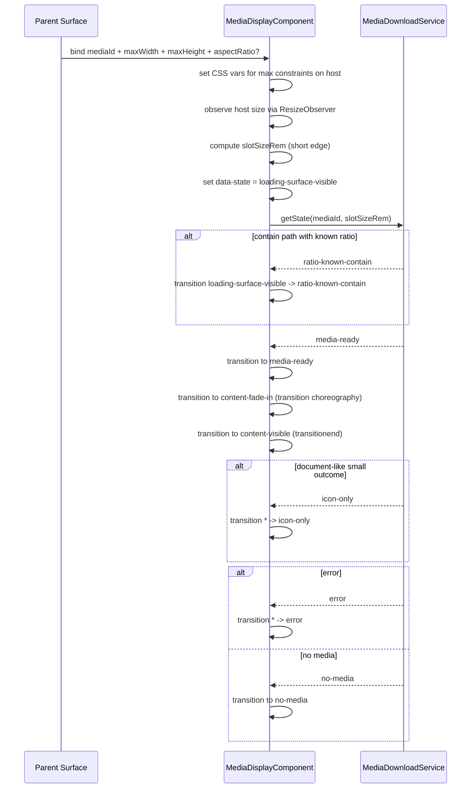

# Media Display

## What It Is

Media Display is the reusable media-rendering contract for Feldpost surfaces.
It MUST own the full media download lifecycle for a single `mediaId`.
It MUST render deterministic states (`idle`, `loading-surface-visible`, `ratio-known-contain`, `media-ready`, `content-fade-in`, `content-visible`, `icon-only`, `error`, `no-media`) without any grid or interaction-layer knowledge.

## Documentation Phase Boundary

- This refactoring pass MUST modify only the `/media` page specification set:
  - `docs/specs/page/media-page.md`
  - `docs/specs/component/media/media.component.md`
  - `docs/specs/component/media/media-content.md`
  - `docs/specs/component/media/media-item.md`
  - `docs/specs/component/media/media-display.md`
  - `docs/specs/component/media/media-item-quiet-actions.md`
  - `docs/specs/component/media/media-item-upload-overlay.md`
  - `docs/specs/component/item-grid/item-grid.md` (media-path constraints only)
  - `docs/specs/component/media/media-page-header.md`
  - `docs/specs/component/media/media-toolbar.md`
- Broader documentation cleanup MUST be deferred to later phases.

## What It Looks Like

The component renders one stable media viewport and keeps geometry stable from first paint. On media handoff, it immediately enters `loading-surface-visible` so users always get deterministic feedback, including cache-hit paths. In contain mode it stabilizes ratio before content reveal (`ratio-known-contain`), while cover mode skips that phase and proceeds directly to media readiness. Content entry is token-driven (`media-ready` -> `content-fade-in` -> `content-visible`) and must never use hardcoded timing. Error and no-media are visually distinct and render-only in this component; action UI is owned by parent shells.

## Where It Lives

- Spec location: `docs/specs/component/media/media-display.md`
- Service contract dependency: `docs/specs/service/media-download-service/media-download-service.md`
- Primary code location: `apps/web/src/app/shared/media-display/`
- Initial consumers:
  - `MediaItemComponent`
  - map marker media surfaces
  - media detail hero or card views
- Trigger: any UI that needs media rendering by identity (`mediaId`) with deterministic download-state visualization

## Actions & Interactions

| #   | System Trigger                                       | System Response                                                                                                                      | Trigger               |
| --- | ---------------------------------------------------- | ------------------------------------------------------------------------------------------------------------------------------------ | --------------------- |
| 1   | Component instantiates without `mediaId`             | Component MUST enter `idle` and MUST render neutral idle shell.                                                                      | `mediaId` missing     |
| 2   | `mediaId` is provided or changed                     | Component MUST enter `loading-surface-visible` and MUST subscribe to `MediaDownloadService.getState(mediaId, slotSizeRem)`.         | input change          |
| 3   | Service reports contain path and ratio becomes known | Component MUST enter `ratio-known-contain` to stabilize geometry before content reveal.                                              | service state update  |
| 4   | Service reports media asset readiness                | Component MUST enter `media-ready`.                                                                                                  | service state update  |
| 5   | Transition choreography starts content reveal        | Component MUST enter `content-fade-in`.                                                                                              | CSS transition start  |
| 6   | Content reveal transition completes                  | Component MUST enter `content-visible`.                                                                                              | CSS transition event  |
| 7   | Service reports explicit `no-media` outcome          | Component MUST enter `no-media` without error semantics.                                                                             | service state update  |
| 8   | Service reports explicit `error` outcome             | Component MUST enter `error` as render-only surface state.                                                                           | service state update  |
| 9   | Service reports non-previewable document-like small  | Component MUST enter `icon-only` and MUST render icon surface without image request.                                                 | service state update  |
| 10  | Parent provides `maxWidth` and `maxHeight`           | Component MUST apply `--media-display-max-width` and `--media-display-max-height` on host.                                          | input change          |
| 11  | Parent provides `aspectRatio` hint                   | Component MUST apply `--media-aspect-ratio` until metadata ratio is known.                                                          | input change          |
| 12  | Service publishes metadata ratio                     | Component MUST replace or confirm `--media-aspect-ratio` value without layout jump.                                                 | metadata update       |
| 13  | Component host is resized                            | Component MUST measure short edge via `ResizeObserver`, convert to `rem`, update `slotSizeRem`, and request deterministic delivery reevaluation. | resize observer event |
| 14  | Cached asset is available                            | Component MUST preserve deterministic ordering: `loading-surface-visible` remains first; direct shortcuts to `content-visible` are forbidden. | cache hit             |
| 15  | Reduced motion is requested                          | Component MUST use global motion policy and MUST NOT implement local motion branching.                                               | global CSS policy     |
| 16  | Parent re-enters route with unchanged querySignature | Component MUST consume cache-hydrated media source and continue deterministic delivery flow; it MUST NOT trigger a full list requery. | route re-entry        |

## Normative Boundary Contract

- This file MUST be the single source of truth for `MediaDisplayComponent` delivery/render state behavior.
- `docs/specs/component/media/media-item.md` MUST remain the single source of truth for media-item interaction-shell behavior.
- This file MUST NOT define route-shell lifecycle behavior.
- This file MUST NOT define upload-lane state ownership.

## Component Hierarchy

```text
MediaDisplayComponent
├── media-display__viewport (single geometry owner)
│   ├── media-display__layer--loading-surface
│   ├── media-display__layer--staged-content
│   ├── media-display__layer--content
│   ├── media-display__layer--icon-only
│   ├── media-display__layer--error
│   └── media-display__layer--no-media
```

## Data Requirements

Media Display does not call Supabase directly. It consumes one identity input (`mediaId`) and one service stream from `MediaDownloadService`.

### Data Flow (Mermaid)

```mermaid
flowchart TD
  A[Parent component] --> B[MediaDisplayComponent]
  B --> C[mediaId]
  B --> D[maxWidth and maxHeight constraints]
  B --> E[aspectRatio hint optional]
  B --> F[ResizeObserver short edge measurement]
  F --> G[slotSizeRem]
  C --> H[MediaDownloadService.getState(mediaId, slotSizeRem)]
  G --> H
  H --> I[state + urls + metadata ratio]
  D --> J[--media-display-max-width and --media-display-max-height]
  I --> K[data-state on host]
  I --> L[layer rendering]
  E --> M[--media-aspect-ratio fallback]
  I --> M
```

| Field                 | Source                                         | Type                                                                                                                                                    | Purpose                                                                       |
| --------------------- | ---------------------------------------------- | ------------------------------------------------------------------------------------------------------------------------------------------------------- | ----------------------------------------------------------------------------- |
| `mediaId`             | parent                                         | `string`                                                                                                                                                | Primary identity for media state subscription                                 |
| `maxWidth`            | parent                                         | `string`                                                                                                                                                | Maximum allowed inline size as CSS value (`rem`, `%`, `vw`, etc.)             |
| `maxHeight`           | parent                                         | `string`                                                                                                                                                | Maximum allowed block size as CSS value (`rem`, `%`, `vh`, etc.)              |
| `aspectRatio`         | parent hint                                    | `number \| null`                                                                                                                                        | Optional ratio hint before service metadata arrives                           |
| `slotSizeRem`         | internal measurement                           | `number`                                                                                                                                                | Host short-edge size in `rem` used for service tier resolution                |
| `deliveryState`       | `MediaDownloadService` + renderer choreography | `'loading-surface-visible' \| 'ratio-known-contain' \| 'media-ready' \| 'content-fade-in' \| 'content-visible' \| 'icon-only' \| 'error' \| 'no-media'` | Canonical delivery vocabulary across service handoff and renderer transitions |
| `resolvedUrl`         | `MediaDownloadService`                         | `string \| null`                                                                                                                                        | Active sharp tier URL                                                         |
| `stagedContentUrl`    | `MediaDownloadService`                         | `string \| null`                                                                                                                                        | Cached or staged content URL used before final reveal                         |
| `metadataAspectRatio` | `MediaDownloadService`                         | `number \| null`                                                                                                                                        | Authoritative ratio from media metadata                                       |

## Tier Resolution Contract

`MediaDisplayComponent` resolves requested media quality by passing `mediaId` and internally measured `slotSizeRem` (short edge) to `MediaDownloadService`. Tier-selection logic is fully owned by `MediaDownloadService`; this component only supplies measured size and renders the returned state.

Tier thresholds are defined in `MediaDownloadService`, not in `MediaDisplayComponent`.

### Photos and Videos (always bitmap)

| slotSizeRem (short edge) | Requested tier |
| ------------------------ | -------------- |
| `< 4rem`                 | `thumbnail-xs` |
| `4 - 8rem`               | `thumbnail-sm` |
| `8 - 16rem`              | `thumbnail-md` |
| `>= 16rem`               | `thumbnail-lg` |

### Documents, Audio, and Other Non-Photo/Video Types

| slotSizeRem (short edge) | Requested tier                                             |
| ------------------------ | ---------------------------------------------------------- |
| `< 8rem`                 | `icon-only` (no image request)                             |
| `8 - 12rem`              | first-page preview if available, else `icon-only`          |
| `>= 12rem`               | high-res first-page preview if available, else `icon-only` |

`icon-only` is a service-level signal, not a component decision. The component may render `icon-only` only when explicitly returned by `MediaDownloadService`.

## Geometry Ownership Between MediaDisplay and Parent

`MediaDisplayComponent` is strictly parent-constrained. The parent defines both width and height limits (`maxWidth`, `maxHeight`). The component may provide an intrinsic ratio hint (`--media-aspect-ratio`), but this only influences preferred shape inside parent constraints and must never override those limits.

## Geometry Dependency Contract

| Dimension    | Constraint Owner | Intrinsic Shape Owner | Mechanism                                                                                                                         |
| ------------ | ---------------- | --------------------- | --------------------------------------------------------------------------------------------------------------------------------- |
| width        | parent           | n/a                   | Parent sets `maxWidth`; component clamps inline size to that limit and never exceeds it.                                          |
| height       | parent           | component             | Parent sets `maxHeight`; component computes preferred block size from aspect ratio and clamps to parent height limit.             |
| aspect ratio | component        | component             | Component sets `--media-aspect-ratio` from hint/metadata; this changes preferred shape only, not ownership of height constraints. |

### CSS Variable Ownership & Dependency Matrix

| CSS Variable                   | Set By                                            | Consumed By                  | Dependency Type  | Why                                                                                       |
| ------------------------------ | ------------------------------------------------- | ---------------------------- | ---------------- | ----------------------------------------------------------------------------------------- |
| `--media-display-max-width`    | parent value forwarded through component input    | `:host` sizing rules         | parent-dependent | Width limit is an external layout contract and must be controlled by the parent surface.  |
| `--media-display-max-height`   | parent value forwarded through component input    | `:host` sizing rules         | parent-dependent | Height limit is an external layout contract and must be controlled by the parent surface. |
| `--media-aspect-ratio`         | component (`aspectRatio` hint + service metadata) | `:host` `aspect-ratio`       | self-set         | Ratio is media-intrinsic rendering knowledge and belongs to the renderer.                 |
| `--transition-*` design tokens | global design system/theme                        | state layers and transitions | global-dependent | Motion semantics are centralized and must not be duplicated per component.                |

Child dependency note:

- No child component may set geometry-driving CSS variables for `MediaDisplayComponent`.
- Geometry authority remains parent constraints + media-display intrinsic ratio only.

## State

### Public Inputs

| Input         | Type             | Purpose                                                            |
| ------------- | ---------------- | ------------------------------------------------------------------ |
| `mediaId`     | `string`         | Primary identity for internal media download subscription          |
| `maxWidth`    | `string`         | CSS max-width constraint (for example `4rem`, `100%`, `60vw`)      |
| `maxHeight`   | `string`         | CSS max-height constraint (for example `4rem`, `100%`, `60vh`)     |
| `aspectRatio` | `number \| null` | Optional ratio hint to avoid layout shift before metadata resolves |

`slotSizeRem` is not a public input. It is measured internally from host size.

No URL input is allowed. No load-state input is allowed. No boolean visual-state inputs are allowed.

### State Enum

```typescript
export type MediaDisplayState =
  | "idle"
  | "loading-surface-visible"
  | "ratio-known-contain"
  | "media-ready"
  | "content-fade-in"
  | "content-visible"
  | "icon-only"
  | "error"
  | "no-media";
```

### FSM State Table

| State                     | Class        | Entry trigger                                   | Exit trigger                             | Forbidden coupling                                   |
| ------------------------- | ------------ | ----------------------------------------------- | ---------------------------------------- | ---------------------------------------------------- |
| `idle`                    | Main         | no valid `mediaId`                              | valid `mediaId` bind                     | Must not consume upload state                        |
| `loading-surface-visible` | Main         | `mediaId` handoff or cache-hydrated replay      | service delivery event                   | Must stay independent from item selection/upload FSM |
| `ratio-known-contain`     | Transitional | contain-path ratio metadata event               | `media-ready` or error/no-media          | Cover path must not enter this state                 |
| `media-ready`             | Transitional | service marks asset ready                       | `content-fade-in` or icon/error/no-media | Must not be driven by parent booleans                |
| `content-fade-in`         | Transitional | reveal choreography starts                      | `transitionend` to `content-visible`     | Timers without transition events are forbidden       |
| `content-visible`         | Main         | reveal transition completed                     | new handoff or service branch change     | Direct shortcuts from loading states are forbidden   |
| `icon-only`               | Main         | service returns document-like small-slot branch | new handoff or no-media                  | Must not be entered by photo/video branch            |
| `error`                   | Main         | service error event                             | retry-driven re-entry or no-media        | Retry ownership is external to this renderer         |
| `no-media`                | Main         | missing-path or explicit no-media signal        | new valid handoff                        | Must stay distinct from error                        |

### State Classification Matrix

| State                     | Class        | HTML/CSS shape                                                 | Clear-text meaning                             |
| ------------------------- | ------------ | -------------------------------------------------------------- | ---------------------------------------------- |
| `idle`                    | Main         | Neutral idle shell; no content layer active                    | Component is mounted without valid `mediaId`   |
| `loading-surface-visible` | Main         | Loading surface visible with stable geometry                   | Immediate user feedback after handoff          |
| `ratio-known-contain`     | Transitional | Loading/staged layers remain; ratio lock-in occurs             | Contain-only ratio stabilization before reveal |
| `media-ready`             | Transitional | Staged content available in DOM; final content not yet visible | Asset is ready for controlled reveal           |
| `content-fade-in`         | Transitional | Content layer fades in using tokens                            | Transition bridge to final visible state       |
| `content-visible`         | Main         | Final content layer visible                                    | Final steady visual state                      |
| `icon-only`               | Main         | Icon layer visible, no image required                          | Document-like small-area fallback              |
| `error`                   | Main         | Error layer visible, render-only                               | Service-reported failure outcome               |
| `no-media`                | Main         | No-media layer visible, render-only                            | Service-reported intentional absence           |

### Transition Map

```typescript
export const MEDIA_DISPLAY_TRANSITIONS: Record<
  MediaDisplayState,
  MediaDisplayState[]
> = {
  idle: ["loading-surface-visible"],
  "loading-surface-visible": [
    "ratio-known-contain",
    "media-ready",
    "icon-only",
    "error",
    "no-media",
  ],
  "ratio-known-contain": ["media-ready", "error", "no-media"],
  "media-ready": ["content-fade-in", "icon-only", "error", "no-media"],
  "content-fade-in": ["content-visible", "icon-only", "error", "no-media"],
  "content-visible": [
    "loading-surface-visible",
    "icon-only",
    "error",
    "no-media",
  ],
  "icon-only": ["loading-surface-visible", "no-media"],
  error: ["loading-surface-visible", "no-media"],
  "no-media": ["loading-surface-visible", "error"],
};
```

### Transition Guard Contract

- Every state transition must be validated against the transition map.
- The root host is bound by one visual-state driver only: `[attr.data-state]="state()"`.
- Template and SCSS are forbidden from using boolean visual-state flags as primary state drivers.
- Cached paths must preserve deterministic ordering and may not skip `loading-surface-visible`.
- Upload state and delivery/render state are orthogonal concerns and must never share enum values or component inputs.
- Forbidden shortcuts: `idle -> content-visible`, `loading-surface-visible -> content-visible`, `ratio-known-contain -> content-visible`.
- `ratio-known-contain` is contain-path only; cover-path flows must skip this state.
- Transient-state exits are controlled by `transitionend`, never by `setTimeout` magic numbers.

### Transition Choreography Table (Required Before CSS)

| from -> to                                       | step | element                    | property     | timing token                 | delay                            |
| ------------------------------------------------ | ---- | -------------------------- | ------------ | ---------------------------- | -------------------------------- |
| `loading-surface-visible -> ratio-known-contain` | 1    | viewport                   | aspect-ratio | `var(--transition-geometry)` | 0                                |
| `loading-surface-visible -> media-ready`         | 1    | staged content layer       | opacity 0->1 | `var(--transition-fade-in)`  | 0                                |
| `media-ready -> content-fade-in`                 | 1    | content layer              | opacity 0->1 | `var(--transition-fade-in)`  | `var(--transition-reveal-delay)` |
| `content-fade-in -> content-visible`             | 1    | staged content layer       | opacity 1->0 | `var(--transition-fade-out)` | 0                                |
| `loading-surface-visible -> icon-only`           | 1    | icon layer                 | opacity 0->1 | `var(--transition-fade-in)`  | `var(--transition-reveal-delay)` |
| `content-visible -> icon-only`                   | 1    | content layer              | opacity 1->0 | `var(--transition-fade-out)` | 0                                |
| `any -> error`                                   | 1    | active content/stage layer | opacity 1->0 | `var(--transition-fade-out)` | 0                                |
| `any -> error`                                   | 2    | error frame                | opacity 0->1 | `var(--transition-fade-in)`  | `var(--transition-reveal-delay)` |

State rendering matrix, visual behavior / ownership triad, internal behavior, and non-ownership list: **[media-display.rendering-matrix.supplement.md](./media-display.rendering-matrix.supplement.md)**.

## File Map

| File                                                                 | Purpose                                               |
| -------------------------------------------------------------------- | ----------------------------------------------------- |
| `apps/web/src/app/shared/media-display/media-display.component.ts`   | Internal state orchestration and service subscription |
| `apps/web/src/app/shared/media-display/media-display.component.html` | Layered state template driven by `data-state`         |
| `apps/web/src/app/shared/media-display/media-display.component.scss` | State-layer visuals and tokenized transitions         |
| `apps/web/src/app/shared/media-display/media-display-state.ts`       | Enum and transition map contracts                     |

## Wiring

### Parent Contract

- Parent passes `mediaId`, `maxWidth`, `maxHeight`, and optional `aspectRatio`.
- Parent does not pass URLs or load-state booleans.
- Parent does not coordinate internal media lifecycle transitions.

### Service Contract

- `MediaDisplayComponent` injects `MediaDownloadService`.
- It subscribes to `getState(mediaId, slotSizeRem)` and maps service delivery semantics to `MediaDisplayState`.
- Retry ownership remains in `MediaDownloadService` and/or parent shells; this component is render-only.

### Wiring Sequence (Mermaid)



## Acceptance Criteria

- [ ] The component exposes exactly four inputs: `mediaId`, `maxWidth`, `maxHeight`, and `aspectRatio`.
- [ ] `mode` input does not exist on this component.
- [ ] The component exposes no URL input and no load-state input.
- [ ] The component exposes no boolean visual-state inputs.
- [ ] `maxWidth` and `maxHeight` are applied on host as `--media-display-max-width` and `--media-display-max-height`.
- [ ] The component never sets explicit pixel width or height; sizing remains constraint-driven.
- [ ] Slot size is measured internally via `ResizeObserver` and converted to `rem`.
- [ ] `slotSizeRem` is passed to `MediaDownloadService` on every resize.
- [ ] All state transitions are deterministic and pass transition-map validation.
- [ ] Root visual state is driven only by `[attr.data-state]="state()"`.
- [ ] `mediaId` changes trigger `loading-surface-visible` and a fresh `MediaDownloadService.getState(mediaId, slotSizeRem)` subscription.
- [ ] The state model uses `idle`, `loading-surface-visible`, `ratio-known-contain`, `media-ready`, `content-fade-in`, `content-visible`, `icon-only`, `error`, and `no-media`.
- [ ] Cached paths preserve deterministic ordering and never skip directly to `content-visible`.
- [ ] Route re-entry with unchanged querySignature consumes cache-hydrated source and does not trigger full list requery from this component boundary.
- [ ] Forbidden shortcuts are enforced: `idle -> content-visible`, `loading-surface-visible -> content-visible`, `ratio-known-contain -> content-visible`.
- [ ] Contain path uses `ratio-known-contain` before content reveal.
- [ ] Cover path skips `ratio-known-contain` and continues via `media-ready`.
- [ ] `content-fade-in` is treated as a transitional state and exits only via `transitionend`.
- [ ] `icon-only` state is only entered when the service explicitly returns it.
- [ ] Photos and videos never enter `icon-only` regardless of slot size; they always receive tier-appropriate bitmap previews.
- [ ] Documents, audio, and other non-photo/video types enter `icon-only` when slot short edge is below `8rem`.
- [ ] Slot-size threshold changes trigger a fresh service request and smooth transition between tiers/states.
- [ ] Error rendering in this component has no retry button or other action controls.
- [ ] Retry behavior is owned by `MediaDownloadService` and/or parent shells.
- [ ] Upload state is not represented in `MediaDisplayState` and is not accepted as a visual-state input.
- [ ] No-media is visually distinct from error.
- [ ] Aspect ratio is stable from first paint via `--media-aspect-ratio` with `1/1` fallback.
- [ ] The component never owns grid slot geometry, upload overlays, selection, quiet actions, retry action ownership, border, outline, or border-radius.
- [ ] Transient exits are implemented via `transitionend`, not `setTimeout`.
- [ ] `prefers-reduced-motion` remains globally owned (no local override logic).
- [ ] `ng build` is clean after integration.
- [ ] `npm run lint` is clean after integration.

## Canonical Name Registry Gate

- Every component name used in this spec MUST match a canonical entry in glossary/registry.
- Names that do not resolve to a canonical glossary/registry entry MUST be treated as unresolved and MUST block completion.
- This refactor pass MUST NOT create or rename glossary/registry entries outside the in-scope media-page specification set.
- If a required canonical name cannot be resolved, documentation work MUST stop with: `⚠ SPEC GAP: [missing file or ambiguous owner]`.

