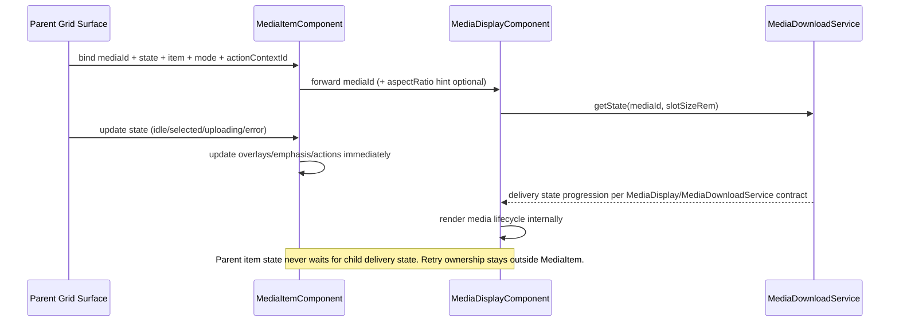

# Media Item

## What It Is

Media Item is the grid-item interaction contract for one media entity in Item Grid surfaces.
It MUST own grid-level visuals and interactions (selection emphasis, upload overlay, quiet actions).
It MUST delegate all media download and rendering lifecycle responsibilities to `MediaDisplayComponent`.

## Documentation Phase Boundary

- This refactoring pass MUST modify only the `/media` page specification set:
  - `docs/specs/page/media-page.md`
  - `docs/specs/component/media/media.component.md`
  - `docs/specs/component/media/media-content.md`
  - `docs/specs/component/media/media-item.md`
  - `docs/specs/component/media/media-display.md`
  - `docs/specs/component/media/media-item-quiet-actions.md`
  - `docs/specs/component/media/media-item-upload-overlay.md`
  - `docs/specs/component/item-grid/item-grid.md` (media-path constraints only)
  - `docs/specs/component/media/media-page-header.md`
  - `docs/specs/component/media/media-toolbar.md`
- Broader documentation cleanup MUST be deferred to later phases.

## What It Looks Like

The component renders one stable item shell with media content in the base layer, upload overlay above it, and quiet actions on top. Selection emphasis is applied around the media frame and never around the full tile wrapper. Upload state is visible as a dedicated overlay layer and does not interfere with media loading visuals. Quiet actions stay hidden at rest and reveal on hover/focus with keyboard-accessible controls. Media delivery FSM details are not visualized by this component directly and remain delegated to the media renderer/service chain (`MediaDisplayComponent` + `MediaDownloadService`).
When `item` is `null`, the host renders an icon-free skeleton rectangle in the exact media-item geometry and keeps interaction layers disabled.

**Row mode (`mode === 'row'`):** dense horizontal scan row — square thumb on the left, primary + secondary text on the right, `3rem` min row height (search-bar result density). Full contract: [media-item.row-mode.supplement.md](media-item.row-mode.supplement.md).

## Where It Lives

- Spec location: `docs/specs/component/media/media-item.md`
- Parent spec: `docs/specs/component/item-grid/item-grid.md`
- Media renderer dependency: `docs/specs/component/media/media-display.md`
- Upload overlay dependency: `docs/specs/component/media/media-item-upload-overlay.md`
- Quiet-actions dependency: `docs/specs/component/media/media-item-quiet-actions.md`
- Service contract reference: `docs/specs/service/media-download-service/media-download-service.md`
- Runtime location: `apps/web/src/app/shared/media-item/media-item.component.ts`
- Map picker: [media-item-map-action.md](media-item-map-action.md); glossary: [media-locations.zoomable-map-contract.supplement.md](../../service/media-locations/media-locations.zoomable-map-contract.supplement.md)

## Actions & Interactions

| #   | User Action / System Trigger                            | System Response                                                   | Trigger                     |
| --- | ------------------------------------------------------- | ----------------------------------------------------------------- | --------------------------- |
| 1   | Item is rendered in grid context                        | Component MUST compose `MediaDisplayComponent` + upload overlay + quiet actions. | component init              |
| 2   | Parent provides `mediaId`                               | Component MUST forward `mediaId` directly to `MediaDisplayComponent`. | input change                |
| 3   | Parent sets visual state to `selected`                  | Component MUST render selected emphasis around media frame.       | `state='selected'`          |
| 4   | Parent sets visual state to `uploading`                 | Component MUST show upload overlay layer.                         | `state='uploading'`         |
| 5   | Parent sets visual state to `error`                     | Component MUST show item-level error treatment for interaction layer. | `state='error'`             |
| 6   | Parent sets visual state to `idle`                      | Component MUST hide selected/upload/error-only treatments.        | `state='idle'`              |
| 7   | User hovers/focuses item                                | Component MUST reveal quiet actions in deterministic tokenized timing. | hover/focus                 |
| 8   | User activates select/map action                        | Map: `app-media-item-map-action` per [supplement §3](../../service/media-locations/media-locations.zoomable-map-contract.supplement.md#3-tile-map-affordance-table-canonical); gate via `mediaHasZoomableLocation` (zoomable count 0 → map disabled). | click/keyboard              |
| 9   | `MediaDisplayComponent` changes internal delivery state | Component MUST keep `MediaItemState` unchanged and MUST NOT wait on child delivery state. | child internal state change |
| 10  | Upload phase updates                                    | Component MUST update overlay content and progress visuals.       | upload stream               |

## Normative Boundary Contract

- This file MUST be the single source of truth for `MediaItemComponent` interaction-shell behavior.
- `docs/specs/component/media/media-display.md` MUST remain the single source of truth for media delivery/render FSM behavior.
- This file MUST NOT redefine route-shell lifecycle state transitions.
- This file MUST NOT redefine toolbar/query command ownership.

## Component Hierarchy

```text
MediaItemComponent
├── [grid modes] .media-item__slot
│   ├── MediaDisplayComponent         (owns media rendering + download states)
│   ├── MediaItemUploadOverlayComponent
│   └── MediaItemQuietActionsComponent
└── [row mode] .media-item__row — see media-item.row-mode.supplement.md
    ├── .media-item__row-media → .media-item__slot → MediaDisplay + overlays
    └── .media-item__row-content (primary + secondary labels)
```

## Geometry Dependency Contract

| Dimension            | Constraint Owner       | Effective Render Owner           | Mechanism                                                                                                                                                                     |
| -------------------- | ---------------------- | -------------------------------- | ----------------------------------------------------------------------------------------------------------------------------------------------------------------------------- |
| width                | parent                 | child-coupled within constraints | ItemGrid sets slot width constraint. `MediaDisplayComponent` resolves actual rendered media box inside that slot; MediaItem frame/outline must conform to this rendered box.  |
| height               | parent                 | child-coupled within constraints | ItemGrid sets slot height or slot aspect policy. `MediaDisplayComponent` applies aspect ratio and resolves used height; MediaItem frame/outline must follow that used height. |
| intrinsic ratio hint | parent/domain metadata | child renderer                   | Parent may pass optional `aspectRatio` input to `MediaDisplayComponent`; the child uses this hint for internal shape resolution.                                              |

Interpretation rule:

- Parent owns limits (`maxWidth`, `maxHeight`, slot policy).
- Child owns intrinsic media shaping inside these limits.
- MediaItem visuals (outline, selected emphasis, overlays) must align to the child's effective rendered box, not to a stale fixed wrapper assumption.
- If child state is `icon-only`, the rendered box is square (`1/1`) and MediaItem visuals must stay square-aligned.

Geometry chain:

```text
ItemGrid -> sets slot width + height constraints
  MediaItem -> fills slot constraints
    MediaDisplayComponent -> renders media within forwarded constraints
```

### Spacing & Framing Ownership

`MediaItemComponent :host` owns external framing and clipping for this surface.

- Host-owned framing properties:
  - `border-radius`
  - `overflow: hidden` (for clipping to host radius)
  - outer `padding` and `margin`
- `MediaDisplayComponent` remains render-slot-only and must not take over host framing ownership.

### CSS Variable Ownership & Dependency Matrix

| CSS Variable                                               | Set By                                               | Consumed By                              | Dependency Type                 | Why                                                                                                         |
| ---------------------------------------------------------- | ---------------------------------------------------- | ---------------------------------------- | ------------------------------- | ----------------------------------------------------------------------------------------------------------- |
| `--media-item-max-width` (slot contract)                   | parent container (`ItemGrid`)                        | `MediaItem` host/frame sizing            | parent-dependent                | Slot width belongs to layout system, not to media item internals.                                           |
| `--media-item-max-height` (slot contract)                  | parent container (`ItemGrid`)                        | `MediaItem` host/frame sizing            | parent-dependent                | Slot height belongs to layout system, not to media item internals.                                          |
| `--media-item-selected-ring-color`                         | design tokens/theme                                  | selected emphasis styles                 | global-dependent                | Selection semantics must stay globally consistent.                                                          |
| `--media-aspect-ratio`                                     | `MediaDisplayComponent`                              | child host sizing and rendered media box | child-owned (intrinsic shape)   | Ratio comes from media metadata/hint. It shapes the effective box used by the child inside parent limits.   |
| `--media-display-max-width` / `--media-display-max-height` | `MediaDisplayComponent` host (from forwarded inputs) | child internal host styles               | child-owned (internal to child) | These variables are internal to the renderer and must not be read back by MediaItem for geometry decisions. |

Child dependency note:

- `MediaItem` must not read back child CSS variables to compute parent slot geometry.
- `MediaItem` must align outline/overlay geometry to the actual rendered child box in normal layout flow.
- Geometry is therefore two-layered: parent-constrained limits plus child-resolved effective box.

## Data Requirements

Media Item does not call Supabase directly and does not subscribe to media download state for rendering decisions.
Media Item is never a write owner for route lifecycle or operator/query state.

### Data Flow (Mermaid)

```mermaid
flowchart TD
  A[Parent grid adapter] --> B[MediaItemComponent]
  B --> C[mediaId]
  B --> D[state: MediaItemState]
  B --> E[item + mode + actionContextId]
  C --> F[MediaDisplayComponent]
  F --> G[MediaDownloadService.getState(mediaId, slotSizeRem)]
  D --> H[MediaItem visual gates]
  H --> I[Selected emphasis]
  H --> J[Upload overlay visibility]
  H --> K[Quiet actions reveal gate]
```

| Field             | Source                                | Type                                                     | Purpose                                            |
| ----------------- | ------------------------------------- | -------------------------------------------------------- | -------------------------------------------------- |
| `mediaId`         | parent adapter                        | `string`                                                 | Identity forwarded to `MediaDisplayComponent`      |
| `state`           | parent interaction/state orchestrator | `MediaItemState`                                         | Single visual-state driver for item-level behavior |
| `item`            | parent adapter                        | `MediaItemViewModel`                                     | Domain data for labels/actions context             |
| `mode`            | parent container                      | `'grid-sm' \| 'grid-md' \| 'grid-lg' \| 'row' \| 'card'` | Slot context for MediaItem-local layout behavior   |
| `actionContextId` | action resolver                       | `string`                                                 | Resolves quiet-actions set                         |
| `uploadOverlay`   | upload manager bridge                 | `UploadOverlayState \| null`                             | Upload progress/status visualization               |

## State

### Public Inputs

| Input             | Type                                                     | Purpose                                         |
| ----------------- | -------------------------------------------------------- | ----------------------------------------------- |
| `mediaId`         | `string`                                                 | Identity forwarded to `MediaDisplayComponent`   |
| `state`           | `MediaItemState`                                         | Single visual driver for grid-level item states |
| `item`            | `MediaItemViewModel`                                     | Domain payload for item metadata and actions    |
| `mode`            | `'grid-sm' \| 'grid-md' \| 'grid-lg' \| 'row' \| 'card'` | Layout/slot context                             |
| `actionContextId` | `string`                                                 | Action-context resolution                       |
| `uploadOverlay`   | `UploadOverlayState \| null`                             | Upload progress/status visualization            |

All boolean visual-state inputs are forbidden.

### State Enum

```typescript
export type MediaItemState = "idle" | "selected" | "uploading" | "error";
```

### FSM State Table

| State       | Class | Entry trigger                                 | Exit trigger                                  | Forbidden coupling                                 |
| ----------- | ----- | --------------------------------------------- | --------------------------------------------- | -------------------------------------------------- |
| `idle`      | Main  | default or clear item-level interaction state | selection/upload/error event                  | Must not encode media delivery/render lifecycle    |
| `selected`  | Main  | parent selection state update                 | deselect/upload/error event                   | Must not wait for media delivery states            |
| `uploading` | Main  | upload pipeline marks active overlay          | upload completion/error/selection transitions | Must not include MediaDisplay delivery transitions |
| `error`     | Main  | item-level interaction or upload error state  | reset/retry/upload transitions                | Must not proxy renderer error states               |

### Transition Map

```typescript
export const MEDIA_ITEM_TRANSITIONS: Record<MediaItemState, MediaItemState[]> =
  {
    idle: ["selected", "uploading", "error"],
    selected: ["idle", "uploading", "error"],
    uploading: ["idle", "selected", "error"],
    error: ["idle", "uploading"],
  };
```

### State Scope Clarification

- `MediaItemState` covers only grid-item-level states.
- Media delivery state progression is orchestrated by `MediaDownloadService` and rendered by `MediaDisplayComponent` according to their canonical specs.
- Upload state (`UploadOverlayState`) and media delivery/render state (`MediaDisplayState` / `MediaDisplayDeliveryState`) are orthogonal concerns and must never share enum values or input fields.
- Route lifecycle state and operator/query state (`groupingMode`, `sortMode`, `activeFilters`) are outside `MediaItemComponent` scope and are read-only at this boundary.
- `MediaItemComponent` is a forbidden writer for route-shell state, operator/query state, and cross-route pane state.
- `MediaItemComponent` does not coordinate, await, or proxy media download state transitions.
- `MediaItemComponent` does not subscribe to or emit `SystemicMediaFaultIntent`; storm-safe escalation routing belongs to service + content + shell boundaries.
- Retry behavior for media delivery stays in `MediaDownloadService` and/or parent shells. `MediaItemComponent` remains interaction-shell only.

### Transition Guard Contract

- Every transition must pass through map validation.
- Root binds one visual driver: `[attr.data-state]="state()"`.
- Template and SCSS may not use boolean visual-state flags as primary state drivers.

### Unmount and Garbage-Collection Contract

Lifecycle ownership:

- `MediaItemState` is UI-local and may be destroyed when component instance unmounts (for example virtualization or route teardown).
- Upload execution must never be owned by `MediaItemComponent`; long-running upload work belongs to `UploadManagerService` before UI state enters `uploading`.

Unmount rules:

- On component destroy, local FSM and local observers are disposed (`ResizeObserver`, local effects, renderer subscriptions tied to the component instance).
- Unmount must not cancel background upload jobs already registered in `UploadManagerService`.
- Unmount must not emit per-item critical escalation intents to route shell.

Remount rules:

- On remount, `MediaItemComponent` rehydrates `uploadOverlay` from `UploadManagerService` by stable media identity/job mapping.
- If an upload is still active, UI state may re-enter `uploading` from service snapshot without replaying user action.
- Delivery/render state remains delegated and re-established through `MediaDisplayComponent` + `MediaDownloadService`.

## Visual Behavior Contract

### Ownership Matrix

| Behavior             | Visual Geometry Owner         | Stacking Context Owner | Interaction Hit-Area Owner           | Selector(s)                    | Layer (z-index/token) | Test Oracle                                                   |
| -------------------- | ----------------------------- | ---------------------- | ------------------------------------ | ------------------------------ | --------------------- | ------------------------------------------------------------- |
| Selected emphasis    | `.media-item__slot`           | `app-media-item:host`  | `.media-item__open`                  | `.media-item__slot--selected` | layer/selected (2)    | **Secondary** blue ring on slot only — not square `:host` letterbox |
| Upload overlay       | `.media-item__upload-overlay` | `app-media-item:host`  | none (passive)                       | `.media-item__upload-overlay`  | layer/upload (3)      | Upload layer sits above media content and below quiet actions |
| Quiet actions reveal | `.media-item__quiet-actions`  | `.media-item__slot`    | `.media-item-quiet-actions__button*` | `.media-item__quiet-actions`   | layer/actions (4)     | Select visible when selected; map visible on hover **or** when selected + `map-enabled` |
| Tile hover emphasis  | `.media-item__slot`           | `app-media-item:host`  | `.media-item__slot`                  | `.media-item__slot:hover`, `.media-item__slot--linked-hover` | layer/hover (1b)      | **Primary** gold; `box-shadow` / `border-color` only — **no CSS `outline`** on rounded slot |

### Ownership Triad Declaration

| Behavior             | Geometry Owner                | State Owner                          | Visual Owner                   | Same element?                                                                  |
| -------------------- | ----------------------------- | ------------------------------------ | ------------------------------ | ------------------------------------------------------------------------------ |
| Selected emphasis    | `.media-item__slot`           | `.media-item__slot--selected`        | `.media-item__slot--selected`  | yes — secondary `--interaction-selected-ink` inset + border; **no width change** |
| Upload overlay       | `.media-item__upload-overlay` | `.media-item__upload-overlay`        | `.media-item__upload-overlay`  | yes                                                                            |
| Quiet actions reveal | `.media-item__quiet-actions`  | `.media-item__slot:hover` / `--selected` | `.media-item__quiet-actions`   | exception: slot-scoped CSS only — not `:host(:hover)`.                          |
| Tile hover emphasis  | `.media-item__slot`           | `.media-item__slot:hover` / `--linked-hover` | `.media-item__slot`            | yes — primary gold `box-shadow`; **forbidden:** `outline` on rounded slot       |

### Stacking Context

- `app-media-item:host` is the sole stacking-context owner (fixed square grid cell).
- **Hover/focus visuals** (elevation, **gold hover emphasis**, border tint, quiet-actions reveal) are triggered by **`.media-item__slot:hover` / `:focus-within` / `--linked-hover`**, not `:host(:hover)`, so letterbox padding in the host does not activate chrome.
- `MediaDisplayComponent` is rendered as base content layer.
- Upload overlay and quiet actions are absolute overlays anchored to `.media-item__slot`.

### Layer Order

| Layer             | z-index | Element                        |
| ----------------- | ------- | ------------------------------ |
| Media content     | 1       | `MediaDisplayComponent`        |
| Selected emphasis | 2       | `.media-item__slot--selected` |
| Upload overlay    | 3       | `.media-item__upload-overlay`  |
| Quiet actions     | 4       | `.media-item__quiet-actions`   |

## Interaction emphasis

- Canonical: [`state-visuals.md`](../../../design/state-visuals.md) § Interaction emphasis (three-tier budget)
- Ink: [`interaction-emphasis-ink-contract.md`](../../system/interaction-emphasis-ink-contract.md)
- [ ] This component implements the contract (or documented exception below)

| Surface | Tier | Rest | Hover / linked-hover | Owner |
| --- | --- | --- | --- | --- |
| Media tile slot (domain selection) | **Secondary** | `--interaction-selected-ink` ring on `.media-item__slot--selected` | — | `media-item.component.scss` |
| Media tile slot (pointer / cross-surface) | **Primary** | — | **Gold** `box-shadow` + border on `.media-item__slot:hover` / `--linked-hover` | same |

**Normative geometry:** Rounded slot emphasis (`border-radius: var(--radius-lg)`) MUST use **`border` / `box-shadow` only**. CSS `outline` is **forbidden** on `.media-item__slot` — outlines are rectangular and produce square halos.

Cross-surface **linked-hover** from workspace grid ↔ map marker: parent grid binds `linkedHoveredMediaIds` → tile adds `.media-item__slot--linked-hover` with the same primary gold treatment as pointer hover. See [`media-marker.md`](../../ui/media-marker/media-marker.md) § linked-hover.

**ItemGrid does not paint any of the above** — see [`item-grid.md`](../item-grid/item-grid.md) § Ownership Matrix.

## Boolean Input Migration Required

- Migration required: yes.
- Current/legacy boolean visual-state inputs (`loading`, `error`, `empty`, `selected`, `disabled`) are removed from the public component API.
- Target input contract:
  - `mediaId: string`
  - `state: MediaItemState`
  - non-visual data inputs (`item`, `mode`, `actionContextId`)
- Parent call sites must migrate in one cutover pass to avoid mixed state models.

## File Map

| File                                                                     | Purpose                                                           |
| ------------------------------------------------------------------------ | ----------------------------------------------------------------- |
| `apps/web/src/app/features/media/media-item.component.ts`                | Item-level state orchestration and event outputs                  |
| `apps/web/src/app/features/media/media-item.component.html`              | Composition of media display + overlays + actions                 |
| `apps/web/src/app/features/media/media-item.component.scss`              | Item-level visual layering and interaction styles                 |
| `apps/web/src/app/shared/media-display/media-display.component.ts`       | Delegated media rendering and download-state ownership            |
| `apps/web/src/app/features/media/media-item-upload-overlay.component.ts` | Upload overlay presentation                                       |
| `apps/web/src/app/features/media/media-item-quiet-actions.component.ts`  | Quiet actions presentation and outputs                            |
| `apps/web/src/app/features/media/media-item-render-surface.component.ts` | Legacy reference only; not part of active runtime render contract |

## Wiring

### Parent/Child Coordination Contract

- `MediaItemComponent` provides identity and optional aspect-ratio hint to `MediaDisplayComponent` (`mediaId`, optional `aspectRatio` pass-through).
- `MediaItemComponent` does not wait for child download states before applying its own grid-level state changes.
- Child media lifecycle and parent item lifecycle are parallel and independent.
- **Workspace grid:** `workspace-selected-items-grid` passes `state` from selection service; MUST bind `linkedHoveredMediaIds()` → `class.media-item__slot--linked-hover` on each `app-media-item` when cross-surface map hover is active (see § Interaction emphasis).

### Wiring Sequence (Mermaid)



## Acceptance Criteria

- [ ] `MediaItemComponent` uses `MediaDisplayComponent` for all media rendering.
- [ ] Media download states are not represented in `MediaItemState`.
- [ ] `MediaItemState` contains only `idle`, `selected`, `uploading`, `error`.
- [ ] Upload state and delivery/render state stay orthogonal and do not share enum values or component inputs.
- [ ] `MediaItemComponent` exposes no boolean visual-state inputs.
- [ ] Public input contract includes `mediaId`, `state`, and non-visual data (`item`, `mode`, `actionContextId`).
- [ ] Selected emphasis is rendered on `.media-item__slot` only (not the square grid host).
- [ ] **Given** `state='selected'` at rest, **when** the slot is not hovered, **then** `.media-item__slot--selected` shows **secondary** `--interaction-selected-ink` ring (not primary gold).
- [ ] **Given** pointer over the slot, **when** hovered or focus-within, **then** gold emphasis uses `box-shadow` / `border-color` only — **no** CSS `outline` on the rounded slot.
- [ ] **Given** parent passes `linkedHoveredMediaIds` containing this item's id, **when** the tile is not pointer-hovered, **then** the slot receives `.media-item__slot--linked-hover` with primary gold emphasis (same as hover).
- [ ] Upload overlay z-order is above media content and below quiet actions.
- [ ] Quiet actions reveal remains deterministic and keyboard accessible.
- [ ] `MediaItemComponent` does not proxy or await `MediaDisplayComponent` internal states.
- [ ] `MediaItemRenderSurfaceComponent` is either removed or reduced to a thin slot wrapper with no render-state logic.
- [ ] No media render-state logic remains in `MediaItemComponent`.
- [ ] Destroying a virtualized `MediaItemComponent` disposes only UI-local FSM state and observers.
- [ ] Upload jobs continue in `UploadManagerService` after MediaItem unmount.
- [ ] MediaItem remount rehydrates `uploadOverlay` and can re-enter `uploading` from service state.
- [ ] MediaItem unmount/remount does not emit per-item critical escalation storms to route shell.
- [ ] `ng build` is clean after migration.
- [ ] `npm run lint` is clean after migration.
- [x] `MediaItemComponent` is an interaction-shell only contract and has no direct write access to route lifecycle state.
- [x] `MediaItemComponent` is a forbidden writer for `groupingMode`, `sortMode`, and `activeFilters`.
- [x] `MediaItemComponent` does not consume or emit coalesced systemic escalation intents.

## Ratio Binding Addendum (2026-04-05)

### Decision

- `MediaItemComponent` stays an interaction-shell component.
- Media render lifecycle remains exclusively inside `MediaDisplayComponent`.
- `MediaItemState` remains limited to item-level interaction states (`idle`, `selected`, `uploading`, `error`).
- New media lifecycle states from the MediaDisplay delivery FSM are explicitly forbidden in `MediaItemState`.

### Parent-Driven Ratio Binding Contract

| Concern                    | Owner                      | Rule                                                                                                          |
| -------------------------- | -------------------------- | ------------------------------------------------------------------------------------------------------------- |
| Slot constraints           | Parent grid/layout         | Defines `maxWidth` and `maxHeight` limits for the item shell.                                                 |
| Interaction shell geometry | `MediaItemComponent` frame | Selection ring, hover/click hit areas, quiet actions align to the parent-owned frame.                         |
| Media intrinsic rendering  | `MediaDisplayComponent`    | Renders media inside forwarded constraints and ratio hint.                                                    |
| Ratio hint propagation     | Parent/domain projection   | Parent passes `aspectRatio` hint into `MediaDisplayComponent`; no child-to-parent geometry callback required. |

Mandatory rule:

- `MediaItemComponent` must not read back child CSS variables to compute shell geometry.

### Critical Analysis

- The previous dual-constraint wording can be interpreted as circular ownership if not made explicit.
- The corrected interpretation is: parent owns constraints, child owns intrinsic rendering, and parent interaction shell follows a parent-owned ratio policy.
- This avoids introducing an upward geometry event channel and keeps the interaction contract deterministic.

### Plan Delta (In-Place Only)

1. Tighten `Geometry Dependency Contract` wording to remove ambiguous "child-coupled" interpretation.
2. Keep `MediaItemComponent` free of media delivery-state transitions defined by the MediaDisplay contract.
3. Keep selection, quiet actions, and upload overlays bound to the shell frame only.
4. Align acceptance checks to verify shell-to-media fit for portrait and landscape outcomes.

### Added Verification Cases

- Grid host (`:host` not `row`) keeps a **fixed square** footprint (`aspect-ratio: 1`); neighbors do not reflow when inner slot ratio changes.
- Landscape media: inner slot width reaches cell limit while height shrinks to ratio (top-aligned inside square cell).
- Portrait media: inner slot height reaches cell limit while width shrinks to ratio (horizontally centered).
- `icon-only` media: inner slot remains square-aligned with rendered media box.
- Hover/select/click hit areas remain bound to visible media frame after ratio change.

## File-type aspect ratio policy

Grid (`intrinsic` slot): initial slot ratio is **session cache** or square (`1`). After preview loads, `MediaDisplay` probes the signed bitmap URL and emits `aspectRatioChange` — **no registry fixed ratios**.

Detail embed (`media-item--detail-embed`): session cache first; else probe **signed thumbnail URL only** (`getCachedUrl(mediaId, 'small')`) — never full-resolution `storage_path` for layout.

All grid tiles share one choreography: `loading-surface-visible` → `ratio-known-contain` (when ratio unknown) → `content-fade-in` / `content-visible`. Warm shell revisit may skip gray pulse and 300ms shrink when session ratio and cached preview URL are both present (after `registerPreviewPaths`); parent passes `[skipIntrinsicRatioTransition]="gridSessionAspectPrefilled()"`.

**Cross-component invariant:** `MediaDisplay` identity handoff must not include slot pixels — parent slot resize during shrink must not clear the child preview URL (see [`media-display.md`](./media-display.md) § Intrinsic grid warm revisit). A visible JPEG chip with an empty content layer is a display FSM/DOM bug, not missing list data.

## File-type chip (Phase 2)

Every loaded tile shows `app-chip` inside `.media-item__slot` (lower-right) with registry badge text (e.g. `JPEG`, `PPTX`) and `chipVariantForFileType`. Hover/selected border and shadow are owned by `.media-item__slot`, not the host wrapper. Chip is presentational (`pointer-events: none`); primary action remains the open control.

## Canonical Name Registry Gate

- Every component name used in this spec MUST match a canonical entry in glossary/registry.
- Names that do not resolve to a canonical glossary/registry entry MUST be treated as unresolved and MUST block completion.
- This refactor pass MUST NOT create or rename glossary/registry entries outside the in-scope media-page specification set.
- If a required canonical name cannot be resolved, documentation work MUST stop with: `⚠ SPEC GAP: [missing file or ambiguous owner]`.
