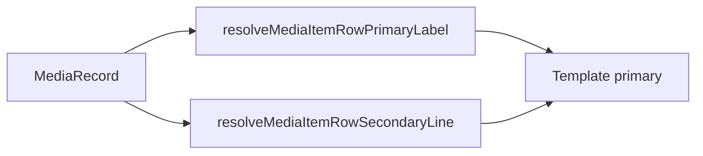

# Media Item — Row mode layout

> **Parent:** [media-item.md](media-item.md)  
> **Row reference:** [search-bar.md](../../ui/search-bar/search-bar.md) (`.ui-item` / `search-dropdown-item` density)

## What It Is

When `mode === 'row'`, `MediaItemComponent` renders a **dense horizontal scan row**: fixed square preview on the left, stacked primary and secondary text on the right. Geometry matches search-bar result rows (`min-height: 3rem`, `1.5rem` / 24px media column), not full-width thumbnail bands.

## What It Looks Like

Each row card is one **full-width horizontal band** in a single-column list (one item per row):

- **Leading media column:** square (`var(--spacing-6)` / 24px), `border-radius: var(--container-radius-control)`, `MediaDisplayComponent` fills the square with `object-fit: contain` (icon-only for document-like types when required by media-display contract).
- **Label column:** flex column with `gap: 2px`; primary line `font-size: var(--font-size-sm)`; secondary meta row with inline file-type chip + capture/location text (`font-size: var(--font-size-xs)`, ellipsis).
- **Row chrome:** `padding: var(--spacing-1)` on all sides, `min-height: 2rem`, `border-radius: var(--container-radius-control)`.
- **Grid container:** `ItemGrid` row mode uses a single-column flex stack with `gap: var(--spacing-1)` — one item per row, full width.
- **Hover / selected:** row background uses primary tint on hover only (`color-mix(in srgb, var(--primary) 12%, transparent)`). Selected row adds `border: 1px solid var(--primary)` on the row band plus quiet-action visibility; focus-within does not apply row tint (avoids false highlight when tabbing to select button).
- **File-type chip:** rendered inline in the secondary meta row via `app-chip` (not overlaid on thumb, not plain text).

### Text content contract

| Line | Source priority | Fallback |
| --- | --- | --- |
| **Primary** | `address_label` → `original_filename` | i18n `media.card.alt.missing` (`Image`) |
| **Secondary** | Join with ` · `: formatted `captured_at` (date+time when `has_time`), location snippet (`city`, `district`, or non-duplicate `address_label`) | Omit empty segments; meta row hidden when chip and text both empty |
| **File type** | `app-chip` in secondary meta row (same chip contract as grid mode) | Hidden when badge text empty |

Formatting uses `I18nService.locale()` via `Intl.DateTimeFormat` (`dateStyle: 'medium'`; `timeStyle: 'short'` when `has_time`).

## Where It Lives

- **Spec:** this supplement
- **Code:** `apps/web/src/app/shared/media-item/media-item.component.*`, `media-item-row-display.helpers.ts`
- **Layout tokens:** `apps/web/src/app/shared/item-grid/item-grid.component.scss` (`--item-grid--row`)
- **Consumers:** workspace selected-items grid, `/media` page (`cardVariant === 'row'`)

## Component Hierarchy

```text
MediaItemComponent [data-mode=row]
└── .media-item__row
    ├── .media-item__row-media
    │   └── .media-item__slot (square thumb)
    │       ├── MediaDisplayComponent
    │       ├── MediaItemUploadOverlayComponent (when uploading)
    │       └── MediaItemQuietActionsComponent
    ├── .media-item__row-content
    │   ├── .media-item__row-label (primary)
    │   └── .media-item__row-meta
    │       ├── app-chip (file type)
    │       └── .media-item__row-secondary (optional)
    └── .media-item__open (full-row hit target)
```

## Visual Behavior Contract

### Ownership Matrix

| Behavior | Visual Geometry Owner | Stacking Context Owner | Interaction Hit-Area Owner | Selector(s) | Layer | Test Oracle |
| --- | --- | --- | --- | --- | --- | --- |
| Row band height | `.media-item__row` | `:host` | `.media-item__open` | `.media-item__row` | content | min-height 3rem |
| Square thumb | `.media-item__row-media` / `.media-item__slot` | `.media-item__slot` | `.media-item__open` (row) | `.media-item__row-media` | content | 24×24px used size |
| Primary label | `.media-item__row-label` | `.media-item__row-content` | `.media-item__open` | `.media-item__row-label` | content | truncates |
| Secondary meta | `.media-item__row-secondary` | `.media-item__row-content` | `.media-item__open` | `.media-item__row-secondary` | content | truncates |
| Selected emphasis | `.media-item__surface--row` | `:host[data-state=selected]` | `.media-item__surface--row` | `:host([data-state='selected']) .media-item__surface--row` | surface/selected | primary border on row band |
| Quiet actions | `.media-item__quiet-actions` | `.media-item__slot` | action buttons | `.media-item__quiet-actions` | overlay/actions | thumb hover only |

### Ownership Triad

| Behavior | Geometry Owner | State Owner | Visual Owner | Same element? |
| --- | --- | --- | --- | --- |
| Row layout | `.media-item__row` | `:host[data-mode=row]` | `.media-item__row` | ✅ |
| Thumb square | `.media-item__row-media` | `.media-item__slot` | `.media-item__slot` | ⚠️ exception — slot draws border inside media column |
| Row hover tint | `.media-item__row` | `:host[data-state]` | `.media-item__row:hover` | ✅ |

## Data



## ItemGrid row mode tokens

`ItemGridComponent` in `--row` mode MUST expose:

| Token | Value | Consumer |
| --- | --- | --- |
| `--item-grid-gap` (row mode) | `var(--spacing-1)` | `ItemGrid` row list gap |
| `--media-item-row-min-height` | `2rem` | `.media-item__surface--row` |
| `--media-item-row-media-size` | `var(--spacing-6)` | `.media-item__row-media` |
| `--media-item-row-padding-inline` | `var(--spacing-1)` | `.media-item__surface--row` |
| `--media-item-row-padding-block` | `var(--spacing-1)` | `.media-item__surface--row` |
| `--media-item-row-gap` | `var(--spacing-1)` | `.media-item__surface--row` |

`--item-grid-slot-block-size` MUST NOT force tall full-width lanes in row mode.

## Acceptance Criteria

- [ ] Row mode list is single-column — one full-width item per row.
- [ ] Row card padding is `spacing-1` on all sides.
- [ ] Primary line uses address → filename → i18n fallback order.
- [ ] Secondary line shows capture date, file type, and location snippet when available.
- [ ] File-type chip appears inline in row meta row; type is not plain text in secondary line.
- [ ] Open/select/quiet-actions behavior matches grid mode; hit target spans full row width.
- [ ] `/media` loading placeholder count uses ~48px row height for row variant.
