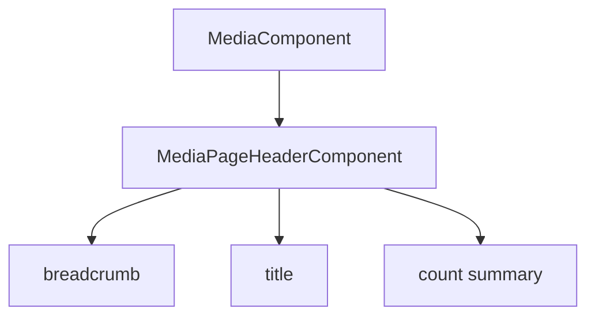
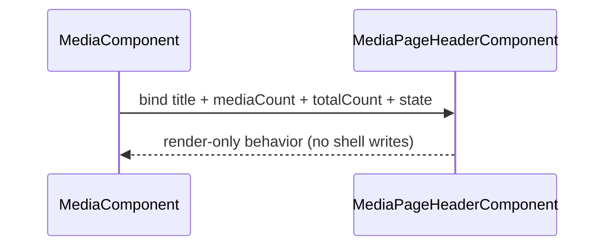

# Media Page Header

## What It Is

Media Page Header is the header contract for the `/media` route shell.
It MUST own breadcrumb/title/count presentation for the media page header region.
It MUST NOT own media list lifecycle, toolbar commands, or pane orchestration.

## Documentation Phase Boundary

- This refactoring pass MUST modify only the `/media` page specification set:
  - `docs/specs/page/media-page.md`
  - `docs/specs/component/media/media.component.md`
  - `docs/specs/component/media/media-content.md`
  - `docs/specs/component/media/media-item.md`
  - `docs/specs/component/media/media-display.md`
  - `docs/specs/component/media/media-item-quiet-actions.md`
  - `docs/specs/component/media/media-item-upload-overlay.md`
  - `docs/specs/component/item-grid/item-grid.md` (media-path constraints only)
  - `docs/specs/component/media/media-page-header.md`
  - `docs/specs/component/media/media-toolbar.md`
- Broader documentation cleanup MUST be deferred to later phases.

## What It Looks Like

The component MUST render breadcrumb navigation, page title, and count summary in one stable header block.
The breadcrumb MUST expose home-to-media context.
The count row MUST render loading text while header state is `loading`, then render count summaries when state is `ready`.

## Where It Lives

- Runtime file: `apps/web/src/app/features/media/media-page-header.component.ts`
- Template file: `apps/web/src/app/features/media/media-page-header.component.html`
- Parent shell contract: `docs/specs/component/media/media.component.md`
- Parent route contract: `docs/specs/page/media-page.md`

## Actions & Interactions

| # | User/System Trigger | System Response | Output Contract |
| --- | --- | --- | --- |
| 1 | Parent binds `state='loading'` | Header MUST render loading summary text. | loading summary visible |
| 2 | Parent binds `state='ready'` with known counts | Header MUST render deterministic count summary. | ready count summary visible |
| 3 | Parent provides `title` | Header MUST render provided page title text. | title visible |
| 4 | Parent provides `mediaCount` and `totalCount` with `totalCount > mediaCount` | Header MUST render loaded-of-total summary text. | loaded-of-total summary visible |
| 5 | User activates breadcrumb home link | Header MUST route via home link contract. | route intent emitted by anchor navigation |

## Normative Boundary Contract

- This file MUST be the single source of truth for `MediaPageHeaderComponent` presentation behavior.
- `docs/specs/component/media/media.component.md` MUST remain the single source of truth for media shell FSM and list lifecycle.
- This file MUST NOT define toolbar command ownership.
- This file MUST NOT define item-grid/media-render ownership.

## Component Hierarchy

```text
MediaPageHeaderComponent
├── breadcrumb nav
├── page title
└── count summary
```

## Data Requirements

| Field | Source | Type | Purpose |
| --- | --- | --- | --- |
| `title` | parent media shell | `string` | Header title text |
| `mediaCount` | parent media shell | `number | null` | Loaded item count |
| `totalCount` | parent media shell | `number | null` | Total item count |
| `state` | parent media shell | `'loading' | 'ready'` | Header summary mode |



## State

### State Enum

```ts
export type MediaPageHeaderState = "loading" | "ready";
```

State ownership rule:

- Header state MUST be input-driven from parent shell.
- Header state MUST NOT write to parent shell lifecycle state.

## File Map

| File | Purpose |
| --- | --- |
| `apps/web/src/app/features/media/media-page-header.component.ts` | Header inputs and derived summary helpers |
| `apps/web/src/app/features/media/media-page-header.component.html` | Breadcrumb, title, and summary template |
| `apps/web/src/app/features/media/media-page-header.component.scss` | Header-only visuals |
| `docs/specs/component/media/media.component.md` | Parent shell lifecycle contract |

## Wiring

The parent media shell MUST bind `title`, `mediaCount`, `totalCount`, and `state` to this component.
This component MUST remain presentation-only and MUST emit no command writes to shell/query state.



## Acceptance Criteria

- [ ] Header renders breadcrumb, title, and count summary in one stable block.
- [ ] Header state is input-driven by parent shell only (`loading` or `ready`).
- [ ] Loaded-of-total text appears only when `totalCount > mediaCount`.
- [ ] Component has no ownership of shell FSM transitions or toolbar commands.
- [ ] All enforceable statements in this file MUST use RFC 2119 language (`MUST`, `SHOULD`, `MAY`).

## Canonical Name Registry Gate

- Every component name used in this spec MUST match a canonical entry in glossary/registry.
- Names that do not resolve to a canonical glossary/registry entry MUST be treated as unresolved and MUST block completion.
- This refactor pass MUST NOT create or rename glossary/registry entries outside the in-scope media-page specification set.
- If a required canonical name cannot be resolved, documentation work MUST stop with: `⚠ SPEC GAP: [missing file or ambiguous owner]`.
