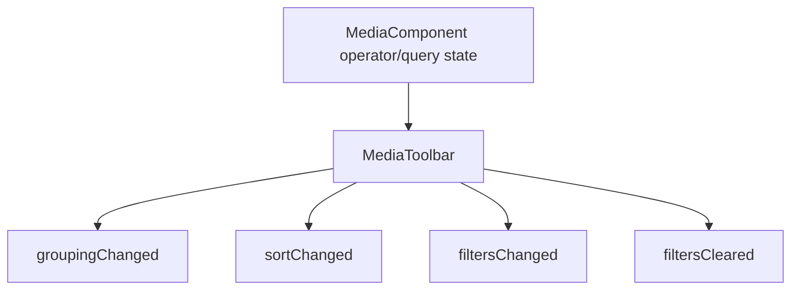
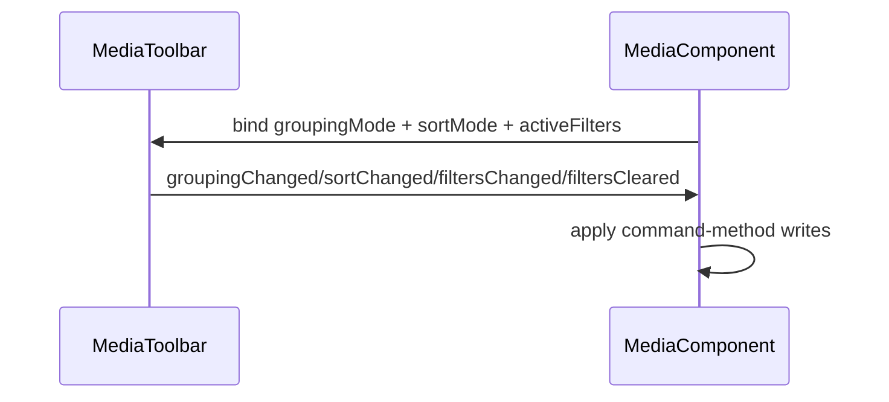

# Media Toolbar

## What It Is

Media Toolbar is the command-intent boundary for `/media` list operators.
It MUST own toolbar control presentation and typed intent emission for grouping, sorting, and filter actions.
It MUST NOT write shell query/operator state directly.

## Documentation Phase Boundary

- This refactoring pass MUST modify only the `/media` page specification set:
  - `docs/specs/page/media-page.md`
  - `docs/specs/component/media/media.component.md`
  - `docs/specs/component/media/media-content.md`
  - `docs/specs/component/media/media-item.md`
  - `docs/specs/component/media/media-display.md`
  - `docs/specs/component/media/media-item-quiet-actions.md`
  - `docs/specs/component/media/media-item-upload-overlay.md`
  - `docs/specs/component/item-grid/item-grid.md` (media-path constraints only)
  - `docs/specs/component/media/media-page-header.md`
  - `docs/specs/component/media/media-toolbar.md`
- Broader documentation cleanup MUST be deferred to later phases.

## What It Looks Like

The toolbar MUST present controls for grouping, sorting, and filter actions.
The toolbar SHOULD expose explicit clear-filters affordance when filters are active.
The toolbar MAY be omitted when route configuration suppresses operator UI.

## Where It Lives

- Contract owner: `docs/specs/component/media/media-toolbar.md`
- Parent shell contract: `docs/specs/component/media/media.component.md`
- Content reference contract: `docs/specs/component/media/media-content.md`
- Runtime composition boundary: media shell toolbar region in `apps/web/src/app/features/media/media.component.html`

## Actions & Interactions

| # | User/System Trigger | System Response | Output Contract |
| --- | --- | --- | --- |
| 1 | User changes grouping control | Toolbar MUST emit `groupingChanged` intent. | grouping intent emitted |
| 2 | User changes sorting control | Toolbar MUST emit `sortChanged` intent. | sorting intent emitted |
| 3 | User changes filter control | Toolbar MUST emit `filtersChanged` intent. | filters intent emitted |
| 4 | User activates clear-filters control | Toolbar MUST emit `filtersCleared` intent. | clear-filters intent emitted |
| 5 | Parent binds current operator/query values | Toolbar MUST reflect parent-provided control state without writing parent state. | read-only control state projection |

## Normative Boundary Contract

- This file MUST be the single source of truth for `MediaToolbar` intent-only behavior.
- `docs/specs/component/media/media.component.md` MUST remain the single source of truth for operator/query write ownership.
- `MediaToolbar` MUST be intent-only and MUST NOT mutate `groupingMode`, `sortMode`, or `activeFilters` directly.
- This file MUST NOT define route-shell lifecycle FSM transitions.

## Component Hierarchy

```text
MediaToolbar
├── grouping control
├── sorting control
├── filter control
└── clear-filters control
```

## Data Requirements

| Field | Source | Type | Purpose |
| --- | --- | --- | --- |
| `groupingMode` | parent media shell | grouping enum | current grouping projection |
| `sortMode` | parent media shell | sorting enum | current sorting projection |
| `activeFilters` | parent media shell | filter collection | current filter projection |

Typed intent outputs:

- `groupingChanged`
- `sortChanged`
- `filtersChanged`
- `filtersCleared`



## State

State ownership rule:

- Toolbar control state MUST be read-only projection from parent shell.
- Toolbar MUST emit intents instead of direct state writes.

## File Map

| File | Purpose |
| --- | --- |
| `docs/specs/component/media/media-toolbar.md` | Canonical toolbar intent-only contract |
| `docs/specs/component/media/media.component.md` | Shell query/operator write ownership |
| `docs/specs/component/media/media-content.md` | Child content contract that consumes shell effects |

## Wiring

The parent media shell MUST bind current operator/query values into toolbar controls.
The toolbar MUST emit typed intents to parent shell command methods.
Implementation MAY be composed through shared toolbar primitives as long as intent-only contract remains unchanged.



## Acceptance Criteria

- [ ] Toolbar emits typed intents for grouping, sorting, filter update, and filter clear.
- [ ] Toolbar performs no direct writes to shell operator/query state.
- [ ] Operator/query single-writer ownership remains in `MediaComponent`.
- [ ] Toolbar naming remains canonical as `MediaToolbar` in `/media` specs.
- [ ] All enforceable statements in this file MUST use RFC 2119 language (`MUST`, `SHOULD`, `MAY`).

## Canonical Name Registry Gate

- Every component name used in this spec MUST match a canonical entry in glossary/registry.
- Names that do not resolve to a canonical glossary/registry entry MUST be treated as unresolved and MUST block completion.
- This refactor pass MUST NOT create or rename glossary/registry entries outside the in-scope media-page specification set.
- If a required canonical name cannot be resolved, documentation work MUST stop with: `⚠ SPEC GAP: [missing file or ambiguous owner]`.
