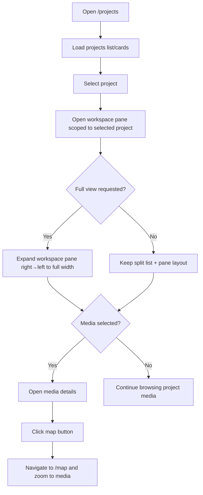
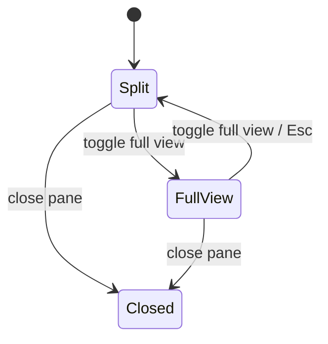
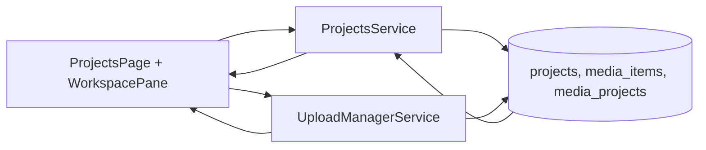
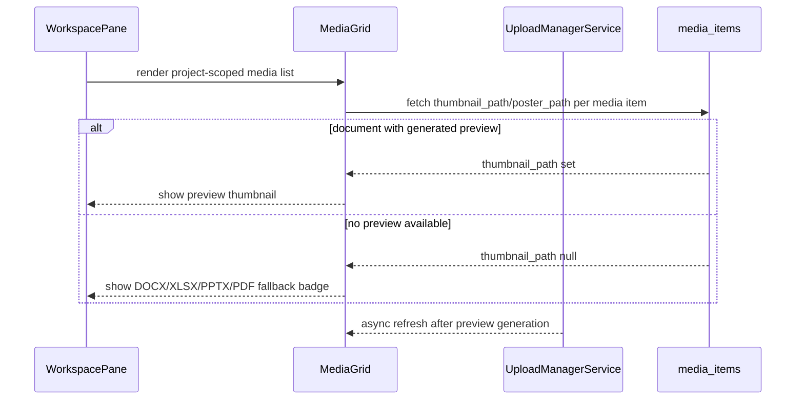
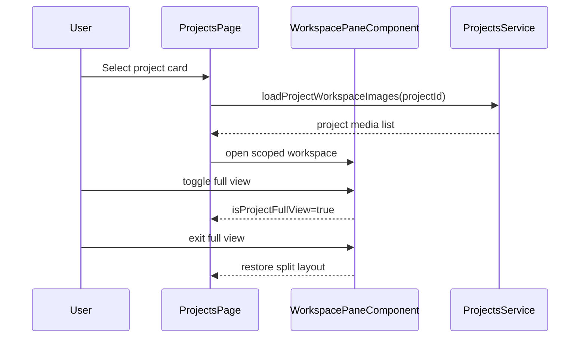

# Project Details View

> **Use cases:** [use-cases/projects-page-workspace.md](../use-cases/projects-page-workspace.md)

## Terminology (layout vs projects page)

**Workspace Pane** (product) reuses **`WorkspacePaneComponent`**. **Canonical:** pane mounts under **authenticated app layout** with a global split — [workspace-pane § Layout host](../ui/workspace/workspace-pane.md#layout-host-canonical). **Interim:** pane may mount only under map routes; `/projects` may use **page-local visibility** (e.g. `workspacePaneOpen` on `ProjectsPageComponent`) until the layout hoist. See [workspace-pane § Interim implementation](../ui/workspace/workspace-pane.md#interim-implementation-until-layout-hoist).

## What It Is

A project-scoped workspace detail mode inside the Projects Page. It opens when a project is selected and reuses the existing workspace/media-detail experience to browse only that project's media while remaining on `/projects`.

## What It Looks Like

The layout is projects-first: project list/cards remain the primary surface and a workspace pane opens with the selected project context. The pane shows project-scoped media in the existing grid/collection presentation and can open media details inline. No embedded map is shown in this view; map handoff is provided by the media-details map action, which opens `/map` and zooms to the selected media location.

A dedicated Project Full View action expands the workspace pane from right to left across the full content width. In this mode, the projects list surface is visually de-emphasized so the workspace becomes the primary canvas.

## Where It Lives

- **Route**: `/projects`
- **Parent**: `ProjectsPage`
- **Appears when**: User clicks a project row/card or "Open in workspace"

## Actions & Interactions

| #   | User Action                              | System Response                                                                             | Triggers                                |
| --- | ---------------------------------------- | ------------------------------------------------------------------------------------------- | --------------------------------------- |
| 1   | Opens `/projects`                        | Loads projects list/cards and related metadata                                              | Router + projects data service          |
| 2   | Clicks a project row/card                | Sets selected project and opens workspace pane scoped to that project                       | `selectedProjectId` + pane state        |
| 3   | Clicks "Open in workspace"               | Opens the same project-scoped workspace pane (no route change)                              | Shared open action                      |
| 4   | Clicks a thumbnail in the workspace pane | Opens media details for the selected item                                                   | Existing media detail state             |
| 5   | Clicks map button in media details       | Navigates to `/map` and centers/zooms to selected media location                            | Router + map focus payload              |
| 6   | Closes workspace pane                    | Returns to projects list/cards context while preserving search/filter/view mode             | Pane close action                       |
| 7   | Clicks Project Full View toggle          | Expands workspace pane right→left to full content width and hides list emphasis             | `isProjectFullView` → true              |
| 8   | Presses Esc or clicks exit full view     | Restores split layout with previous pane width and list context                             | `isProjectFullView` → false             |
| 9   | Opens DOCX/XLSX/PPTX/PDF item            | Shows generated document preview thumbnail if available, otherwise deterministic type badge | `media_items.thumbnail_path` / fallback |

### Interaction Flowchart



### Full View State



## Component Hierarchy

```
ProjectsPage (host route)
+-- ProjectsList / ProjectsCardGrid
+-- WorkspacePaneComponent (reused)
    +-- PaneHeader
    |   +-- Project context title
    |   +-- FullViewToggle
    |   +-- CloseButton
    +-- MediaGrid / CollectionThumbnails (reused)
    +-- MediaDetailView (reused)
      +-- MapButton → navigate `/map` and focus selected media item
```

## Data Requirements

### Data Flow (Mermaid)



### Document Preview Flow (Mermaid)



| Field                   | Source                                                            | Type                 |
| ----------------------- | ----------------------------------------------------------------- | -------------------- |
| Active project          | Selected project from projects list/cards + projects table        | `string` / `Project` |
| Project-scoped media    | Existing workspace pipeline filtered by project ID                | `WorkspaceMedia[]`   |
| Selected media location | Existing media record geo fields used by media-details map action | `LatLng \| null`     |
| Generated previews      | `media_items.thumbnail_path` / `media_items.poster_path`          | `string \| null`     |

## State

| Name                | Type                                                    | Default | Controls                                 |
| ------------------- | ------------------------------------------------------- | ------- | ---------------------------------------- |
| `selectedProjectId` | `string \| null`                                        | `null`  | Active project scope                     |
| `workspacePaneOpen` | `boolean`                                               | `false` | **Projects page:** scoped workspace surface visible (not necessarily identical to map-route `photoPanelOpen`; see [workspace-pane § Terminology](../ui/workspace/workspace-pane.md#terminology-symbols-and-product-language)) |
| `selectedMediaId`   | `string \| null`                                        | `null`  | Active media details                     |
| `mapFocusPayload`   | `{ mediaId: string; lat: number; lng: number } \| null` | `null`  | Navigation payload for `/map` focus      |
| `isProjectFullView` | `boolean`                                               | `false` | Right→left full-width workspace mode     |
| `restorePaneWidth`  | `number \| null`                                        | `null`  | Width to restore after leaving full view |

## File Map

| File                                                                          | Purpose                                                      |
| ----------------------------------------------------------------------------- | ------------------------------------------------------------ |
| `apps/web/src/app/features/projects/projects-page.component.ts`               | Host page state for project selection + workspace visibility |
| `apps/web/src/app/features/map/workspace-pane/workspace-pane.component.ts`    | Reused pane for project-scoped media browsing                |
| `apps/web/src/app/features/map/workspace-pane/media-detail-view.component.ts` | Reused details view with map action                          |
| `apps/web/src/app/features/projects/projects-page.component.spec.ts`          | Integration tests for in-page project details behavior       |

## Wiring

### Wiring Flow (Mermaid)



- Keep route as `{ path: 'projects', component: ProjectsPageComponent }`.
- On project open action, set selected project scope in page/workspace state without route transition.
- Reuse existing Workspace Pane and Media Details components for project-scoped media browsing.
- Wire media-details map action to navigate to `/map` with selected media coordinates and id so map can zoom/focus the target media item.

## Acceptance Criteria

- [ ] [PPW-1] Clicking a project in `/projects` opens project details in the workspace pane without leaving `/projects`.
- [ ] Existing workspace grid/collection and media details components are reused (no duplicate implementations).
- [ ] [PPW-2] Workspace content is filtered to selected project media and thumbnail selection opens media details for that scoped item.
- [ ] [PPW-3] Media details map button navigates to `/map` and zooms/focuses the exact selected media location.
- [ ] [PPW-4] Closing the workspace pane preserves prior projects-page search/filter/view-mode state.
- [ ] [PPW-5] Re-opening the same project restores prior project-scoped browsing context (including prior subview and scroll position).
- [ ] Project Full View toggle expands workspace pane right→left to full content width and hides list emphasis while active.
- [ ] Exiting Project Full View restores prior split width/layout without losing current media selection context.
- [ ] Document items (`.doc/.docx/.xls/.xlsx/.ppt/.pptx/.pdf`) display generated thumbnail previews when available, otherwise deterministic fallback badges.

## Use Cases

> **Full use cases:** [use-cases/projects-page-workspace.md](../use-cases/projects-page-workspace.md)

This element must satisfy the project-scoped workspace scenarios in that document, including opening from a project row, browsing thumbnails, map handoff, and pane-close state preservation.
