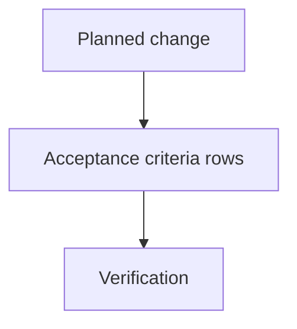
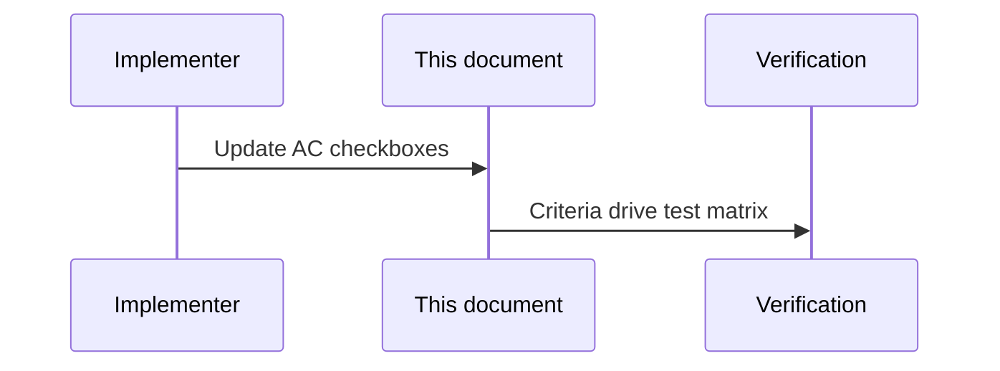

# Upload Panel — Acceptance criteria and planned changes

> **Parent:** [upload-panel.md](upload-panel.md)

## What It Is

Full **acceptance criteria checklist** and **planned-change** table for Upload Panel. Split from `upload-panel.md` for size; the parent spec links here for normative done-ness tracking.

## What It Looks Like

Checkbox lists and a short planned-change table referencing which AC rows must be revalidated after each implementation pass.

## Where It Lives

- **Specs:** `docs/specs/component/upload-panel.acceptance-criteria.md`

## Actions

| # | Trigger | System response |
| --- | --- | --- |
| 1 | QA / implementer verifies feature | Each criterion checked against product behavior |

## Component Hierarchy

N/A — criteria apply to `UploadPanelComponent` subtree per parent **Component Hierarchy**.

## Data

## Planned Changes

The next implementation pass must treat these changes as spec-first and verify them against the listed acceptance criteria before any code changes land.

| Planned change                                                                                  | Why it is needed                                                              | Acceptance criteria to re-check                            |
| ----------------------------------------------------------------------------------------------- | ----------------------------------------------------------------------------- | ---------------------------------------------------------- |
| Normalize uploaded-row location labels to `Add/Change GPS` and `Add/Change address`             | Keeps location editing language explicit and future code checks deterministic | `Change location` suboption labels, GPS/address edit flows |
| Keep `Assign project` on uploaded and unresolved-document rows through one shared selector flow | Prevents feature-local project selection variants                             | `Assign project` visibility and shared dropdown reuse      |
| Preserve attachment-only `Download` behavior                                                    | Prevents inline browser preview regressions                                   | `Download` file behavior                                   |
| Preserve down-first menu placement with viewport fallback                                       | Matches shared dropdown conventions and avoids clipping                       | 3-dot row menu placement                                   |
| Keep Upload Zone instructional copy mounted during all panel states                             | Prevents flicker during drag/lane/batch transitions                           | Upload Zone text persistence                               |
| Keep lane switch labels readable on compact surfaces                                            | Prevents icon-only ambiguity in the lane switch                               | segmented switch label readability                         |

The later code pass must revalidate at least these existing acceptance-criteria items:

- Uploaded rows expose `Assign project` in all states (assign and reassign through one selector flow).
- Project assignment UI in upload panel reuses the same shared dropdown primitive/pattern as toolbar project selection.
- `Change location` exposes exactly two suboptions with contextual labels: `Add/Change GPS` and `Add/Change address`.
- `Add/Change GPS` enters map-pick mode and commits the clicked location for the selected media item.
- Location edits on already uploaded media never trigger re-upload or re-queue; they update persisted media location only.
- `Download` always triggers file download behavior and never opens inline browser preview tabs.
- The segmented switch keeps Queue / Uploaded / Issues readable and distinguishable.

## Wiring

## Acceptance Criteria

- [ ] Panel appears as compact container expansion from Upload Button
- [x] Top section is a Drop Zone with drag-and-drop and click upload
- [x] `Upload folder` action is always visible in intake area
- [x] When folder import is unsupported, `Upload folder` is disabled and shows fallback guidance
- [x] Folder scan shows progress text and disables repeat folder action while scanning
- [x] Take Photo action opens capture-capable intake and submits into the same upload pipeline
- [ ] Folder uploads inherit folder-name address as default location hint when files do not provide their own title address.
- [ ] File-level title address overrides inherited folder-level address.
- [ ] If queue has jobs, segmented lane switch appears under Drop Zone
- [x] Lane switch contains exactly 3 options: Queue (`uploading`), Uploaded, Issues
- [x] Clicking a lane filters visible media list to that lane only
- [x] Queue and Uploaded lane buttons use icon+label content for direct readability
- [x] Issues lane button uses icon+label content and attention styling when unresolved items exist
- [x] Segmented switch block is full width and shares the same left/right edges as upload area and folder button
- [x] Segmented switch block has no additional tile/card shell around it; the tab list itself is the only visual container
- [x] Lane list uses a fully transparent, padding-free overflow wrapper for scrolling only
- [x] Queue/Uploaded/Issues lane lists show max 5 rows and scroll internally when more rows exist
- [ ] File list block is full width and shares the same left/right edges as upload area and folder button
- [ ] Lane list item surfaces use white/surface background (`var(--color-bg-surface)`) with state-aware warning/error tinting
- [ ] Gap between lane items is visually see-through
- [ ] File items are separated by vertical gap (not by table-like borders)
- [ ] Distinct panel blocks are separated by layout gap between sections (not by decorative separators)
- [ ] Upload panel shell remains mostly transparent; block gaps are literal see-through spaces to the map/background behind
- [x] Compact intake layout does not render a `No uploads yet` placeholder block
- [ ] Compact map-overlay panel keeps row actions menu-first and does not render selection checkboxes
- [ ] Embedded workspace panel reveals row-selection checkbox on hover/focus for eligible rows
- [x] Embedded workspace panel shows bottom selection toolbar only when one or more rows are selected
- [ ] Embedded selection toolbar provides retry/download/remove/clear actions with lane-safe behavior
- [x] 3-dot row menu always contains a divider followed by exactly one destructive bottom action
- [x] Destructive bottom action label is state-dependent: `Cancel upload` (active), `Remove from project` (uploaded), `Dismiss` (issues/failed)
- [ ] Destructive bottom action uses danger styling for both label and icon
- [x] Clicking the map-marker action on a `missing_data` row emits a placement request
- [x] Clicking an uploaded row with coordinates emits a zoom-to-location request
- [x] Uploaded rows expose `Assign project` in all states (assign and reassign through one selector flow)
- [ ] Project assignment UI in upload panel reuses the same shared dropdown primitive/pattern as toolbar project selection
- [x] Uploaded rows expose `Prioritize` for saved media follow-up workflows
- [x] Uploaded rows expose `Open in /media`, `Change location`, and `Download` when persisted media data is available
- [x] `Change location` exposes exactly two suboptions with contextual labels: `Add/Change GPS` and `Add/Change address`
- [x] `Add/Change address` opens a vertically extended address-finder overlay with suggestions under the input
- [x] Hovering a location suggestion previews that location on the map without committing the update
- [x] Selecting a location suggestion persists both address and coordinates for the media item
- [ ] `Add/Change GPS` enters map-pick mode and commits the clicked location for the selected media item
- [ ] Location edits on already uploaded media never trigger re-upload or re-queue; they update persisted media location only
- [x] `Download` always triggers file download behavior and never opens inline browser preview tabs
- [ ] Uploaded rows with EXIF/text mismatch (>15m) expose a clear mismatch indicator for follow-up in media details.
- [ ] Duplicate-photo rows are shown in Issues and expose a secondary GPS action to open the existing placed media.
- [ ] Duplicate-resolution modal appears for duplicate-photo issues with `use existing`, `upload anyway`, and `reject` options.
- [ ] Duplicate-resolution modal provides "apply to all matching items in this batch" behavior.
- [x] Non-photo/video documents without GPS and without parseable address land in Issues as `document_unresolved`, including project-bound intake context.
- [x] `document_unresolved` rows show status text `Choose location or project` (localized fallback allowed).
- [ ] `document_unresolved` row menu exposes exactly `Add GPS`, `Add/Change address`, and `Assign project` before the destructive action.
- [ ] Choosing `Add GPS`, `Add/Change address`, or `Assign project` from `document_unresolved` resolves the item and moves it to Uploaded lane.
- [x] Issue-row menu visibility is strict by `issueKind` (no cross-kind leakage of actions).
- [x] Uploaded-row menu exposes `Prioritize` only when priority workflow capability is enabled.
- [x] Phase and issue status texts follow the status-text contract for every lane transition.
- [x] `Upload anyway` is available only for duplicate-photo issue rows, never for GPS issue rows
- [x] GPS issue rows expose placement-oriented actions instead of force-upload actions
- [x] `Retry` action in row menu is operational and re-queues eligible issue rows into uploading flow
- [x] `Place on map` action in row menu is operational for placement-related issue rows
- [x] Uploading/retrying rows show a spinning loading indicator overlay over the thumbnail
- [ ] Hovering media rows with available previews always shows a stable thumbnail/media preview (no blank hover state)
- [ ] Row status text updates live while retrying and uploading phases progress
- [ ] Jobs with unresolved address fragments expose an address-note indicator that leads to detail evidence rows.
- [x] Lane tabs display live counts derived from the same lane bucket data as the list
- [ ] Users can switch to an empty lane and keep that lane selected
- [ ] Closing panel does not cancel active uploads
- [ ] Viewer upload attempts are blocked by RLS and shown as a clear error state
- [x] Upload intake accepts office documents (`.doc`, `.docx`, `.odt`, `.odg`, `.xls`, `.xlsx`, `.ods`, `.ppt`, `.pptx`, `.odp`) plus `.txt` and `.csv` in addition to photo/video/PDF types
- [ ] Document uploads without preview show deterministic type fallback badge (`DOC`, `DOCX`, `ODT`, `ODG`, `TXT`, `XLS`, `XLSX`, `ODS`, `CSV`, `PPT`, `PPTX`, `ODP`, `PDF`)
- [x] Upload Zone instructional text remains visible and stable across drag states, lane switches, and queue updates while panel is open
- [x] Panel root section is layout-only (no padding, border, background, or shadow); inner blocks carry container styling.
- [ ] Panel rigidly adheres to `.ui-item` class primitives for list rendering geometry.
- [ ] Visual state changes (hover, active, selected) do NOT impact layout geometry or spacing.
