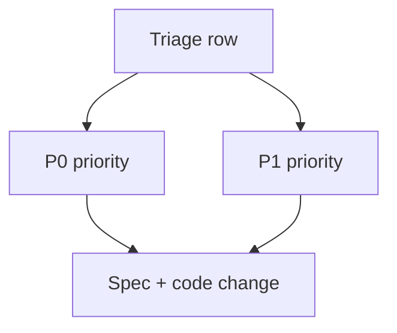

# Upload Panel — Feedback triage

> **Parent:** [upload-panel.md](upload-panel.md)

## What It Is

Dated **implementation backlog** for Upload Panel: known gaps, owning files, proposed spec-level fixes, and priority. This is a working triage log, not the primary UX contract (see parent and [lane & row actions](upload-panel.lane-and-row-actions.md)).

## What It Looks Like

Tabular audit: issue statement, file paths, contract direction, P0/P1.

## Where It Lives

- **Specs:** `docs/specs/component/upload-panel.feedback-triage.md`

## Actions

| # | Owner action | Result |
| --- | --- | --- |
| 1 | Resolve a row | Move expectation into acceptance criteria or lane contracts; update linked specs |

## Component Hierarchy

N/A — documentation artifact only.

## Data

## Feedback Triage (2026-03-30)

| Issue                                                                                                  | Files involved                                                                                                                                                                                                               | Possible solution (spec contract)                                                                                                                          | Priority |
| ------------------------------------------------------------------------------------------------------ | ---------------------------------------------------------------------------------------------------------------------------------------------------------------------------------------------------------------------------- | ---------------------------------------------------------------------------------------------------------------------------------------------------------- | -------- |
| Filename address parsing should accept highly likely single-address titles                             | `apps/web/src/app/core/filename-parser.service.ts`, `apps/web/src/app/core/upload/upload-new-prepare-route.util.ts`, `apps/web/src/app/features/upload/upload-phase.helpers.ts`                                              | Use confidence scoring with `high` acceptance path. High-likelihood single-address matches count as parseable; only low-confidence/noise stays unresolved. | P0       |
| Folder project context (`Project: [projectname]`) should resolve project assignment case-insensitively | `apps/web/src/app/core/folder-scan.service.ts`, `apps/web/src/app/core/upload/upload-manager.service.ts`, `apps/web/src/app/core/projects/projects.service.ts`, `apps/web/src/app/features/upload/upload-panel.component.ts` | Parse folder context token `Project:` and resolve by case-insensitive name; create project if missing, otherwise assign to existing project automatically. | P0       |
| `Download` opens in browser tab instead of downloading                                                 | `apps/web/src/app/features/upload/upload-panel.component.ts`, `apps/web/src/app/core/upload/upload-manager.service.ts`, `apps/web/src/app/core/supabase.service.ts`                                                          | `Download` action MUST force attachment semantics (`Content-Disposition: attachment`) and trigger file download, never open inline preview tab.            | P0       |
| Issues lane jumps automatically to Uploaded after resolving one item                                   | `apps/web/src/app/features/upload/upload-panel.component.ts`, `apps/web/src/app/features/upload/upload-panel-lane-handlers.service.ts`                                                                                       | Keep currently selected lane stable after resolution actions; never auto-switch lane/tab unless user explicitly changes it.                                | P0       |
| `Choose project` UI quality is below toolbar dropdown quality                                          | `apps/web/src/app/features/upload/upload-panel.component.html`, `apps/web/src/app/features/upload/upload-panel.component.ts`, `apps/web/src/app/shared/`                                                                     | Reuse the same shared project-selection dropdown primitive/pattern used by toolbar project selection. Avoid feature-local degraded variant.                | P1       |
| Menu labels still show outdated wording (`Click on map`, etc.) for uploaded documents                  | `apps/web/src/app/features/upload/upload-panel-item.component.ts`, `apps/web/src/app/features/upload/upload-panel-item.component.html`, `docs/i18n/translation-workbench.csv`                                                | Replace with contextual wording: `Change GPS` / `Change address` on uploaded rows, `Add GPS` / `Add address` only when values are missing.                 | P1       |
| `Assign project` is missing in some already-bound contexts                                             | `apps/web/src/app/features/upload/upload-panel-item.component.ts`, `apps/web/src/app/features/upload/upload-panel.component.ts`                                                                                              | Keep project assignment action always available as `Assign project` (opens selector with current project preselected when already bound).                  | P1       |
| Destructive action label `Remove from project` is wrong for uploaded media row action intent           | `apps/web/src/app/features/upload/upload-panel-item.component.ts`, `apps/web/src/app/features/upload/upload-panel.component.ts`, `docs/i18n/translation-workbench.csv`                                                       | If the action actually deletes media, label must be `Delete photo`/`Delete media`; keep `Remove from project` only for explicit membership-removal action. | P1       |
| Missing user-facing explanation of why options appear/disappear in row dropdown                        | [upload-panel.lane-and-row-actions.md](upload-panel.lane-and-row-actions.md), `apps/web/src/app/features/upload/upload-panel-item.component.ts`                                                                                                                    | Add explicit visibility/rationale matrix per lane/issue/state to make option gating transparent and testable.                                              | P1       |
| Context menu currently opens upward first; should prefer downward opening                              | `apps/web/src/app/features/upload/upload-panel-item.component.ts`, `apps/web/src/app/features/upload/upload-panel-item.component.html`, `apps/web/src/app/features/upload/upload-panel.component.scss`                       | Use down-first menu placement with viewport-aware fallback to upward only when bottom space is insufficient.                                               | P1       |
| Changing address on uploaded photos can restart upload path                                            | `apps/web/src/app/features/upload/upload-panel.component.ts`, `apps/web/src/app/features/map/map-shell/map-shell.component.ts`, `apps/web/src/app/core/upload/upload-manager.service.ts`                                     | Persist location updates on existing media only; MUST call location update flow and MUST NOT requeue/reupload files.                                       | P0       |
| Hover thumbnail preview is missing on media rows                                                       | `apps/web/src/app/features/upload/upload-panel-item.component.html`, `apps/web/src/app/features/upload/upload-panel-item.component.scss`                                                                                     | Enforce deterministic thumbnail rendering for rows with preview-capable media; hover must reveal media thumbnail reliably.                                 | P1       |
| Segmented switch style mismatch (lane labels not shown clearly enough)                                 | `apps/web/src/app/features/upload/upload-panel.component.html`, `apps/web/src/app/shared/segmented-switch/segmented-switch.component.scss`, `apps/web/src/app/features/upload/upload-panel.component.scss`                   | Lock segmented style contract: Queue/Uploaded/Issues are all icon+label controls with clear text labels.                                                   | P1       |
| Upload Zone text disappears intermittently                                                             | `apps/web/src/app/features/upload/upload-panel.component.html`, `apps/web/src/app/features/upload/upload-panel.component.ts`                                                                                                 | Keep Upload Zone title/subtitle/helper text mounted and stable during all panel states.                                                                    | P0       |

## Wiring

N/A.

## Acceptance Criteria

- [ ] Every P0 row is either closed with a spec+code change or explicitly deferred with rationale.
- [ ] Triage table stays in sync when new upload-panel gaps are discovered (date heading updated when scope changes).
