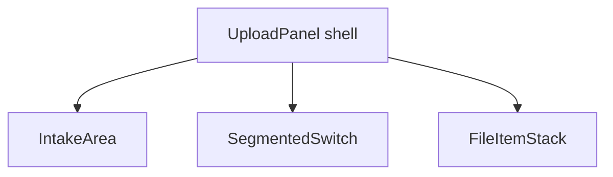

# Upload Panel — Layout reference and visual states

> **Parent:** [upload-panel.md](upload-panel.md)

## What It Is

Structural ASCII reference tree and **visual states** diagram for the Upload Panel shell (intake, segmented lanes, file stack). Split from the parent **What It Looks Like** for lint size; UX summary stays in `upload-panel.md`.

## What It Looks Like

Three stacked blocks (intake → lane switch → file list), transparent shell gaps, segmentation without extra card wrappers around the tab list, and lane/file-item surfaces using surface tokens and status tints—matching the parent narrative.

## Where It Lives

- **Specs:** `docs/specs/component/upload-panel.layout-and-states.md`

## Actions

| # | Trigger | System response |
| --- | --- | --- |
| 1 | Implementer verifies layout | DOM matches reference structure; states match diagram |

## Component Hierarchy

See parent [Component Hierarchy](upload-panel.md#component-hierarchy).

## Data



### Reference Structure (Contract)

```text
<UploadPanel>                          <!-- transparent wrapper, flex column, gap -->

  <IntakeArea>                         <!-- full width card, bg-surface, padding -->
    <UploadZone />
    <FolderUploadButton />
  </IntakeArea>

  <!-- gap (transparent to map) -->

  <SegmentedSwitch />                  <!-- ui-tab-list ONLY, no wrapping div -->
    <!-- Uploading (Icon only) -->
    <!-- Uploaded (Icon only) -->
    <!-- Issues (Icon + Text, flex grow) -->

  <!-- gap -->

  <FileItemStack>                      <!-- transparent overflow wrapper (max 5 items height) -->

    <FileItem />                       <!-- full width card, bg-surface, padding -->
    <!-- gap -->
    <FileItem state="error" />         <!-- error tint bg-surface, padding -->
    <!-- gap -->
    <FileItem />                       <!-- full width card, bg-surface, padding -->

  </FileItemStack>

</UploadPanel>
```

### Visual States (Mermaid)

```mermaid
stateDiagram-v2
    direction TB

    state FileItem {
        direction LR
        [*] --> default_item
        default_item --> uploading : phase='uploading'
        uploading --> complete : phase='complete'
        uploading --> missing_data : phase='missing_data'
        uploading --> error : phase='error'

        state default_item {
            bg: var(--color-bg-surface)
        }

        state complete {
            statusText: var(--color-success)
        }

        state missing_data {
            bg: var(--color-bg-surface) + warning tint
            statusText: var(--color-warning)
        }

        state error {
            bg: var(--color-bg-surface) + danger tint
            statusText: var(--color-danger)
        }
    }

    state SegmentedSwitch {
        [*] --> activeTab
        activeTab --> QueueTab
        activeTab --> UploadedTab
        activeTab --> IssuesTab

        state IssuesTab {
            [*] --> empty
            [*] --> attention
            empty : no items (default styles)
            attention : has items (tinted/distinguished style via .ui-tab--attention)
        }
    }
```

## Wiring

N/A.

## Acceptance Criteria

- [ ] Live DOM matches **Reference Structure** (transparent shell, no extra card around `SegmentedSwitch` only).
- [ ] File item and issues-tab states match **Visual States** diagram for phase and attention styling.
