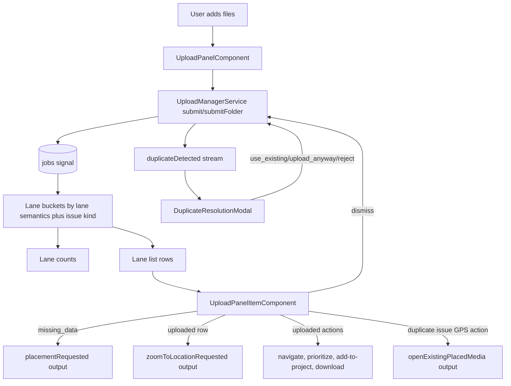
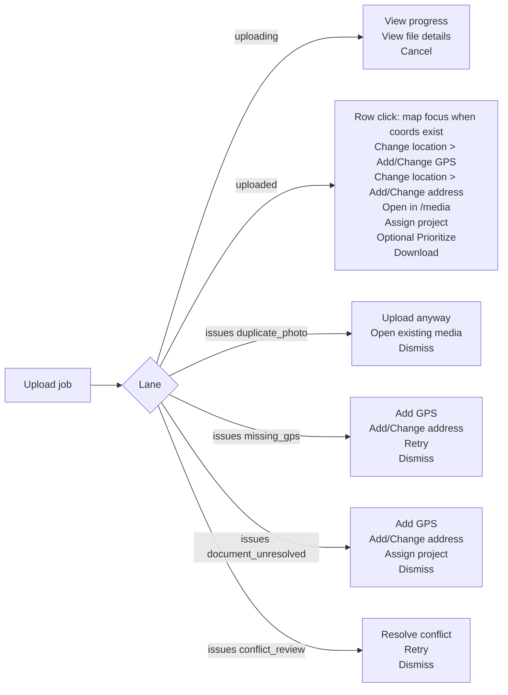
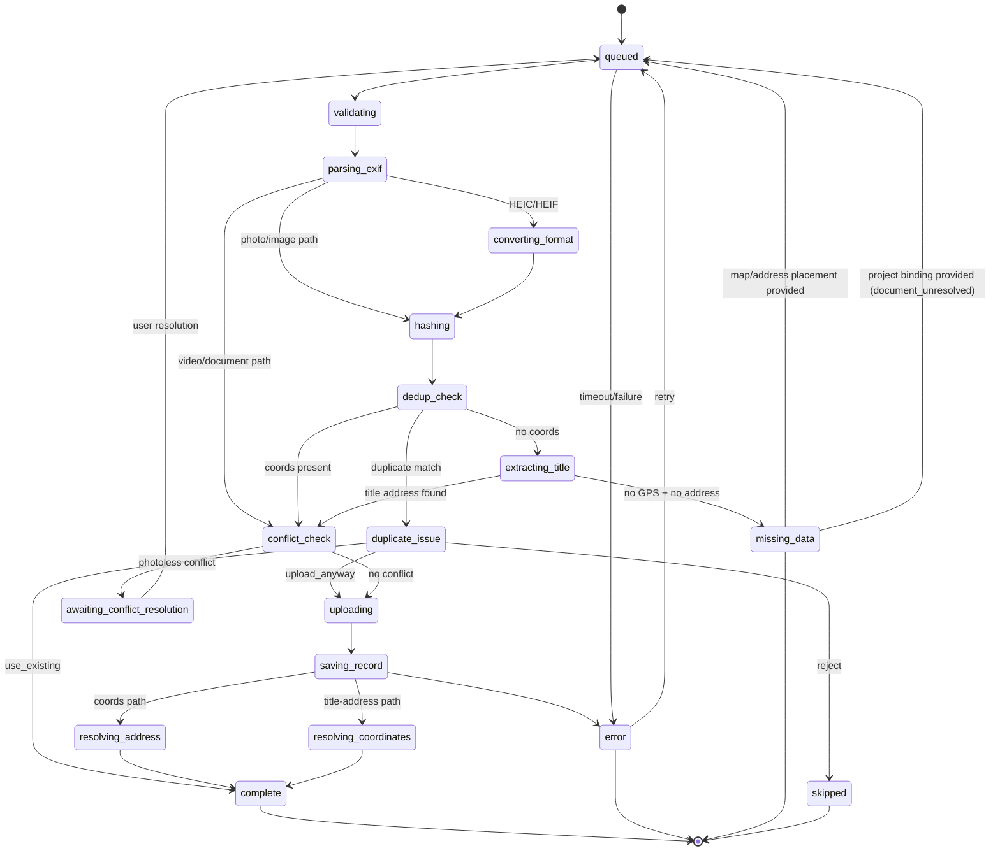
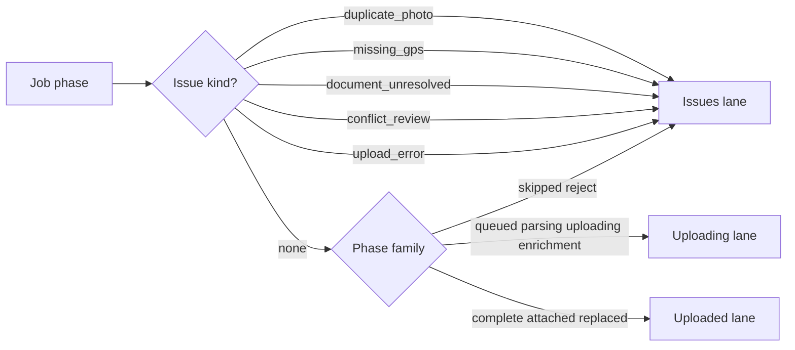
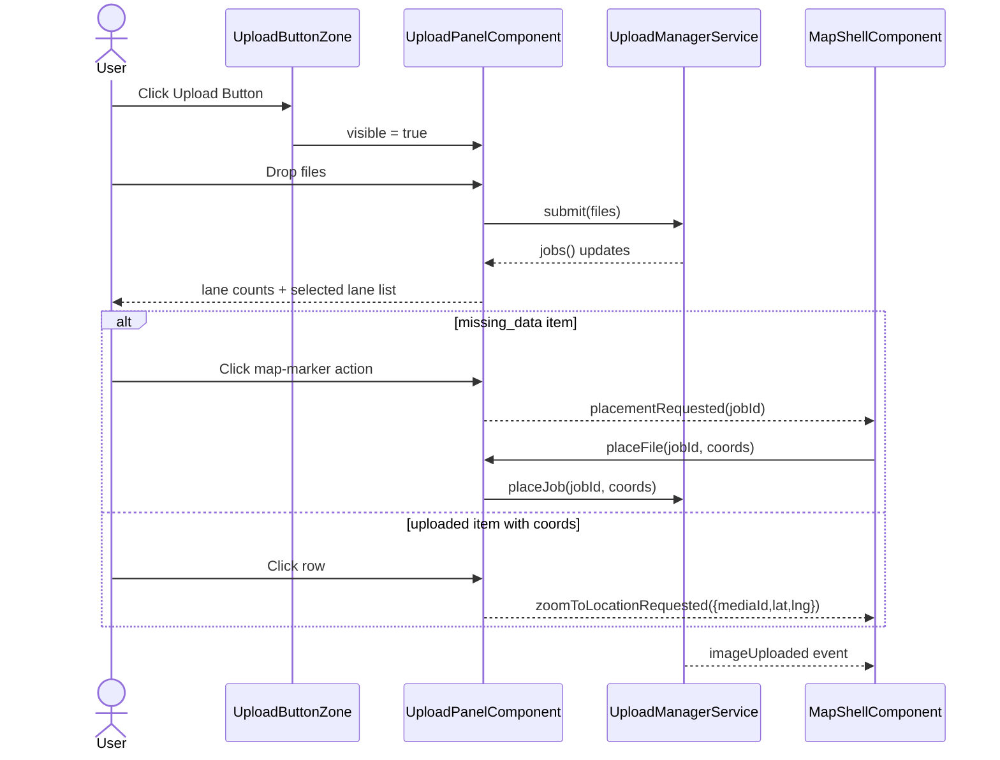

# Upload Panel

> **Related specs:** [media-download-service](media-download/media-download-service.md), [upload-manager](upload-manager.md), [file-type-chips](file-type-chips.md), [action-context-matrix](action-context-matrix.md)  
> **Split contracts:** [Layout & visual states](upload-panel.layout-and-states.md) · [Lane & row actions](upload-panel.lane-and-row-actions.md) · [Feedback triage](upload-panel.feedback-triage.md) · [Acceptance criteria](upload-panel.acceptance-criteria.md)

## What It Is

The Upload Panel is the compact upload workspace that appears from the Upload Button Zone. It lets users add mixed media files and triage uploads by state (uploading, uploaded, issues).

## What It Looks Like

The panel is a **fixed-width section shell** of **three stacked blocks** (intake, lane switch, file list) with the same left/right edges. The root is **layout-only and unstyled** (no padding, border, or card shell); inner blocks own surface treatment. Gaps between blocks are **see-through** to the map. The lane switch has **no extra card wrapper**—the tab list is the only container. File rows use **surface** backgrounds with status tints; the list area uses a **transparent overflow wrapper** (max **5** visible rows, internal scroll). Row **3-dot** menus open **downward first** with viewport fallback. **Reference tree and state diagram:** [upload-panel.layout-and-states.md](upload-panel.layout-and-states.md). **Row menus and status text:** [upload-panel.lane-and-row-actions.md](upload-panel.lane-and-row-actions.md).

## Where It Lives

- **Parent**: Upload Button Zone in `MapShellComponent`
- **Component**: `UploadPanelComponent` at `features/upload/upload-panel/`
- **Appears when**: user toggles Upload Button open

## Actions

| #    | User Action                                                                        | System Response                                                                                                | Triggers                                                   |
| ---- | ---------------------------------------------------------------------------------- | -------------------------------------------------------------------------------------------------------------- | ---------------------------------------------------------- |
| 1    | Clicks Upload Button                                                               | Opens compact Upload Panel container                                                                           | `uploadPanelOpen` signal                                   |
| 2    | Drags files onto Drop Zone                                                         | Creates upload jobs and starts pipeline (max 3 parallel)                                                       | `UploadManagerService.submit()`                            |
| 3    | Clicks Drop Zone                                                                   | Opens file picker with multi-select                                                                            | Native file picker                                         |
| 4    | Clicks Upload folder                                                               | Starts folder scan then enqueues discovered files                                                              | `UploadManagerService.submitFolder`                        |
| 4a   | Browser does not support folder import                                             | `Upload folder` control remains visible but disabled with explanatory tooltip/text                             | capability guard + UX fallback                             |
| 5    | Folder scan is running                                                             | Shows scanning status line and disables folder action                                                          | `activeBatch.status = 'scanning'`                          |
| 5b   | Folder name contains parseable address                                             | Uses folder address as default location hint for queued files                                                  | folder-title parser in upload pipeline                     |
| 5c   | A file inside folder has its own parseable address                                 | File-level address overrides inherited folder address                                                          | filename parser precedence                                 |
| 5d   | File/folder title contains low-confidence or nonsense address                      | Address hint is recorded as note only; file stays unresolved and lands in Issues                               | confidence gate before routing                             |
| 6    | Clicks Take Photo                                                                  | Opens camera-capable file capture path and submits captured file                                               | Native capture input                                       |
| 6b   | Uploads DOCX/XLSX/PPTX/ODT/ODS/ODP/ODG/TXT/CSV/PDF                                 | File is accepted and classified as `document`; if no GPS/address exists it enters Issues                       | `UploadService.validateFile()` + location-context gate     |
| 6c   | Document has no GPS and no parseable address                                       | Item stays in Issues first (also when submitted with project context) with status `Choose location or project` | issue kind `document_unresolved`                           |
| 7    | Viewer attempts upload action                                                      | Upload is denied by RLS; UI shows permission error feedback                                                    | Supabase policy deny                                       |
| 9    | Active or queued jobs exist                                                        | Shows segmented lane switch under Drop Zone                                                                    | `jobs().length > 0`                                        |
| 10   | Switches segmented control to Queue (`uploading`)                                  | Lane list filters to upload pipeline jobs only                                                                 | `selectedLane = 'uploading'`                               |
| 11   | Switches segmented control to Uploaded                                             | Lane list filters to completed jobs                                                                            | `selectedLane = 'uploaded'`                                |
| 12   | Switches segmented control to Issues                                               | Lane list filters to problematic jobs                                                                          | `selectedLane = 'issues'`                                  |
| 13   | Clicks map-marker icon in Issues row (`missing_data`)                              | Emits placement request to map shell                                                                           | `placementRequested.emit(jobId)`                           |
| 14   | Clicks row in Issues lane (`missing_data`)                                         | Enters placement mode from map shell                                                                           | `placementRequested.emit(jobId)`                           |
| 15   | Clicks row in Uploaded lane with coords                                            | Requests map zoom to uploaded media location                                                                   | `zoomToLocationRequested.emit({ mediaId, lat, lng })`      |
| 15a  | Opens uploaded row action menu                                                     | Shows follow-up actions based on saved media state and workflow capability                                     | derived from `mediaId`, `projectId`, coords, feature flags |
| 15b  | Job has EXIF and textual address mismatch (>15m)                                   | Row remains uploaded but carries mismatch indicator for detail follow-up                                       | location reconciliation state                              |
| 15c  | Duplicate hash issue row shows secondary GPS button                                | Clicking button opens/focuses the already placed existing media                                                | duplicate target image reference                           |
| 15d  | Duplicate hash issue detected                                                      | Opens duplicate-resolution modal with `use existing`, `upload anyway`, `reject`                                | Optional apply-to-batch checkbox                           |
| 15e  | Address parser found unresolved address fragments                                  | Row shows subtle address-note indicator and links to detail evidence section                                   | No parsing info is dropped                                 |
| 15f  | Chooses `Assign project` on uploaded item                                          | Opens project selector (shared toolbar dropdown pattern), supports assign and reassign                         | persisted media; current project preselected when present  |
| 15g  | Chooses `Prioritize` on uploaded item                                              | Marks or queues the saved media item for prioritized follow-up                                                 | project/workflow integration                               |
| 15h  | Chooses `Open in /media` on uploaded item                                          | Navigates to `/media` and focuses or filters the persisted media item                                          | router navigation with media context                       |
| 15i  | Chooses `Open project` on uploaded item                                            | Navigates to the bound project when the upload already belongs to one                                          | only when `projectId` exists on job/media                  |
| 15j  | Chooses `Change location` on uploaded item                                         | Opens suboptions for location correction                                                                       | grouped action section in row context menu                 |
| 15j1 | Chooses `Add GPS` or `Change GPS`                                                  | Enters map-pick mode and persists clicked coordinates for the saved media item                                 | label depends on whether coordinates exist                 |
| 15j2 | Chooses `Add address` or `Change address`                                          | Opens taller address-finder overlay with search input and suggestions list                                     | label depends on whether address exists                    |
| 15j3 | Hovers an address suggestion                                                       | Shows preview pin on map at suggestion coordinates                                                             | preview clears when hover ends or dialog closes            |
| 15j4 | Selects an address suggestion                                                      | Persists address + coordinates and refreshes marker position                                                   | same `resolve_media_location` contract                     |
| 15k  | Chooses `Download` on uploaded item                                                | Forces file download with attachment semantics; never opens inline browser tab                                 | persisted storage path required                            |
| 15l  | Chooses `Assign project` on document issue row                                     | Binds or rebinds the document to a project and moves it to Uploaded lane                                       | project-bound document resolution path                     |
| 15m  | Chooses `Add GPS/Change GPS` or `Add address/Change address` on document issue row | Persists location context and moves item to Uploaded lane                                                      | same resolver contract as uploaded location edits          |
| 15n  | Opens 3-dot menu on issue row                                                      | Shows only issue-kind-specific options plus one destructive final action                                       | contract matrix by `issueKind`                             |
| 16   | Clicks dismiss icon on terminal row                                                | Removes row from queue/history                                                                                 | `UploadManagerService.dismissJob()`                        |
| 17   | Switches into empty lane                                                           | Lane stays selected even with zero items                                                                       | `selectedLane` signal                                      |
| 18   | Closes panel                                                                       | Panel collapses; uploads continue in background                                                                | Root service lifecycle                                     |
| 19   | Uses compact map-overlay panel                                                     | Per-row interactions are menu-first; no row-selection checkboxes are shown                                     | compact mode (`embeddedInPane = false`)                    |
| 20   | Uses embedded panel in Workspace Upload tab                                        | Row-selection checkboxes appear on hover/focus for multi-select workflows                                      | embedded mode (`embeddedInPane = true`)                    |
| 21   | Selects upload rows in embedded mode                                               | Bottom toolbar appears with retry/download/remove/clear selection actions                                      | `selectedUploadJobIds.size > 0`                            |
| 22   | Uses bulk remove in embedded mode                                                  | Active jobs are cancelled; terminal jobs are dismissed from the list                                           | `cancelJob` + `dismissJob` dispatch                        |
| 23   | Opens 3-dot menu in any lane row                                                   | Bottom menu item is always destructive, separated by a divider                                                 | row action menu contract                                   |
| 24   | Uses destructive 3-dot action on active upload row                                 | Label is `Cancel upload`; operation cancels active/pending job                                                 | `UploadManagerService.cancelJob()`                         |
| 25   | Uses destructive 3-dot action on uploaded row                                      | Label is `Remove from project`; operation removes item from project context                                    | project-bound persisted media contract                     |
| 26   | Uses destructive 3-dot action on issue/failed row                                  | Label is `Dismiss`; operation dismisses terminal issue row                                                     | `UploadManagerService.dismissJob()`                        |
| 27   | Lane contains more than 5 rows                                                     | List remains constrained to 5 visible rows and scrolls internally via transparent wrapper                      | lane overflow wrapper contract                             |

## Component Hierarchy

**STRICT PRIMITIVE REQUIREMENT:** This component and all its children must explicitly use the standardized layout primitives from `src/styles/primitives/container.scss`. Do not introduce custom wrapper `div`s for basic flex or grid layouts. Use flatter DOM structures. The lane list items MUST use `.ui-item` without modifying its base geometry. The root `UploadPanel` section MUST remain unstyled and must not be rendered as a `.ui-container` surface.

```text
UploadPanel                                              ← compact fixed-width unstyled wrapper from button morph
├── UploadArea                                            ← full width block
│   ├── PanelHeader                                      ← title + subtitle
│   └── DropZone                                         ← dashed drag target + file type chips
├── FolderUploadButton                                    ← full width block under UploadArea
├── SegmentedSwitchBlock                                  ← full width block under FolderUploadButton
│   └── LaneSwitch                                       ← Uploading / Uploaded / Issues
├── [scanning] ScanStatus                                ← "Scanning folder..." feedback row
├── [queue or active exists] SegmentedSwitchBlock        ← lane switch under folder button
├── [selected lane has items] FileItemStack              ← full width block under segmented switch
│   ├── LaneOverflowWrapper                               ← fully transparent, no padding, overflow-only scroll helper
│   │   └── LaneList
│   │       └── UploadPanelItem × N                      ← full width items stacked with gap between items
│       ├── [compact overlay only] No selection checkbox
│       └── [embedded mode only] HoverSelectionCheckbox
├── [embedded mode AND selection > 0] UploadSelectionFooter (`app-pane-footer`)
│   ├── SelectedCount
│   ├── RetrySelectionAction
│   ├── DownloadSelectionAction
│   ├── RemoveSelectionAction
│   └── ClearSelectionAction
├── [duplicate issue selected] DuplicateResolutionModal  ← standardized modal primitive
│   └── ApplyToBatchCheckbox
└── [selected lane empty] No list rows
```

## Data

### Data Flow (Mermaid)



### Lane Actions (Mermaid)



### Change Location Flow (Mermaid)

```mermaid
sequenceDiagram
  actor User
  participant Row as UploadPanelItem
  participant Panel as UploadPanelComponent
  participant Map as MapShellComponent
  participant DB as resolve_media_location RPC

  User->>Row: Context menu > Change location
  alt Add/Change GPS
    Row->>Panel: change_location_map(mediaId)
    Panel->>Map: locationMapPickRequested(mediaId)
    User->>Map: Click map
    Map->>DB: persist(latitude, longitude, address)
    Map-->>Panel: imageUploaded(id, lat, lng)
  else Add/Change address
    Row->>Panel: change_location_address(mediaId)
    User->>Panel: Types search text
    Panel-->>User: Suggestions under input
    User->>Panel: Hover Suggestion
    Panel->>Map: locationPreviewRequested(lat, lng)
    User->>Panel: Click suggestion
    Panel->>DB: persist(latitude, longitude, address)
    Panel->>Map: imageUploaded(id, lat, lng)
  end
  Note over Panel,DB: Persisted media location update only; do not requeue upload pipeline
```

| Field                   | Source                                      | Type                                                                                                         |
| ----------------------- | ------------------------------------------- | ------------------------------------------------------------------------------------------------------------ |
| Upload jobs             | `UploadManagerService.jobs()`               | `Signal<UploadJob[]>`                                                                                        |
| Active batch            | `UploadManagerService.activeBatch()`        | `Signal<UploadBatch \| null>`                                                                                |
| Folder address hint     | Upload pipeline folder-title parsing        | `string \| null`                                                                                             |
| Last completed batch    | `UploadPanelComponent.lastCompletedBatch()` | `Computed<UploadBatch \| null>`                                                                              |
| Lane buckets            | `UploadPanelComponent.laneBuckets()`        | `Computed<Record<UploadLane, UploadJob[]>>`                                                                  |
| Lane counts             | `UploadPanelComponent.laneCounts()`         | `Computed<{ uploading:number; uploaded:number; issues:number }>`                                             |
| Selected lane items     | `UploadPanelComponent.laneJobs()`           | `Computed<UploadJob[]>`                                                                                      |
| Selected upload rows    | `UploadPanelComponent.selectedUploadJobIds` | `WritableSignal<Set<string>>`                                                                                |
| Accepted MIME set       | `UploadService.validateFile()`              | Runtime validation                                                                                           |
| Document fallback badge | `documentFallbackLabel(job)`                | `string \| null`                                                                                             |
| Location mismatch flag  | Upload pipeline EXIF/text reconciliation    | `boolean`                                                                                                    |
| Duplicate issue flag    | Upload pipeline dedupe decision flow        | `boolean`                                                                                                    |
| Duplicate target image  | Duplicate detection payload                 | `string \| null`                                                                                             |
| Address parsing notes   | Upload parser residual fragments            | `string[]`                                                                                                   |
| Thumbnail overlay state | Upload row presenter                        | `Computed<'none' \| 'spinner'>`                                                                              |
| Placement handoff       | `placementRequested` output                 | `jobId`                                                                                                      |
| Item action set         | upload row presenter                        | `UploadItemAction[]`                                                                                         |
| Issue kind              | upload lane mapping                         | `'duplicate_photo' \| 'missing_gps' \| 'document_unresolved' \| 'conflict_review' \| 'upload_error' \| null` |

### Status Mapping (Mermaid)



### Lane Semantics (Mermaid)



## State

| Name                            | Type                                                             | Default       | Controls                                                                                                                                   |
| ------------------------------- | ---------------------------------------------------------------- | ------------- | ------------------------------------------------------------------------------------------------------------------------------------------ |
| `isDragging`                    | `WritableSignal<boolean>`                                        | `false`       | Drop Zone hover treatment                                                                                                                  |
| `selectedLane`                  | `WritableSignal<'uploading' \| 'uploaded' \| 'issues'>`          | `'uploading'` | Which lane list is visible                                                                                                                 |
| `issueAttentionPulse`           | `WritableSignal<boolean>`                                        | `false`       | Temporary attention pulse on Issues lane button                                                                                            |
| `scanningLabel`                 | `Computed<string \| null>`                                       | `null`        | Folder-scan feedback text                                                                                                                  |
| `laneBuckets`                   | `Computed<Record<UploadLane, UploadJob[]>>`                      | empty buckets | Single source for list + tab counts                                                                                                        |
| `laneCounts`                    | `Computed<{ uploading:number; uploaded:number; issues:number }>` | zeros         | Counts rendered in segmented tabs                                                                                                          |
| `issueKind`                     | `Computed<UploadIssueKind \| null>`                              | `null`        | Determines row actions inside the Issues lane (`duplicate_photo`, `missing_gps`, `document_unresolved`, `conflict_review`, `upload_error`) |
| `availableActions`              | `Computed<UploadItemAction[]>`                                   | `[]`          | Per-row action menu in any lane                                                                                                            |
| `thumbnailOverlayState`         | `Computed<'none' \| 'spinner'>`                                  | `'none'`      | Spinner overlay visibility for uploading/retrying rows                                                                                     |
| `selectedUploadJobIds`          | `WritableSignal<Set<string>>`                                    | empty set     | Embedded-mode row selection for workspace bulk actions                                                                                     |
| `laneViewportMaxRows`           | `number`                                                         | `5`           | Maximum simultaneously visible lane rows before internal scrolling                                                                         |
| `useTransparentOverflowWrapper` | `boolean`                                                        | `true`        | Enables dedicated transparent, padding-free wrapper for lane scrolling only                                                                |

## File Map

| File                                                       | Purpose                                                              |
| ---------------------------------------------------------- | -------------------------------------------------------------------- |
| `features/upload/upload-panel/upload-panel.component.ts`   | Upload panel orchestration, lane filters, row actions                |
| `features/upload/upload-panel/upload-panel.component.html` | Compact panel UI: drop zone, segmented switch, lane list             |
| `features/upload/upload-panel/upload-panel.component.scss` | Lane switch visuals, transparent section surfaces, status tokens     |
| `core/upload/upload-manager.service.ts`                    | Root upload lifecycle, per-job phases, batch tracking, event streams |
| `features/map/map-shell/map-shell.component.ts`            | Consumes placement and zoom outputs from the panel                   |

## Wiring

### Wiring Flow (Mermaid)



- Receives visibility from `MapShellComponent` and uses parent-controlled open/close behavior.
- Injects `UploadManagerService` to submit files and read reactive job/batch state.
- Uses one canonical intake pipeline for picker, drop, folder, and capture file sources.
- Keeps lane filters stable and deterministic as jobs move through phases.
- Emits placement and zoom intents to `MapShellComponent` through dedicated outputs.
- Keeps lane selection stable, including empty lanes.
- Surfaces RLS permission denies as user-facing feedback while relying on backend enforcement.


## Acceptance Criteria (rollup)

Normative checklist and planned-change gates: [upload-panel.acceptance-criteria.md](upload-panel.acceptance-criteria.md). Lane/row menu contracts: [upload-panel.lane-and-row-actions.md](upload-panel.lane-and-row-actions.md).

- [ ] Implementation satisfies the linked child specs and stays aligned with this parent contract.