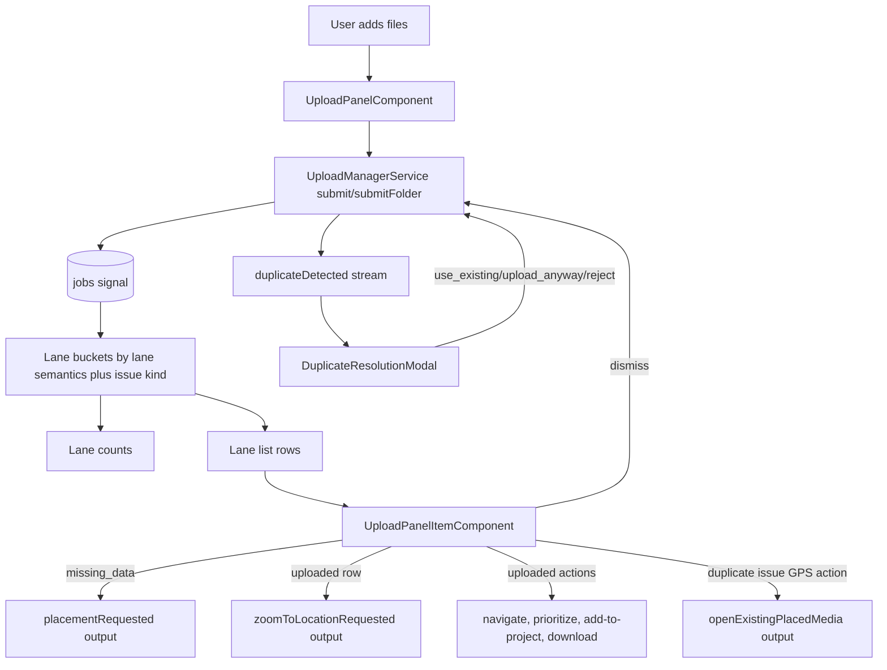
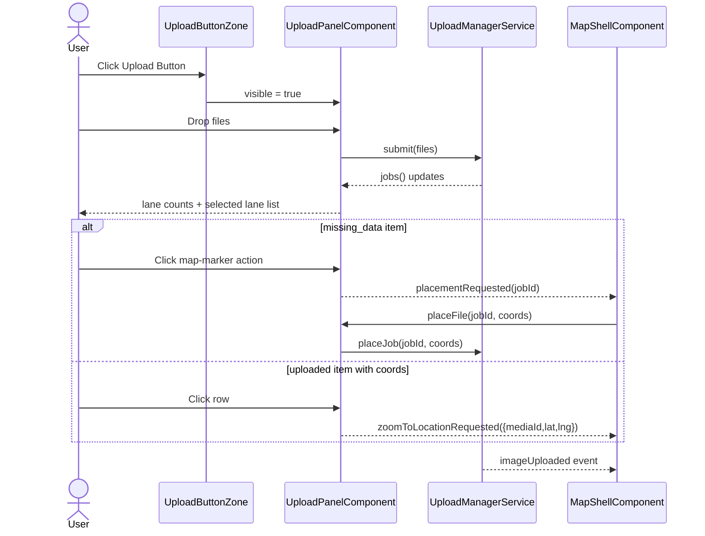

# Upload Panel — Data flow and wiring

> **Parent:** [upload-panel.md](upload-panel.md)

## What It Is

The reactive **data-flow diagram** (job intake through lane presentation) and the **wiring sequence** (open, submit, placement, zoom) for Upload Panel. Split from `upload-panel.md` for size; normative behavior is in the parent, this document is the diagram detail.

## What It Looks Like

Two Mermaid diagrams: a flowchart tracing signal/stream propagation from submit to row outputs, and a sequence diagram tracing the open → drop → submit → placement/zoom round trip across `UploadButtonZone`, `UploadPanelComponent`, `UploadManagerService`, and `MapShellComponent`.

## Where It Lives

- **Specs:** `docs/specs/component/upload/upload-panel.data-flow.supplement.md`
- **Code:** `features/upload/upload-panel/`, `core/upload/upload-manager.service.ts`, `features/map/map-shell/component/map-shell.component.ts`

## Actions

| # | Trigger | System response |
| --- | --- | --- |
| 1 | User adds files (drop/pick/folder/capture) | `UploadManagerService.submit()`/`submitFolder()` drives `jobs()`; panel buckets into lanes |
| 2 | User opens panel and interacts | Wiring sequence below governs visibility, submit, placement and zoom round trips |

## Component Hierarchy

N/A — diagrams describe data/control flow across the components in the parent **Component Hierarchy**, not a DOM subtree of their own.

## Data Flow (Mermaid)

## Wiring

### Wiring Flow (Mermaid)

- Receives visibility from `MapShellComponent` and uses parent-controlled open/close behavior.
- Injects `UploadManagerService` to submit files and read reactive job/batch state.
- Uses one canonical intake pipeline for picker, drop, folder, and capture file sources.
- Keeps lane filters stable and deterministic as jobs move through phases.
- Emits placement and zoom intents to `MapShellComponent` through dedicated outputs.
- Keeps lane selection stable, including empty lanes.
- Surfaces RLS permission denies as user-facing feedback while relying on backend enforcement.
