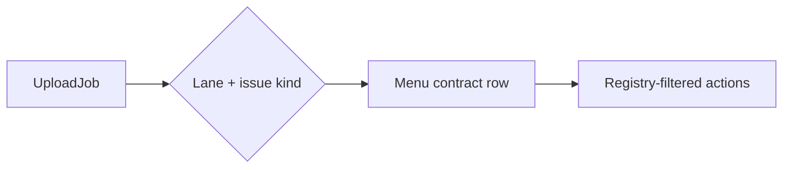
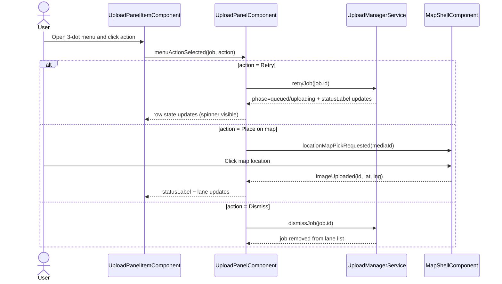

# Upload Panel — Lane and row actions

> **Parent:** [upload-panel.md](upload-panel.md)

## What It Is

Normative contracts for Upload Panel **lane rows**: per-lane actions, status text, media item menus, dropdown visibility, action registry, wiring sequence, and destructive 3-dot menu rules. Split from `upload-panel.md` for spec size; implementation must satisfy this document together with the parent.

## What It Looks Like

Row surfaces use white/surface backgrounds with status tints; 3-dot menus follow primary/secondary/destructive section order with exactly one destructive group last. Full panel chrome is described in the parent **What It Looks Like**.

## Where It Lives

- **Specs:** `docs/specs/component/upload/upload-panel.lane-and-row-actions.md`
- **Code:** `features/upload/` (`UploadPanelComponent`, `UploadPanelItemComponent`)

## Actions

| # | Trigger | System response |
| --- | --- | --- |
| 1 | User opens row menu | Menu options filtered per lane/issue per tables below |
| 2 | User picks destructive action | Operation matches row state (`cancelJob` / unbind+delete / `dismissJob`) |

## Component Hierarchy

Row host: `UploadPanelItemComponent` inside `UploadPanelComponent` lane list (see parent **Component Hierarchy** for full tree).

## Data

Lane and menu contracts apply to `UploadJob` rows bucketed by `UploadLane` and issue kind; see parent **Data** for full field sources.

## Lane Item Features

| Lane                                       | Availability                                                 | Item Actions                                                                                                                                                                        | Notes                                                                                                                                                                          |
| ------------------------------------------ | ------------------------------------------------------------ | ----------------------------------------------------------------------------------------------------------------------------------------------------------------------------------- | ------------------------------------------------------------------------------------------------------------------------------------------------------------------------------ |
| `uploading`                                | queued, parsing, validating, uploading, saving, enrichment   | `View file details`, `Cancel upload`                                                                                                                                                | Queue lane is user-facing label; internal lane id remains `uploading`                                                                                                          |
| `uploaded`                                 | persisted uploads and attachments with successful completion | `Change location > Add/Change GPS`, `Change location > Add/Change address`, `Open in /media`, `Assign project`, optional `Open project`, optional `Prioritize`, optional `Download` | `Assign project` opens shared project-selector primitive with multi-select and deselect support; `Open project` opens direct on single binding or submenu on multiple bindings |
| `issues: duplicate_photo`                  | dedupe review                                                | `Open existing media`, `Upload anyway`, `Dismiss`                                                                                                                                   | `Upload anyway` only for duplicate-photo rows                                                                                                                                  |
| `issues: missing_gps`                      | GPS/manual placement needed                                  | `Add GPS`, `Add/Change address`, `Retry`, `Dismiss`                                                                                                                                 | `Retry` re-queues only when retry preconditions are met                                                                                                                        |
| `issues: document_unresolved`              | document without GPS/address                                 | `Add GPS`, `Add/Change address`, `Assign project`, `Dismiss`                                                                                                                        | `Assign project` resolves geospatially missing documents as project-bound artifacts                                                                                            |
| `issues: address_ambiguous`                | ambiguous address prompt                                     | `Select suggested candidate`, `Enter location manually`, `Cancel`                                                                                                                   | Upload-internal prompt only; no map/workspace exposure                                                                                                                         |
| `issues: conflict_review` / `upload_error` | conflict or hard error                                       | `Retry`, `Dismiss`                                                                                                                                                                  | No force-upload actions in these issue kinds                                                                                                                                   |

Row state rendering requirements:

- Each lane item uses a white/surface background (`var(--color-bg-surface)`), with status tints for error/warning states.
- During active upload and retry transitions, the thumbnail area shows an overlaid spinning loading indicator.
- Rows with preview-capable media always render deterministic thumbnail previews; hover MUST NOT collapse to empty placeholders.
- Row status text must update live as phase/statusLabel changes (including retry re-queue and upload progression).
- `document_unresolved` issue rows show status text `Choose location or project` (or localized equivalent) until resolved.

### Status Text Contract

| Phase / Issue Kind                            | Required status text (English fallback)      | Lane        | Notes                                      |
| --------------------------------------------- | -------------------------------------------- | ----------- | ------------------------------------------ |
| `queued`                                      | `Queued`                                     | `uploading` | Initial queued and post-resolution requeue |
| `validating`                                  | `Validating…`                                | `uploading` | File checks                                |
| `parsing_exif` / `extracting_title`           | `Reading metadata…` / `Checking filename…`   | `uploading` | Metadata context build                     |
| `hashing` / `dedup_check`                     | `Computing hash…` / `Checking duplicates…`   | `uploading` | Photo-only dedupe path                     |
| `uploading` / `saving_record`                 | `Uploading…` / `Saving…`                     | `uploading` | Persist path                               |
| `resolving_address` / `resolving_coordinates` | `Resolving address…` / `Resolving location…` | `uploading` | Enrichment path                            |
| `awaiting_conflict_resolution`                | `Waiting for decision…`                      | `issues`    | Conflict review hold                       |
| `missing_data` + `missing_gps`                | `Choose location`                            | `issues`    | Requires GPS/address placement             |
| `missing_data` + `document_unresolved`        | `Choose location or project`                 | `issues`    | Resolvable by location or project binding  |
| `skipped` + `duplicate_photo`                 | `Already uploaded`                           | `issues`    | Duplicate review entry                     |
| `error`                                       | `Upload failed`                              | `issues`    | Retry path allowed when supported          |
| `complete`                                    | `Uploaded`                                   | `uploaded`  | Terminal success                                           |
| `awaiting_map_pick` (uploaded row)            | `Click map to set location`                  | `uploaded`  | After `Add/Change GPS` until pick completes or panel hides |

### Media Item Menu Contract

| Lane / Issue Kind                            | Non-destructive actions                                                                                                                                                                               | Destructive section (last group)                                                                                                      | Destructive styling       |
| -------------------------------------------- | ----------------------------------------------------------------------------------------------------------------------------------------------------------------------------------------------------- | ------------------------------------------------------------------------------------------------------------------------------------- | ------------------------- |
| `uploading`                                  | `View file details`                                                                                                                                                                                   | `Cancel upload`                                                                                                                       | danger text + danger icon |
| `uploaded` (with or without project binding) | `Change location > Add/Change GPS`, `Change location > Add/Change address`, `Open in /media`, `Assign project` (shared selector), optional `Open project`, optional `Prioritize`, optional `Download` | If project-bound: `Remove from project` (single) OR `Remove from projects` (multi). Always include `Delete media` for uploaded media. | danger text + danger icon |
| `issues: duplicate_photo`                    | `Open existing media`, `Upload anyway`                                                                                                                                                                | `Dismiss`                                                                                                                             | danger text + danger icon |
| `issues: missing_gps`                        | `Add GPS`, `Add/Change address`, `Retry`                                                                                                                                                              | `Dismiss`                                                                                                                             | danger text + danger icon |
| `issues: document_unresolved`                | `Add GPS`, `Add/Change address`, `Assign project`                                                                                                                                                     | `Dismiss`                                                                                                                             | danger text + danger icon |
| `issues: address_ambiguous`                  | `Select suggested candidate`, `Enter location manually`                                                                                                                                               | `Cancel`                                                                                                                              | danger text + danger icon |
| `issues: conflict_review` or `upload_error`  | `Retry`                                                                                                                                                                                               | `Dismiss`                                                                                                                             | danger text + danger icon |

The `primary` / `secondary` / `destructive` section order in this contract is the canonical basis for shared action menus on map and workspace surfaces. Keep that ordering stable when a registry is reused outside the upload panel.

### Dropdown Visibility Rationale

| Condition                                        | Why this option appears                                                       |
| ------------------------------------------------ | ----------------------------------------------------------------------------- |
| Lane = `uploading`                               | Item is still transient; only detail/cancel actions are valid                 |
| Lane = `uploaded` and media persisted            | Location/project/download actions require saved media identity                |
| Uploaded row with one bound project              | `Open project` navigates directly to that project                             |
| Uploaded row with multiple bound projects        | `Open project` opens subdropdown to choose target project                     |
| Uploaded row with one or more project bindings   | Destructive section includes project-unbind action (`Remove from project(s)`) |
| Uploaded row with persisted media                | Destructive section includes `Delete media`                                   |
| Issue kind = `duplicate_photo`                   | Duplicate needs resolution choices (`open existing`, `upload anyway`)         |
| Issue kind = `missing_gps`                       | Missing location needs placement/correction actions                           |
| Issue kind = `document_unresolved`               | Document lacks resolvable location; allow GPS, address, or project resolution |
| Issue kind = `conflict_review` or `upload_error` | Safe recovery path is retry/dismiss only                                      |
| Destructive section always last                  | Keeps action hierarchy predictable and prevents accidental destructive clicks |

### Action Label Contract

| Action family  | Label when value missing | Label when value already exists                                            |
| -------------- | ------------------------ | -------------------------------------------------------------------------- |
| GPS action     | `Add GPS`                | `Change GPS`                                                               |
| Address action | `Add address`            | `Change address`                                                           |
| Project action | `Assign project`         | `Assign project` (opens shared selector with current bindings preselected) |
| Open project   | Hidden                   | `Open project` (direct for one binding, subdropdown for multiple bindings) |

### Row Action Registry Shape (Contract)

All row actions MUST be declared in a registry and filtered by lane/state/capabilities. The UI may not hardcode action visibility in scattered conditional blocks.

| id                        | label contract                                 | section       | lane gate                                    | state/issue gate                                 | capability gates                     | run contract                             |
| ------------------------- | ---------------------------------------------- | ------------- | -------------------------------------------- | ------------------------------------------------ | ------------------------------------ | ---------------------------------------- |
| `view_file_details`       | `View file details`                            | `primary`     | `uploading`                                  | all non-terminal upload phases                   | none                                 | info/details drawer                      |
| `cancel_upload`           | `Cancel upload`                                | `destructive` | `uploading`                                  | active or queued                                 | none                                 | cancel pipeline job                      |
| `change_location_map`     | `Add GPS` / `Change GPS`                       | `edit`        | `uploaded`                                   | persisted                                        | `mediaId`                            | map-pick and persist location            |
| `change_location_address` | `Add address` / `Change address`               | `edit`        | `uploaded`                                   | persisted                                        | `mediaId`                            | open address finder and persist          |
| `open_in_media`           | `Open in /media`                               | `primary`     | `uploaded`                                   | persisted                                        | `mediaId`                            | navigate to media focus                  |
| `assign_to_project`       | `Assign project`                               | `primary`     | `uploaded`, `issues` (`document_unresolved`) | for uploaded and unresolved-document resolution  | shared project selector available    | open shared project selector primitive   |
| `open_project`            | `Open project`                                 | `primary`     | `uploaded`                                   | persisted                                        | one or more bound projects           | direct navigation or project subdropdown |
| `toggle_priority`         | `Prioritize`                                   | `primary`     | `uploaded`                                   | persisted                                        | priority workflow capability enabled | toggle priority state                    |
| `download`                | `Download`                                     | `primary`     | `uploaded`                                   | persisted                                        | `mediaId` and `storagePath`          | force attachment download                |
| `remove_from_project`     | `Remove from project` / `Remove from projects` | `destructive` | `uploaded`                                   | persisted                                        | one or more bound projects           | open remove-membership flow              |
| `delete_media`            | `Delete media`                                 | `destructive` | `uploaded`                                   | persisted                                        | `mediaId`                            | delete persisted media                   |
| `open_existing_media`     | `Open existing media`                          | `primary`     | `issues`                                     | `duplicate_photo`                                | `existingMediaId`                    | navigate to existing media               |
| `upload_anyway`           | `Upload anyway`                                | `primary`     | `issues`                                     | `duplicate_photo`                                | none                                 | force duplicate upload flow              |
| `add_gps_issue`           | `Add GPS`                                      | `edit`        | `issues`                                     | `missing_gps`, `document_unresolved`             | map-pick capability                  | placement workflow                       |
| `change_address_issue`    | `Add address` / `Change address`               | `edit`        | `issues`                                     | `missing_gps`, `document_unresolved`             | none                                 | address finder workflow                  |
| `candidate_select`        | `Select suggested candidate`                   | `primary`     | `issues`                                     | `address_ambiguous`                              | none                                 | apply chosen address candidate           |
| `manual_location_entry`   | `Enter location manually`                      | `secondary`   | `issues`                                     | `address_ambiguous`                              | address editor available             | open manual location entry               |
| `cancel_location_prompt`  | `Cancel`                                       | `destructive` | `issues`                                     | `address_ambiguous`                              | none                                 | close ambiguous-address prompt           |
| `retry`                   | `Retry`                                        | `primary`     | `issues`                                     | `missing_gps`, `conflict_review`, `upload_error` | retry preconditions met              | retry job                                |
| `dismiss`                 | `Dismiss`                                      | `destructive` | `issues`                                     | all issue kinds                                  | none                                 | dismiss row                              |

### Media Item Action Wiring (Mermaid)

## Destructive Menu Convention

The row 3-dot menu always ends with **one destructive section**: exactly one divider, followed by one or more destructive entries as a group. Multiple destructive entries share the single divider — no additional dividers between them.

| Row State                        | Destructive entries                                                              | Required operation                                    |
| -------------------------------- | -------------------------------------------------------------------------------- | ----------------------------------------------------- |
| Active upload (`uploading` lane) | `Cancel upload`                                                                  | `cancelJob(jobId)`                                    |
| Uploaded (`uploaded` lane)       | `Remove from project(s)` (when project-bound, else omitted) + `Delete media`    | unbind from one/many projects; delete persisted media |
| Issue or failed (`issues` lane)  | `Dismiss`                                                                        | `dismissJob(jobId)`                                   |

Notes:

- Compact mode and embedded mode share the same destructive naming convention.
- `Upload anyway` is a non-destructive duplicate-resolution action and MUST NOT replace the destructive section.
- Every destructive menu entry uses danger styling for label and icon.
- `Delete media` is always present for uploaded rows regardless of project binding. `Remove from project(s)` appears only when one or more project bindings exist.

### Two-Step Confirm Contract for Destructive Menu Actions

`remove_from_project` and `delete_media` require two deliberate clicks before the operation fires. This prevents accidental destructive actions in the compact panel context.

**FSM per destructive menu button:**

| State   | Trigger                          | Next state | Visual change                                           | Side effect             |
| ------- | -------------------------------- | ---------- | ------------------------------------------------------- | ----------------------- |
| `idle`  | First click on destructive item  | `armed`    | Label → "Confirm?" prefix; icon → `warning`; background → danger tint | Menu stays open; 5 s auto-disarm timer starts |
| `armed` | Second click (within 5 s)        | `idle`     | Reverts to idle styling                                 | Operation fires; menu closes |
| `armed` | 5 s timeout                      | `idle`    | Reverts to idle styling                                 | Nothing; menu stays open |
| `armed` | Click outside menu (DropdownShell outside-close) | `idle` | Reverts to idle styling                    | Menu closes + disarm (outside is outside) |
| `armed` | Click on non-destructive item    | `idle`     | Reverts to idle styling                                 | Non-destructive action fires; menu closes |

**Wiring constraint:** `onMenuAction()` in `UploadPanelItemComponent` MUST NOT call `closeMenu()` when a destructive action is in `idle` state (i.e., first click). It calls `closeMenu()` only when a destructive action fires from `armed` state, or when any non-destructive action fires.

**Implementation path:** Use `TwoStepConfirmInteraction` (at `shared/ui/button/destructive-confirm.interaction.ts`) inside `UploadPanelItemComponent`, shared across all destructive menu items via a `TwoStepConfirmGroup` instance. `TwoStepConfirmGroup` ensures only one armed item at a time per menu.

**Label contract for armed state:**

| Action                | Idle label                               | Armed label            |
| --------------------- | ---------------------------------------- | ---------------------- |
| `remove_from_project` | `Remove from project` / `Remove from projects` | `Confirm remove?`  |
| `delete_media`        | `Delete media`                           | `Confirm delete?`      |

After `delete_media` fires from `armed` state: the operation delegates to `MediaDeleteUndoService.deleteWithUndo()` (undo-toast with 5 s window) — no secondary confirm dialog needed.

### Map-pick row state (uploaded lane)

When the user chooses `Add GPS` or `Change GPS` on a persisted uploaded row (`change_location_map`):

| State | Row status text (English fallback) | Clears when |
| --- | --- | --- |
| `awaiting_map_pick` | `Click map to set location` | Map pick succeeds (`imageUploaded` / location update for that `mediaId`), user starts a different map pick, or upload panel hides |

Toast `Click on the map to set the location.` MAY still appear; row status is the canonical in-list affordance.

### Embedded bulk selection (lane switch)

When `embeddedInPane = true`, row checkboxes MAY select jobs across lanes internally, but **changing the selected lane tab MUST clear `selectedUploadJobIds`** before rendering the new lane list. Bulk toolbar actions therefore never operate on a cross-lane selection.

## Acceptance Criteria

- [ ] Row menus match **Media Item Menu Contract** for each lane/issue kind.
- [ ] Status text follows **Status Text Contract** for every phase transition.
- [ ] Action registry drives visibility; no scattered ad-hoc menu conditionals.
- [ ] Destructive section is last in every row menu with danger styling.
- [ ] Uploaded rows with no project binding show exactly one destructive entry: `Delete media`.
- [ ] Uploaded rows with project binding show two entries in one section: `Remove from project(s)` then `Delete media` — preceded by exactly one divider.
- [ ] `remove_from_project` requires two clicks: first arms (label → "Confirm remove?", danger tint), second fires; menu stays open between clicks.
- [ ] `delete_media` requires two clicks: first arms (label → "Confirm delete?", danger tint), second fires; menu stays open between clicks.
- [ ] Armed state auto-disarms after 5 s without second click; menu remains open.
- [ ] Click outside the open menu while armed closes the menu and disarms without firing the destructive action.
- [ ] Clicking a non-destructive item while a destructive item is armed disarms it and fires the non-destructive action.
- [ ] After `delete_media` fires: undo-toast appears (5 s window); no separate confirm dialog.
- [ ] Uploaded row entering map-pick shows status text `Click map to set location` until pick completes or panel hides.
- [ ] Embedded mode clears row selection when the user switches Queue / Uploaded / Issues lane tabs.
