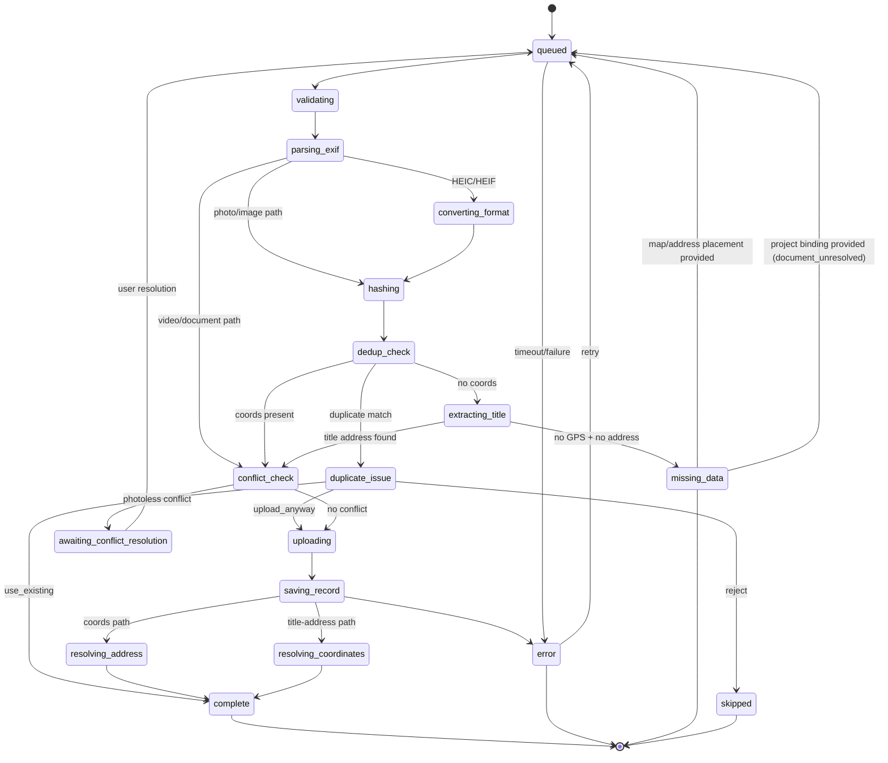
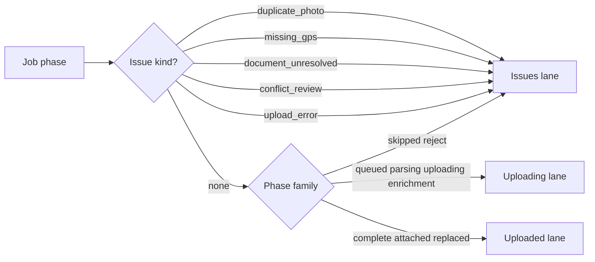

# Upload Panel — Status mapping and lane semantics

> **Parent:** [upload-panel.md](upload-panel.md)

## What It Is

The **phase state diagram** (queued through complete/error/missing_data/skipped) and the **lane-bucketing rule** (issue kind first, then phase family) that Upload Panel uses to route a job into the Uploading / Uploaded / Issues lane. Split from `upload-panel.md` for size; the row-level status text strings live in [lane & row actions § Status Text Contract](upload-panel.lane-and-row-actions.md#status-text-contract).

## What It Looks Like

Two Mermaid diagrams: a `stateDiagram-v2` of every upload-pipeline phase transition, and a flowchart deciding lane placement from issue kind and phase family.

## Where It Lives

- **Specs:** `docs/specs/component/upload/upload-panel.status-mapping.supplement.md`
- **Code:** `core/upload/upload-manager.service.ts`, `features/upload/upload-panel/upload-panel.component.ts` (`laneBuckets`)

## Actions

| # | Trigger | System response |
| --- | --- | --- |
| 1 | Job phase changes | State diagram below governs the legal next phase |
| 2 | `laneBuckets` recomputes | Lane semantics diagram below governs which lane the job lands in |

## Component Hierarchy

N/A — these diagrams describe `UploadJob` state, not a DOM subtree; see parent **Component Hierarchy** for the row host tree.

## Status Mapping (Mermaid)

## Lane Semantics (Mermaid)

