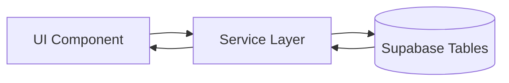
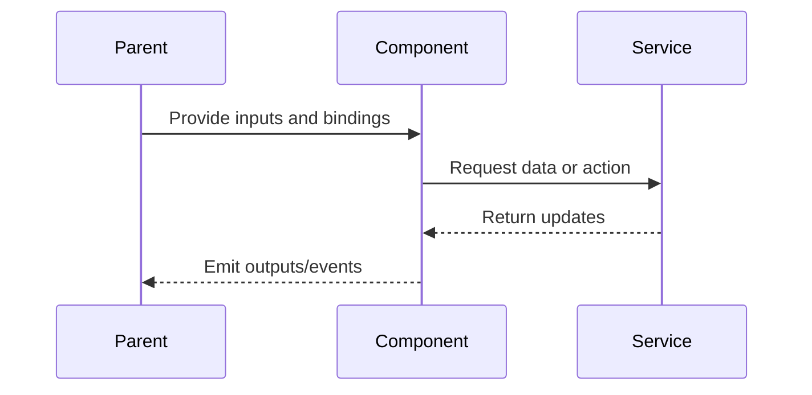

# Group Tab Bar


## What It Is

A horizontal row of tabs inside the Workspace Pane. Each tab represents a group of media items. The first tab is always Active Selection (ephemeral, current map selections). Remaining tabs are user-created named groups. A "+" button at the end creates new groups.

## What It Looks Like

Scrollable horizontal row; `border-bottom: 1px solid var(--border)` underlines the row. Tab triggers use `[brnTabsTrigger][hlmTabsTrigger]`: muted foreground text by default; active trigger receives `color: var(--foreground)` + `border-bottom: 2px solid var(--primary)` (tweakcn primary token — was legacy `--color-clay`; background transparent — was legacy `--color-bg-elevated`). Overflow scrolls horizontally (scrollbar hidden). Active Selection tab is pinned leftmost and cannot be closed/renamed. Named Group tabs have a context menu on long-press.

**Spec sync (2026-05-19, Phase 1 Wave P5):** Legacy `--color-clay` / `--color-bg-elevated` references replaced by tweakcn `var(--primary)` / `var(--foreground)` per `group-tab-bar.component.scss`.

## Where It Lives

- **Parent**: Workspace Pane
- **Always visible** when Workspace Pane is open

## Actions

| #   | User Action              | System Response                                        | Triggers              |
| --- | ------------------------ | ------------------------------------------------------ | --------------------- |
| 1   | Clicks a tab             | Content area switches to that group's media thumbnails | `activeTabId` changes |
| 2   | Clicks "+" button        | Creates a new empty named group, prompts for name      | New tab appears       |
| 3   | Long-presses a named tab | Opens context menu: Rename, Delete                     | Context menu          |
| 4   | Selects "Rename"         | Tab label becomes editable inline input                | Focus on input        |
| 5   | Selects "Delete"         | Confirmation prompt, then removes group                | Tab removed           |
| 6   | Scrolls horizontally     | Reveals overflow tabs                                  | Native scroll         |

## Component Hierarchy

```
app-group-tab-bar                          ← [hlmTabs][brnTabs] root (display: contents wrapper)
└── .group-tab-bar                         ← [brnTabsList][hlmTabsList], scrollable row, border-bottom
    └── button.group-tab-bar__tab × N      ← [brnTabsTrigger][hlmTabsTrigger] per tab
        (Active Selection tab always first — cannot close/rename)
        (Named Group tabs planned: closable, context menu on long-press, inline rename)
```

**Current state (2026-05-19):** Component renders a static `Selection` tab only; named groups, "+" button, inline rename, and long-press context menu are not yet implemented. See Data / Acceptance Criteria for full contract.

## Data

### Data Flow (Mermaid)



| Field                 | Source                                                   | Type                |
| --------------------- | -------------------------------------------------------- | ------------------- |
| Persisted shared sets | `share_sets` + `share_set_items` via service abstraction | `ShareSetSummary[]` |
| Selection media items | In-memory (Active Selection is not persisted)            | `WorkspaceMedia[]`  |

## State

| Name           | Type             | Default       | Controls                       |
| -------------- | ---------------- | ------------- | ------------------------------ |
| `activeTabId`  | `string`         | `'selection'` | Which tab content is displayed |
| `editingTabId` | `string \| null` | `null`        | Which tab is in rename mode    |

## File Map

| File                                                     | Purpose           |
| -------------------------------------------------------- | ----------------- |
| `apps/web/src/app/shared/workspace-pane/group-tab-bar.component.ts` | Tab bar component |

## Wiring

### Wiring Flow (Mermaid)



- Import `GroupTabBarComponent` in `WorkspacePaneComponent`
- Inject `GroupService` for CRUD operations
- Bind `activeTabId` input from `WorkspacePaneComponent` state

## Acceptance Criteria

- [ ] Active Selection tab always first, cannot be closed or renamed
- [ ] Named group tabs show group name, support rename and delete
- [ ] "+" button creates new group with name prompt
- [ ] Horizontal scroll when tabs overflow
- [ ] Active tab visually distinct (`var(--primary)` 2 px bottom border, `var(--foreground)` text)
- [ ] Long-press context menu works on named tabs
- [ ] Tab switches update the content area below
