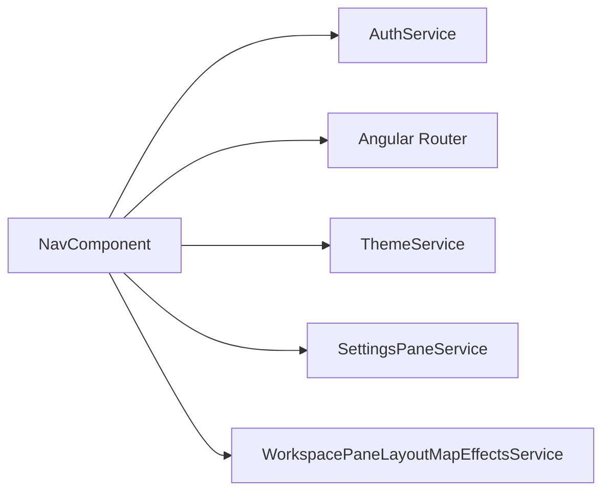

# Sidebar

## What It Is

The main navigation rail. **Desktop:** frosted-glass panel fixed to the left edge with a **pinned** expand/collapse control (not hover-auto-expand). **Mobile:** fixed bottom tab bar. Primary routes, theme cycle, and settings/account row at the bottom.

Detail: [`sidebar.collapse.supplement.md`](sidebar.collapse.supplement.md) (NavRow geometry, padding invariants, map reflow).

## What It Looks Like

**Desktop (≥ 768px):** Expanded = `15rem`; collapsed = `3rem`. Panel uses frosted chrome; row CSS is **identical in both states** — sidebar `overflow: hidden` clips the label column automatically. Icons stay at a fixed X position. Header: logo | title | collapse control (see supplement).

**Mobile (< 768px):** Bottom bar `3.5rem` tall, icons only. Account row hidden (settings via other surfaces).

Tokens: [`docs/design/tokens.md`](../../../design/tokens.md), [`docs/design/layout.md`](../../../design/layout.md).

## Where It Lives

- **Parent:** `AuthenticatedAppLayoutComponent` (`app-nav` flex spacer + fixed `.sidebar`)
- **Component:** `NavComponent` — `features/nav/`

## Interaction emphasis

- [`state-visuals.md`](../../../design/state-visuals.md) § Interaction emphasis
- [`interaction-emphasis-ink-contract.md`](../../system/interaction-emphasis-ink-contract.md)
- [x] Nav links: tertiary violet active, gold hover; avatar uses filled-primary exception

## NavLink States

| State | Background | Ink | Notes |
| --- | --- | --- | --- |
| Default | transparent | `--muted-foreground` | icon + label inherit |
| Hover | gold ~10% | `--brand-gold` | host + children |
| Active route | nav-ink ~10% | `--interaction-nav-ink` | `nav__link--active` |
| Active + hover | gold ~10% | `--brand-gold` | |
| Focus-visible | hover ink + ring | `--interactive-focus-ring` | |
| Disabled | transparent | muted, reduced opacity | `pointer-events: none` |

## Spacing (desktop summary)

| Property | Value |
| --- | --- |
| Collapsed / expanded width | `3rem` / `15rem` |
| Panel `padding-inline` | `var(--spacing-2)` (8px) — **constant** |
| Row `padding-block` | `var(--spacing-2)` (8px) — **constant** |
| Row `padding-inline` | `0` — **constant** |
| Row `column-gap` | `var(--spacing-3)` (12px) — **constant** |
| Media column | `var(--spacing-6)` (32px) — **constant** |
| Row min-height | `calc(var(--spacing-6) + 2 × var(--spacing-2))` = 48px — **constant** |
| Width transition | `180ms ease-out` |

Full tables + mobile bar: [`sidebar.collapse.supplement.md`](sidebar.collapse.supplement.md).

## Actions

| # | User Action | System Response | Triggers |
| --- | --- | --- | --- |
| 1 | Clicks collapse control | Toggles `3rem` ↔ `15rem`; labels fade; persists preference | `toggleCollapse()` |
| 2 | Clicks nav link | Navigates | `RouterLink` |
| 3 | Clicks theme row | Cycles theme; dots update | `ThemeService.cycle()` |
| 4 | Clicks account row | Opens settings overlay | `toggleSettingsOverlay()` |
| 5 | Resizes below 768px | Bottom tab bar | CSS media query |

Legacy hover-expand actions are **deferred** — see supplement.

## Component Hierarchy

```text
Sidebar (.sidebar)
└── SidebarPanel (.sidebar__panel)
    ├── Header (.nav__header) — logo, title, collapse btn
    ├── NavList — NavLink rows (media + label)
    ├── Spacer
    ├── ThemeUtilityRow — cycle btn + theme dots
    └── AccountRow — avatar + settings label
```

Theme dots: [`cycle-indicator-dots.md`](../ui-primitives/cycle-indicator-dots.md).

## Data



| Field | Source |
| --- | --- |
| Nav items | `navItems` computed + i18n |
| User avatar / name | `AuthService.user()` |
| Collapsed preference | `localStorage` + `sidebarCollapsed` signal |

## State

| Name | Type | Default | Controls |
| --- | --- | --- | --- |
| `sidebarCollapsed` | `boolean` | from `localStorage` | Rail width, label visibility, `--feldpost-sidebar-width` |
| `settingsOverlayOpen` | `boolean` | from `SettingsPaneService` | Account row active styling |

## File Map

| File | Purpose |
| --- | --- |
| `features/nav/nav.component.ts` | Collapse signal, map invalidate on toggle |
| `features/nav/nav.component.html` | Template |
| `features/nav/nav.component.scss` | NavRow + collapse styles |

## Wiring

- `AuthenticatedAppLayoutComponent` hosts `app-nav`; layout spacer mirrors `--feldpost-sidebar-width`
- Collapse toggle MUST NOT change panel `padding-inline` — collapsed row gap/label width change per supplement
- Map shell registers `invalidateMapSize` via `WorkspacePaneLayoutMapEffectsService`

## Acceptance Criteria

- [x] Pinned collapse documented in [`sidebar.collapse.supplement.md`](sidebar.collapse.supplement.md)
- [x] Full checklist in [`sidebar.acceptance-criteria.md`](sidebar.acceptance-criteria.md)
