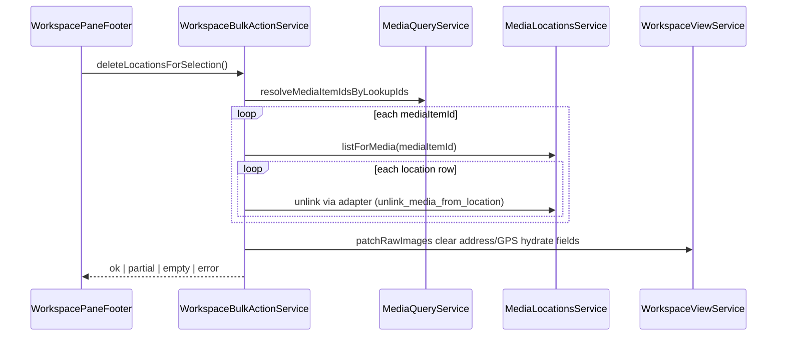

# Workspace Pane Footer — Destructive Bulk Actions (Supplement)

> **Parent:** [workspace-pane-footer.md](./workspace-pane-footer.md)  
> **Service:** [media-locations-service.md](../../service/media-locations/media-locations-service.md), `MediaDeleteUndoService` (no dedicated spec — behavior from matrix + existing delete flows)

## Semantic split (normative)

| User-facing name | Action ID | Domain effect | Reversible |
| --- | --- | --- | --- |
| **Delete locations** | `delete_locations` | For each selected media item, remove **every** `media_item_location_links` row (via `unlink_media_from_location`). Shared `locations` rows remain if other media still link. | No undo toast; user re-adds addresses manually |
| **Delete media** | `delete_media` | Delete selected `media_items` and storage assets (existing bulk path). | Undo toast via `MediaDeleteUndoService` |

**Forbidden:** Using `delete_media` to mean “clear address only”, or `delete_locations` to delete files.

## Action registry contract

Add to `WORKSPACE_EXPORT_ACTION_DEFINITIONS`:

| id | section | priority | icon (Material) | visibleWhen | enabledWhen |
| --- | --- | --- | --- | --- | --- |
| `delete_locations` | `destructive` | 0 | `location_off` | `selectedCount > 0` | `context.hasLocationInSelection === true` |
| `delete_media` | `destructive` | 1 | `delete` | `selectedCount > 0` | always when visible |

Extend `WorkspaceExportActionContext`:

```ts
hasLocationInSelection: boolean; // true when any selected lookup id maps to media with ≥1 location link
```

`hasLocationInSelection` MUST be computed in the footer component (or a small helper) by resolving selected media item IDs and checking location link presence — not inferred from stale `WorkspaceImage` address labels alone.

## Confirmation dialogs

Both destructive actions MUST use dedicated confirm UI (existing inline dialog pattern or `app-confirm-dialog` — pick one in implementation; normative copy below).

### Location delete dialog

| Field | English canonical (`fallback`) | Key (planned) |
| --- | --- | --- |
| Title | Remove locations from selection | `workspace.footer.deleteLocations.title` |
| Body | Removes address and GPS links from {count} media items. Media files are kept. | `workspace.footer.deleteLocations.message` |
| Confirm | Remove locations | `workspace.footer.deleteLocations.confirm` |
| Cancel | Cancel | `workspace.export.dialog.cancel` (reuse) |
| ARIA | Remove locations from selection | `workspace.footer.deleteLocations.aria` |
| Success toast | Locations removed from selection | `workspace.footer.deleteLocations.success` |
| No links toast | Selected items have no locations to remove | `workspace.footer.deleteLocations.none` |

### Media delete dialog

| Field | English canonical | Key (planned) |
| --- | --- | --- |
| Title | Delete selected media | `workspace.footer.deleteMedia.title` |
| Body | Permanently deletes {count} media items and their files. You can undo immediately after. | `workspace.footer.deleteMedia.message` |
| Confirm | Delete media | `workspace.footer.deleteMedia.confirm` |
| ARIA | Delete selected media | `workspace.footer.deleteMedia.aria` |

Migrate legacy keys `workspace.export.deleteDialog.*` to `workspace.footer.deleteMedia.*` in the same implementation pass (CSV + SQL regen).

Toolbar tooltips / `aria-label` MUST use the same strings as action `fallbackLabel` keys:

- `workspace.footer.action.deleteLocations` → `Remove locations`
- `workspace.footer.action.deleteMedia` → `Delete media`

## Bulk location delete orchestration

New method on `WorkspaceBulkActionService` (name normative: `deleteLocationsForSelection`):



**Rules:**

1. Process media items **sequentially** (or bounded concurrency ≤3) to avoid RPC stampede; report partial failure with count in toast.
2. Use `unlink_media_from_location(media_item_id, location_id)` — not `delete_media_item_location` — so each unlink is scoped to the selected media item (shared locations stay for other media).
3. After all unlinks for an item, caller MUST `invalidateListCache(mediaItemId)` and refresh display-hydrate snapshot if detail is open (parent pane observer).
4. `WorkspaceImage` patch MUST null/empty: `latitude`, `longitude`, `addressLabel`, `city`, `district`, `street`, `streetNumber`, `zip`, `country` for affected lookup ids.
5. **No** undo stack for this path in v1.

**Empty selection / no locations:** return `empty_selection` or `no_locations`; show warning toast; do not open confirm.

## Bulk media delete orchestration

Keep existing `deleteSelectedWithUndo` contract. Footer MUST wire `delete_media` toolbar action to open `deleteMediaDialogOpen` (rename from generic `deleteDialogOpen`).

Post-success: clear selection, remove tiles, close dialog — unchanged from current `confirmDeleteDialog` behavior.

## Action context matrix updates

Add row `delete_locations` with `ws_footer_multi` = `✅ (count guard + confirm)` and `ws_grid_thumbnail` = `—` (bulk-only in footer for v1).

Keep `delete_media` on `ws_footer_multi` with count guard; footer MUST expose it (registry today omits it — gap closed by this spec).

## i18n

All keys in § Confirmation dialogs and § Action registry MUST be added to `docs/i18n/translation-workbench.csv` with `context` referencing `workspace-pane-footer` before code merge. Run diacritics normalize + `npm run i18n:check` + SQL import.

## Acceptance Criteria (supplement)

- [ ] User can distinguish location delete vs media delete from icon + tooltip + confirm copy.
- [ ] Location delete leaves media tiles in grid with cleared address/GPS presentation after refresh.
- [ ] Media delete removes tiles and supports undo toast.
- [ ] Shared org `locations` referenced only from unselected media are untouched.
- [ ] Footer destructive buttons use `icon-sm` and `variant="outline"`; dialog confirm uses `destructive` variant.
- [ ] `WORKSPACE_EXPORT_ACTION_DEFINITIONS` test fixture includes `delete_locations` and `delete_media`.
