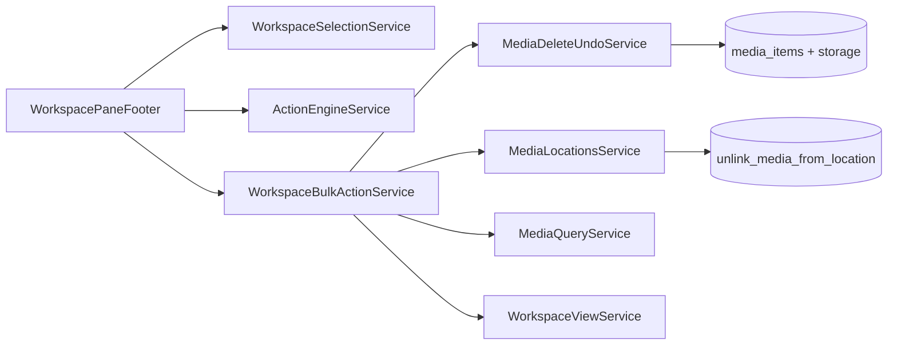

# Workspace Pane Footer

> **Feature surface (selection bar):** [workspace-actions-bar.md](../../ui/workspace/workspace-actions-bar.md)  
> **Destructive bulk delete contract:** [workspace-pane-footer.destructive-actions.supplement.md](./workspace-pane-footer.destructive-actions.supplement.md)  
> **Action matrix:** [action-context-matrix.md](../../system/action-context-matrix.md)  
> **Layout shell:** [pane-footer.md](./pane-footer.md) (projection only; no action semantics)

## What It Is

Bottom action bar in the Workspace Pane **Selected items** tab when `selectedCount > 0`. Hosts selection controls, export/share actions, and **two distinct bulk destructive actions**: **location delete** (remove address/GPS links, keep media) and **media delete** (remove media records and storage). Actions resolve through `ActionEngineService` and `WORKSPACE_EXPORT_ACTION_DEFINITIONS`; mutations delegate to `WorkspaceBulkActionService`.

Context ID: `ws_footer_multi` when `selectedCount > 1`; consumers MUST pass `ACTION_CONTEXT_IDS.wsFooter` with `selectedCount` so visibility guards match the matrix.

## What It Looks Like

Full-width footer row inside `app-pane-footer`: left slot shows `{count} selected`; right slot is a wrapping flex row of compact controls.

**Compact control tier (normative):**

| Control kind | `hlmBtn` size | Geometry | Notes |
| --- | --- | --- | --- |
| Icon-only actions (select, share, copy, both deletes) | `icon-sm` | 2rem × 2rem (`h-8 w-8`) | Replaces prior `size="icon"` (2.5rem) in this footer only |
| Labeled primary export (`download_zip`) | `sm` | height 2.25rem (`h-9`) | Keeps icon + short label; not `default` height |

Gap between controls: `var(--spacing-2)`. Destructive icon buttons use `variant="outline"` at rest; confirm buttons inside dialogs use `variant="destructive"` for irreversible commit.

Section order from action engine: `primary` → `secondary` → `destructive` → (labeled ZIP remains `primary` with highest priority after selection controls per registry).

## Where It Lives

- **Code:** `apps/web/src/app/shared/workspace-pane/footer/workspace-pane-footer/`
- **Parent:** `WorkspacePaneComponent` when selection non-empty
- **Inputs:** `scopeIds: string[]`, `images: WorkspaceImage[]`

## Actions & Interactions

| # | User Action | System Response | Notes |
| --- | --- | --- | --- |
| 1 | First item selected | Footer mounts; compact action row visible | Derived `selectedCount > 0` |
| 2 | `Select all` | `selectAllInScope(scopeIds)` | Current filtered scope only |
| 3 | `Select none` | `clearSelection()`; footer unmounts | |
| 4 | `Share link` / `Copy link` | Audience dialog → share-set URL | Existing contract |
| 5 | `Download ZIP` | ZIP title dialog → `MediaDownloadService` | `size="sm"` labeled button |
| 6 | `Delete locations` | Opens location-delete confirm dialog | See supplement § Location delete |
| 7 | `Delete media` | Opens media-delete confirm dialog | See supplement § Media delete |
| 8 | Confirms either destructive dialog | Runs bulk mutation; refreshes grid + map surfaces | `pending` blocks duplicate submits |
| 9 | Cancels destructive dialog | Closes dialog; selection unchanged | |
| 10 | `Escape` with dialog open | Closes topmost dialog only | Does not clear selection |

## Component Hierarchy

```text
app-workspace-pane-footer
└── app-pane-footer
    ├── [slot=left] selection summary
    └── [slot=right] @for resolved actions
        ├── icon-sm outline buttons (select, share, copy, delete_locations, delete_media)
        └── sm default button (download_zip)
├── [projectDialogOpen] app-project-select-dialog (reserved; not in export registry today)
├── [addressDialogOpen] app-text-input-dialog (reserved)
├── [deleteMediaDialogOpen] destructive confirm (media)
├── [deleteLocationsDialogOpen] destructive confirm (locations)
├── [shareAudienceDialogOpen] app-share-link-audience-dialog
└── [zipDialogOpen] inline export dialog
```

## Data Requirements

### Data flow



| Artifact | Source | Role |
| --- | --- | --- |
| `selectedMediaIds` | `WorkspaceSelectionService` | Lookup IDs for scope |
| `selectedMediaItemIds` | `MediaQueryService.resolveMediaItemIdsByLookupIds` | Canonical UUIDs for mutations |
| Location link rows | `MediaLocationsService.listForMedia` per item | Drives delete-locations batch |
| Grid/map address snapshot | `WorkspaceViewService.updateRawImages` | Clears hydrated address fields after location delete |

## State

| Name | Type | Default | Controls |
| --- | --- | --- | --- |
| `pending` | `signal<boolean>` | `false` | Disables toolbar + dialog actions |
| `deleteMediaDialogOpen` | `signal<boolean>` | `false` | Media delete confirm |
| `deleteLocationsDialogOpen` | `signal<boolean>` | `false` | Location delete confirm |
| `zipDialogOpen` | `signal<boolean>` | `false` | ZIP export |
| `shareAudienceDialogOpen` | `signal<boolean>` | `false` | Share audience |
| `actions` | `computed` | from engine | Registry + context predicates |

No `[attr.data-state]` on footer root (visibility is parent-gated; dialogs own modal state).

## Settings

- **Selection bulk actions:** whether destructive confirms show numeric count only or include media-type breakdown (future).

## File Map

| File | Purpose |
| --- | --- |
| `workspace-pane-footer.component.ts` | Action routing, dialogs, bulk calls |
| `workspace-pane-footer.component.html` | Pane footer template |
| `workspace-pane-footer.component.scss` | Summary + action row layout |
| `workspace-export-actions.registry.ts` | Declarative action definitions |
| `workspace-export-actions.types.ts` | Context + action IDs |
| `workspace-bulk-action.service.ts` | Bulk delete orchestration |
| `workspace-bulk-action.types.ts` | Result types for bulk mutations |

## Wiring

- Registry MUST register `delete_media` and `delete_locations` in `destructive` section (see supplement for predicates).
- `onActionSelected` MUST open the correct dialog; MUST NOT call mutations without confirm.
- After successful **media** delete: clear selection and remove tiles from `WorkspaceViewService` (existing undo hooks).
- After successful **location** delete: keep selection; patch each affected `WorkspaceImage` address/GPS fields to empty; invalidate location caches per `MediaLocationsService` contract.

## Visual Behavior Contract

### Ownership Matrix

| Behavior | Visual Geometry Owner | Stacking Context Owner | Interaction Hit-Area Owner | Selector(s) | Layer | Test Oracle |
| --- | --- | --- | --- | --- | --- | --- |
| Footer row | `app-pane-footer` | `app-pane-footer` | action buttons | `.workspace-action__actions` | content | wraps on narrow width |
| Destructive dialogs | `.workspace-action__dialog` | `fixed` viewport | dialog buttons | `.workspace-action__dialog-actions` | overlay 501 | scrim blocks map clicks |

### Ownership Triad

| Behavior | Geometry | State | Visual | Same? |
| --- | --- | --- | --- | --- |
| Compact icon control | `hlmBtn` host | disabled via `[disabled]` | variant + size CVA | ✅ |
| Selection summary | `.workspace-action__summary` | N/A | text color token | ✅ |

## Acceptance Criteria

- [ ] Footer uses `icon-sm` for all icon-only footer actions and `sm` for labeled ZIP.
- [ ] Two destructive toolbar icons are visible when `selectedCount > 0`: location delete before media delete (engine `priority`).
- [ ] Location delete removes all `media_item_location_links` for each selected media item; does not delete `media_items` or storage objects.
- [ ] Media delete removes selected media via `MediaDeleteUndoService` with existing undo toast contract.
- [ ] `delete_locations` disabled when no selected item has at least one location link; helper toast on attempted click optional.
- [ ] Both destructive flows require explicit confirmation with count in copy.
- [ ] Action IDs `delete_media` and `delete_locations` are registered in [action-context-matrix.md](../../system/action-context-matrix.md) for `ws_footer_multi`.
- [ ] All new UI strings registered in i18n workbench before implementation ships (see supplement § i18n).
