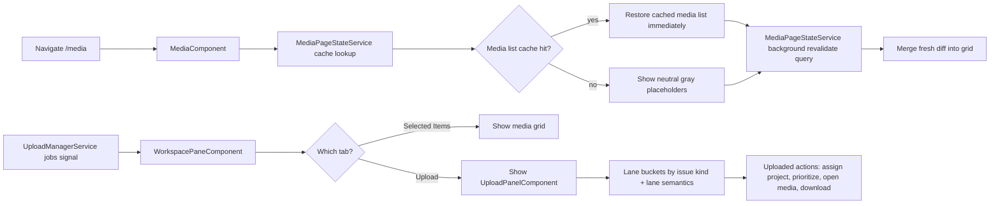
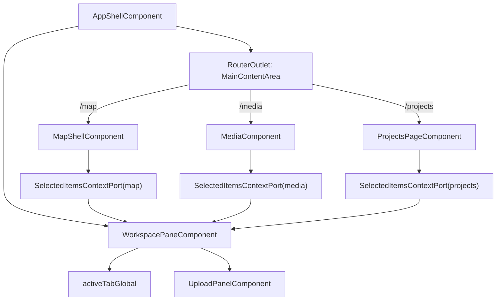
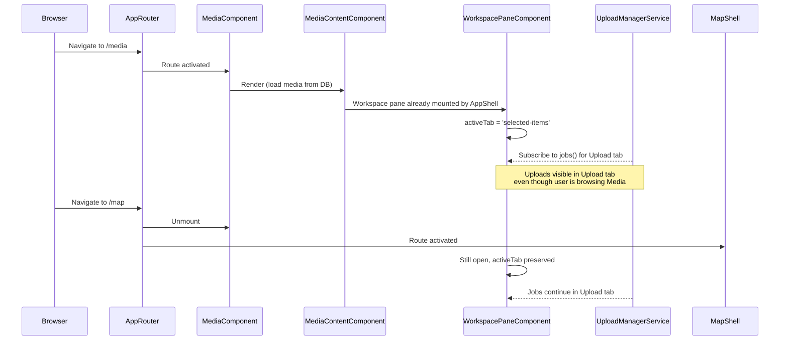

# Media Page

**Status:** Element Spec  
**Route:** `/media`  
**Parent:** **Authenticated app layout** (split host) — see [workspace-pane § Layout host](../ui/workspace/workspace-pane.md#layout-host-canonical). **`MediaComponent`** renders **inside** the layout’s `router-outlet` main column.

---

## What It Is

Canonical `/media` route: page-level layout, **layout-host** pane integration, and persistence only; child component specs own grid, items, and media chrome (this phase: `media.component.md`, `media-content.md`, `media-item.md`, `item-grid.md` media path, etc.).

## Documentation Phase Boundary

- This refactoring pass MUST modify only the `/media` page specification set:
  - `docs/specs/page/media-page.md`
  - `docs/specs/component/media/media.component.md`
  - `docs/specs/component/media/media-content.md`
  - `docs/specs/component/media/media-item.md`
  - `docs/specs/component/media/media-display.md`
  - `docs/specs/component/media/media-item-quiet-actions.md`
  - `docs/specs/component/media/media-item-upload-overlay.md`
  - `docs/specs/component/item-grid/item-grid.md` (media-path constraints only)
  - `docs/specs/component/media/media-page-header.md`
  - `docs/specs/component/media/media-toolbar.md`
- Broader documentation cleanup MUST be deferred to later phases.

## Layer Ownership Contract

- The page layer MUST own orchestration, routing, high-level layout composition, and page-level state ownership.
- The component layer MUST own behavior contracts, FSM transitions, and API/service boundaries.
- The item/domain layer MUST own tile visuals, local UI states, and atomic data mapping.
- When page and component specs conflict on a shared boundary, the component spec MUST be authoritative for behavior and the page spec MUST be authoritative for composition.

---

## What It Looks Like

**Desktop Layout (canonical):**

```
AuthenticatedAppLayout (split host)
├── SideMenuComponent (or shared chrome — exact app structure TBD)
├── MainColumn (flex 1) — router-outlet
│   └── MediaComponent
│       ├── MediaPageHeaderComponent
│       ├── [Optional] MediaToolbar
│       └── MediaContentComponent
│
└── WorkspacePaneShell + WorkspacePaneComponent   ← same pane as map route; right column
    ├── PaneHeaderComponent
    ├── TabSelectorComponent: "Selected Items" | "Upload"
    └── ContentArea @switch(activeTab)
        ├── Tab: "Selected Items" → context from `WorkspacePaneObserverAdapter` + `MediaComponent`
        └── Tab: "Upload" → UploadPanelComponent (1:1 embed)
```

**Settings:** **`/settings/**`** uses the same authenticated layout and **`MapShellComponent`** in the main column (settings overlay behavior unchanged). No separate settings-only layout fork in this phase.

---

**Rollback note:** If the pane is reverted to map-only mounting, restore the prior **interim** paragraph here and in [workspace-pane § Interim implementation](../ui/workspace/workspace-pane.md#interim-implementation-rollback--partial-landing).

**Mobile Layout (Phase 2):**

- The media content region MUST fill the available viewport height.
- Workspace pane behavior SHOULD switch to a bottom-sheet pattern.

---

## Where It Lives

- **Route:** `/media` (routed by AppRouter → `MediaComponent` in main column)
- **Parent Container:** **`app-authenticated-app-layout`** main column (canonical); `WorkspacePaneObserverAdapter` coordinates selected-items context; pane DOM is a **sibling** column on the same layout host.
- **Workspace Pane:** Same `WorkspacePane` tree as map/projects routes (mounted by layout host).
- **Trigger:** Navigation via app menu, or view-all-media action
- **Persistence:** Media page state (filters, sort, group) saved to localStorage; media list snapshots and pagination cursor are cache-retained per user/query (no forced clear on normal revisit); workspace pane state (tab, selection, uploads) is independent

## Terminology (symbols)

- **`WorkspacePaneObserverAdapter.setDetailImageId`:** legacy method name — argument is **media id** (not “image” as a domain term). Prefer **`detailMediaId`** / **requestOpenDetail** in new contracts.

---

## Actions & Interactions

| #  | Trigger | Orchestration Response | Ownership |
| --- | --- | --- | --- |
| 1 | Route enters `/media` without persisted tab state | Layout host MUST mount `MediaComponent` in the outlet and bind **Workspace Pane** selected-items context with default tab `selected-items` (via `WorkspacePaneObserverAdapter` / ports). | Layout host + page |
| 2 | Route re-enters `/media` with persisted tab state | Same as today: restore last active tab unless URL anchor overrides. | Layout host + page |
| 3 | Explicit URL anchor/intent requests a tab | Prioritize anchor over persisted tab state. | Layout host + page |
| 4 | User switches to `upload` tab | Pane host renders `UploadPanelComponent` without remounting the route outlet content. | Layout host + pane |
| 5 | User navigates between `/media` and `/map` | Pane host MUST preserve upload continuity and tab state across route transitions. | Layout host + pane |
| 6 | User invokes grouping/sorting/filtering via toolbar | `MediaComponent` command methods; toolbar intent-only. | Page + layout |
| 7 | Child emits selection/detail intents | Forward through selected-items context ports to **Workspace Pane**. | Page + pane host |

Page contract note:

- Child tile rendering details (for example address chips, overlay typography, per-item hover visuals) MUST be owned by domain/component contracts and MUST NOT be specified in this page spec.

---

## Component Hierarchy

```text
AuthenticatedAppLayout
├── MainColumn — router-outlet
│   └── MediaComponent (route shell)
│       ├── MediaPageHeaderComponent
│       ├── [Optional] MediaToolbar
│       └── MediaContentComponent
└── WorkspacePaneComponent (same instance contract as other routes)

WorkspacePaneComponent
├── PaneHeaderComponent
├── TabSelectorComponent ("Selected Items" | "Upload")
└── ContentArea @switch(activeTab)
    ├── "Selected Items" tab (context-bound provider via observer)
    └── "Upload" tab → UploadPanelComponent
```

---

## Data Requirements

| Source                                  | Fields Needed                                                        | Purpose                                      |
| --------------------------------------- | -------------------------------------------------------------------- | -------------------------------------------- |
| `media_items` table                     | All columns (id, title, address_label, captured_at, media_type, ...) | Grid content                                 |
| `MediaPageStateService`                 | cachedItems, nextOffset, totalCount, querySignature, lastSyncedAt    | Restore list on revisit without forced clear |
| `MediaDownloadService`                  | bestCachedTierUrl, loadState, signed URL reuse                       | Warm preview + cross-route cache reuse       |
| `share_sets` + `share_set_items` tables | share_set_id, fingerprint, ordered media_item_id membership          | Persisted shared selections (media-era)      |
| `UploadManagerService`                  | jobs(), batches(), activeCount()                                     | Upload tab progress + lane data              |
| `WorkspaceViewService`                  | getGroupedAndFiltered() logic (reuse)                                | Grouping/filtering/sorting                   |
| `WorkspaceSelectionService`             | selectedMediaIds, toggleSelection()                                  | Selection state for "Selected Items" tab     |

### Data Flow



---

## State

### Page-Level Ownership (Mandatory)

- This page spec MUST own route composition and cross-route pane orchestration only.
- Route-shell lifecycle FSM behavior MUST be owned by `docs/specs/component/media/media.component.md`.
- Content-render FSM behavior MUST be owned by `docs/specs/component/media/media-content.md`.
- Tile visuals and per-item UI mapping MUST be owned by domain-level specs (`MediaItemComponent` and related item contracts).

### Deterministic Tab Entry Policy (Mandatory)

- On re-entry, the page MUST restore the last active tab unless an explicit URL anchor/intent overrides it.
- Selection context restore behavior MUST be subordinate to the tab policy above.
- If the restored/overridden tab is `selected-items`, the route context MUST rebind selected-items provider contracts for `/media`.
- If the restored/overridden tab is `upload`, upload continuity MUST remain uninterrupted and selected-items context MAY rebind in background.

**Cross-route contracts (AppShell-owned pane lifecycle remains unchanged):**

| Name              | Type                             | Default            | Write Owner                                  | Controls                                                    |
| ----------------- | -------------------------------- | ------------------ | -------------------------------------------- | ----------------------------------------------------------- |
| `activeTabGlobal` | `'selected-items' \| 'upload'`   | `'selected-items'` | Workspace pane host (`AppShell` integration) | Single source of truth for tab restore across route changes |
| `pageContextKey`  | `'map' \| 'media' \| 'projects'` | `'media'`          | App shell route host                         | Which selected-items provider should render in pane         |
| `selectionScope`  | `'media-item-id'`                | `'media-item-id'`  | `WorkspaceSelectionService` boundary         | Canonical ID namespace for selection service integration    |

**WorkspacePaneComponent (extended):**

| Name               | Type                           | Default            | Write Owner                        | Controls                                        |
| ------------------ | ------------------------------ | ------------------ | ---------------------------------- | ----------------------------------------------- |
| `activeTab`        | `'selected-items' \| 'upload'` | `'selected-items'` | `WorkspacePaneComponent` host port | Which workspace pane tab is shown               |
| `isOpen`           | `boolean`                      | `true`             | `WorkspacePaneComponent`           | Pane visibility; same close button as existing  |
| `detailMediaId`    | `string \| null`               | `null`             | `WorkspacePaneComponent`           | If set, detail modal opens on any tab/page      |
| `width`            | `number`                       | `320`              | `WorkspacePaneComponent`           | Desktop pane width (unchanged)                  |
| `selectedMediaIds` | `Set<string>`                  | empty set          | `WorkspaceSelectionService`        | Current selection from active page's media grid |

Forbidden writers in this page contract:

- `MediaToolbar`, `MediaContentComponent`, and `MediaItemComponent` MUST NOT directly mutate `groupingMode`, `sortMode`, or `activeFilters`.
- `MediaItemComponent` MUST NOT write route lifecycle or cross-route tab/detail state.

## Module Interfaces (Schnittstellen)

### Input/Output Contract

```ts
export type WorkspacePaneTab = "selected-items" | "upload";
export type WorkspacePageContextKey = "map" | "media" | "projects";

export interface SelectedItemsContextPort {
  contextKey: WorkspacePageContextKey;
  selectedMediaIds$: Signal<Set<string>>;
  openDetail: (mediaId: string) => void;
  clearDetail: () => void;
  setHover: (mediaId: string | null) => void;
}

export interface WorkspacePaneHostPort {
  activeTab$: Signal<WorkspacePaneTab>;
  setActiveTab: (tab: WorkspacePaneTab) => void;
  bindContext: (port: SelectedItemsContextPort) => void;
  unbindContext: () => void;
}
```

### Contract Invariants

- `activeTabGlobal` is the single source of truth across routes; per-page state MUST NOT duplicate the tab key.
- Route transition contract: `unbindContext` MUST run before `bindContext` when context key changes.
- Upload tab visibility MUST remain globally persistent; selected-items provider MUST remain route-scoped and hot-swappable.
- Naming contract MUST remain canonical: `selectedMediaIds` in page, pane, and service interfaces.

### Observer/Hooks Contract

| Hook                              | Owner                   | Input         | Output                            | Cleanup                                  |
| --------------------------------- | ----------------------- | ------------- | --------------------------------- | ---------------------------------------- |
| `onRouteContextEnter(contextKey)` | App shell route host    | route key     | binds selected-items port         | unbind previous port before binding next |
| `onRouteContextLeave(contextKey)` | App shell route host    | route key     | detaches selected-items port      | clear transient hover only               |
| `onContextSwap(nextContextKey)`   | App shell route host    | route key     | unbind + bind in one transition   | no duplicate observers                   |
| `onUploadJobsChanged(jobs)`       | upload observer adapter | `UploadJob[]` | updates upload tab lanes/progress | unsubscribe in pane destroy              |
| `onActiveTabChanged(tab)`         | workspace pane          | selected tab  | persists `activeTabGlobal`        | none                                     |

---

## File Map

**New Files:**

| File                                          | Purpose                                                                   |
| --------------------------------------------- | ------------------------------------------------------------------------- |
| `features/media/media.component.ts`           | Route component for `/media`                                              |
| `features/media/media.component.html`         | Template: breadcrumb + content shell (no pane — pane is in AppShell)      |
| `features/media/media.component.scss`         | Page layout styles                                                        |
| `features/media/media-content.component.ts`   | Responsive ItemGrid-backed content renderer with state switching          |
| `features/media/media-content.component.html` | Content template with grouped sections / empty / error branches           |
| `features/media/media-content.component.scss` | Content-region layout and transition styles                               |
| `features/media/media-toolbar.component.ts`   | OPTIONAL Phase 2: Grouping/Sort/Filter operators                          |
| `features/media/media-toolbar.component.html` | Toolbar template (Phase 2)                                                |
| `features/media/media-toolbar.component.scss` | Toolbar styles (Phase 2)                                                  |
| `core/media-view.service.ts`                  | Grouping, filtering, sorting logic (or share with workspace service)      |
| `core/media-page-state.service.ts`            | Route-stable media list snapshot cache + background revalidation metadata |
| `core/workspace-pane-context.port.ts`         | Shared interface contract for selected-items context provider             |
| `core/workspace-pane-host.port.ts`            | Host contract for tab and context binding                                 |
| `core/workspace-pane-observer.adapter.ts`     | Observer lifecycle adapter (route, upload, tab persistence)               |

**Modified Files:**

| File                                                        | Change                                                 |
| ----------------------------------------------------------- | ------------------------------------------------------ |
| `shared/workspace-pane/workspace-pane.component.ts`   | Add `activeTab` signal + tab container logic + imports |
| `shared/workspace-pane/workspace-pane.component.html` | Add tab selector UI at top before content              |
| `app-shell.component.ts`                                    | Add `/media` route option (if not already present)     |
| Routing config                                              | Wire `/media` → MediaComponent                         |

**Reused Components:**

- `ItemGridComponent` (shared)
- `MediaItemComponent` (media domain item)
- `MediaDetailViewComponent` (overlay variant)
- `UploadPanelComponent` (full embed in Upload tab)

---

## Wiring

### App-Level Architecture



### Media Page Flow



---

## Acceptance Criteria

- [ ] `/media` route MUST be accessible through AppShell navigation.
- [ ] Page composition MUST include `MediaComponent` and MUST integrate with `WorkspacePaneComponent` without pane remount on route changes.
- [ ] Tab persistence MUST follow one deterministic rule: restore last active tab on re-entry unless explicit URL anchor/intent overrides it.
- [ ] Selection context restore MUST be subordinate to tab persistence and MUST rebind only for `selected-items` context.
- [ ] Page spec MUST NOT define child tile visual mapping details; those details MUST be referenced through component/domain contracts.
- [ ] Toolbar contract naming MUST use `MediaToolbar` when referring to the `/media` toolbar boundary.
- [ ] All enforceable statements in this file MUST use RFC 2119 language (`MUST`, `SHOULD`, `MAY`).

## Canonical Name Registry Gate

- Every component name used in this spec MUST match a canonical entry in glossary/registry.
- Names that do not resolve to a canonical glossary/registry entry MUST be treated as unresolved and MUST block completion.
- This refactor pass MUST NOT create or rename glossary/registry entries outside the in-scope media-page specification set.
- If a required canonical name cannot be resolved, documentation work MUST stop with: `⚠ SPEC GAP: [missing file or ambiguous owner]`.
