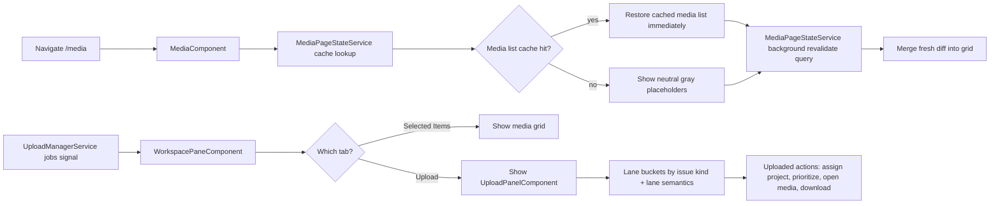
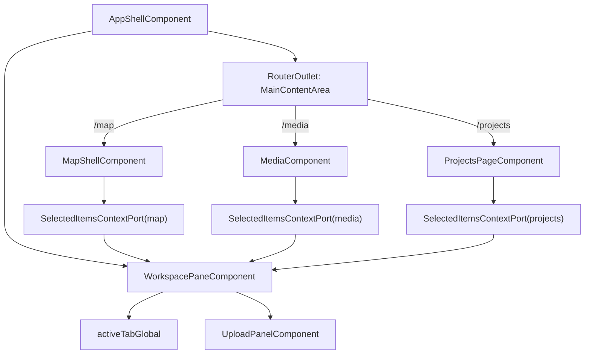
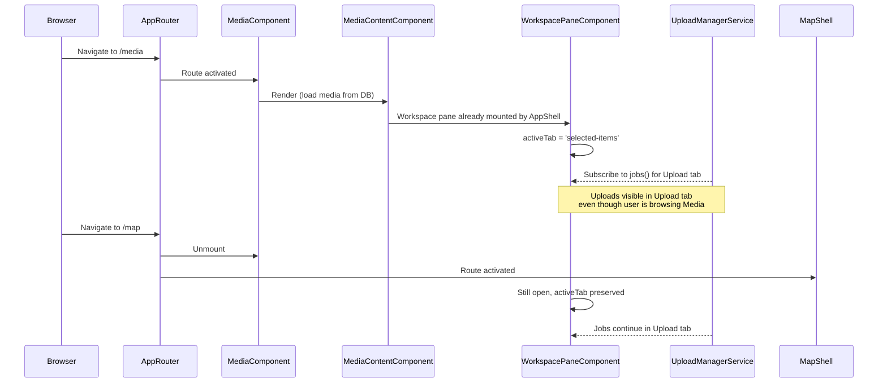

# Media Page

**Status:** Element Spec  
**Route:** `/media`  
**Parent:** `AppShellComponent` main content area (flex 1)

---

## What It Is

The **Media Page** is the canonical `/media` route for browsing all media assets with grouping, filtering, and sorting, while AppShell owns pane lifecycle and page components provide selected-items context through explicit interfaces.

---

## Design Philosophy

**Problem:** Users need a dedicated, non-spatial view to browse all their media with powerful discovery operators (grouping by project, date, address; sorting; filtering). The map view is spatial-first; media browsing deserves its own page.

**Solution:**

1. Create `/media` route with MediaComponent
2. Use same Workspace Pane as other pages (map, projects)

- "Selected Items" tab shows media grid browsed on this page
- "Upload" tab is seitenübergreifend (persists across page changes)

3. Reuse all existing workspace infrastructure (selection, operators, detail view)

---

## What It Looks Like

**Desktop Layout:**

```
AppShell (top-level, persistent across routes)
├── SideMenuComponent (AppShell-owned, rendered independent from MediaComponent)
├── Main Content
│   ├── MediaComponent (flex 1)
│   │   ├── Breadcrumb: / > Media
│   │   ├── [Optional] MediaToolbar (grouping/sort/filter)
│   │   └── MediaContentComponent
│   │       ├── ItemGridComponent + projected MediaItemComponent × N
│   │       │   ├── media preview (photo/video tile or doc icon)
│   │       │   ├── Title + date overlay
│   │       │   ├── Address chip (optional)
│   │       │   └── Hover state (linked-hover to workspace)
│   │       └── No-results placeholder
│   │
│   └── WorkspacePaneComponent (right side, always visible unless closed)
│       ├── PaneHeaderComponent (title, close button, width control)
│       ├── TabSelectorComponent ← NEW: "Selected Items" | "Upload"
│       └── ContentArea @switch(activeTab)
│           ├── Tab: "Selected Items"
│           │   └── [ItemGridComponent + projected MediaItemComponent]
│           └── Tab: "Upload"
│               └── [UploadPanelComponent 1:1 embed]
│
└── Footer (optional)
```

**Mobile Layout (Phase 2):**

- Media grid fills viewport
- Workspace pane becomes bottom sheet (snap points)

---

## Where It Lives

- **Route:** `/media` (routed by AppRouter → MediaComponent)
- **Parent Container:** `AppShellComponent` main content flex area
- **Workspace Pane:** Mounted by AppShellComponent (seitenübergreifend, not media-specific)
- **Trigger:** Navigation via AppShell side menu, or view-all-media action
- **Persistence:** Media page state (filters, sort, group) saved to localStorage; media list snapshots and pagination cursor are cache-retained per user/query (no forced clear on normal revisit); workspace pane state (tab, selection, uploads) is independent

---

## Actions & Interactions

**Media Grid Tab (Selected Items in Workspace Pane):**

| #    | User Action                                        | System Response                                                                                 | Notes                                 |
| ---- | -------------------------------------------------- | ----------------------------------------------------------------------------------------------- | ------------------------------------- |
| 1a   | Navigates to `/media`                              | MediaComponent loads, workspace pane shows "Selected Items" tab                                 | Filtered to "All media" if no filters |
| 1a.1 | Navigates to `/media` again (same user/query)      | Previously cached media list is restored immediately; background revalidation updates diff-only | No hard reset/empty flash             |
| 1b   | Workspace applies saved filter state               | Grid re-renders with filtered/sorted/grouped media                                              | localStorage or query params          |
| 2    | Uses Grouping operator (project/date/address)      | Grid reorganizes with section headers (if toolbar shown)                                        | Computed via `WorkspaceViewService`   |
| 3    | Uses Sorting operator (newest/oldest/name)         | Grid re-sorts within groups                                                                     | Reactive recompute                    |
| 4    | Uses Filter operator (project/date/tag/media-type) | Grid hides non-matching items                                                                   | Cascading filter logic                |
| 5    | Clicks thumbnail in grid                           | Opens media detail view (modal overlay)                                                         | Same detail component as workspace    |
| 6    | Closes detail                                      | Returns to grid, clears `detailMediaId`                                                         | Grid state preserved                  |
| 7    | Hovers thumbnail                                   | Shows optional linked-hover underlay                                                            | Same pattern as workspace hover       |
| 8    | Selects one or more thumbnails                     | Selected count updates in workspace pane header                                                 | Affects "Selected Items" tab content  |
| 8a   | Media was already loaded on `/map` or detail       | Grid tile uses warm cached preview (blurred) and dissolves to requested sharp tier when ready   | Shared media cache contract           |

**Upload Tab (Global, Seitenübergreifend):**

| #   | User Action                                     | System Response                                                                                | Notes                                                       |
| --- | ----------------------------------------------- | ---------------------------------------------------------------------------------------------- | ----------------------------------------------------------- |
| 9a  | Clicks "Upload" tab in workspace                | Tab switches, shows full UploadPanelComponent                                                  | Same as upload on map                                       |
| 9b  | Drags files onto Drop Zone                      | Creates upload jobs via UploadManagerService                                                   | Queue + progress visible                                    |
| 10  | Clicks "Select Folder" button                   | Opens folder picker, scans + enqueues                                                          | Folder address hint applied                                 |
| 11  | Folder name contains address                    | Address becomes default for all files in folder                                                | Folder precedence rule                                      |
| 12  | Clicks "Uploading" / "Uploaded" / "Issues" lane | Lane list filters to show matching jobs                                                        | 1:1 copy of upload panel                                    |
| 13  | Duplicate detected                              | Modal appears, user selects use/upload/reject                                                  | Job state resolved                                          |
| 13a | User opens action menu on uploaded row          | Embedded upload tab exposes saved-media follow-up actions                                      | `Zu Projekt hinzufügen`, `Priorisieren`, `/media`, download |
| 13b | Uploaded row belongs to a bound project         | `Projekt öffnen` action is available                                                           | Only when project context already exists                    |
| 13c | Issue row represents missing GPS                | Upload tab exposes placement-oriented actions only                                             | No `Trotzdem hochladen` for GPS issues                      |
| 13d | Issue row represents duplicate-photo review     | Upload tab exposes `Trotzdem hochladen` and existing-media actions                             | Only for duplicate review                                   |
| 14  | Switches back to "Selected Items"               | Tab switches, media grid stays in last filter state                                            | Uploads continue in background                              |
| 15  | Navigates away to `/map`                        | MediaPage unmounts, Map loads; **Workspace pane stays open with Upload tab content preserved** | Uploads never interrupted                                   |
| 16  | Navigates back from `/map` to `/media`          | MediaPage mounts; pane stays on previously active tab (global restore policy)                  | If tab is `selected-items`, media context is rebound        |

---

## Component Hierarchy

**STRICT PRIMITIVE REQUIREMENT:** The Media Page and its grid structural components must strictly rely on `.ui-container` and `.ui-item`. Do not create deep nested `div` elements for the grid sections; the group headers and media item tiles should be structurally flat siblings or one-level deep inside a standard container.

```text
MediaComponent (new route component, flex 1)
├── BreadcrumbComponent
│   └── "/" > "Media" > [Project filter]?
├── [Optional] MediaToolbarComponent
│   ├── Standard dropdown/segmented primitives
└── MediaContentComponent (new - flat structure using .ui-container/.ui-item equivalents)
    ├── GroupSectionHeader × N (if grouping active)
    │   └── ItemGridComponent + projected MediaItemComponent × N
    │       ├── Media/video/doc preview
    │       ├── Title + date overlay
    │       ├── Address chip (optional)
    │       └── Hover state (linked-hover)
    └── No-results placeholder

[Workspace Pane is mounted by AppShellComponent, not MediaComponent]
WorkspacePaneComponent (seitenübergreifend)
├── PaneHeaderComponent (unchanged)
├── TabSelectorComponent (NEW: two-button toggle)
│   ├── "Selected Items" button
│   └── "Upload" button
└── ContentArea @switch(activeTab)
    ├── "Selected Items" tab
    │   └── ItemGridComponent + projected MediaItemComponent (shows current page's selection)
    └── "Upload" tab
        └── UploadPanelComponent (unchanged, 1:1 embed)
```

---

## Data Requirements

| Source                                  | Fields Needed                                                        | Purpose                                      |
| --------------------------------------- | -------------------------------------------------------------------- | -------------------------------------------- |
| `media_items` table                     | All columns (id, title, address_label, captured_at, media_type, ...) | Grid content                                 |
| `MediaPageStateService`                 | cachedItems, nextOffset, totalCount, querySignature, lastSyncedAt    | Restore list on revisit without forced clear |
| `MediaDownloadService`                  | bestCachedTierUrl, loadState, signed URL reuse                       | Warm preview + cross-route cache reuse       |
| `share_sets` + `share_set_items` tables | share_set_id, fingerprint, ordered media_item_id membership          | Persisted shared selections (media-era)      |
| `UploadManagerService`                  | jobs(), batches(), activeCount()                                     | Upload tab progress + lane data              |
| `WorkspaceViewService`                  | getGroupedAndFiltered() logic (reuse)                                | Grouping/filtering/sorting                   |
| `WorkspaceSelectionService`             | selectedMediaIds, toggleSelection()                                  | Selection state for "Selected Items" tab     |

### Data Flow



---

## State

### FSM Ownership Mapping

- MediaPage route-shell FSM ownership is defined in `docs/specs/component/media.component.md`.
- MediaContent rendering FSM ownership is defined in `docs/specs/component/media-content.md`.
- This page spec remains route/product contract and must not redefine those component FSM enums.

**MediaComponent:**

| Name               | Type                                                | Default    | Controls                                         |
| ------------------ | --------------------------------------------------- | ---------- | ------------------------------------------------ |
| `groupingMode`     | `'none' \| 'project' \| 'date' \| 'address'`        | `'none'`   | How grid is organized into sections              |
| `sortMode`         | `'newest' \| 'oldest' \| 'name_asc' \| 'name_desc'` | `'newest'` | Grid sort order                                  |
| `activeFilters`    | `FilterSpec[]`                                      | `[]`       | Applied filter chips (projects, date ranges)     |
| `filteredImages`   | `Signal<WorkspaceMedia[]>`                          | `[]`       | Computed: media items matching active filters    |
| `groupedAndSorted` | `Signal<MediaGroup[]>`                              | `[]`       | Computed: filtered + grouped + sorted            |
| `cachedMediaItems` | `Signal<WorkspaceMedia[]>`                          | `[]`       | Route-stable cached snapshot for instant restore |
| `hoveredMediaId`   | `string \| null`                                    | `null`     | Current media item tile under pointer            |
| `detailMediaId`    | `string \| null`                                    | `null`     | If set, detail modal is open                     |

Note: cache-warm status is encoded in the MediaComponent FSM boot/initial-loading path, not as a separate boolean signal.

**Cross-route contracts:**

| Name              | Type                             | Default            | Controls                                                    |
| ----------------- | -------------------------------- | ------------------ | ----------------------------------------------------------- |
| `activeTabGlobal` | `'selected-items' \| 'upload'`   | `'selected-items'` | Single source of truth for tab restore across route changes |
| `pageContextKey`  | `'map' \| 'media' \| 'projects'` | `'media'`          | Which selected-items provider should render in pane         |
| `selectionScope`  | `'media-item-id'`                | `'media-item-id'`  | Canonical ID namespace for selection service integration    |

**WorkspacePaneComponent (extended):**

| Name               | Type                           | Default            | Controls                                        |
| ------------------ | ------------------------------ | ------------------ | ----------------------------------------------- |
| `activeTab`        | `'selected-items' \| 'upload'` | `'selected-items'` | Which workspace pane tab is shown               |
| `isOpen`           | `boolean`                      | `true`             | Pane visibility; same close button as existing  |
| `detailMediaId`    | `string \| null`               | `null`             | If set, detail modal opens on any tab/page      |
| `width`            | `number`                       | `320`              | Desktop pane width (unchanged)                  |
| `selectedMediaIds` | `Set<string>`                  | empty set          | Current selection from active page's media grid |

## Module Interfaces (Schnittstellen)

### Input/Output Contract

```ts
export type WorkspacePaneTab = "selected-items" | "upload";
export type WorkspacePageContextKey = "map" | "media" | "projects";

export interface SelectedItemsContextPort {
  contextKey: WorkspacePageContextKey;
  selectedMediaIds$: Signal<Set<string>>;
  openDetail: (mediaId: string) => void;
  clearDetail: () => void;
  setHover: (mediaId: string | null) => void;
}

export interface WorkspacePaneHostPort {
  activeTab$: Signal<WorkspacePaneTab>;
  setActiveTab: (tab: WorkspacePaneTab) => void;
  bindContext: (port: SelectedItemsContextPort) => void;
  unbindContext: () => void;
}
```

### Contract Invariants

- `activeTabGlobal` is the single source of truth across routes; per-page state must not duplicate the tab key.
- Route transition contract: `unbindContext` runs before `bindContext` when context key changes.
- Upload tab visibility is globally persistent; selected-items provider is route-scoped and hot-swappable.
- Naming contract is canonical: `selectedMediaIds` in page, pane, and service interfaces.

### Observer/Hooks Contract

| Hook                              | Owner                   | Input         | Output                            | Cleanup                                  |
| --------------------------------- | ----------------------- | ------------- | --------------------------------- | ---------------------------------------- |
| `onRouteContextEnter(contextKey)` | App shell route host    | route key     | binds selected-items port         | unbind previous port before binding next |
| `onRouteContextLeave(contextKey)` | App shell route host    | route key     | detaches selected-items port      | clear transient hover only               |
| `onContextSwap(nextContextKey)`   | App shell route host    | route key     | unbind + bind in one transition   | no duplicate observers                   |
| `onUploadJobsChanged(jobs)`       | upload observer adapter | `UploadJob[]` | updates upload tab lanes/progress | unsubscribe in pane destroy              |
| `onActiveTabChanged(tab)`         | workspace pane          | selected tab  | persists `activeTabGlobal`        | none                                     |

---

## File Map

**New Files:**

| File                                          | Purpose                                                                   |
| --------------------------------------------- | ------------------------------------------------------------------------- |
| `features/media/media.component.ts`           | Route component for `/media`                                              |
| `features/media/media.component.html`         | Template: breadcrumb + content shell (no pane — pane is in AppShell)      |
| `features/media/media.component.scss`         | Page layout styles                                                        |
| `features/media/media-content.component.ts`   | Responsive ItemGrid-backed content renderer with state switching          |
| `features/media/media-content.component.html` | Content template with grouped sections / empty / error branches           |
| `features/media/media-content.component.scss` | Content-region layout and transition styles                               |
| `features/media/media-toolbar.component.ts`   | OPTIONAL Phase 2: Grouping/Sort/Filter operators                          |
| `features/media/media-toolbar.component.html` | Toolbar template (Phase 2)                                                |
| `features/media/media-toolbar.component.scss` | Toolbar styles (Phase 2)                                                  |
| `core/media-view.service.ts`                  | Grouping, filtering, sorting logic (or share with workspace service)      |
| `core/media-page-state.service.ts`            | Route-stable media list snapshot cache + background revalidation metadata |
| `core/workspace-pane-context.port.ts`         | Shared interface contract for selected-items context provider             |
| `core/workspace-pane-host.port.ts`            | Host contract for tab and context binding                                 |
| `core/workspace-pane-observer.adapter.ts`     | Observer lifecycle adapter (route, upload, tab persistence)               |

**Modified Files:**

| File                                                        | Change                                                 |
| ----------------------------------------------------------- | ------------------------------------------------------ |
| `features/map/workspace-pane/workspace-pane.component.ts`   | Add `activeTab` signal + tab container logic + imports |
| `features/map/workspace-pane/workspace-pane.component.html` | Add tab selector UI at top before content              |
| `app-shell.component.ts`                                    | Add `/media` route option (if not already present)     |
| Routing config                                              | Wire `/media` → MediaComponent                         |

**Reused Components:**

- `ItemGridComponent` (shared)
- `MediaItemComponent` (media domain item)
- `MediaDetailViewComponent` (overlay variant)
- `UploadPanelComponent` (full embed in Upload tab)

---

## Wiring

### App-Level Architecture



### Media Page Flow



---

## Acceptance Criteria

**Route & Page:**

- [ ] `/media` route accessible from AppShell side menu navigation
- [ ] MediaComponent renders breadcrumb: "/" > "Media"
- [ ] Page loads all media (photos, videos, documents) from DB
- [ ] Workspace pane opens by default, "Selected Items" tab active

**Media Grid (MVP - Phase 1):**

- [ ] MediaContentComponent displays media items via ItemGrid in responsive grid (2–4 columns)
- [ ] MediaItemComponent is reused as the domain item contract for media tiles
- [ ] Each card shows media/video/doc preview + title + date overlay + address chip
- [ ] Clicking card opens detail view (modal overlay)
- [ ] Closing detail returns to grid with state preserved
- [ ] Hovering card shows optional linked-hover effect
- [ ] Initial unknown-count loading uses icon-free neutral gray placeholders sized to approximately 3 viewport heights (`columns x rows(3 viewports)`).
- [ ] Revisiting `/media` with same user/query restores cached list immediately and does not hard-clear grid before revalidation.
- [ ] If cached media tier exists from `/map` or detail/workspace, tile may render warm blurred preview before dissolving to requested sharp tier.

**Workspace Pane Integration:**

- [ ] Tab selector visible at top of pane (two buttons: "Selected Items" / "Upload")
- [ ] "Selected Items" tab shows grid of media selected on this page
- [ ] "Upload" tab shows UploadPanelComponent (same as map view)
- [ ] Tab state persists globally via `activeTabGlobal` (single source of truth)
- [ ] Selecting media items in media grid updates "Selected Items" tab count
- [ ] Selected-items content is provided through `SelectedItemsContextPort` (documented in/out contract)
- [ ] Route change rebinds selected-items provider via observer hook without remounting pane

**Upload Persistence (Seitenübergreifend):**

- [ ] User can open Upload tab and drag files while on `/media`
- [ ] Jobs appear in progress board immediately
- [ ] Navigate to `/map`, workspace pane stays open, Upload tab visible
- [ ] Navigate back to `/media`, pane still open, "Selected Items" tab active
- [ ] Uploads continue in background regardless of page navigation
- [ ] Uploads not cancelled when navigating away

**Mobile (Phase 2):**

- [ ] Workspace pane becomes bottom sheet at <800px viewport
- [ ] Sheet has snap points (64px, 50vh, 100vh)
- [ ] Media grid shows 1–2 columns above sheet
- [ ] All touch targets 44×44px minimum

**Operators (Phase 2):**

- [ ] Grouping operator (project/date/address) reorganizes grid
- [ ] Sorting operator (newest/oldest/name) re-orders items
- [ ] Filter operator (project/date/tag/media-type) hides non-matching
- [ ] Filter state persists to localStorage

**Modularity & Contracts:**

- [ ] No route component directly controls pane lifecycle; all pane open/close ownership is in AppShell host
- [ ] Module interfaces are documented for pane host and selected-items provider
- [ ] Observer lifecycle (bind/unbind/subscribe/unsubscribe) is documented with cleanup behavior
- [ ] Selection naming is canonical (`selectedMediaIds`) across page, pane, and service contracts
- [ ] Context swap is atomic on route change (`unbindContext` before `bindContext`) with no duplicate observer subscriptions
- [ ] Global tab persistence uses only `activeTabGlobal` (no per-route duplicate tab state key)
- [ ] Media page containers and list-like rows use shared layout primitives (`.ui-container`, `.ui-item`) instead of ad-hoc wrappers
- [ ] Hover/selected visual states never change card/list geometry (no padding/height jitter)

---

## Design Details

- **Grid Columns (responsive):** 2 (mobile) → 3 (tablet) → 4 (desktop 1440px+)
- **Media Item Slot Size:** 128×128px (matches workspace grid default tile)
- **Group Section Header Font:** Smaller than pane header, muted color token `--color-text-muted`
- **Pane Width:** Same as map workspace (default 320px, 280–640px range)
- **Pane Close Button:** Top-right, consistent with map/projects
- **Tab Selector Style:** Simple segmented control or button toggle at pane top

## Delivery Slices

### MVP Delivery (first implementation wave)

- Route activation for `/media` and page-level media grid render
- Workspace pane integration through existing AppShell ownership
- Stable two-tab behavior (`selected-items` / `upload`) with global tab persistence
- Reuse of existing ItemGrid/MediaItem/detail/upload components and shared primitives (`.ui-container`, `.ui-item`)
- No early feature-local wrappers or media-page-specific pane forks

### Expansion Delivery (post-MVP)

- Advanced operators (grouping, sorting, filtering)
- Mobile bottom-sheet behavior and snap-point refinements
- Progressive loading for very large clusters or group buckets
- Additional linked-hover polish and non-critical UX refinements

---

## Related Specs

- [workspace/workspace-pane.md](workspace/workspace-pane.md) — extended with Upload tab
- [upload-panel.md](../component/upload-panel.md) — embedded in workspace pane Upload tab (no changes)
- [media-detail-inline-editing.md](media-detail-inline-editing.md) — detail modal reused on media page
