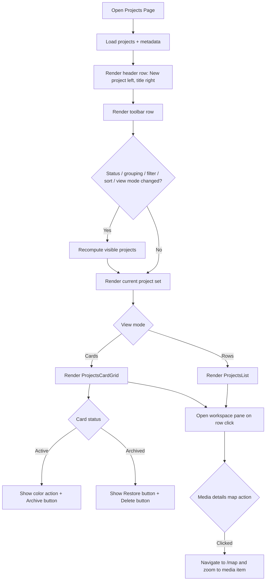
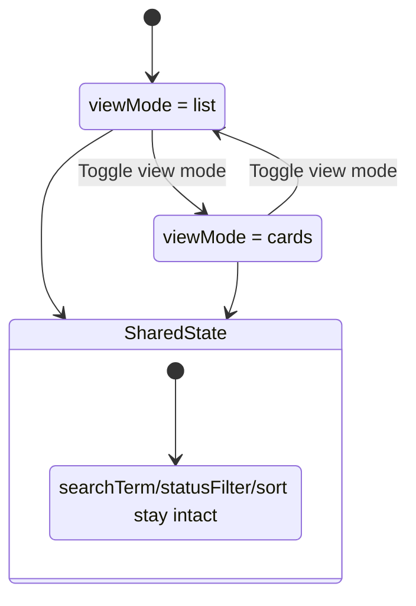
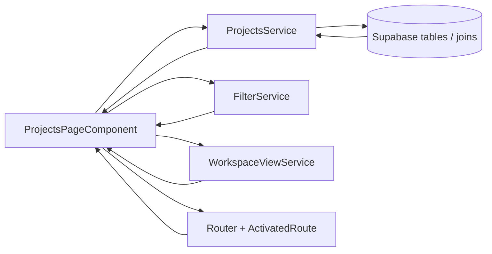
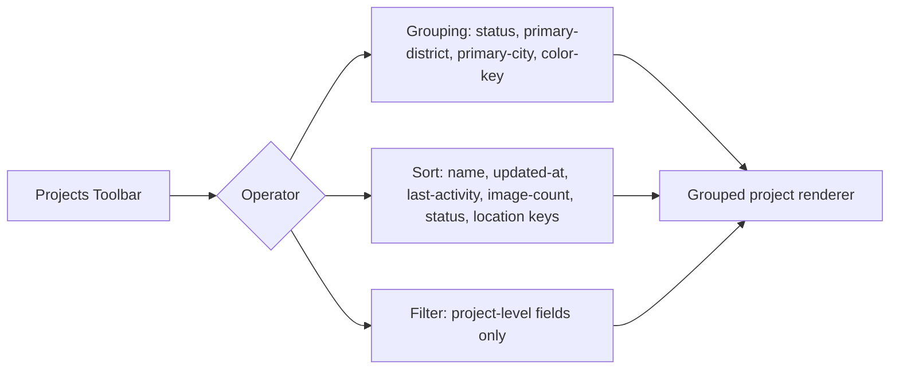
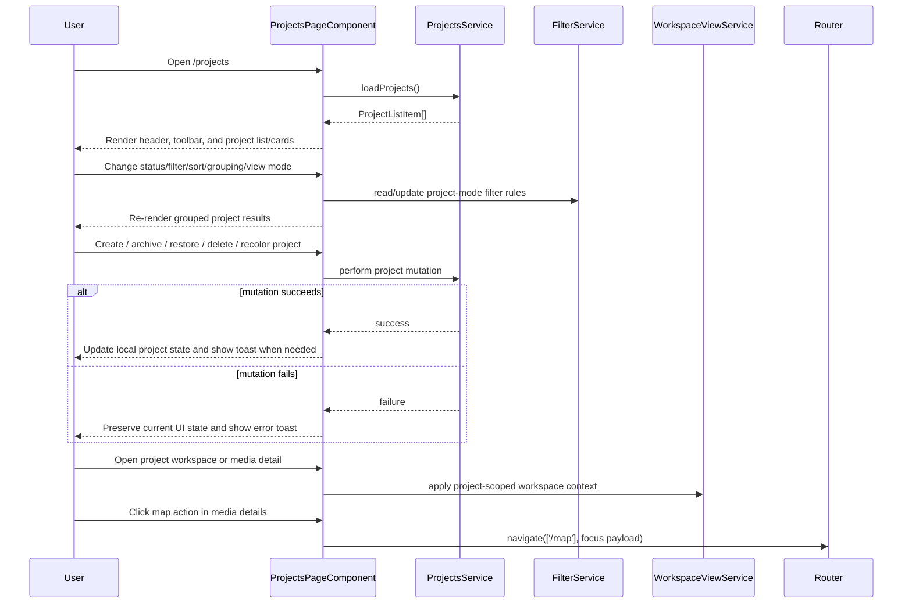

# Projects Page

> **Use cases:** [use-cases/projects-page-workspace.md](../use-cases/projects-page-workspace.md), [use-cases/projects-grouping-filter-sort.md](../use-cases/projects-grouping-filter-sort.md)

## What It Is

A dedicated management page for organization projects. It lets users create, rename, archive, color-tag, and open projects while preserving map-first workflows. Grouping/filtering/sorting on this page uses a project-level operator profile (not the media-level workspace operator profile).

## What It Looks Like

Full-width page with a single top header row. The header places a primary `New project` button on the left and the page title `Projects` on the right, aligned on the same horizontal line. Directly below sits one toolbar row that contains the existing project operators: status scope (`All`, `Active`, `Archived`), grouping, filter, sort, and the view-mode switch for rows vs. cards. The center content rail is horizontally centered and constrained to a narrow maximum width of 25rem (400px) so project controls and lists stay focused in a compact management column. Each project item shows name, color chip, status, media counts, last activity, and action buttons; cards use stable action zones so active and archived projects expose different actions without shifting layout.

## Where It Lives

- **Route**: `/projects`
- **Parent**: App shell
- **Sidebar link**: Projects icon
- **Appears when**: User navigates via sidebar or deep link

## Actions

| #   | User Action                            | System Response                                                                                                      | Triggers                         |
| --- | -------------------------------------- | -------------------------------------------------------------------------------------------------------------------- | -------------------------------- |
| 1   | Navigates to `/projects`               | Loads organization projects, media counts, and summary metadata                                                      | Supabase query                   |
| 2   | Clicks `New project`                   | Inserts draft project, opens workspace pane, and focuses title text input in pane header                             | Supabase insert                  |
| 3   | Presses Enter in workspace title input | Persists new name, exits title edit mode, and updates the project label in list/cards                                | Supabase update                  |
| 4   | Uses status filter                     | Restricts visible projects to `All`, `Active`, or `Archived`                                                         | `statusFilter` state             |
| 5   | Opens Grouping dropdown                | Shows only project-level grouping fields (`status`, `primary-district`, `primary-city`, `color-key`)                 | Projects operator profile        |
| 6   | Activates one or more groupings        | Renders explicit group headers and nests project rows/cards under those sections                                     | `activeGroupings` state          |
| 7   | Opens Filter dropdown                  | Shows only project-level filter fields                                                                               | Projects operator profile        |
| 8   | Opens Sort dropdown                    | Shows only project-level sort fields (`name`, `updated-at`, `last-activity`, `image-count`, `status`, location keys) | Projects operator profile        |
| 9   | Changes sort direction                 | Reorders grouped or flat project result set deterministically                                                        | `activeProjectSorts` state       |
| 10  | Toggles view mode                      | Switches between row/list and card layouts without losing toolbar state                                              | `viewMode` state                 |
| 11  | Clicks project row or card             | Opens workspace pane in-place and scopes content to that project                                                     | `selectedProjectId` + pane state |
| 12  | Clicks color button on an active card  | Opens anchored color picker with semantic project colors                                                             | `coloringProjectId` state        |
| 13  | Selects a new project color            | Persists the new color token and updates chip/accent immediately                                                     | Supabase update                  |
| 14  | Clicks `Archive` on an active card     | Asks confirmation, then archives project                                                                             | Supabase update                  |
| 15  | Clicks `Restore` on an archived card   | Asks confirmation, then restores the project to Active                                                               | Supabase update                  |
| 16  | Clicks `Delete` on an archived card    | Asks confirmation, then permanently deletes the archived project for the organization                                | Supabase delete                  |
| 17  | Clicks map button in media details     | Navigates to `/map` and zooms to the selected media location                                                         | Router + map focus payload       |

### Interaction Flowchart



### View Mode State



## Component Hierarchy

```
ProjectsPage                                ← route root, full width
├── ProjectsHeader                            ← single top row, no search bar
│   ├── NewProjectButton                      ← left-aligned primary action
│   └── ProjectsTitle                         ← right-aligned "Projects"
├── ProjectsToolbar                           ← row below header
│   ├── StatusSegmentedControl                ← All / Active / Archived
│   ├── GroupingDropdown                      ← project-level grouping fields only
│   ├── FilterDropdown                        ← project-level filter fields only
│   ├── SortDropdown                          ← project-level sorting fields only
│   └── ViewModeToggle                        ← Rows / Cards
├── ContentRail                                ← centered layout rail, max-width 25rem (400px)
│   ├── [viewMode=list] ProjectsList (.ui-container)
│   │   ├── [grouping active] ProjectGroupSection × N
│   │   │   ├── ProjectGroupHeader             ← grouping label + count
│   │   │   └── ProjectRow (.ui-item) × N
│   │   │       ├── ProjectColorChip           ← token color indicator
│   │   │       ├── ProjectStatusDot           ← active/archived state
│   │   │       ├── ProjectName (.ui-item-label) ← static by default, inline editable via row Rename action
│   │   │       ├── MatchingCountMeta          ← "5 results" for current search query
│   │   │       ├── MediaCountMeta             ← total media items
│   │   │       ├── LastActivityMeta           ← relative date
│   │   │       ├── ProjectColorChipButton     ← larger token chip, hover palette affordance, click opens picker
│   │   │       └── RowActions                 ← Rename, Archive
│   │   └── [no grouping] ProjectRow (.ui-item) × N
│   └── [viewMode=cards] ProjectsCardGrid      ← responsive grid, cards share stable info zones
│       └── ProjectCard × N
│           ├── ProjectColorChip               ← token color indicator
│           ├── ProjectName                    ← primary label
│           ├── ProjectMeta                    ← total count + status + updated
│           ├── [status=active] ProjectColorButton ← changes project color
│           ├── [status=active] ArchiveButton  ← moves project to Archived after confirmation
│           ├── [status=archived] RestoreButton ← removes project from Archived after confirmation
│           └── [status=archived] DeleteButton ← permanently deletes archived project after confirmation
├── [projectSelected] WorkspacePaneComponent    ← in-page details surface, no route change
│   ├── ProjectScopedMediaGrid                  ← selected project media
│   └── MediaDetailView                          ← includes MapButton to `/map`
│   └── WorkspacePaneTitleBinding                ← shows selected project name
│   └── WorkspacePaneTitleInput                  ← focused edit mode after New project
├── [loading] ProjectsLoadingState           ← skeleton rows
└── [empty] ProjectsEmptyState               ← guidance + CTA
```

## Data

### Data Flow (Mermaid)



| Field                          | Source                                                                                                            | Type                            |
| ------------------------------ | ----------------------------------------------------------------------------------------------------------------- | ------------------------------- |
| Projects                       | `ProjectsService.loadProjects()` → `projects` joined/aggregated with project activity and membership metadata     | `ProjectListItem[]`             |
| Draft project                  | `ProjectsService.createDraftProject()`                                                                            | `ProjectListItem \| null`       |
| Rename/archive/restore/delete  | `ProjectsService.renameProject()`, `archiveProject()`, `restoreProject()`, `deleteProject()`                      | `Promise<boolean>`              |
| Project color                  | `ProjectsService.setProjectColor()`                                                                               | `Promise<boolean>`              |
| Project-scoped workspace media | `ProjectsService.loadProjectWorkspaceImages(projectId)`                                                           | `ProjectScopedWorkspaceImage[]` |
| Primary city                   | Derived in `ProjectsService` from the most frequent `media_items.city` per project (tie-break: lexicographic)     | `string \| null`                |
| Primary district               | Derived in `ProjectsService` from the most frequent `media_items.district` per project (tie-break: lexicographic) | `string \| null`                |
| View preference                | `localStorage['feldpost-projects-view-mode']` via component persistence helper                                    | `'list' \| 'cards'`             |
| Route-scoped project open      | `ActivatedRoute.snapshot.paramMap.get('projectId')`                                                               | `string \| null`                |
| Filter rules                   | `FilterService.rules()` restricted to the projects operator profile                                               | `FilterRule[]`                  |

`color_key` accepts semantic keys (`clay`, `accent`, `success`, `warning`) and temporary generated brand-hue keys in the format `brand-hue-###` (0-359) used by the one-click random color action.
This page must keep Supabase access behind `ProjectsService`; the component contract must describe service calls, not introduce ad-hoc client queries.

### Projects Operator Profile



Media-level-only fields (`date-captured`, `date-uploaded`, `distance`, `project`) are not valid operator options in Projects mode.

## State

| Name                          | Type                                         | Default                  | Controls                                                      |
| ----------------------------- | -------------------------------------------- | ------------------------ | ------------------------------------------------------------- |
| `projects`                    | `ProjectListItem[]`                          | `[]`                     | Rendered project rows/cards                                   |
| `loading`                     | `boolean`                                    | `false`                  | Loading skeleton visibility                                   |
| `statusFilter`                | `'all' \| 'active' \| 'archived'`            | `'all'`                  | Status scoping                                                |
| `viewMode`                    | `'list' \| 'cards'`                          | stored value or `'list'` | Active layout mode                                            |
| `sortMode`                    | `'name' \| 'updated' \| 'image-count'`       | `'updated'`              | Fallback/base project ordering                                |
| `selectedProjectId`           | `string \| null`                             | `null`                   | Active project opened in workspace pane                       |
| `workspacePaneOpen`           | `boolean`                                    | `false`                  | In-page workspace visibility                                  |
| `editingProjectId`            | `string \| null`                             | `null`                   | Inline rename row                                             |
| `workspaceTitleEditProjectId` | `string \| null`                             | `null`                   | Enables workspace header title input for the selected project |
| `workspaceTitleEditValue`     | `string`                                     | `''`                     | Live value for workspace header title input                   |
| `creatingProject`             | `boolean`                                    | `false`                  | New-project draft input visibility                            |
| `pendingProjectAction`        | `'archive' \| 'restore' \| 'delete' \| null` | `null`                   | Confirmation dialog mode for destructive project actions      |
| `pendingProjectId`            | `string \| null`                             | `null`                   | Target project for the pending destructive action             |
| `pendingActionBusy`           | `boolean`                                    | `false`                  | Prevents duplicate archive/restore/delete submissions         |
| `coloringProjectId`           | `string \| null`                             | `null`                   | Color picker visibility target                                |
| `detailMediaId`               | `string \| null`                             | `null`                   | Selected media item inside the project-scoped workspace       |
| `activeGroupings`             | `GroupingProperty[]`                         | `[]`                     | Grouping hierarchy for list/card rendering                    |
| `collapsedGroupIds`           | `Set<string>`                                | `new Set()`              | Collapsed grouped sections                                    |
| `activeProjectSorts`          | `SortConfig[]`                               | `[]`                     | Explicit project-level sort criteria                          |
| `activeToolbarDropdown`       | `'grouping' \| 'filter' \| 'sort' \| null`   | `null`                   | Which toolbar dropdown is open                                |
| `isMobile`                    | `boolean`                                    | viewport-derived         | Mobile layout behavior                                        |

## File Map

| File                                                                   | Purpose                                                               |
| ---------------------------------------------------------------------- | --------------------------------------------------------------------- |
| `apps/web/src/app/features/projects/projects-page.component.ts`        | Standalone route component and page interaction orchestration         |
| `apps/web/src/app/features/projects/projects-page.component.html`      | Page template for list/cards/workspace states                         |
| `apps/web/src/app/features/projects/projects-page.component.scss`      | Page styles                                                           |
| `apps/web/src/app/features/projects/projects-view-toggle.component.ts` | List/cards toggle control                                             |
| `apps/web/src/app/features/projects/project-color-picker.component.ts` | Color selector using semantic tokens                                  |
| `apps/web/src/app/core/projects/projects.service.ts`                   | Project read/search/create/rename/archive/restore/delete data service |
| `apps/web/src/app/core/projects/projects.types.ts`                     | Shared project page models                                            |
| `apps/web/src/app/features/projects/projects-page.component.spec.ts`   | Component behavior tests                                              |

## Wiring

### Injected Services

- `I18nService` — resolves all user-facing strings through `t(key, fallback)`.
- `ProjectsService` — owns all project and project-scoped media reads/writes.
- `ToastService` — shows create/archive/restore/delete failure and success feedback.
- `FilterService` — stores project-mode filter rules and exposes the active ruleset.
- `WorkspaceViewService` — coordinates project-scoped workspace content and media-detail context.
- `Router` — navigates to `/map` for media handoff and keeps project route state in sync.
- `ActivatedRoute` — reads optional `projectId` route parameter for direct-open behavior.

### Inputs / Outputs

- Route root component: none.
- Child bindings are internal template bindings only; this page does not expose public `@Input()` or `@Output()` APIs.

### Subscriptions

- Angular `effect()` keeps active grouping labels synchronized with translated option labels.
- Angular `effect()` persists `viewMode` to `localStorage` whenever the mode changes.
- No manual RxJS subscription is required in the page contract; signal/effect lifecycle is owned by Angular.

### Supabase Calls

None — delegated to `ProjectsService`.

### Wiring Flow (Mermaid)



- Add route `{ path: 'projects', component: ProjectsPageComponent }` in app routes.
- Support direct-open route state for a selected project (`/projects/:projectId` or equivalent route param binding) when the router configuration provides it.
- Add sidebar entry that navigates to `/projects`.
- Projects mode must provide a dedicated project-level operator profile for Grouping/Filter/Sort, instead of exposing the full workspace media-property registry.
- Grouping in list mode must render explicit group headers and grouped rows/cards; reordering groupings must re-render sections immediately.
- On row open action, set selected project and open the in-page workspace pane; do not change route.
- Reuse existing media-details map action to navigate to `/map` with selected media id/coordinates so map zoom/focus can be applied.
- Keep `Projects Dropdown` behavior consistent with this page by sharing the same source-of-truth project scope state.
- Constrain the central project content area to max-width 25rem (400px) and center it in the available viewport.
- Do not add direct Supabase client calls to `ProjectsPageComponent`; keep the security/data contract behind `ProjectsService`.

## Acceptance Criteria

- [x] Route `/projects` renders a list of projects for the active organization.
- [x] The top row shows `New project` on the left and the page title `Projects` on the right.
- [x] The page has no standalone search bar above the toolbar.
- [x] The second row is a toolbar containing status scope, grouping, filter, sort, and view-mode controls.
- [x] Status control filters Active vs Archived rows.
- [x] View toggle switches between List and Cards without resetting search/filter/sort state.
- [x] List view is default and optimized for scan/compare.
- [x] Cards view keeps card internals structurally consistent for fast comparison.
- [x] "New project" creates a draft row, opens workspace pane, and focuses the workspace title input.
- [x] Pressing Enter in the workspace title input persists the name and updates the project label in list/cards.
- [x] Each active card shows a color-change action and an `Archive` button.
- [x] Archive requires confirmation and removes project from Active view.
- [x] Each archived card shows exactly two actions: `Restore` and `Delete`.
- [x] Restoring an archived project requires confirmation and moves it back to Active.
- [x] Permanent delete is only offered for archived projects and requires confirmation.
- [x] Clicking project row opens in-page workspace details scoped to that project without leaving `/projects`.
- [x] Project row/list item click opens the in-page workspace details behavior.
- [x] Card click opens the same in-page workspace details behavior.
- [ ] Clicking the active-card color action opens a dedicated anchored color picker.
- [ ] Temporary picker variant offers one dropdown-style action to assign a random brand hue (`brand-hue-###`).
- [ ] Opening workspace from a project shows the project name as pane title.
- [x] Empty state appears when no projects match current filters.
- [x] Loading state appears during initial fetch and refresh operations.
- [x] Center content rail is horizontally centered and capped at max-width 25rem (400px).
- [x] Mobile layout is single-column with accessible touch targets.
- [ ] Grouping/Filter/Sort dropdowns in Projects mode expose project-level fields only.
- [ ] Media-level-only fields (`date-captured`, `distance`, `project`) are not shown in Projects operator menus.
- [ ] Grouping in list mode renders explicit group headers and grouped project sections.
- [ ] Primary district and primary city semantics are deterministic (most-frequent value, tie-break lexicographically).
- [x] [PPW-1] Selecting a project opens the workspace pane in place while remaining on `/projects`.
- [x] [PPW-2] Selecting a project-scoped thumbnail opens media details for that scoped media item.
- [x] [PPW-3] Using the media-details map action navigates to `/map` and focuses the exact selected media location.
- [x] [PPW-4] Closing the workspace pane preserves Projects page search/filter/view mode state.
- [ ] [PPW-5] Re-opening the same project restores prior project-scoped browsing context (including prior subview and scroll position).

## Use Cases

> **Full use cases:** [use-cases/projects-page-workspace.md](../use-cases/projects-page-workspace.md), [use-cases/projects-grouping-filter-sort.md](../use-cases/projects-grouping-filter-sort.md)

The scenarios in this use-case document define the expected behavior for project selection, project-scoped workspace browsing, map handoff, and state persistence on `/projects`.

## Settings

- **Projects View Mode**: default layout mode (`list` or `cards`) and persistence behavior.
- **Project Color Palette**: enabled semantic project color options and default fallback color.
