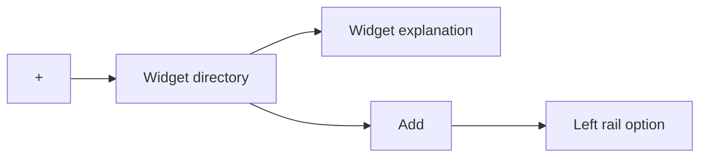
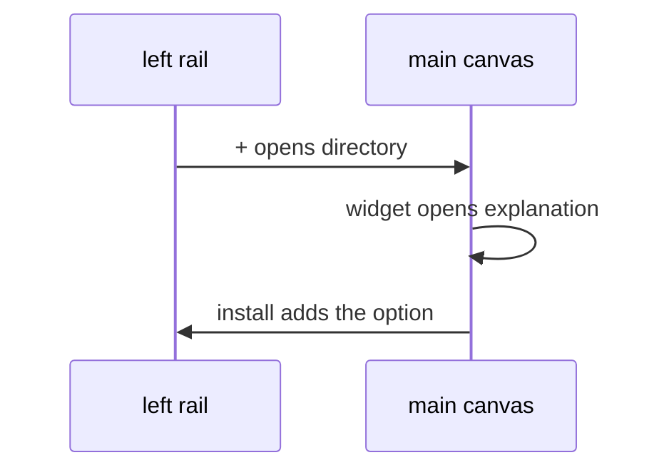

# Widgets page

The journey the left-rail `+` opens. Child specs own the directory, the explanation, placement, grants, and the suite. Do not implement a route from this file alone.

## What It Is

Two canvas pages. The directory lists widgets. More opens one explanation page. Add makes a widget available to the organization. An uninstalled widget is absent from the rail.

## What It Looks Like

Both pages render inside `app-shell-main-canvas`. The rectangle, More, and Add are [widget-directory.md](widget-directory.md). The longer text is [widget-explanation.md](widget-explanation.md). Spacing stays `var(--spacing-3)`. The `+` option does not become a page of its own inside the rail.

## Where It Lives

- **Trigger:** the left-rail `+` (`shell.control.more`). It stays `inert` until a route is assigned.
- **Parent:** `app-shell-main-canvas`, on the grid shell.
- **Routes:** not assigned.

## Actions

| # | User Action | System Response | Triggers |
| --- | --- | --- | --- |
| 1 | Activates `+` | Canvas shows the directory | [widget-directory.md](widget-directory.md) |
| 2 | Activates More | Canvas shows the explanation page | [widget-explanation.md](widget-explanation.md) |
| 3 | Activates Back | Canvas shows the directory | [widget-directory.md](widget-directory.md) |

Rail placement is [shell-widget-placement.md](../ui/shell/shell-widget-placement.md). Grants are [widget-grants.md](../system/widget-grants.md). The suite catalog is [widget-suite.md](widget-suite.md).

## Component Hierarchy

```text
app-shell-main-canvas
└── widget directory | widget explanation
```

This file owns the journey only. The children own the rectangle, the explanation, placement, grants, and the catalog.

## Data

No table is named here. Grants and the catalog live in the child specs linked above.



## State

| Name | Type | Default | Effect |
| --- | --- | --- | --- |
| `browsing` | directory | yes | List is shown |
| `reading` | one widget id | none | Explanation page is shown |

Install state is not a page state. It is the organization grant in [widget-grants.md](../system/widget-grants.md).

## File Map

| File | Purpose |
| --- | --- |
| `docs/specs/page/widgets-page.md` | This journey |
| `docs/specs/page/widget-directory.md` | Directory rectangles |
| `docs/specs/page/widget-explanation.md` | Explanation page |
| `docs/specs/page/widget-suite.md` | GPS-and-media catalog |
| `docs/specs/ui/shell/shell-widget-placement.md` | Rail placement |
| `docs/specs/system/widget-grants.md` | Organization and role grants |
| `layout/shell/shell-control.types.ts` | `+` stays inert |

## Wiring



`AuthenticatedAppLayoutComponent` does not gain a widget route in this change.

## Acceptance Criteria

- [ ] `+` does not navigate while no directory route exists.
- [ ] The directory and the explanation page are the only two destinations this journey adds.
- [ ] An uninstalled widget has no left-rail option.
- [ ] No migration is added from this spec alone.
