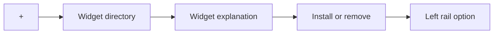
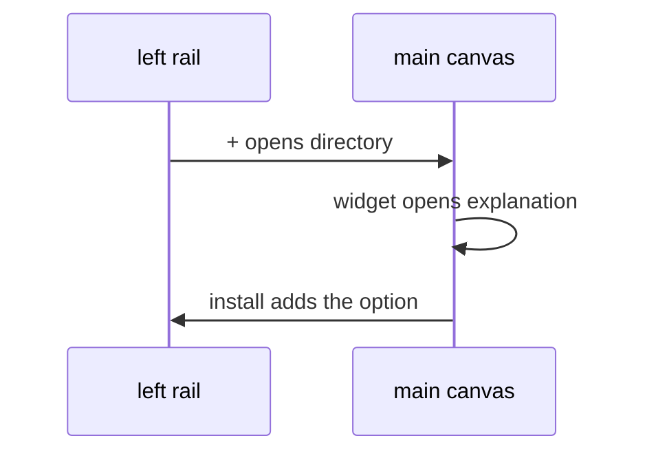

# Widgets page

The directory the left-rail `+` opens, and the explanation page for one widget. The shape follows a directory-then-detail flow: browse widgets, open one, read what it does, install or remove it. This spec does not name a table, an install scope, or a catalog. Those are open in [STUDY-016](../../study/016-widgets-page-flow.md). Do not implement this page until that study is `accepted`.

## What It Is

Two canvas pages. The directory lists widgets the organization can add. The explanation page is one widget: what it does, and whether it is installed. Installing makes the widget available to the organization. Removing takes it off the rail. An uninstalled widget is absent, not disabled.

Who may then open that widget, and which of its records they may use, is a grant on the organization role. That grant is proposed in [STUDY-017](../../study/017-role-widget-grants.md) and is not a table in this spec.

## What It Looks Like

Both pages render inside `app-shell-main-canvas`, so they share that box's radius. The directory is a set of rectangles. Each rectangle shows the widget name, a short explanation, and two controls: More and Add. A rectangle the organization does not allow is greyed out. More opens that widget's explanation page. The explanation page is the longer text. No second gutter: spacing stays `var(--spacing-3)`. The `+` option does not become a page of its own inside the rail.

## Where It Lives

- **Trigger:** the left-rail `+` (`shell.control.more`). It stays `inert` until STUDY-016 is accepted.
- **Parent:** `app-shell-main-canvas`, on the grid shell.
- **Routes:** not assigned. STUDY-016 must name them before a route file changes.

## Actions

| # | User Action | System Response | Triggers |
| --- | --- | --- | --- |
| 1 | Activates `+` | Canvas shows the directory | route, after STUDY-016 |
| 2 | Activates More on a directory rectangle | Canvas shows that widget's explanation page | route |
| 3 | Activates Add on a directory rectangle | Widget becomes available to the organization | install |
| 4 | Activates Add on a greyed rectangle | Nothing is installed | organization does not allow it |
| 5 | Activates Back on an explanation page | Canvas shows the directory | route |

Whether map, projects, and media can leave the rail is [STUDY-018](../../study/018-rail-placement.md). This spec does not remove them.

## Component Hierarchy

```text
app-shell-main-canvas
└── widget directory | widget explanation
```

The directory and the explanation page get their own specs when implementation starts. This file owns the journey only.

## Data

No table is named here. [STUDY-016](../../study/016-widgets-page-flow.md) lists the studies that must decide install scope and the catalog before a migration exists.



## State

| Name | Type | Default | Effect |
| --- | --- | --- | --- |
| `browsing` | directory | yes | List is shown |
| `reading` | one widget id | none | Explanation page is shown |

Install state is not a page state. It is whatever STUDY-016 decides stores an installation.

## File Map

| File | Purpose |
| --- | --- |
| `docs/specs/page/widgets-page.md` | This journey |
| `docs/study/016-widgets-page-flow.md` | Open decisions |
| `docs/study/018-rail-placement.md` | Where a widget sits on the rails |
| `layout/shell/shell-control.types.ts` | `+` stays inert <!-- planned change --> |

## Wiring



`AuthenticatedAppLayoutComponent` does not gain a widget route in this change.

## Acceptance Criteria

- [ ] `+` does not navigate while STUDY-016 is `proposed`.
- [ ] The directory and the explanation page are the only two destinations this journey adds.
- [ ] An uninstalled widget has no left-rail option.
- [ ] No migration is added from this spec alone.
