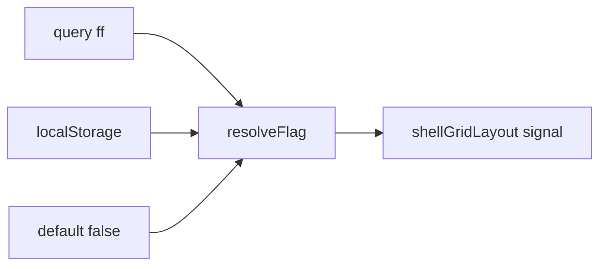
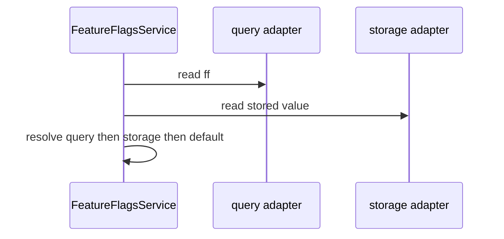

# Feature flags

## What It Is

A migration flag reader. It resolves one boolean, `shellGridLayout`, from a query parameter, then `localStorage`, then a default of `false`. It is deleted in the same change that removes the old layout.

## What It Looks Like

No UI. Callers read a signal. A preview URL uses `?ff=shellGridLayout` to force on and `?ff=-shellGridLayout` to force off. The query writes `localStorage` so the choice sticks on the next load.

## Where It Lives

- **Code:** `apps/web/src/app/core/feature-flags/`.
- **Consumers:** the authenticated layout, when it chooses which shell to mount. No other module reads it.

## Actions

| # | User Action | System Response | Triggers |
| --- | --- | --- | --- |
| 1 | Opens `?ff=shellGridLayout` | Resolves `true` and stores `true` | query adapter |
| 2 | Opens `?ff=-shellGridLayout` | Resolves `false` and stores `false` | query adapter |
| 3 | Opens a URL with no `ff` | Uses the stored value, else `false` | localStorage adapter |
| 4 | Asks for an unknown name | Resolves `false` and does not throw | helper |

## Component Hierarchy

```text
FeatureFlagsService
├── feature-flags.helpers.ts
└── adapters/
    ├── query-param adapter
    └── localStorage adapter
```

## Data

| Source | Contract | Operation |
| --- | --- | --- |
| `feature-flags.types.ts` | union of one name, default `false` | Read |
| URL search | `ff` | Read, then write storage |
| `localStorage` | key beside the nav collapse key pattern | Read and write |

No `environment.ts` constant. No Supabase row.

## State

| Name | Type | Default | Effect |
| --- | --- | --- | --- |
| `shellGridLayout` | `Signal<boolean>` | `false` | Layout branch |

There is no terminal state. Reading twice returns the same signal value. An unknown name resolves to `false`.

Resolution order, highest wins: query parameter, then `localStorage`, then the default in `feature-flags.types.ts`.

## File Map

| File | Purpose |
| --- | --- |
| `core/feature-flags/feature-flags.service.ts` | Facade <!-- planned --> |
| `core/feature-flags/feature-flags.service.spec.ts` | Resolution tests <!-- planned --> |
| `core/feature-flags/feature-flags.types.ts` | Flag union and default <!-- planned --> |
| `core/feature-flags/feature-flags.helpers.ts` | Pure resolution <!-- planned --> |
| `core/feature-flags/adapters/feature-flags-query.adapter.ts` | `ff` reader <!-- planned --> |
| `core/feature-flags/adapters/feature-flags-storage.adapter.ts` | `localStorage` <!-- planned --> |
| `core/feature-flags/README.md` | Module index <!-- planned --> |

## Wiring



The facade does not parse the URL itself. Adapters return plain values. Helpers are pure.



## Acceptance Criteria

- [ ] `?ff=shellGridLayout` wins over a stored `false`.
- [ ] `?ff=-shellGridLayout` wins over a stored `true`.
- [ ] A query value is written to `localStorage`.
- [ ] An unknown name resolves to `false` and does not throw.
- [ ] The union has one member, `shellGridLayout`.
- [ ] The default in `feature-flags.types.ts` is `false`.
