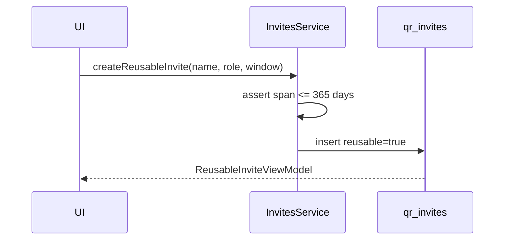

# Invite Service

## What It Is

**QR invite** lifecycle for org onboarding: one-shot drafts, persistent reusables, revoke/expire/pause, share-event logging, and referral/signup queries. Requires authenticated user and resolved `organization_id`. Throws on hard failures (callers catch at UI).

**UI:** [qr-invite-flow](../../ui/settings-overlay/qr-invite-flow.md) · [colleagues-invites-workspace](../../ui/colleagues/colleagues-invites-workspace.md)

## What It Looks Like

Callers receive typed view models (`QrInviteViewModel`, `ReusableInviteViewModel`, `InviteReferralViewModel`) with URL, validity window, and derived status inputs for `app-chip`.

## Where It Lives

- **Code:** `apps/web/src/app/core/invites/`
- **Facade:** `invites.service.ts`
- **Types:** `invites.types.ts`

## Actions

| # | Method | Behavior |
| --- | --- | --- |
| 1 | `createInviteDraft(targetRole, options?)` | Insert one-shot (`reusable=false`, 7d expiry) unless `options.reusable` |
| 2 | `createReusableInvite(payload)` | Named reusable + validity; validates 365d cap |
| 3 | `listReusableInvites()` | Current user's `reusable=true` rows |
| 4 | `setReusablePaused(inviteId, paused)` | `active` ↔ `revoked` |
| 5 | `updateReusableInvite(inviteId, payload)` | Save from column-1 edit mode |
| 6 | `regenerateInvite` / `revokeInvite` / `expireInvite` | Existing one-shot + reusable token lifecycle |
| 7 | `logShareEvent` | `invite_share_events` insert |
| 8 | `loadAcceptedReferrals()` | One-shot acceptances + reusable signups for creator |

Validity: [reusable-time supplement](../../ui/colleagues/colleagues-invites-workspace.reusable-time.supplement.md).

## Component Hierarchy

```text
InvitesService
├── invites.types.ts
├── SupabaseService → qr_invites, invite_signups, invite_share_events
└── AuthService (session)
```

## Data

| Table | Operations |
| --- | --- |
| `qr_invites` | insert, update status/validity, select by creator |
| `invite_share_events` | insert |
| `invite_signups` | insert (trigger), select for referrals |
| `profiles` | join for display names |

### `createReusableInvite` payload

| Field | Type | Required |
| --- | --- | --- |
| `displayName` | string | yes |
| `targetRole` | `'clerk' \| 'worker'` | yes |
| `validFrom` | string \| null | no |
| `expiresAt` | string | yes |

### Constants

| Name | Value |
| --- | --- |
| `ONE_SHOT_EXPIRY_DAYS` | 7 |
| `REUSABLE_DEFAULT_EXPIRY_DAYS` | 30 |
| `MAX_VALIDITY_DAYS` | 365 (all roles; no unlimited) |



## File Map

| File | Purpose |
| --- | --- |
| `apps/web/src/app/core/invites/invites.service.ts` | Facade |
| `apps/web/src/app/core/invites/invites.types.ts` | DTOs |
| `apps/web/src/app/core/invites/invites.service.spec.ts` | Unit tests |
| `docs/specs/service/invites/invite-service.md` | This contract |

## Wiring

- `SupabaseService`, `AuthService`
- RLS on tables; service does not bypass security.

## Acceptance Criteria

- [ ] Method names match `invites.service.ts` exports.
- [ ] `createReusableInvite` rejects windows longer than 365 days (service + DB check).
- [ ] No API accepts null/unbounded `expires_at` for product-created rows.
- [ ] `loadAcceptedReferrals` includes `invite_signups` once migration ships.
- [ ] Token hashing and URL format unchanged from qr-invite-flow.
