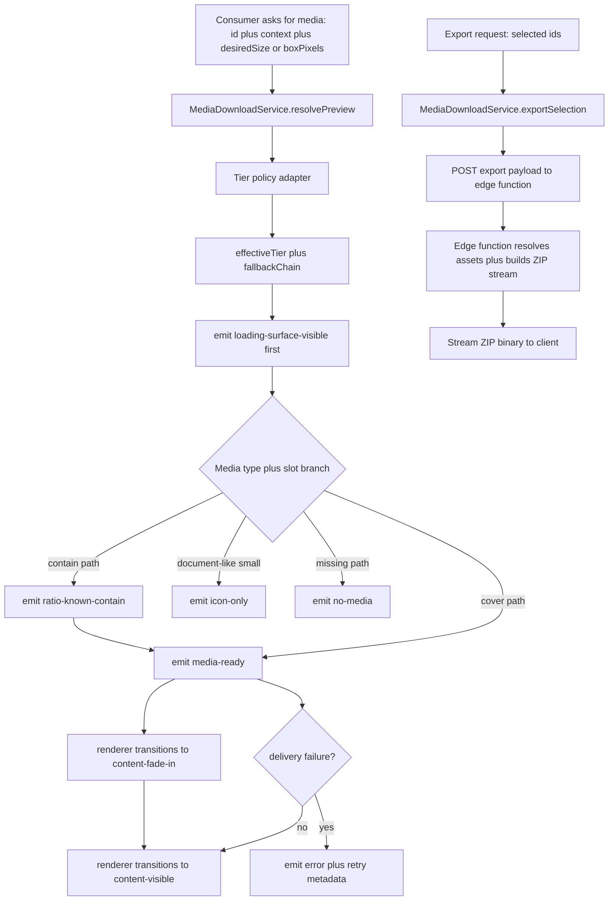
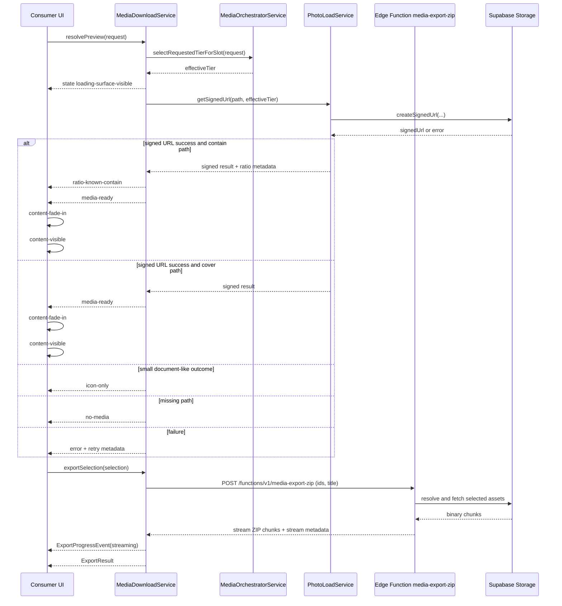

# media download service.data requirements.supplement

> Parent: [`media-download-service.md`](./media-download-service.md)

## Data Requirements

### Data Flow (Mermaid)

### Wiring Sequence (Mermaid)

### Service Interfaces (Contract)

| Interface                                     | Signature                                                                                                                                                                                                                                     | Purpose                                                                |
| --------------------------------------------- | --------------------------------------------------------------------------------------------------------------------------------------------------------------------------------------------------------------------------------------------- | ---------------------------------------------------------------------- |
| `MediaPreviewRequest`                         | `{ mediaId: string; storagePath: string \| null; thumbnailPath?: string \| null; desiredSize?: 'marker' \| 'thumb' \| 'detail' \| 'full'; boxPixels?: { width: number; height: number }; context: 'map' \| 'grid' \| 'upload' \| 'detail'; }` | Single deterministic preview request contract with UI-decoupled sizing |
| `MediaPreviewResult`                          | `{ url: string \| null; resolvedTier: 'inline' \| 'small' \| 'mid' \| 'mid2' \| 'large' \| 'full' \| null; source: 'cache' \| 'signed' \| 'local' \| 'none'; state: MediaDisplayDeliveryState; errorCode?: MediaDeliveryErrorCode; }`         | Consumer-facing preview outcome                                        |
| `MediaDownloadService.resolvePreview`         | `(request: MediaPreviewRequest) => Promise<MediaPreviewResult>`                                                                                                                                                                               | Main preview retrieval method                                          |
| `MediaDownloadService.resolveBatchPreviews`   | `(requests: MediaPreviewRequest[]) => Promise<Map<string, MediaPreviewResult>>`                                                                                                                                                               | Batch preload/sign for visible collections                             |
| `MediaDownloadService.getState`               | `(mediaId: string, slotSizeRem: number) => WritableSignal<MediaDisplayDeliveryState>`                                                                                                                                                         | Per-item delivery state signal API                                     |
| `MediaDownloadService.invalidate`             | `(mediaId: string) => void`                                                                                                                                                                                                                   | Drop all cached tiers for identity                                     |
| `MediaDownloadService.invalidateStale`        | `(maxAgeMs?: number) => number`                                                                                                                                                                                                               | Stale sweep policy                                                     |
| `MediaDownloadService.injectLocalUrl`         | `(mediaId: string, blobUrl: string) => void`                                                                                                                                                                                                  | Attach/replace instant preview path                                    |
| `MediaDownloadService.revokeLocalUrl`         | `(mediaId: string) => void`                                                                                                                                                                                                                   | Memory-safe blob cleanup                                               |
| `MediaDownloadService.downloadBlob`           | `(storagePath: string) => Promise<{ ok: true; blob: Blob } \| { ok: false; errorCode: MediaDeliveryErrorCode; message: string }>`                                                                                                             | Single media binary download                                           |
| `ExportProgressEvent`                         | `{ phase: 'queued' \| 'edge-started' \| 'streaming' \| 'finalizing' \| 'completed' \| 'failed'; bytesStreamed?: number; totalBytesHint?: number; itemsProcessed?: number; itemsTotal?: number; }`                                             | Server-stream status event model                                       |
| `MediaDownloadService.exportSelection`        | `(items: WorkspaceMedia[], title: string, onProgress?: (event: ExportProgressEvent) => void) => Promise<ExportResult>`                                                                                                                        | ZIP/export orchestration via edge stream                               |
| `CacheHydrationResult`                        | `{ querySignature: string; hydratedWindows: number; usedIndexEntries: number; skippedFullRequery: boolean; reconciliationStates: Array<'unchanged-url-valid' \| 'unchanged-url-stale' \| 'changed-content' \| 'new' \| 'removed'>; }`         | Route re-entry hydration outcome                                       |
| `SystemicMediaFaultIntent`                    | `{ faultClass: 'offline' \| 'network-changed' \| 'transport-burst'; querySignature: string; sampleSize: number; windowMs: number; firstSeenAt: string; lastSeenAt: string; cooldownMs: number; }`                                             | Aggregated upward escalation payload (storm-safe)                      |
| `MediaDownloadService.getSystemicFaultIntent` | `() => Signal<SystemicMediaFaultIntent \| null>`                                                                                                                                                                                              | Coalesced fault signal for shell-level handling                        |

### Data Sources and Dependencies

| Artifact              | Source                                                  | Type                                                                                                                                                                                   | Purpose                                             |
| --------------------- | ------------------------------------------------------- | -------------------------------------------------------------------------------------------------------------------------------------------------------------------------------------- | --------------------------------------------------- |
| `storage_path`        | `media_items.storage_path`                              | `string \| null`                                                                                                                                                                       | Original media storage object path                  |
| `thumbnail_path`      | media projection model                                  | `string \| null`                                                                                                                                                                       | Pre-generated thumbnail path if available           |
| `desiredSize`         | consumer input                                          | `'marker' \| 'thumb' \| 'detail' \| 'full'`                                                                                                                                            | UI intent without tier math leakage                 |
| `boxPixels`           | consumer measurement                                    | `{ width: number; height: number } \| undefined`                                                                                                                                       | Optional geometry hint in px for adaptive policy    |
| Signed URL rows       | Supabase Storage `createSignedUrl` / `createSignedUrls` | remote API result                                                                                                                                                                      | Time-limited render/download URL                    |
| Dynamic transform URL | tier resolver adapter                                   | `string \| null`                                                                                                                                                                       | Proxy-compatible URL strategy (`?w=...&q=...`)      |
| Cached entry          | in-memory cache key `${mediaId}:${tier}`                | `{ url; signedAt; isLocal }`                                                                                                                                                           | Cross-surface reuse and staleness control           |
| `querySignature`      | list-route query model                                  | `string`                                                                                                                                                                               | Stable namespace key for cache-first route re-entry |
| `loadedWindows`       | list orchestration cache                                | `Array<{ windowId: string; offset: number; limit: number; mediaIds: string[]; syncedAt: string; }>`                                                                                    | Tracks hydrated list windows per `querySignature`   |
| `indexEntries`        | list orchestration cache                                | `Record<string, { mediaId: string; dbUpdatedAt: string; urlExpiresAt: string; resolvedUrl: string \| null; resolvedTier: string \| null; lastSeenAt: string; removedFlag: boolean; }>` | Index-level reconciliation source of truth          |
| Export selection      | workspace selection service                             | `WorkspaceMedia[]`                                                                                                                                                                     | Export input set                                    |
| Edge export endpoint  | edge function API                                       | `POST` stream response                                                                                                                                                                 | Server-side ZIP assembly and streaming              |
| File naming metadata  | media metadata + helper util                            | `string`                                                                                                                                                                               | ZIP filename normalization                          |

### Cache Model Contract

| Field            | Type                      | Key/Scope                                          | Mandatory subfields                                                                                  | Ownership                                                    | Update trigger                                              |
| ---------------- | ------------------------- | -------------------------------------------------- | ---------------------------------------------------------------------------------------------------- | ------------------------------------------------------------ | ----------------------------------------------------------- |
| `querySignature` | `string`                  | List namespace (`route + filters + sort + search`) | `routeKey`, `filterHash`, `sortKey`, `searchTerm`                                                    | List consumer orchestration + media-download cache boundary  | Route/filter/sort/search change                             |
| `loadedWindows`  | Array                     | Per `querySignature`                               | `windowId`, `offset`, `limit`, `mediaIds`, `syncedAt`                                                | List consumer orchestration                                  | Pagination append, window refresh, route re-entry hydration |
| `indexEntries`   | Record keyed by `mediaId` | Per `querySignature`                               | `mediaId`, `dbUpdatedAt`, `urlExpiresAt`, `resolvedUrl`, `resolvedTier`, `lastSeenAt`, `removedFlag` | MediaDownloadService + list consumer reconciliation boundary | Reconciliation cycle, URL refresh, content update           |

Contract invariants:

- Same `querySignature` on route re-entry must hydrate from cache-first and must not trigger a full list requery.
- Revalidation after hydration is diff-only and must run through reconciliation states.
- `indexEntries.dbUpdatedAt` and `indexEntries.urlExpiresAt` are mandatory for dual-staleness decisions.

### Dual-Staleness Reconciliation Contract

Staleness is evaluated on two independent dimensions:

- Content staleness: `dbUpdatedAt` mismatch between cache index entry and source projection.
- URL staleness: `urlExpiresAt` elapsed while content identity remains unchanged.

Decision rules:

- Content stale requires content reconciliation and URL refresh as part of changed-content handling.
- URL stale without content change requires URL refresh only; no full content list fetch.
- Both dimensions must be evaluated per entry inside the active `querySignature` namespace.

### Reconciliation State Table

| Reconciliation state  | Predicate                                                                   | Action                                             | Network scope                | Result contract                                                |
| --------------------- | --------------------------------------------------------------------------- | -------------------------------------------------- | ---------------------------- | -------------------------------------------------------------- |
| `unchanged-url-valid` | `dbUpdatedAt` unchanged and current time less than `urlExpiresAt`           | Reuse cached URL and metadata                      | none                         | Hydrate immediately from cache and keep deterministic ordering |
| `unchanged-url-stale` | `dbUpdatedAt` unchanged and current time greater or equal to `urlExpiresAt` | Refresh signed URL only                            | URL signing only             | Preserve content identity and update URL fields                |
| `changed-content`     | `dbUpdatedAt` mismatch                                                      | Replace entry payload and refresh URL              | metadata + URL refresh       | Updated content is reconciled without full list reset          |
| `new`                 | Entry exists in source but not in cache index                               | Insert new index entry and attach to loaded window | URL signing as needed        | Deterministic insert under current `querySignature`            |
| `removed`             | Entry exists in cache window but not in source snapshot                     | Mark removed and evict from active window          | none (optional cleanup only) | Deterministic removal without ghost rows                       |

