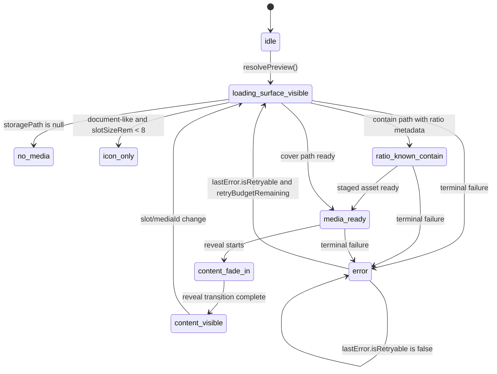

# Media Download Service

> Related specs: [item-grid](../../component/item-grid/item-grid.md), [media-item](../../component/media/media-item.md), [media-detail-media-viewer](../../ui/media-detail/media-detail-media-viewer.md), [workspace-actions-bar](../../ui/workspace/workspace-actions-bar.md), [upload-manager](../media-upload-service/upload-manager.md), [action-context-matrix](../../system/action-context-matrix.md)
> Adapter sub-specs: [tier-resolver.adapter](adapters/tier-resolver.adapter.md), [signed-url-cache.adapter](adapters/signed-url-cache.adapter.md), [edge-export-orchestrator.adapter](adapters/edge-export-orchestrator.adapter.md)

## Terminology (symbols)

Upload pipeline streams such as **`imageReplaced$`** use **image** in the TypeScript symbol only; payloads refer to **media items**. See [symbol rename backlog](../../../../backlog/media-photo-symbol-rename-roadmap.md).

## What It Is

Media Download Service is the unified facade contract for all media retrieval concerns: signed URL loading, high/low-resolution tier selection, cache reuse, preloading, binary download, edge-orchestrated ZIP export, and canonical error signaling.
Adapter implementation details are delegated to dedicated adapter specs.

## What It Looks Like

This is not a visual component. Its visible impact is consistency across map marker previews, workspace thumbnails, media detail hero, `/media` Items, upload replacement previews, and export/download flow.

The same media can appear instantly from cache on one surface after it was loaded on another surface, but delivery ordering remains deterministic: `loading-surface-visible` is emitted first, then the stream proceeds through the allowed contain/cover path states without layout shift.

Error handling is uniform: missing path resolves to no-media, signing/fetch failures resolve to explicit error states, and export errors expose retry-safe outcomes. High-resolution fetch is always demand-driven and never blocks first render when a lower cached tier exists. Retry orchestration belongs to this service boundary and/or parent shells; render components stay actionless.

## Where It Lives

- Contract doc: `docs/specs/service/media-download-service/media-download-service.md`
- Runtime ownership target (service facade + adapters):
  - `apps/web/src/app/core/media-download/media-download.service.ts` (facade)
  - `apps/web/src/app/core/media-download/adapters/signed-url-cache.adapter.ts` (signing + cache)
  - `supabase/functions/media-export-zip/index.ts` (edge export orchestrator)
- Adapter spec split:
  - `docs/specs/service/media-download-service/adapters/tier-resolver.adapter.md`
  - `docs/specs/service/media-download-service/adapters/signed-url-cache.adapter.md`
  - `docs/specs/service/media-download-service/adapters/edge-export-orchestrator.adapter.md`
- Scope: root singleton (`providedIn: 'root'`) with route-stable cache behavior
- Trigger: any change to media loading policy, tier/fallback behavior, cache TTL, download semantics, or export retrieval

## Adapter Decomposition

| Adapter                  | Spec                                                                                     | Primary ownership                                                                 |
| ------------------------ | ---------------------------------------------------------------------------------------- | --------------------------------------------------------------------------------- |
| Tier Resolver            | `docs/specs/service/media-download-service/adapters/tier-resolver.adapter.md`            | desiredSize/boxPixels mapping, tier selection, fallback order, proxy URL strategy |
| Signed URL Cache         | `docs/specs/service/media-download-service/adapters/signed-url-cache.adapter.md`         | signing, cache lifecycle, no-media/error state mapping, blob bridge               |
| Edge Export Orchestrator | `docs/specs/service/media-download-service/adapters/edge-export-orchestrator.adapter.md` | edge POST orchestration, stream progress mapping, export result contract          |

## Phase 1 - Inventory and Audit

### Existing Spec Coverage Audit

| Existing spec                                         | Covered concern                                                 | Target adapter or facade ownership            | Decision                                     |
| ----------------------------------------------------- | --------------------------------------------------------------- | --------------------------------------------- | -------------------------------------------- |
| `docs/specs/component/item-grid/item-grid.md`                   | Cross-surface preview consistency and tier/fallback consumption | Facade + Tier Resolver                        | Keep, reference new parent                   |
| `docs/specs/component/media/media-item.md`                  | `/media` preview state mapping and tier usage                   | Facade + Signed URL Cache                     | Keep, reference new parent                   |
| `docs/specs/ui/media-detail/media-detail-media-viewer.md`   | Detail progressive loading and shared cache contract            | Facade + Signed URL Cache                     | Keep, reference new parent                   |
| `docs/specs/ui/media-marker/media-marker.md`                | Marker preview loading runtime dependency                       | Facade + Signed URL Cache                     | Keep, point to runtime file/service boundary |
| `docs/specs/ui/workspace/workspace-actions-bar.md`       | Export trigger behavior and UX expectations                     | Facade + Edge Export Orchestrator             | Keep, consume edge export contract           |
| `docs/specs/service/upload-manager/upload-manager.md` | Upload attach/replace blob bridge into media retrieval          | Facade + Signed URL Cache                     | Keep, reference new parent                   |
| `docs/specs/component/upload/upload-panel.md`                | Upload area file actions and integration context                | Facade + Signed URL Cache                     | Keep, reference new parent                   |
| `docs/specs/component/media/file-type-chips.md`             | Upload area architecture parent linkage                         | Facade                                        | Keep, reference new parent                   |
| `media-delivery-orchestrator (legacy spec)`           | Legacy combined tier+delivery policy contract                   | Replaced by facade + adapter split            | Archived as deprecated                       |
| `photo-load-service (legacy spec)`                    | Legacy signed URL/cache headless contract                       | Replaced by signed-url-cache adapter contract | Archived as deprecated                       |

### Affected Code Audit (Migration Scope)

| Current file                                                                                            | Concern                               | Target destination or integration path           |
| ------------------------------------------------------------------------------------------------------- | ------------------------------------- | ------------------------------------------------ |
| `apps/web/src/app/core/photo-load.service.ts` (removed)                                               | Signed URL, cache, load states        | **Done:** `SignedUrlCacheAdapter` + `MediaDownloadService`                          |
| `apps/web/src/app/core/media/media-orchestrator.service.ts` (removed)                                 | Former tier and fallback policy       | **Done:** `TierResolverAdapter` + `MediaDownloadService`                             |
| `apps/web/src/app/core/zip-export/zip-export.service.ts`                                                | Former client ZIP orchestration       | Edge Export Orchestrator adapter + edge function |
| `apps/web/src/app/core/zip-export/zip-export.helpers.ts`                                                | Former ZIP helper ownership           | Media-download helper ownership                  |
| `apps/web/src/app/core/upload/upload.service.ts`                                                        | Direct download/sign helpers          | Facade delegation and API consolidation          |
| `apps/web/src/app/core/workspace-view.service.ts`                                                       | Batch preview signing consumer        | Facade `resolveBatchPreviews` integration        |
| `apps/web/src/app/features/map/map-shell/map-shell.component.ts`                                        | Marker preview and staleness consumer | Facade preview + staleness calls                 |
| `apps/web/src/app/features/media/media-item.component.ts`                                               | Grid preview consumer                 | Facade preview and state binding                 |
| `apps/web/src/app/features/map/workspace-pane/media-detail-view.component.ts`                           | Detail thumb/full preview consumer    | Facade preview/state calls                       |
| `apps/web/src/app/features/map/workspace-pane/thumbnail-grid.component.ts`                              | ZIP export trigger                    | Facade edge export call                          |
| `apps/web/src/app/features/map/workspace-pane/workspace-pane-footer/workspace-pane-footer.component.ts` | ZIP export dialog trigger             | Facade edge export call                          |
| `apps/web/src/app/features/upload/upload-panel-job-file-actions.service.ts`                             | Single-file download action           | Facade download API                              |

## Phase 2 - Spec Restructure and Archive Status

| Work item                                  | Status | Result                                                                                                 |
| ------------------------------------------ | ------ | ------------------------------------------------------------------------------------------------------ |
| Create canonical facade spec               | Done   | `docs/specs/service/media-download-service/media-download-service.md` is active parent contract        |
| Split adapter sub-specs                    | Done   | `tier-resolver.adapter.md`, `signed-url-cache.adapter.md`, `edge-export-orchestrator.adapter.md` added |
| Retarget active cross-spec references      | Done   | Active consumers now reference media-download-service as parent contract                               |
| Remove legacy specs from active navigation | Done   | Active spec index references only runtime-relevant contracts                                           |

## Actions & Interactions

| #   | User/System Trigger                                    | System Response                                                                                          | Output Contract                               |
| --- | ------------------------------------------------------ | -------------------------------------------------------------------------------------------------------- | --------------------------------------------- |
| 1   | Any surface requests media preview by media identity   | Resolve desired size input through internal tier policy                                                  | `effectiveTier`                               |
| 2   | New media handoff starts                               | Emit deterministic loading-first state                                                                   | item state `loading-surface-visible`          |
| 3   | Contain path resolves authoritative ratio              | Emit ratio lock-in before reveal                                                                         | item state `ratio-known-contain`              |
| 4   | Cover path resolves media readiness                    | Skip ratio-lock state and continue reveal path                                                           | item state `media-ready`                      |
| 5   | Asset URL is signed/preloaded and staged               | Emit `media-ready`; renderer advances `content-fade-in` -> `content-visible` via transition choreography | delivery state handoff to renderer            |
| 6   | Signed URL fetch/preload fails                         | Emit canonical error with reason code                                                                    | item state `error`                            |
| 7   | Storage path is missing/null                           | Emit no-media immediately, no network call                                                               | item state `no-media`                         |
| 8   | Media type is image/video                              | Always return bitmap tier path (never icon-only by size alone)                                           | state remains bitmap reveal path              |
| 9   | Media type is document-like and slot is small          | Emit icon-only branch; larger slots prefer first-page preview                                            | item state `icon-only` or preview reveal path |
| 10  | User triggers single-file download                     | Resolve signed URL and fetch blob with retry policy                                                      | `DownloadBlobResult`                          |
| 11  | User triggers ZIP export                               | Send POST to edge export orchestrator and stream ZIP response                                            | `ExportProgressEvent` (stream phases)         |
| 12  | Edge export fails partially                            | Emit partial-failure summary with retryability metadata                                                  | `ExportResult` with failures                  |
| 13  | Route changes between map/workspace/media/detail       | Keep cache namespace stable, avoid forced cache reset                                                    | route-stable cache                            |
| 14  | Staleness sweep runs                                   | Remove stale signed URLs, preserve local object URLs                                                     | cleared entry count                           |
| 15  | Consumer reads per-item delivery signal                | Receive deterministic transitions and terminal outcomes via signal state updates                         | `WritableSignal<MediaDisplayDeliveryState>`   |
| 16  | Consumer re-enters list route with same querySignature | Hydrate from cache first and avoid full list requery; run reconciliation only for stale dimensions       | `CacheHydrationResult`                        |
| 17  | Burst of retryable network failures across viewport    | Coalesce per-item failures into one systemic escalation intent via threshold + cooldown logic            | `SystemicMediaFaultIntent`                    |

## Component Hierarchy

```text
MediaDownloadServiceContract
├── MediaDownloadService (pure facade only)
│   ├── TierResolverAdapter (`apps/web/src/app/core/media-download/adapters/tier-resolver.adapter.ts`)
│   ├── SignedUrlCacheAdapter (`apps/web/src/app/core/media-download/adapters/signed-url-cache.adapter.ts`)
│   ├── EdgeExportOrchestratorAdapter (`apps/web/src/app/core/media-download/adapters/edge-export-orchestrator.adapter.ts`)
│   └── StateStore (per-media identity + tier; facade-internal)
├── Consumer surfaces
│   ├── Map marker preview flow
│   ├── Workspace selected-items grid
│   ├── Media page item grid
│   ├── Media detail viewer and lightbox
│   ├── Upload replace/attach instant preview bridge
│   └── Workspace export actions (ZIP)
└── External boundary
  ├── Supabase Storage signed URL + download APIs
  ├── Edge Function ZIP stream endpoint
  └── Future image proxy URL transformers (Cloudinary/Imgix-compatible)
```

### Cache Synchronization Rules

- Tier cache entries (`${mediaId}:${tier}`) own per-tier delivery artifacts (`url`, `signedAt`, `isLocal`).
- `indexEntries` own list-level reconciliation metadata (`dbUpdatedAt`, `urlExpiresAt`, `removedFlag`) per `querySignature`.
- Reconciliation source of truth is `indexEntries` for list membership and staleness class; tier cache entries are updated as a consequence of reconciliation outcomes.
- On `unchanged-url-valid`, list index and tier cache remain unchanged.
- On `unchanged-url-stale`, update tier cache URL fields and synchronize `indexEntries.urlExpiresAt`.
- On `changed-content`, replace affected index entry and invalidate or refresh impacted tier cache entries for that `mediaId`.

## Data Requirements

Mermaid flows, service interface table, cache and reconciliation contracts: **[media-download-service.data-requirements.supplement.md](./media-download-service.data-requirements.supplement.md)**.

## State

### Canonical Per-Media State

| State                     | Type                        | Default | Controls                                                         |
| ------------------------- | --------------------------- | ------- | ---------------------------------------------------------------- |
| `idle`                    | `MediaDisplayDeliveryState` | `idle`  | No retrieval started                                             |
| `loading-surface-visible` | `MediaDisplayDeliveryState` | -       | Deterministic loading-first feedback                             |
| `ratio-known-contain`     | `MediaDisplayDeliveryState` | -       | Contain-path ratio stabilization before reveal                   |
| `media-ready`             | `MediaDisplayDeliveryState` | -       | Asset is ready and staged for reveal                             |
| `content-fade-in`         | `MediaDisplayDeliveryState` | -       | Renderer-owned transitional reveal bridge after `media-ready`    |
| `content-visible`         | `MediaDisplayDeliveryState` | -       | Renderer-owned final steady visual state after reveal completion |
| `icon-only`               | `MediaDisplayDeliveryState` | -       | Document-like small-area icon representation                     |
| `error`                   | `MediaDisplayDeliveryState` | -       | Retrieval failed with mapped error code                          |
| `no-media`                | `MediaDisplayDeliveryState` | -       | Missing storage path, terminal non-error                         |

### State Type Contract

- `MediaDisplayDeliveryState = 'idle' | 'loading-surface-visible' | 'ratio-known-contain' | 'media-ready' | 'content-fade-in' | 'content-visible' | 'icon-only' | 'error' | 'no-media'`
- `MediaDeliveryErrorCode = { code: 'auth' | 'forbidden' | 'not-found' | 'sign-failed' | 'fetch-failed' | 'timeout' | 'rate-limited' | 'unknown'; isRetryable: boolean }`

### Retryability Policy

| Error code                               | isRetryable       | Behavior                                                                                  |
| ---------------------------------------- | ----------------- | ----------------------------------------------------------------------------------------- |
| `forbidden`, `not-found`, `auth`         | `false`           | Terminal: enter `error` and stay there until explicit user retry                          |
| `timeout`, `rate-limited`                | `true`            | Transient: follow `error -> loading-surface-visible` retry loop with bounded retry budget |
| `sign-failed`, `fetch-failed`, `unknown` | context-dependent | Retryable when classified as transient transport/backend failure                          |

### Systemic Fault Escalation Throttling Contract

Purpose: prevent intent storms when many visible media items fail simultaneously (for example offline transitions or network reconfiguration).

Rules:

- Per-item delivery errors remain local renderer concerns by default and must not be bubbled individually to route shell.
- A systemic escalation intent is emitted only by `MediaDownloadService` and only when one of these gates passes:
  - Explicit offline/network-change classification, or
  - Threshold gate: at least `5` distinct `mediaId` failures within a rolling `1000ms` window for the same `querySignature`.
- Cooldown gate: after one emitted systemic intent, suppress further intents for the same `faultClass + querySignature` for `3000ms`.
- Coalescing gate: all failures inside the active window are collapsed into one `SystemicMediaFaultIntent` payload with `sampleSize`.
- Shell-facing chain (mandatory):
  - `MediaDownloadService` emits coalesced `SystemicMediaFaultIntent` via `getSystemicFaultIntent()`.
  - `MediaContentComponent` consumes this signal read-only and forwards one typed shell intent per cooldown window.
  - `MediaComponent` processes only the coalesced shell intent and never a per-item failure stream.
- Per-item renderer failures must never be escalated to route shell as individual intents.

Classification notes:

- `offline`: browser offline or transport layer unavailable.
- `network-changed`: connectivity class changed while active requests were in flight.
- `transport-burst`: retryable network/server faults crossing threshold without explicit offline signal.

### State Machine (Mermaid)



## File Map

| File                                                                                                    | Purpose                                                                             |
| ------------------------------------------------------------------------------------------------------- | ----------------------------------------------------------------------------------- |
| `docs/specs/service/media-download-service/media-download-service.md`                                   | Canonical unified contract for media loading/download/export/caching/error handling |
| `apps/web/src/app/core/media-download/media-download.service.ts`                                       | Facade: preview, signing, cache, export, `setLocalUrl` / `revokeLocalUrl`          |
| `apps/web/src/app/core/media-download/adapters/signed-url-cache.adapter.ts`                            | Signed URL + load-state cache implementation                                       |
| `apps/web/src/app/core/media-download/adapters/tier-resolver.adapter.ts`                              | Tier / transform policy                                                            |
| `apps/web/src/app/core/media-download/adapters/edge-export-orchestrator.adapter.ts`                    | Client edge ZIP stream orchestration                                              |
| `supabase/functions/media-export-zip/index.ts`                                                          | Edge ZIP assembly and streaming                                                    |
| `apps/web/src/app/core/upload/upload.service.ts`                                                        | Upload surface helpers (download migration per ledger)                              |
| `apps/web/src/app/core/workspace-view/workspace-view.service.ts`                                      | Batch preview signing consumer                                                      |
| `apps/web/src/app/features/map/map-shell/map-shell.component.ts`                                        | Marker signing, preload, staleness consumer                                         |
| `apps/web/src/app/features/media/media-item.component.ts`                                               | `/media` preview consumer                                                           |
| `apps/web/src/app/features/map/workspace-pane/media-detail-view.component.ts`                           | Detail preview consumer                                                           |
| `apps/web/src/app/features/map/workspace-pane/thumbnail-grid.component.ts`                              | ZIP export trigger consumer                                                         |
| `apps/web/src/app/features/map/workspace-pane/workspace-pane-footer/workspace-pane-footer.component.ts` | ZIP export dialog and trigger consumer                                              |
| `apps/web/src/app/core/media-download/media-download.types.ts`                                         | Shared `MediaLoadState`, delivery, and export types                                 |
| `apps/web/src/app/core/media-download/media-download.service.spec.ts`                                   | Facade + adapter contract tests                                                     |

## Phase 3 - Migration Ledger

## Implementation Tracking

| Current File Name                                                                                       | Target File Name / Target Location                                                                                                                     | Migration Status | Breaking Changes                                                                                                        |
| ------------------------------------------------------------------------------------------------------- | ------------------------------------------------------------------------------------------------------------------------------------------------------ | ---------------- | ----------------------------------------------------------------------------------------------------------------------- |
| `(new)` `apps/web/src/app/core/media-download/media-download.service.ts`                                | `apps/web/src/app/core/media-download/media-download.service.ts` (facade bridge phase)                                                                 | Done             | New facade exists and bridges to legacy services; consumer imports remain unchanged in this phase                       |
| `apps/web/src/app/core/photo-load.service.ts`                                                           | `apps/web/src/app/core/media-download/adapters/signed-url-cache.adapter.ts`                                                                            | RETIRED          | File removed; signing/cache lives in adapter behind `MediaDownloadService` only                                         |
| `apps/web/src/app/core/photo-load.model.ts`                                                             | `apps/web/src/app/core/media-download/media-download.types.ts` (shared module contracts)                                                               | Done             | Types consolidated into media-download module                                                                           |
| `apps/web/src/app/core/media/media-orchestrator.service.ts`                                             | `apps/web/src/app/core/media-download/adapters/tier-resolver.adapter.ts`                                                                               | RETIRED          | Deprecated compatibility wrapper removed after all runtime consumers were migrated                                      |
| `apps/web/src/app/core/media/media-renderer.types.ts`                                                   | `apps/web/src/app/core/media-download/media-download.types.ts` (shared module contracts)                                                               | Pending          | `MediaTier` ownership shifts; exports kept via barrel during transition                                                 |
| `apps/web/src/app/core/zip-export/zip-export.service.ts`                                                | `apps/web/src/app/core/media-download/adapters/edge-export-orchestrator.adapter.ts` (client) + `supabase/functions/media-export-zip/index.ts` (server) | RETIRED          | Deprecated compatibility wrapper removed after all runtime consumers were migrated                                      |
| `apps/web/src/app/core/zip-export/zip-export.helpers.ts`                                                | `apps/web/src/app/core/media-download/media-download.helpers.ts` (shared module helpers)                                                               | RETIRED          | Helper ownership shifted into media-download module                                                                     |
| `apps/web/src/app/core/upload/upload.service.ts` (`getSignedUrl`, `downloadFile`)                       | `apps/web/src/app/core/media-download/media-download.service.ts` facade delegation                                                                     | Pending          | Upload service methods become pass-through and later removable from public upload API                                   |
| `apps/web/src/app/core/workspace-view.service.ts`                                                       | Facade calls (`batchSign`, `getSignedUrl`)                                                                                                             | Done             | Direct typed dependency now points to `MediaDownloadService`                                                            |
| `apps/web/src/app/features/map/map-shell/map-shell.component.ts`                                        | Facade calls (`getSignedUrl`, `invalidateStale`, `preload`)                                                                                            | Done             | Direct typed dependency now points to `MediaDownloadService`                                                            |
| `apps/web/src/app/features/media/media-item.component.ts`                                               | Facade calls (`getLoadState`, `getSignedUrl`, tier/file-type helpers)                                                                                  | Done             | Direct typed dependencies now point to `MediaDownloadService`                                                           |
| `apps/web/src/app/features/map/workspace-pane/media-detail-view.component.ts`                           | Facade calls for thumb/full + state                                                                                                                    | Done             | Detail flow now uses unified facade dependency                                                                          |
| `apps/web/src/app/features/map/workspace-pane/media-detail-data.facade.ts`                              | Facade calls for thumb/full signing                                                                                                                    | Done             | Direct typed dependency now points to `MediaDownloadService`                                                            |
| `apps/web/src/app/features/map/workspace-pane/thumbnail-grid.component.ts`                              | Facade edge export call                                                                                                                                | Done             | `ZipExportService` dependency removed                                                                                   |
| `apps/web/src/app/features/map/workspace-pane/workspace-pane-footer/workspace-pane-footer.component.ts` | Facade edge export call                                                                                                                                | Done             | `ZipExportService` dependency removed                                                                                   |
| `apps/web/src/app/features/upload/upload-panel-job-file-actions.service.ts`                             | Facade single-file download call                                                                                                                       | Pending          | `uploadService.downloadFile` replaced by unified media download API                                                     |

## Wiring

The unified service is an orchestration boundary only; consumers must not call Supabase Storage directly for signed URL retrieval or media downloads.

MediaDownloadService is a pure facade. It must contain orchestration and contract mapping only.

- Consumers ask only the unified contract for preview/download/export operations.
- Tier policy stays in one place (tier resolver adapter), never duplicated per component or in facade internals.
- Signed URL and cache policy stay in one place (signed-url/cache adapter), never duplicated per component or in facade internals.
- Binary fetch and stream handling stay in dedicated download/export adapters, never in facade internals.
- Export retrieval is edge-orchestrated and uses the same error taxonomy as preview retrieval.
- Consumer UI state mappings remain local, but source states must come from this contract.
- Tier resolver may emit static bucket paths or dynamic transformation URLs (`?w=...&q=...`) so storage backends can be swapped without consumer API changes.

## Phase 4 - Practical Refactoring Instructions

## Refactoring Instructions (historical)

Legacy `PhotoLoadService` / `MediaOrchestratorService` / `ZipExportService` migration is **complete** in runtime: consumers use **`MediaDownloadService`** and adapters only. Remaining work: optional cleanup of upload download pass-throughs (see ledger **Pending** rows).

1. ~~Create facade and adapter files~~ **Done.**
2. ~~Introduce compatibility wrappers~~ **Removed** — no separate `PhotoLoadService` wrapper in tree.
3. Re-route any remaining non-facade callers (see Implementation Tracking **Pending**).
4. After each slice, run `ng build` and tests.
5. Final cleanup: remove dead helpers; update tests to facade + adapter boundaries.

## Acceptance Criteria

- [ ] There is exactly one documented canonical contract for media loading, download, export, and caching: this spec.
- [ ] The unified contract explicitly covers all four existing concerns: tier policy, signing/cache, binary download, ZIP export.
- [ ] ZIP export orchestration is edge-first (POST plus streaming response), not client-side ZIP assembly.
- [ ] The contract defines deterministic fallback order for all tiers from `full` down to `inline`.
- [ ] The contract defines route-stable cache behavior and forbids blanket route-change cache resets.
- [ ] The contract defines querySignature-scoped cache namespaces and cache-first route re-entry behavior.
- [ ] Re-entry with identical querySignature hydrates from cache and skips full list requery.
- [ ] The contract defines missing-path handling as `no-media` without network request.
- [ ] The contract defines canonical signing failure handling as `error` with mapped `MediaDeliveryErrorCode`.
- [ ] Retry ownership remains in `MediaDownloadService` and/or parent shells; renderers stay actionless.
- [x] Systemic escalation is emitted only as coalesced `SystemicMediaFaultIntent` payloads (threshold + cooldown gated).
- [x] Shell handling path is explicit and storm-safe: service signal -> MediaContent intent -> MediaComponent shell transition.
- [x] Route shell handling forbids per-item delivery failure storm processing.
- [ ] `MediaDeliveryErrorCode` includes `isRetryable: boolean` and drives retry behavior.
- [ ] Terminal errors (`forbidden`, `not-found`, `auth`) enter `error` and do not auto-loop.
- [ ] Transient errors (`timeout`, `rate-limited`) follow `error -> loading-surface-visible` retry loop with bounded retries.
- [ ] Cached responses preserve deterministic ordering by emitting `loading-surface-visible` before reveal states.
- [ ] Image/video branches never degrade to `icon-only` by slot size alone.
- [ ] Document-like branches may emit `icon-only` for small slots and first-page preview representations for larger slots.
- [ ] The contract defines background high-tier upgrade without layout ownership changes.
- [ ] The contract defines local blob injection for attach/replace and explicit local blob revocation.
- [ ] The contract defines stale sweep semantics and excludes local blob URLs from age-based eviction.
- [ ] The contract defines dual staleness (`dbUpdatedAt` content staleness and `urlExpiresAt` URL staleness) as independent dimensions.
- [ ] The contract defines reconciliation outcomes for `unchanged-url-valid`, `unchanged-url-stale`, `changed-content`, `new`, and `removed`.
- [ ] The contract defines a strict per-media state type (`MediaDisplayDeliveryState`) with explicit values.
- [ ] The contract defines `MediaDeliveryErrorCode` values and their usage scope.
- [ ] `MediaPreviewRequest` interface is fully specified and only exposes `desiredSize` and/or `boxPixels` for size intent.
- [ ] `MediaPreviewResult` interface is fully specified and exposes source + resolved tier + state.
- [ ] The contract includes a signal-based state API for per-media state observation.
- [ ] The contract includes batch preview retrieval for list/grid performance.
- [ ] The contract includes an explicit cache model with `querySignature`, `loadedWindows`, and `indexEntries`.
- [ ] The contract includes single-file download API and ZIP export API under one boundary.
- [ ] The contract requires identical bucket fallback order (`media` then `images`) for preview and export retrieval.
- [ ] `ExportProgressEvent` models edge stream phases (`queued`, `edge-started`, `streaming`, `finalizing`, `completed`, `failed`).
- [ ] Consumers listed in File Map cover all current runtime preview and export callers.
- [ ] Map marker preview flow is listed as a first-class consumer.
- [ ] Workspace selected-items flow is listed as a first-class consumer.
- [ ] `/media` grid flow is listed as a first-class consumer.
- [ ] Media detail viewer flow is listed as a first-class consumer.
- [ ] Workspace export footer and selected-items ZIP actions are listed as first-class consumers.
- [ ] Upload attach/replace preview path is listed as first-class integration.
- [x] The spec includes at least two Mermaid diagrams: one data flow and one wiring sequence.
- [ ] The spec provides explicit transition behavior for `loading-surface-visible -> ratio-known-contain -> media-ready -> content-fade-in -> content-visible` (contain) and `loading-surface-visible -> media-ready -> content-fade-in -> content-visible` (cover).
- [ ] The spec provides explicit retry path `error -> loading-surface-visible`.
- [ ] The spec provides explicit `no-media -> loading-surface-visible` transition after attach/inject-local-url handoff.
- [ ] Export partial-failure behavior is explicitly modeled as non-silent outcome.
- [x] Wiring explicitly states that MediaDownloadService is a pure facade and forbids adapter logic duplication in facade file.
- [x] Tier resolver contract explicitly allows dynamic transformation URLs for image-proxy migration without breaking consumers.
- [x] This spec is referenced as architecture parent from media delivery consumers.
- [x] Legacy `media-delivery-orchestrator.md` is archived after this spec is introduced.
- [x] Legacy archived `photo-load-service.md` remains archived and is treated as historical reference only.
- [x] Active docs no longer point to `media-delivery-orchestrator.md` as canonical parent.
- [x] Spec and implementation docs reference this contract as the active replacement.

## Ratio Binding Stream Addendum (2026-04-05)

### Decision

- This service remains the authoritative source for media delivery progression and retry orchestration used by `MediaDisplayComponent`.
- Reveal transitions (`content-fade-in` and `content-visible`) are renderer-owned but must stay within the same canonical vocabulary.
- Cache-hit optimization must not bypass deterministic stream ordering expected by render-state choreography.

### Deterministic Display Stream Ordering

For every new `mediaId` handoff:

1. Emit `loading-surface-visible` first.
2. Continue with one of the allowed paths:

- Contain: `ratio-known-contain -> media-ready -> content-fade-in -> content-visible`
- Cover: `media-ready -> content-fade-in -> content-visible`

3. Cached paths may shorten network latency but must preserve ordering semantics.

Forbidden shortcuts:

- `idle -> content-visible`
- `loading-surface-visible -> content-visible`
- `ratio-known-contain -> content-visible`

### Media-Type Branch Contract

| Branch                                | Small area                | Large area                          | Required behavior                                          |
| ------------------------------------- | ------------------------- | ----------------------------------- | ---------------------------------------------------------- |
| image/video                           | Lower tier bitmap allowed | Higher tier bitmap requested        | No geometry jump, deterministic fade sequence              |
| document-like (`pdf`, `ppt`, similar) | icon-only representation  | first-page thumbnail representation | Deterministic branch selection, no unstable fallback loops |

### Resize and Tier Reconciliation Rule

- Slot-size driven tier recalculation must be allowed after initial non-idle states.
- Re-request gating may not be restricted to initial `idle` only when a higher suitable tier is required by new slot dimensions.

### Parent-Child Contract Alignment

- This service feeds render progression to `MediaDisplayComponent` only.
- `MediaItemComponent` remains an interaction-shell observer and does not own media lifecycle states.
- Ratio binding remains parent-driven at shell level and service-driven at render lifecycle level.

### Plan Delta (In-Place Only)

1. Update stream types and mappings to support the deterministic ordering above.
2. Update `getState` emission policy to preserve loading-first ordering for cache-hit and uncached paths.
3. Tighten document-like versus image/video branch behavior under small and large slot sizes.
4. Add verification steps for contain/cover uncached/cached paths plus image/doc small/large outcomes.

