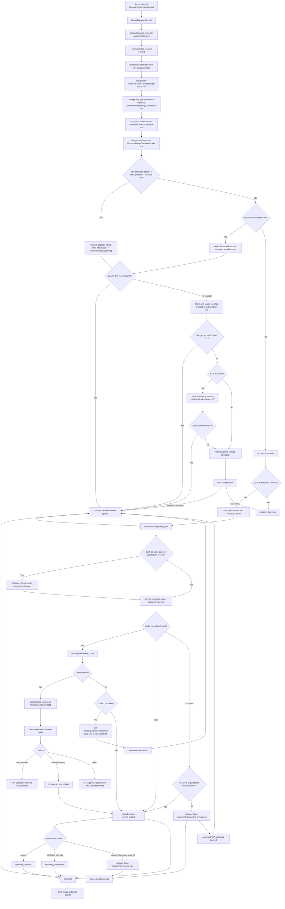

# Upload Manager Pipeline — Data contracts

> Parent pipeline spec: [upload-manager-pipeline.md](./upload-manager-pipeline.md)
> Contains the full **Data** section (document preview, location algorithm, field matrices, issue contracts, status labels).

**Upload events:** Tables may reference **`imageReplaced$`** / **`ImageReplacedEvent`** — symbols use **image**; domain meaning is **media item** replacement. See [symbol rename backlog](../../../../backlog/media-photo-symbol-rename-roadmap.md).

## Data

### Document First-Page Thumbnail Generation

Document uploads can produce a generated first-page thumbnail path used by media consumers.

- Generation trigger: after successful document upload and record persist.
- Generation output: storage path (for example `document_preview_path`) pointing to first-page rasterized preview.
- Retrieval path: media delivery orchestrator resolves this path before icon fallback for eligible slot sizes.
- Failure mode: upload remains successful; preview path stays null and consumer falls back to deterministic icon/no-media rendering.
- Provider model: generation may run via edge function/service worker pipeline using pluggable renderer libraries/services (for example PDF renderer and office-to-preview converter).

### Standortaufloesung: Algorithmus GPS vs. Titel

Deterministische Reihenfolge (first-match-wins):

1. Pro Datei `directorySegments` aus der Ordnerstruktur aufbauen.
2. Folder-Kandidat erzeugen:

- Segmente leaf→root traversieren (`folderHierarchyTraversalOrder`)
- nur high-confidence Segmenttreffer zulassen (`folderHintRequireHighConfidence`)
- root hint nur als fallback (`folderHintUseRootFallback`)

3. Titel/Filename-Kandidat extrahieren und confidence score bestimmen.
4. Vorrangsregel anwenden: Dateiname gewinnt immer gegen Folder-Kandidat (`filenameAlwaysOverridesFolder`).
5. Nur den gemergten Kandidaten ab `titleConfidenceThreshold` weiterverarbeiten.
6. Kandidat forward-geocoden und Mehrtreffer gegen `minMeaningfulScore` filtern.
7. Bei genau einem sinnvollen Treffer: Titel als Standortquelle verwenden.
8. Bei mehreren Treffern: Cluster-Disambiguierung mit `clusterAssistWeight` + `minTopGap` ausfuehren.
9. Wenn weiterhin mehrdeutig und EXIF vorhanden: EXIF als Assistenz mit `exifAssistRadiusMeters` pruefen.
10. Wenn danach eindeutig: Titel-Treffer verwenden.
11. Wenn weiter mehrdeutig: User-Prompt fuer Kandidatenauswahl.
12. Wenn kein aufloesbarer Titelkandidat: EXIF als Fallback verwenden.
13. Wenn weder Titel noch EXIF aufloesbar: `missing_data` issue setzen.

Algorithmus-Parameter (`UploadLocationConfig`) mit Defaults:

| Parameter                                   | Default              | Bedeutung                                                                                                             |
| ------------------------------------------- | -------------------- | --------------------------------------------------------------------------------------------------------------------- |
| `exifAssistRadiusMeters`                    | `300`                | EXIF darf Mehrtreffer nur bestaetigen, wenn EXIF-Koordinaten innerhalb dieses Radius zu genau einem Kandidaten liegen |
| `minMeaningfulScore`                        | `0.55`               | Untergrenze fuer geocoding Treffer, die als sinnvolle Kandidaten gelten                                               |
| `minTopGap`                                 | `0.1`                | Mindestabstand zwischen Platz 1 und Platz 2, damit Cluster-Entscheid als eindeutig gilt                               |
| `titleConfidenceThreshold`                  | `0.8`                | Mindestconfidence fuer Parser-Ergebnis, um als Titelkandidat in den Geocoding-Pfad zu gehen                           |
| `clusterAssistWeight.project`               | `0.7`                | Gewicht fuer bereits bekannte Projektstandorte bei Mehrtreffer-Ranking                                                |
| `clusterAssistWeight.company`               | `0.3`                | Gewicht fuer bekannte Unternehmenscluster bei Mehrtreffer-Ranking                                                     |
| `folderHierarchyTraversalOrder`             | `'leaf-to-root'`     | Traversierungsrichtung der `directorySegments`; dateinahe Ordner haben Prioritaet                                     |
| `folderHintRequireHighConfidence`           | `true`               | Nur high-confidence Segmenttreffer aus Ordnern duerfen als Folder-Kandidat gelten                                     |
| `folderHintUseRootFallback`                 | `true`               | Root folder hint wird nur genutzt, wenn kein spezifischer Segmenttreffer gefunden wurde                               |
| `filenameAlwaysOverridesFolder`             | `true`               | Erzwingt die Vorrangsregel file > folder fuer den finalen Titelkandidaten                                             |
| `maxDirectorySegmentsForHint`               | `32`                 | Schutzgrenze fuer Segmentauswertung pro Datei in tiefen Ordnerbaeumen                                                 |
| `parserBaseConfidence`                      | `0.5`                | Basisvertrauen fuer Pfad-/Titelparser                                                                                 |
| `parserCityStreetIncrement`                 | `0.2`                | Inkrement fuer Stadt/Strassen-Signale im Parser                                                                       |
| `parserZipIncrement`                        | `0.25`               | Inkrement fuer PLZ-Signal im Parser                                                                                   |
| `disambiguationAutoAssignThreshold`         | `0.95`               | Schwellwert fuer automatische Stadtzuweisung                                                                          |
| `disambiguationReviewLowerBound`            | `0.7`                | Untergrenze, ab der Kandidaten noch als pruefbar gelten statt sofort verwerfen                                        |
| `disambiguationZipCandidateProbability`     | `0.8`                | Kandidatenwahrscheinlichkeit bei passender PLZ                                                                        |
| `disambiguationDefaultCandidateProbability` | `0.2`                | Basiswahrscheinlichkeit ohne PLZ-Match                                                                                |
| `disambiguationAlgorithm`                   | `'cluster-majority'` | Disambiguierungsverfahren fuer city ranking                                                                           |
| `filenameSingleWordMinLength`               | `8`                  | Mindestlaenge fuer einwortige Strassennamen im Fallback-Pfad                                                          |
| `filenameSingleWordCityMinLength`           | `3`                  | Mindestlaenge fuer City-Anteil bei einwortigem Strassennamen                                                          |
| `filenameMultiWordTokenMinLength`           | `3`                  | Mindestlaenge pro Token bei mehrwortigen Fallback-Strassen                                                            |
| `filenameTrailingArtifactMinDigits`         | `3`                  | Untergrenze fuer zu entfernende Dateiende-Zaehlreste                                                                  |
| `filenameTrailingArtifactMaxDigits`         | `6`                  | Obergrenze fuer zu entfernende Dateiende-Zaehlreste                                                                   |
| `geocodeCacheTtlMs`                         | `300000`             | Cache-TTL fuer geocoding Antworten                                                                                    |
| `geocodeMaxProxyAttempts`                   | `3`                  | Maximale Retry-Anzahl fuer geocode Proxy-Aufrufe                                                                      |
| `geocodeLogDedupWindowMs`                   | `30000`              | Deduplizierungsfenster fuer wiederholte Fehlerlogs                                                                    |
| `geocodeAuthFailureCooldownMs`              | `120000`             | Cooldown nach Auth-Fehlern vor neuem geocode Versuch                                                                  |
| `geocodeSearchDefaultLimit`                 | `10`                 | Standardlimit fuer Forward-Search Trefferliste                                                                        |

Additional document-preview fields (conceptual contract):

| Field                    | Source                          | Type                               | Purpose                                                   |
| ------------------------ | ------------------------------- | ---------------------------------- | --------------------------------------------------------- |
| `document_preview_path`  | document thumbnail generator    | `string \| null`                   | First-page preview storage path for document-like uploads |
| `document_preview_state` | generation worker/edge function | `'pending' \| 'ready' \| 'failed'` | Progress state for asynchronous preview generation        |

Pseudo-Ablauf:

```ts
const folderCandidate = buildFolderHierarchyCandidate(job.directorySegments, {
  traversalOrder: config.folderHierarchyTraversalOrder,
  requireHighConfidence: config.folderHintRequireHighConfidence,
  useRootFallback: config.folderHintUseRootFallback,
  maxSegments: config.maxDirectorySegmentsForHint,
});

const fileCandidate = extractTitleCandidate(job.fileName);
const mergedCandidate =
  fileCandidate && config.filenameAlwaysOverridesFolder
    ? fileCandidate
    : (fileCandidate ?? folderCandidate);

if (
  mergedCandidate &&
  mergedCandidate.confidence >= config.titleConfidenceThreshold
) {
  const hits = forwardGeocodeAll(mergedCandidate.text);
  const meaningful = hits.filter((h) => h.score >= config.minMeaningfulScore);

  if (meaningful.length === 1) {
    useTitle(meaningful[0]);
  } else if (meaningful.length > 1) {
    const ranked = rankWithClusters(meaningful, {
      projectWeight: config.clusterAssistWeight.project,
      companyWeight: config.clusterAssistWeight.company,
      minTopGap: config.minTopGap,
    });

    if (ranked.isUnique) {
      useTitle(ranked.best);
    } else if (job.coords) {
      const exifNarrowed = narrowWithExif(
        meaningful,
        job.coords,
        config.exifAssistRadiusMeters,
      );
      if (exifNarrowed.length === 1) useTitle(exifNarrowed[0]);
      else promptUserForLocationChoice(meaningful);
    } else {
      promptUserForLocationChoice(meaningful);
    }
  } else if (job.coords) {
    useExif(job.coords);
  } else {
    routeToMissingDataIssue();
  }
} else if (job.coords) {
  useExif(job.coords);
} else {
  routeToMissingDataIssue();
}

// post-save enrichment
if (coords && !titleAddress) reverseGeocode();
else if (titleAddress && !coords) forwardGeocode();
```

### Data Flow (Mermaid)



| Field / Artifact       | Source                                               | Type                                                                                                                                | Notes                                                                                                                                             |
| ---------------------- | ---------------------------------------------------- | ----------------------------------------------------------------------------------------------------------------------------------- | ------------------------------------------------------------------------------------------------------------------------------------------------- |
| Folder batch status    | `UploadBatchService`                                 | `UploadBatch`                                                                                                                       | Starts as `scanning`, then transitions to `uploading`                                                                                             |
| Folder address hint    | Folder name parser                                   | `string \| null`                                                                                                                    | Batch default address for jobs without file-level hint                                                                                            |
| File title address     | Filename parser                                      | `string \| null`                                                                                                                    | Overrides folder address hint                                                                                                                     |
| Title geocode          | `GeocodingService.forward()`                         | `ExifCoords \| null`                                                                                                                | Used for source reconciliation                                                                                                                    |
| EXIF/title distance    | Haversine compare                                    | `number \| null`                                                                                                                    | Mismatch if `distanceMeters > 15`                                                                                                                 |
| Location sources       | Upload persistence (`media_items` + `media` storage) | structured fields                                                                                                                   | Keeps EXIF and text-derived coordinates separately                                                                                                |
| Address disambiguation | `LocationPathParserService` ranking                  | `{ algorithm, probability, candidates }`                                                                                            | Used for ambiguous city assignment                                                                                                                |
| Address notes          | Parser residual fragments                            | `string[]`                                                                                                                          | Preserved on job + media metadata                                                                                                                 |
| Content hash           | `core/content-hash.util.ts`                          | `string`                                                                                                                            | SHA-256 from file head + EXIF-derived metadata                                                                                                    |
| Dedup lookup result    | `check_dedup_hashes` RPC                             | `{ content_hash, media_item_id }[]`                                                                                                 | Used for single and batch duplicate checks                                                                                                        |
| Dedupe scope           | Media type gate                                      | `'image'`                                                                                                                           | Videos and documents (`DOC`, `DOCX`, `ODT`, `ODG`, `TXT`, `XLS`, `XLSX`, `ODS`, `CSV`, `PPT`, `PPTX`, `ODP`, `PDF`) are excluded from hash dedupe |
| Duplicate decision     | Duplicate-resolution modal                           | `'use_existing' \| 'upload_anyway' \| 'reject'`                                                                                     | Can be batch-applied                                                                                                                              |
| Duplicate apply mode   | Modal checkbox                                       | `boolean`                                                                                                                           | Apply chosen decision to all matching jobs in batch                                                                                               |
| Issue kind             | Upload lane presenter                                | `'duplicate_photo' \| 'missing_gps' \| 'address_ambiguous' \| 'document_unresolved' \| 'conflict_review' \| 'upload_error' \| null` | Drives lane placement and row actions                                                                                                             |
| Uploaded actions       | Upload row presenter                                 | `UploadItemAction[]`                                                                                                                | Available only after saved media exists                                                                                                           |
| Conflict candidate     | `media_items` table lookup                           | `ConflictCandidate`                                                                                                                 | Photoless row near upload coords/address                                                                                                          |
| Replace event          | `UploadManagerService.imageReplaced$`                | `ImageReplacedEvent`                                                                                                                | Drives map/detail/card refresh                                                                                                                    |
| Attach event           | `UploadManagerService.imageAttached$`                | `ImageAttachedEvent`                                                                                                                | Upgrades photoless surfaces to media surfaces                                                                                                     |

### Issue Kind Option Contract

| Issue kind                         | Allowed non-destructive actions                                       | Required destructive action |
| ---------------------------------- | --------------------------------------------------------------------- | --------------------------- |
| `duplicate_photo`                  | `open_existing_media`, `upload_anyway`                                | `dismiss`                   |
| `missing_gps`                      | `change_location_map`, `change_location_address`, `retry`             | `dismiss`                   |
| `address_ambiguous`                | `candidate_select`, `manual_location_entry`                           | `cancel_location_prompt`    |
| `document_unresolved`              | `change_location_map`, `change_location_address`, `assign_to_project` | `dismiss`                   |
| `conflict_review` / `upload_error` | `retry`                                                               | `dismiss`                   |

### Filename Address Confidence Contract

| Input                                          | Confidence result  | Pipeline behavior                                                       |
| ---------------------------------------------- | ------------------ | ----------------------------------------------------------------------- |
| Filename/folder address parse                  | `high`             | Treated as parseable title/folder address and can continue normal route |
| Filename/folder address parse                  | `low` / `nonsense` | Stored in `addressNotes[]` only; does not satisfy location requirement  |
| Document with only low-confidence text address | unresolved         | Routed to `missing_data` with `issueKind=document_unresolved`           |

### Persisted Media Location Edit Contract

| Trigger                                           | Required behavior                                                | Forbidden behavior                                    |
| ------------------------------------------------- | ---------------------------------------------------------------- | ----------------------------------------------------- |
| User chooses `Add/Change GPS` on uploaded row     | Update persisted media coordinates/address fields                | Creating a new upload job                             |
| User chooses `Add/Change address` on uploaded row | Resolve and persist updated address/coords on same media record  | Requeueing file into upload phases                    |
| Address/GPS correction completes                  | Keep row identity in uploaded lane and refresh map/card position | Re-running `uploading -> saving_record` for same file |

### Status Label Contract

| Pipeline state                         | Required statusLabel fallback |
| -------------------------------------- | ----------------------------- |
| `queued`                               | `Queued`                      |
| `validating`                           | `Validating…`                 |
| `parsing_exif`                         | `Reading EXIF…`               |
| `extracting_title`                     | `Checking filename…`          |
| `hashing`                              | `Computing hash…`             |
| `dedup_check`                          | `Checking duplicates…`        |
| `awaiting_conflict_resolution`         | `Waiting for decision…`       |
| `uploading`                            | `Uploading…`                  |
| `saving_record`                        | `Saving…`                     |
| `resolving_address`                    | `Resolving address…`          |
| `resolving_coordinates`                | `Resolving location…`         |
| `missing_data` + `missing_gps`         | `Choose location`             |
| `missing_data` + `document_unresolved` | `Choose location or project`  |
| `skipped` + `duplicate_photo`          | `Already uploaded`            |
| `error`                                | `Upload failed`               |
| `complete`                             | `Uploaded`                    |

