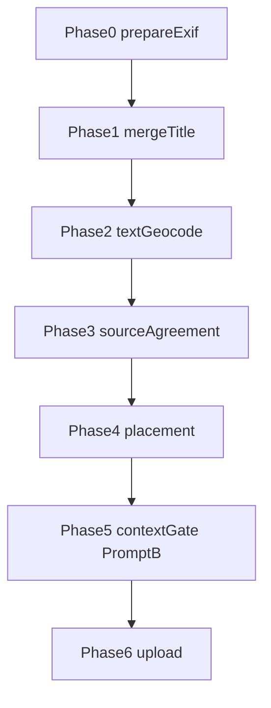
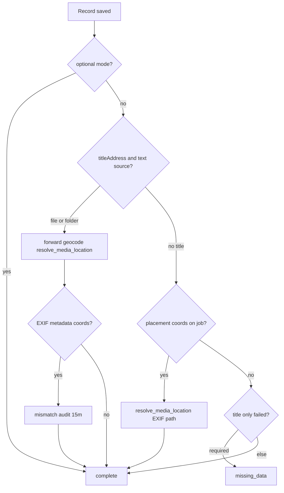

# Upload Manager Pipeline — Location routing FSM (supplement)

> **Parent:** [upload-manager-pipeline.md](./upload-manager-pipeline.md)  
> **Related:** [upload-panel.md](../../component/upload/upload-panel.md), [upload-manager-pipeline.data.md](./upload-manager-pipeline.data.md)  
> **Glossary:** [media-locations.zoomable-map-contract.supplement.md](../media-locations/media-locations.zoomable-map-contract.supplement.md)

## What It Is

Normative FSM and persistence matrix for **upload location routing**: panel mode, job routing, post-save enrichment, and folder webkit fallback. Parent Actions 3–6 remain the index; this file is the operational contract for agents and implementers.

## Panel location mode FSM

| State | `locationRequirementMode` | UI label | Pipeline effect |
| --- | --- | --- | --- |
| `required` | `'required'` | Auto location (ON) | Filename/folder routing, post-save geocode, missing location → Issues |
| `optional` | `'optional'` | No auto location (OFF) | Strip placement; keep EXIF metadata columns only |

**Cold start default:** `required` (Auto location ON). **Not** driven by `projects.location_required` (deprecated — see [deprecated-schema.md](../../../architecture/deprecated-schema.md)).

### Session override (same browser session)

| Event | Behavior |
| --- | --- |
| User toggles mode while workspace has one selected project filter | Store choice in `sessionLocationModeOverrides[projectId]` |
| User switches to another filtered project | Restore that project's override, or `required` if none |
| No project filter active | Toggle updates global signal only; no map entry required |
| Clear project filter | Overrides map is **not** cleared |

## Pre-upload resolution (phased pipeline, OD-4)

Normative order before dedup and upload bytes. **`job.parsedExif.coords`** is raw EXIF metadata (DB `exif_*`); **`job.coords`** is placement only (set via `applyChosenPlacementSource` / tray).

| Phase | Step | Notes |
| --- | --- | --- |
| 0 | `prepareExifAndFile` | Sets `parsedExif` only; **does not** set `job.coords`. HEIC/HEIF: If `convertHeicToJpegUploadFile` fails, the job MUST transition to a terminal error phase with a user-visible message. Upload MUST NOT send the original `.heic` blob or `application/octet-stream` to Storage. |
| 1 | `mergeTitleCandidateOnJob` | High-confidence file/folder text → `titleAddress` |
| 2 | Text geocode (SO or legacy) | Runs when high-confidence text exists **even if** EXIF metadata present |
| 3 | Source agreement | Only when `titleAddressCoords` **and** `parsedExif.coords`; ≤ `sourceAgreementRadiusMeters` → text placement; else `disambiguationKind: 'source'` tray. **Tray membership:** `jobIds` on a source group MUST be jobs in the same `groupingKey` that each have **both** `titleAddressCoords` and `parsedExif.coords` (same folder batch is not enough). Media chip count = `jobIds.length`. **Idempotent:** at most one open group per `(batchId, queryKey)` where `queryKey = source\|{groupingKey}`; after user resolves, no re-register; concurrent `finalizePlacement` singleflight shares one reverse-geocode. Candidate IDs: `source-text`, `source-exif`, `source-both`, `source-none`. |
| 4 | `applyChosenPlacementSource` | EXIF-only when geocode failed and no text coords (Branch B) |

### Phase 3 — source-conflict resolution record

When the user resolves `disambiguationKind: 'source'`, the app MUST persist the chosen tray option id per `(batchId, queryKey)` where `queryKey = source|{groupingKey}`.

| `selectedCandidateId` | Effect on each job in `groupingKey` (including jobs that enter Phase 3 later) |
| --- | --- |
| `source-text` | `buildChosenPlacementPatch(job, 'text', job.titleAddressCoords ?? candidate pin)` |
| `source-exif` | `buildChosenPlacementPatch(job, 'exif', …)` when EXIF (or tray photo pin) present; else **folder text** when `titleAddressCoords` present; else Issues |
| `source-both` | Same as `source-exif` for placement; product “both” semantics unchanged from code |
| `source-none` | `deferGroup` semantics: `phase: missing_data`, `issueKind: missing_gps`, no `job.coords` |

**Forbidden:** After resolve, late jobs MUST NOT default to text placement via a “skip tray” shortcut.

**Replay hook:** `finalizePlacementForJob` when `held_source_conflict` and `getSourceConflictChoice(batchId, groupingKey)` is set → apply the same row as above, then continue Phase 4–6 without re-opening the tray.

### Tray Continue gate (orchestrator path)

While `UploadResolverTrayOrchestratorService.hasActivePresentation()` is true, the primary footer control MUST be disabled until **every** `jobId` on `activeItem` satisfies:

1. `job.phase === 'awaiting_disambiguation'`, and
2. `UploadService.isHeic(job.file) === false` (JPEG replacement applied in Phase 0).

Exception: `answerKind: 'text'` city step (no file prepare dependency on option list).

UI MAY show `upload.resolver.waitingPrepare` while disabled.
| 5 | Geocode far-hit filter | Org `contextDistanceMaxMeters` (Settings → **Max distance for internet results (km)**) — drop Photon hits farther than cap from **job anchor** (EXIF → project) before trays; same key as search bar |
| 6 | `routePreparedNewJob` / upload | `finalCoords` from `job.coords`; `exif_*` from `parsedExif.coords` |

**Branch A (`missing_data_route`):** After Phase 2 failure when **no** `titleAddressCoords` and **no** `parsedExif.coords`. Phase 3 source-conflict **does not** run.

**EXIF-only route (`exif_only_route`):** Phase 4 applies EXIF when no text coords after geocode fail.

**Gate:** Jobs in `awaiting_disambiguation` stay in Queue (“Choose address”) until group `resolutionGateOpen === false`. Dedup/upload only when placement is decided.

**Post-upload:** Tray does not reopen for `complete` jobs (OD-7). Post-save forward is skipped when pre-upload coords exist on the job.

### Distance radii (do not conflate)

Canonical matrix: [search-tuning.distance-radii-contract.md](../search/search-tuning.distance-radii-contract.md).

| Constant | Home | Default | Unit in UI | Used when |
| --- | --- | --- | --- | --- |
| `contextDistanceMaxMeters` | Org Search Tuning (`resolver`) | **120 000 m** | **km** slider | Unrealistic **Internet + upload geocode** hits vs **search anchor** (photo GPS → map → project) |
| `exifAssistRadiusMeters` | [upload-location-config.md](./upload-location-config.md) | **80 m** | *(not in Search Tuning UI)* | Among **multiple** geocode hits, pick/nudge candidate near **EXIF** |
| `sourceAgreementRadiusMeters` | upload-location-config | **150 m** | *(not in Search Tuning UI)* | **Text geocode coords** vs **EXIF metadata** → agree or source tray |

`clusterAssistWeight.project` is a **ranking weight**, not a distance radius.

### Phase 5 reference points (Prompt B)

Do **not** use `MediaClusterService` / `get_media_clusters` for per-upload distance checks. Use project media whose linked locations satisfy [`locationsWithGps`](../media-locations/media-locations.zoomable-map-contract.supplement.md) (`legacyMediaHasGps`). Adapter contract: [upload-project-gps-reference.adapter.md](./adapters/upload-project-gps-reference.adapter.md) — implement `registerContextDistanceGroup` only after adapter ships.

## Job routing FSM (auto location ON)

**Text placement (file or folder):**

- `locationSourceUsed` = `'file'` | `'folder'`; **`job.coords`** = geocoded text
- **`exif_latitude` / `exif_longitude`** still from `parsedExif.coords` when present (metadata ≠ placement)

**EXIF placement:** When no text coords after Phase 2; `job.coords` = `parsedExif.coords`, `locationSourceUsed` = `'exif'`.

## Post-save enrichment FSM (required mode)

Order is normative (fixes title+EXIF ordering bug):

| Branch | RPC / service | Persisted |
| --- | --- | --- |
| Title forward | `resolve_media_location` via `UploadEnrichmentService.enrichWithForwardGeocode` | Linked location lat/lng + address |
| EXIF placement | `resolve_media_location` (not `bulk_update_media_addresses` alone) | Linked location + reverse-derived address when geocoder succeeds |
| Mismatch audit | `forwardGeocodeAddress` (no persist) + `locationMismatchMeters` on job | Audit only; upload stays complete |

## Persistence matrix

Use glossary columns from [zoomable-map-contract supplement](./media-locations.zoomable-map-contract.supplement.md).

| Field | Text placement wins | EXIF placement wins | Optional mode |
| --- | --- | --- | --- |
| **Address-visible** | Forward geocode text on link (may precede coords) | Reverse-derived address on link | May have no link |
| **Zoomable** | After forward geocode `resolve_media_location` | EXIF coords on link | Usually 0 |
| **Display-hydrate** | Zoomable row if geocode succeeded; else address-only row | Zoomable EXIF row | Empty / unresolved |
| `media_items.exif_*` | Metadata only (not placement) | Metadata only | Metadata only |
| `zoomable_location_count` (gallery) | ≥ 1 when geocode succeeds + parity after invalidate | ≥ 1 when EXIF placed | 0 |
| Detail EXIF row | Shows exif_* | Shows exif_* | Shows exif_* if parsed |

## Webkitdirectory fallback (Bug #4 contract)

When `showDirectoryPicker` is unavailable, `<input webkitdirectory>` builds jobs via `scanFilesFromWebkitDirectory()`:

| Case | `directorySegments` | Root folder hint |
| --- | --- | --- |
| `webkitRelativePath` = `Folder/sub/file.jpg` | `['Folder','sub']` | First segment after normalize |
| Path uses `\` | Normalize to `/`; drop empty segments | Same |
| Missing / empty `webkitRelativePath` | `[]` | None |
| `Mariahilferstraße 56/IMG.jpg` | `['Mariahilferstraße 56']` | `Mariahilferstraße 56` |
| `Fuchsthalergasse 4/IMG_1283.HEIC` | `['Fuchsthalergasse 4']` | `Fuchsthalergasse 4` |

Forward geocode retries (folder title): when Nominatim returns no hit for the literal string, `buildForwardGeocodeRetryQueries()` may retry once with a **generic** locality anchor (default `Wien, Österreich`) if the hint has no comma. There is **no** per-street typo table; spelling must be geocoder-resolvable or the job lands in **Issues** (Choose location).

Implementation: [folder-scan-from-file-list.helpers.ts](../../../../apps/web/src/app/core/folder-scan/folder-scan-from-file-list.helpers.ts).

## Acceptance Criteria

- [ ] Vitest: text-wins strip, post-save forward-before-mismatch, EXIF `resolve_media_location`, webkit path matrix (agent-runnable)
- [ ] **Manual browser smoke (product owner)** — FSA folder `Mariahilferstraße 56` + `IMG_*` + Auto location default ON → detail address + GPS chip; EXIF row still visible ([agent-communication.md](../../../agent-workflows/agent-communication.md) LIVE VERIFICATION)
- [ ] **E2E smoke (backlog)** — Playwright/Cypress upload fixture; link GitHub issue when filed
