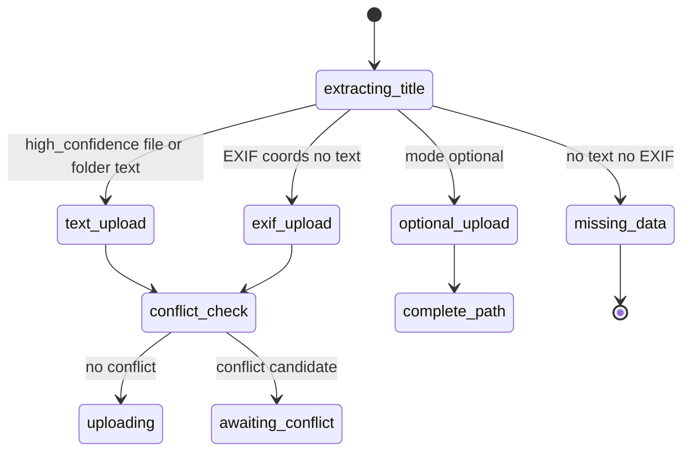
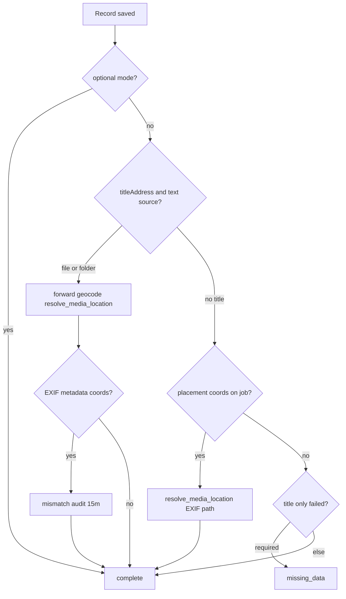

# Upload Manager Pipeline — Location routing FSM (supplement)

> **Parent:** [upload-manager-pipeline.md](./upload-manager-pipeline.md)  
> **Related:** [upload-panel.md](../../component/upload/upload-panel.md), [upload-manager-pipeline.data.md](./upload-manager-pipeline.data.md)  
> **Glossary:** [media-locations.zoomable-map-contract.supplement.md](../media-locations/media-locations.zoomable-map-contract.supplement.md)

## What It Is

Normative FSM and persistence matrix for **upload location routing**: panel mode, job routing, post-save enrichment, and folder webkit fallback. Parent Actions 3–6 remain the index; this file is the operational contract for agents and implementers.

## Panel location mode FSM

| State | `locationRequirementMode` | UI label | Pipeline effect |
| --- | --- | --- | --- |
| `required` | `'required'` | Auto location (ON) | Filename/folder routing, post-save geocode, missing location → Issues |
| `optional` | `'optional'` | No auto location (OFF) | Strip placement; keep EXIF metadata columns only |

**Cold start default:** `required` (Auto location ON). **Not** driven by `projects.location_required` (deprecated — see [deprecated-schema.md](../../../architecture/deprecated-schema.md)).

### Session override (same browser session)

| Event | Behavior |
| --- | --- |
| User toggles mode while workspace has one selected project filter | Store choice in `sessionLocationModeOverrides[projectId]` |
| User switches to another filtered project | Restore that project's override, or `required` if none |
| No project filter active | Toggle updates global signal only; no map entry required |
| Clear project filter | Overrides map is **not** cleared |

## Job routing FSM (auto location ON)

**Text wins (file or folder):**

- `locationSourceUsed` = `'file'` | `'folder'`
- **Placement:** no GPS on upload (`manualCoords` undefined; `parsedExif.coords` stripped for `finalCoords`)
- **Metadata:** `exif_latitude` / `exif_longitude` still populated from raw EXIF when present

**EXIF placement fallback:** only when no high-confidence text candidate (per [upload-manager-pipeline.data.md](./upload-manager-pipeline.data.md) step 12 — placement fallback, not metadata loss).

## Post-save enrichment FSM (required mode)

Order is normative (fixes title+EXIF ordering bug):

| Branch | RPC / service | Persisted |
| --- | --- | --- |
| Title forward | `resolve_media_location` via `UploadEnrichmentService.enrichWithForwardGeocode` | Linked location lat/lng + address |
| EXIF placement | `resolve_media_location` (not `bulk_update_media_addresses` alone) | Linked location + reverse-derived address when geocoder succeeds |
| Mismatch audit | `forwardGeocodeAddress` (no persist) + `locationMismatchMeters` on job | Audit only; upload stays complete |

## Persistence matrix

Use glossary columns from [zoomable-map-contract supplement](./media-locations.zoomable-map-contract.supplement.md).

| Field | Text placement wins | EXIF placement wins | Optional mode |
| --- | --- | --- | --- |
| **Address-visible** | Forward geocode text on link (may precede coords) | Reverse-derived address on link | May have no link |
| **Zoomable** | After forward geocode `resolve_media_location` | EXIF coords on link | Usually 0 |
| **Display-hydrate** | Zoomable row if geocode succeeded; else address-only row | Zoomable EXIF row | Empty / unresolved |
| `media_items.exif_*` | Metadata only (not placement) | Metadata only | Metadata only |
| `zoomable_location_count` (gallery) | ≥ 1 when geocode succeeds + parity after invalidate | ≥ 1 when EXIF placed | 0 |
| Detail EXIF row | Shows exif_* | Shows exif_* | Shows exif_* if parsed |

## Webkitdirectory fallback (Bug #4 contract)

When `showDirectoryPicker` is unavailable, `<input webkitdirectory>` builds jobs via `scanFilesFromWebkitDirectory()`:

| Case | `directorySegments` | Root folder hint |
| --- | --- | --- |
| `webkitRelativePath` = `Folder/sub/file.jpg` | `['Folder','sub']` | First segment after normalize |
| Path uses `\` | Normalize to `/`; drop empty segments | Same |
| Missing / empty `webkitRelativePath` | `[]` | None |
| `Mariahilferstraße 56/IMG.jpg` | `['Mariahilferstraße 56']` | `Mariahilferstraße 56` |
| `Fuchsthalergasse 4/IMG_1283.HEIC` | `['Fuchsthalergasse 4']` | `Fuchsthalergasse 4` |

Forward geocode retries (folder title): when Nominatim returns no hit for the literal string, `buildForwardGeocodeRetryQueries()` may retry once with a **generic** locality anchor (default `Wien, Österreich`) if the hint has no comma. There is **no** per-street typo table; spelling must be geocoder-resolvable or the job lands in **Issues** (Choose location).

Implementation: [folder-scan-from-file-list.helpers.ts](../../../../apps/web/src/app/core/folder-scan/folder-scan-from-file-list.helpers.ts).

## Acceptance Criteria

- [ ] Vitest: text-wins strip, post-save forward-before-mismatch, EXIF `resolve_media_location`, webkit path matrix (agent-runnable)
- [ ] **Manual browser smoke (product owner)** — FSA folder `Mariahilferstraße 56` + `IMG_*` + Auto location default ON → detail address + GPS chip; EXIF row still visible ([agent-communication.md](../../../agent-workflows/agent-communication.md) LIVE VERIFICATION)
- [ ] **E2E smoke (backlog)** — Playwright/Cypress upload fixture; link GitHub issue when filed
