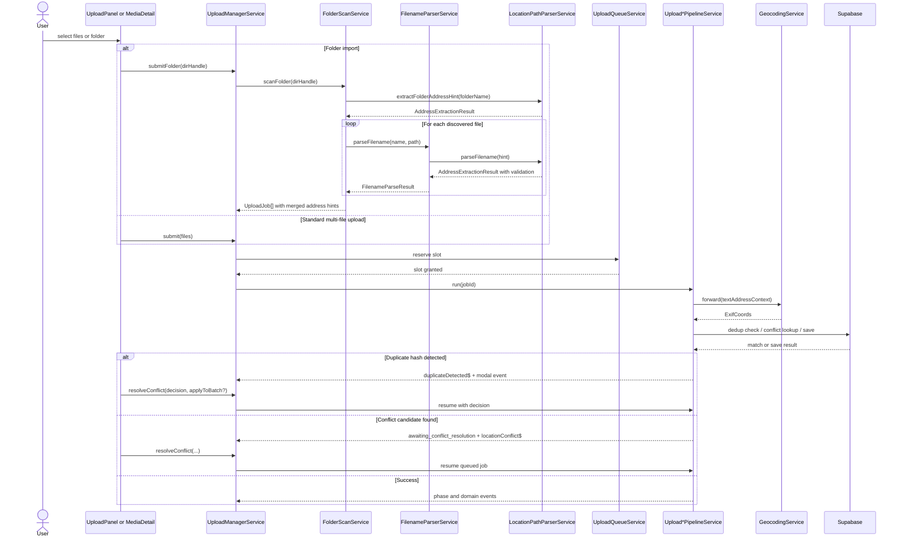

# Upload Manager Pipeline — Wiring

> **Parent:** [upload-manager-pipeline.md](./upload-manager-pipeline.md)

## What It Is

The pipeline's **injected services**, **input/output contract**, **event subscriptions**, **Supabase calls**, and the **submit → dedup/conflict → completion sequence diagram**. Split from `upload-manager-pipeline.md` for size; normative behavior is in the parent, this document is the wiring detail.

## What It Looks Like

Prose lists of injected services and calls, plus one Mermaid sequence diagram tracing folder/file submission through queueing, the dedup/conflict branch, and completion.

## Where It Lives

- **Specs:** `docs/specs/service/media-upload-service/upload-manager-pipeline.wiring.supplement.md`
- **Code:** `core/upload/upload-manager.service.ts` and the pipeline/queue/parser services listed below

## Actions

| # | Trigger | System response |
| --- | --- | --- |
| 1 | `submitFolder()` / `submit()` | Wiring sequence below governs scan/parse, queueing, dedup/conflict branching, and completion events |

## Component Hierarchy

N/A — service wiring, not a DOM subtree; see parent **Component Hierarchy** for the pipeline's own structure.

## Wiring

### Injected Services

- `UploadJobStateService` — owns job state, phase transitions, and failure events
- `UploadBatchService` — owns batch progress and completion state
- `UploadQueueService` — enforces concurrency and running-slot tracking
- `FolderScanService` — recursively scans directories; uses `FilenameParserService` + `LocationPathParserService` per file
- `FilenameParserService` — extracts address and date from all filenames (standalone or via FolderScanService)
- `LocationPathParserService` — parses and validates address components from path hierarchies
- `UploadNewPipelineService` — executes normal upload path
- `UploadReplacePipelineService` — executes replace path
- `UploadAttachPipelineService` — executes attach path
- `GeocodingService` — forward-geocodes text-derived addresses to coordinates
- `SupabaseService` — used for RPC/storage cleanup through service abstraction

### Inputs / Outputs

- **Inputs**: `File[]`, `FileSystemDirectoryHandle`, `mediaId`, conflict-resolution choice
- **Outputs**: `batchId`, `jobId`, and event streams on `UploadManagerService`

### Subscriptions

- Manager-owned consumers subscribe to `imageUploaded$`, `imageReplaced$`, `imageAttached$`, `uploadSkipped$`, `locationConflict$`, `jobPhaseChanged$`, `batchProgress$`, and `batchComplete$`.
- **Domain note:** **`image*` stream names** are legacy symbols; events carry **media item** identities. See [symbol rename backlog](../../../backlog/media-photo-symbol-rename-roadmap.md).
- Folder scan progress updates batch totals during `submitFolder()`.

### Supabase Calls

- `rpc('check_dedup_hashes', { hashes })` — duplicate detection
- Storage remove on cancellation/cleanup via `SupabaseService`
- Conflict lookup and save/update behavior are delegated through upload pipeline services

### Wiring Flow (Mermaid)

