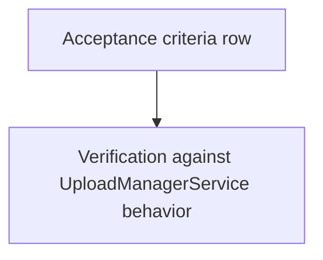

# Upload Manager — Acceptance criteria

> **Parent:** [upload-manager.md](upload-manager.md)

## What It Is

Full **acceptance criteria checklist** for `UploadManagerService`. Split from `upload-manager.md` for size; the parent spec links here for normative done-ness tracking.

## What It Looks Like

A checkbox list, grouped implicitly by the parent's Actions/Data sections it verifies (concurrency, location reconciliation, dedup, uploaded-lane actions, enrichment, failure cleanup).

## Where It Lives

- **Specs:** `docs/specs/service/media-upload-service/upload-manager.acceptance-criteria.md`

## Actions

| # | Trigger | System response |
| --- | --- | --- |
| 1 | QA / implementer verifies feature | Each criterion checked against product behavior |

## Component Hierarchy

N/A — criteria apply to `UploadManagerService` and its pipeline services per parent **Component Hierarchy**.

## Data

## Acceptance Criteria

- [x] Uploads continue when the originating component is destroyed (navigate away)
- [x] Maximum 3 concurrent uploads enforced globally across all entry points
- [x] FIFO queue: first file submitted is first to upload
- [x] `missing_data` jobs do not consume concurrency slots
- [x] Job state is reactive (Angular signals) — any component can bind to `jobs()`
- [x] `imageUploaded$` fires with coords + mediaId when a job completes
- [x] `uploadFailed$` fires when a critical phase fails
- [x] Failed jobs can be retried via `retryJob()`
- [x] Completed/failed jobs can be dismissed individually or in bulk
- [x] **Path A**: GPS in EXIF → upload → save → reverse-geocode address (non-blocking)
- [x] **Path B**: No GPS + address in title → upload → save with address → forward-geocode coords (non-blocking)
- [x] **Path C**: No GPS + no address → job enters `missing_data`, emits `missingData$` for placement flow
- [ ] Folder-level title addresses are applied as defaults to files without file-level title addresses.
- [ ] File-level title addresses override folder-level defaults.
- [ ] EXIF GPS is preserved even when textual location is present.
- [x] Title/folder-derived coordinates are compared against EXIF with a 15m tolerance and mismatches are persisted.
- [x] Hash dedupe runs for photo, document, and video (`photo_v1` / `binary_v1` per [dedup-scope supplement](./upload-manager-pipeline.dedup-scope.supplement.md)).
- [ ] Duplicate hash matches from a **colleague** are resolved via explicit user decision (`use_existing`, `upload_anyway`, `reject`); a same-user match auto-skips without a modal per [dedup-scope supplement](./upload-manager-pipeline.dedup-scope.supplement.md) § Behavior matrix.
- [ ] Duplicate resolution supports a batch apply option for matching items.
- [ ] Duplicate issue rows expose navigation to the existing placed media.
- [ ] Duplicate issue rows expose `Upload anyway` only for duplicate-photo review, never for GPS issues.
- [ ] Persisted successful uploads expose follow-up actions including `Add to project`, `Prioritize`, `Open in /media`, and `Download`.
- [ ] `Open project` appears only when the saved media item is already bound to a project.
- [ ] `Change location` in uploaded rows exposes `Click on map` and `Enter address` as separate flows.
- [ ] Address-suggestion hover previews map position without persisting until suggestion selection.
- [ ] Ambiguous street+house matches are auto-assigned only when disambiguation probability is at or above threshold (default `0.95`).
- [x] Parser residual fragments are preserved as address notes and remain visible in media details.
- [x] Address resolution and coordinate resolution are enrichment — failure is silent
- [ ] Geocoding enrichment `401` performs one silent auth refresh and one retry before failing
- [ ] Persistent geocoding `401` causes controlled sign-out via `AuthService` (no manual storage-clearing workaround)
- [x] Orphaned storage files are cleaned up when DB insert fails, and when a job is cancelled or signed out of after storage/DB residue already exists — `upload-file-persist.util.ts`, `upload-cancel-residue.util.ts`; see `docs/audits/upload-process-analysis-2026-09-08/10-findings.md` UP-02, UP-04
- [x] Auth change (logout) cancels all active jobs
- [x] Global progress indicator visible from any page when uploads are active
- [ ] `beforeunload` warning shown when `isBusy()` is true — **not implemented**: the registered handler is a no-op (`(): void => {}`); see `docs/audits/upload-process-analysis-2026-09-08/10-findings.md` UP-05
