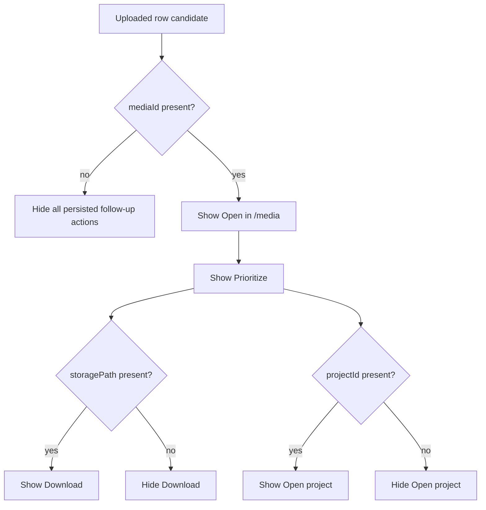

# Upload Manager

> **Related specs:** [media-download-service](../media-download-service/media-download-service.md), [upload-panel-system](../../ui/upload/upload-panel-system.md), [upload-panel (component)](../../component/upload/upload-panel.md)
> **Split contracts:** [Wiring & data flow](upload-manager.wiring.supplement.md) · [Acceptance criteria](upload-manager.acceptance-criteria.md)

## What It Is

A **singleton, application-wide service** that owns the entire upload pipeline: validation, EXIF parsing, folder/title address handling, **org-scoped per-file hash deduplication** (photo / document / video — see [dedup-scope supplement](./upload-manager-pipeline.dedup-scope.supplement.md)), duplicate resolution decisions, storage upload, database insert, and enrichment. Any component in the app can submit files and uploads continue independently of component lifecycle.

## Product principle

**Uploading is a background task — don't make me think.** Expensive work (HEIC conversion, geocoding) and blocking UI gates must not run before the user needs them. Tray questions about folder paths or filenames must not wait on byte conversion; files about to be skipped as duplicates must not pay for conversion.

Queue management and concurrency are implemented inside `UploadManagerService` through `UploadQueueService` and pipeline services under `core/upload/`.

## Child Specs

This parent spec owns the top-level contract. Deep pipeline behavior is split into:

| Child Spec                                            | Covers                                                                                                 |
| ----------------------------------------------------- | ------------------------------------------------------------------------------------------------------ |
| [upload-location-config](upload-location-config.md)   | Canonical upload location thresholds, confidence gates, and disambiguation parameters                  |
| [upload-manager-pipeline](upload-manager-pipeline.md) | Folder upload flow, deduplication, location-conflict detection, and replace/attach event orchestration |
| [upload-manager-pipeline.dedup-scope](upload-manager-pipeline.dedup-scope.supplement.md) | Org-scoped content-hash dedup, resume vs colleague duplicate behavior |

## What It Looks Like

The Upload Manager is mostly invisible UI infrastructure, but it surfaces as consistent upload state across the app: upload rows progress through explicit phases, global progress can be shown from any route, and media detail actions can continue after navigation. Jobs expose stable phase labels and progress percentages, with non-blocking enrichment phases for reverse and forward geocoding. Conflict resolution states are modeled as explicit paused phases instead of silent failures. When folder or file titles contain addresses, textual location is reconciled with EXIF data without ever discarding EXIF coordinates.

Canonical document/office upload catalog for this manager contract is: `DOC`, `DOCX`, `ODT`, `ODG`, `TXT`, `XLS`, `XLSX`, `ODS`, `CSV`, `PPT`, `PPTX`, `ODP`, `PDF`.

## Where It Lives

- Service: `UploadManagerService` at `core/upload/upload-manager.service.ts`
- Scope: `providedIn: 'root'` singleton, survives routing
- Consumers: Upload panel, media detail flows, folder import flows, and global progress UI

## Actions

| #   | Trigger                                            | System Response                                                | Notes                              |
| --- | -------------------------------------------------- | -------------------------------------------------------------- | ---------------------------------- |
| 1   | Any entry point submits files                      | Creates jobs and batch, starts queued execution                | Service-owned lifecycle            |
| 2   | A job starts processing                            | Runs validation, EXIF parse, dedup, upload, DB write           | Max 3 concurrent active jobs       |
| 3   | Folder/file title provides address text            | Resolves textual location source with precedence rules         | File title overrides folder title  |
| 4   | EXIF and textual location both exist               | Performs tolerance-based reconciliation (15m)                  | Keeps both coordinate sources      |
| 5   | Duplicate hash match for photo/image               | Opens duplicate-resolution flow and moves item to issues       | Org-scoped lookup ([dedup-scope supplement](./upload-manager-pipeline.dedup-scope.supplement.md)); same-user resume may auto-skip |
| 5a  | User chooses `upload anyway` on duplicate issue    | Resumes pipeline with force-upload semantics                   | Only valid for duplicate review    |
| 5b  | User chooses `use existing` on duplicate issue     | Completes without creating duplicate persisted media           | Existing media reference retained  |
| 6   | Geocoding enrichment needed                        | Runs reverse or forward enrichment as non-blocking phase       | Failure remains non-fatal          |
| 7   | Conflict detected                                  | Job pauses in awaiting conflict resolution                     | Resumes on user decision           |
| 8   | User retries failed job                            | Requeues from start with new phase transitions                 | Job id retained                    |
| 9   | User cancels job or batch                          | Stops work and performs cleanup as needed                      | Emits cancellation events          |
| 10  | Persisted upload is shown in Uploaded lane actions | Exposes add-to-project, prioritize, download, media navigation | Only after saved media exists      |
| 10a | User selects `Change location > Click on map`      | Enters map-pick flow and persists clicked coordinates          | Existing media row is updated      |
| 10b | User selects `Change location > Enter address`     | Opens address-finder overlay and persists selected suggestion  | Hover previews are map-only, no DB |

### Uploaded-Lane Follow-up Action Gating

Uploaded-lane 3-dot actions are conditional and MUST NOT render before required persisted media data is confirmed.



| Action           | Required data to render   |
| ---------------- | ------------------------- |
| `Open in /media` | `mediaId`                 |
| `Prioritize`     | `mediaId`                 |
| `Download`       | `mediaId` + `storagePath` |
| `Open project`   | `mediaId` + `projectId`   |

If required data is missing or unresolved, the action is hidden until the persistence layer confirms readiness.

## Component Hierarchy

```
Upload Manager System
  ├── Job Queue Layer ← queued jobs, retries, cancellation, FIFO start order
  ├── Pipeline Layer ← validation, EXIF, dedup, upload, save, enrichment
  ├── Event Layer ← emits uploads, replacements, attachments, skips, failures, conflicts
  ├── Batch Layer ← tracks aggregate progress, completion, and scanning state
  └── Consumers
      ├── UploadPanelComponent ← per-file rows, progress, issue states
      ├── ImageDetailView ← replace/attach entry points and refresh behavior
      ├── MapShellComponent ← marker updates and optimistic sync
      ├── ThumbnailCard / ThumbnailGrid ← thumbnail refresh and upload overlays
      └── UploadButtonZone ← global progress badge/ring
```

## Data

Data-flow and issue/action-semantics diagrams: [upload-manager.wiring.supplement.md § Data Flow](upload-manager.wiring.supplement.md#data-flow-mermaid).

| Field            | Source                                  | Type                                                                                |
| ---------------- | --------------------------------------- | ----------------------------------------------------------------------------------- |
| Jobs             | `UploadManagerService.jobs()`           | `Signal<UploadJob[]>`                                                               |
| Active count     | `UploadManagerService.activeCount()`    | `Signal<number>`                                                                    |
| Is busy          | `UploadManagerService.isBusy()`         | `Signal<boolean>`                                                                   |
| Batches          | `UploadManagerService.batches()`        | `Signal<UploadBatch[]>`                                                             |
| Active batch     | `UploadManagerService.activeBatch()`    | `Signal<UploadBatch \| null>`                                                       |
| Per-job events   | `UploadManagerService.jobPhaseChanged$` | `Observable<...>`                                                                   |
| Batch events     | `UploadManagerService.batchProgress$`   | `Observable<...>`                                                                   |
| Skip events      | `UploadManagerService.uploadSkipped$`   | `Observable<...>`                                                                   |
| Issue kind       | upload lane presenter                   | `'duplicate_file' \| 'missing_gps' \| 'address_deferred' \| 'address_ambiguous' \| 'document_unresolved' \| 'conflict_review' \| 'upload_error' \| null` |
| Uploaded actions | upload row presenter                    | `UploadItemAction[]`                                                                |

## State

| Name                   | Type                            | Default | Controls                                                             |
| ---------------------- | ------------------------------- | ------- | -------------------------------------------------------------------- |
| `jobs`                 | `WritableSignal<UploadJob[]>`   | `[]`    | Full upload queue + history                                          |
| `activeJobs`           | `Signal<UploadJob[]>`           | `[]`    | Computed: non-terminal jobs                                          |
| `isBusy`               | `Signal<boolean>`               | `false` | Computed: any non-terminal job exists                                |
| `activeCount`          | `Signal<number>`                | `0`     | Computed: jobs in uploading/saving/resolving                         |
| `batches`              | `WritableSignal<UploadBatch[]>` | `[]`    | All batches (active + completed)                                     |
| `activeBatch`          | `Signal<UploadBatch \| null>`   | `null`  | Active upload/scanning batch                                         |
| `job.issueKind`        | `UploadIssueKind \| null`       | `null`  | Distinguishes duplicate review from GPS or hard error                |
| `job.availableActions` | `UploadItemAction[]`            | `[]`    | Contextual row actions derived from saved media state and issue kind |

## File Map

| File                                                                 | Purpose                                                                      |
| -------------------------------------------------------------------- | ---------------------------------------------------------------------------- |
| `core/upload/upload-manager.service.ts`                              | Queue management, concurrency, pipeline orchestration                        |
| `core/upload/upload-manager.types.ts`                                | Shared upload domain types and event contracts                               |
| `core/upload/support/upload-job-state.service.ts`                    | Job state signal store + phase events                                        |
| `core/upload/support/upload-batch.service.ts`                        | Batch lifecycle and progress computation                                     |
| `core/upload/support/upload-queue.service.ts`                        | Running-slot tracking and concurrency guard                                  |
| `core/upload/pipelines/new/upload-new-pipeline.service.ts`           | New upload path including missing-data and conflict branching                |
| `core/upload/pipelines/replace/upload-replace-pipeline.service.ts`   | Replace existing media path                                                  |
| `core/upload/pipelines/attach/upload-attach-pipeline.service.ts`     | Attach media to photoless row path                                           |
| `core/upload/support/upload-conflict.service.ts`                     | Conflict-candidate lookup for photoless row matching                         |
| `core/upload/support/upload-enrichment.service.ts`                   | Post-upload forward/reverse geocode enrichment helper                        |
| `core/upload/support/upload-storage.service.ts`                      | Storage upload/delete helper for pipeline persistence                         |
| `core/upload/support/upload-notification.service.ts`                 | Upload-failure toast consumer bound to manager event streams                  |
| `core/upload/support/content-hash.util.ts`                           | `computeContentHash()` — SHA-256 from file head + EXIF                       |
| `core/upload/upload.service.ts`                                      | Per-file storage/DB operations and EXIF handling                             |
| `core/geocoding/geocoding.service.ts`                                | Reverse/forward geocoding adapter                                            |
| `docs/specs/service/media-upload-service/upload-location-config.md`  | Child spec for location-confidence and disambiguation contract               |
| `docs/specs/service/media-upload-service/upload-manager-pipeline.md` | Child spec for pipeline, deduplication, folder upload, and conflict handling |
| `features/upload/upload-panel/upload-panel.component.ts`             | Panel UI; delegates ingestion to `UploadManagerService`                      |

## Pipeline Service Coverage Addendum (C-01)

Partial-contract coverage for `UploadConflictService`, `UploadEnrichmentService`, `UploadStorageService`, and `UploadNotificationService` pending dedicated mirrored service specs: [upload-manager-pipeline.data.md § Pipeline Service Coverage Addendum (C-01)](./upload-manager-pipeline.data.md#pipeline-service-coverage-addendum-c-01).

## Wiring

Wiring sequence (submit → queue → pipeline → events) and the event-consumer table: [upload-manager.wiring.supplement.md](upload-manager.wiring.supplement.md).

## Acceptance Criteria

Full checklist: [upload-manager.acceptance-criteria.md](upload-manager.acceptance-criteria.md).

- [ ] Implementation satisfies the linked acceptance criteria and stays aligned with this parent contract.
