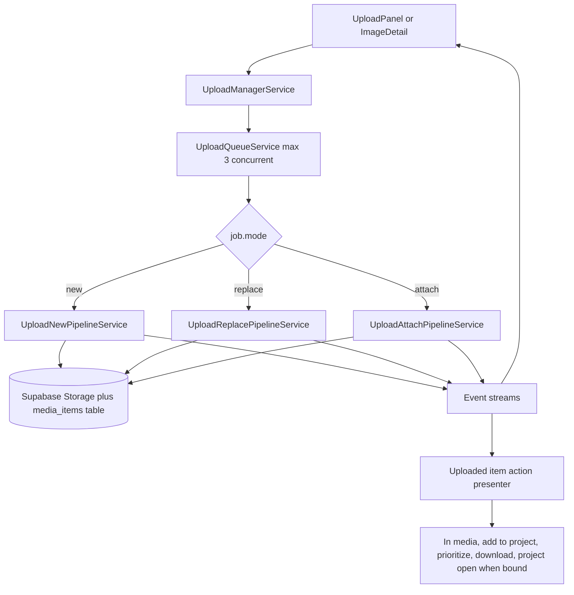
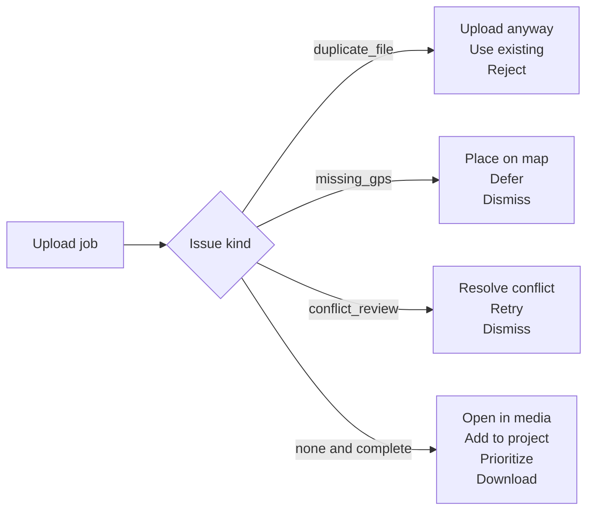
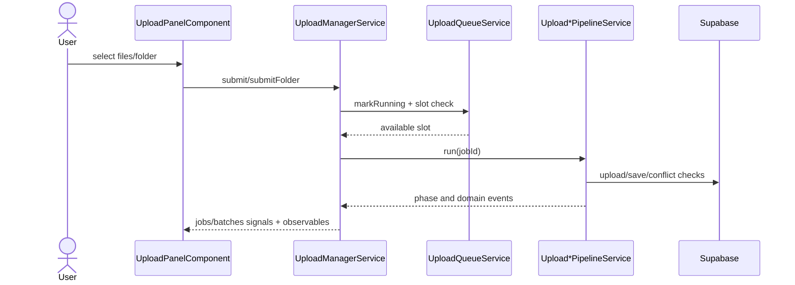

# Upload Manager — Wiring and data flow

> **Parent:** [upload-manager.md](upload-manager.md)

## What It Is

`UploadManagerService`'s **data-flow and issue-semantics diagrams**, its **wiring sequence** (submit → queue → pipeline → events), and the **event consumer table** listing every downstream subscriber of its output streams. Split from `upload-manager.md` for size; normative behavior is in the parent, this document is the diagram/wiring detail.

## What It Looks Like

Mermaid diagrams (data flow, issue/action semantics, wiring sequence) plus prose injection/subscription notes, followed by a table mapping each event stream to its consumers and their reactions.

## Where It Lives

- **Specs:** `docs/specs/service/media-upload-service/upload-manager.wiring.supplement.md`
- **Code:** `core/upload/upload-manager.service.ts` and the consumers listed in the table below

## Actions

| # | Trigger | System response |
| --- | --- | --- |
| 1 | `submit()` / `submitFolder()` | Wiring sequence below governs queue reservation, pipeline dispatch, and event fan-out |
| 2 | A pipeline emits a domain event | Event Consumers table below governs which components react and how |

## Component Hierarchy

N/A — service wiring, not a DOM subtree; see parent **Component Hierarchy** for the manager's own layer structure.

## Data Flow (Mermaid)

## Issue and Action Semantics (Mermaid)

## Wiring

### Wiring Flow (Mermaid)

- `UploadManagerService` is `providedIn: 'root'` — no module import needed
- Inject into `UploadPanelComponent` for intake, lane rows, and placement handoff
- Inject into `ImageDetailView` for `replaceFile()` and `attachFile()`
- Subscribe to `imageUploaded$` in `MapShellComponent` to upsert map markers
- Subscribe to `imageReplaced$` and `imageAttached$` in map/detail/grid consumers for immediate thumbnail refresh
- Subscribe to `uploadFailed$` for user-facing error notifications
- Subscribe to `batchProgress$` where global progress affordance is shown
- Consume `locationConflict$` through upload conflict UI flow before resume
- `dedup_hashes` table and conflict contract remain defined in `upload-manager-pipeline.md`

### Event Consumers

| Event               | Consumer               | Reaction                                                                    |
| ------------------- | ----------------------- | --------------------------------------------------------------------------- |
| `imageUploaded$`    | `MapShellComponent`    | Adds optimistic marker to the map                                           |
| `imageUploaded$`    | `ThumbnailGrid`        | Refreshes grid if the uploaded media item belongs to the active group       |
| `imageReplaced$`    | `MapShellComponent`    | Rebuilds marker DivIcon with the replacement thumbnail                      |
| `imageReplaced$`    | `ThumbnailCard`        | Resets thumbnail loading cycle to the new local object URL                  |
| `imageReplaced$`    | `ImageDetailView`      | Refreshes signed URLs and hero media preview                                |
| `imageAttached$`    | `MapShellComponent`    | Updates a formerly photoless marker with thumbnail content                  |
| `imageAttached$`    | `ThumbnailCard`        | Replaces no-photo state with uploaded thumbnail                             |
| `imageAttached$`    | `ImageDetailView`      | Switches from upload prompt to media display                                |
| `uploadFailed$`     | `MapShellComponent`    | Shows toast notification                                                    |
| `uploadSkipped$`    | `UploadPanelComponent` | Shows skip reason (`duplicate_reject`, `already_uploaded`, `policy_denied`) |
| `locationConflict$` | `UploadPanelComponent` | Shows conflict resolution popup                                             |
| `jobPhaseChanged$`  | `UploadPanelComponent` | Updates per-file status label and icon                                      |
| `jobPhaseChanged$`  | `MediaMarker`          | Shows or hides pending indicator on markers                                 |
| `jobPhaseChanged$`  | `ThumbnailCard`        | Shows or hides uploading overlay                                            |
| `batchProgress$`    | `UploadPanelComponent` | Updates the batch progress bar                                              |
| `batchProgress$`    | `UploadButtonZone`     | Shows progress ring or badge on the upload button                           |
| `batchComplete$`    | `UploadPanelComponent` | Shows batch summary                                                         |
| `missingData$`      | `UploadPanelComponent` | Emits placement request output to map shell                                 |
