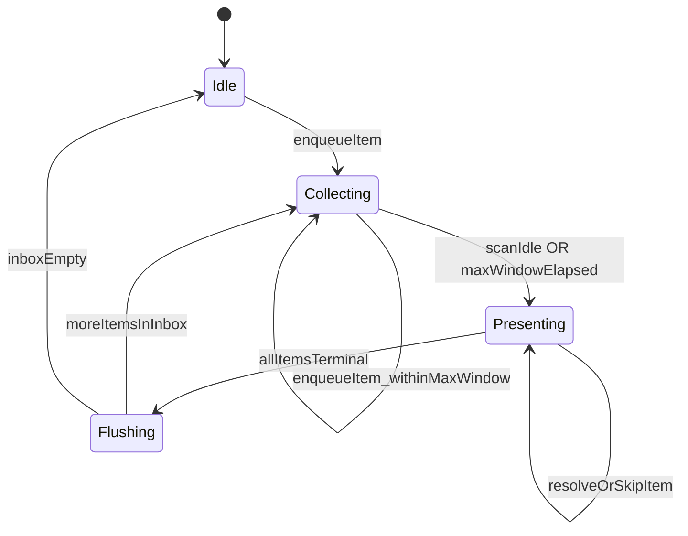

# Upload resolver tray orchestrator

> **UI:** [upload-resolver-tray.md](../../component/upload/upload-resolver-tray.md)  
> **Producer:** [upload-location-resolution.md](./upload-location-resolution.md) via `UploadLocationTrayProducerAdapter`  
> **Code:** `apps/web/src/app/core/upload-resolver-tray-orchestrator/`

## Conversational tray (normative)

The resolver tray is a **short dialogue**, not a form or matrix.

| Do | Don't |
| --- | --- |
| One clear question per screen | Multi-part questionnaires on one card |
| Small option sets (typically 2–5) | Overwhelming ranked lists without collapse |
| Continue → immediate effect → next question | Wait until hundreds of questions are answered |
| Bundle = “a few questions that arrived together” | One carousel for an entire 5000-file upload |
| Dependent step (1B) feels like “and now …” | Hidden state machines the user must infer |

**Engineering implications:**

- One active item in focus per view; carousel only within the current **presentation bundle**.
- **Per-item Continue** applies that answer and advances dialogue.
- Copy follows [upload-resolver-tray.question-copy.md](../../component/upload/upload-resolver-tray.question-copy.md).
- Producers must not enqueue items without renderable options (except explicit `answerKind: text`).

## What it is

`UploadResolverTrayOrchestratorService` — presentation layer between producers and `app-upload-resolver-tray`. Producers call `enqueueItem`; the tray reads `activeItem`, `activeItems`, and `itemStatuses`.

## Presentation bundle window

| Rule | Behavior |
| --- | --- |
| `PRESENTATION_BUNDLE_WINDOW_MS` | **Upper bound** (default **5000 ms**) on collecting-window duration |
| Not a minimum | Window **must** close earlier when possible |
| `notifyScanIdle(batchId)` | **Immediately** closes collecting → `presenting` (same as timer expiry) |

### `scanIdle` definition

For a given `batchId`, all of:

1. Upload batch **`status` leaves `scanning`** and folder intake for that batch is complete (jobs created).
2. `UploadAddressResolutionOrchestrator.classifyBatch(batchId)` has completed for the current scan wave.
3. Emitter: `UploadManagerService` submit pipeline after `classifyBatch` resolves → `UploadLocationTrayProducerAdapter.notifyScanIdle(batchId)`.

### FSM

## API

| Method / event | Purpose |
| --- | --- |
| `enqueueItem(descriptor)` | Producer adds one dialogue turn |
| `notifyScanIdle(batchId)` | Close collecting window early |
| `resolveItem` / `resolveActiveItem` | User Continue → `itemResolved$` |
| `skipItem` / `skipActiveItem` | Skip → `itemResolved$` (skipped) |
| `itemResolved$` | Per-item result (immediate) |
| `bundleCompleted$` | All items in bundle terminal → flush |
| `presentBundleImmediately` | Dev/QA: skip collecting window |

## Items and dependencies

- `dependsOnItemId` → item `blocked` until parent resolved; UI shows hint, Continue disabled.
- `trayStepLabel` `1a` / `1b` → carousel sub-label (e.g. `1A/4`, `2/4`).
- Carousel index **only** inside active bundle — never `2/847` for whole upload.

## Acceptance criteria

- [x] Items within 5s coalesce into one bundle during continuous scan
- [x] When scan ends at ~1.2s with items enqueued, bundle presents at ~1.2s, not 5s
- [x] Long scan (>5s) forms multiple bundles (5s cap per collecting window)
- [x] `scanIdle` with empty collecting window does not show empty tray
- [x] Per-item Continue emits `itemResolved$` before bundle flush
- [x] Dependent item blocked until parent resolved
- [x] Tray reads orchestrator only (no whole-batch `disambiguationGroups` carousel)
