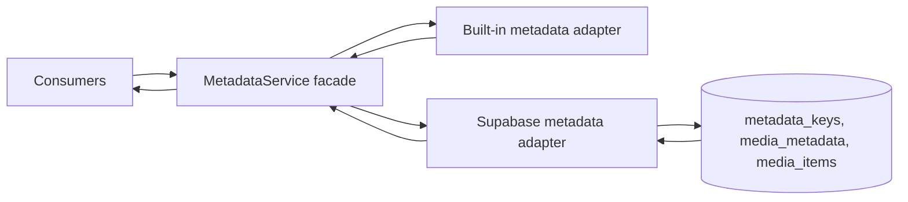
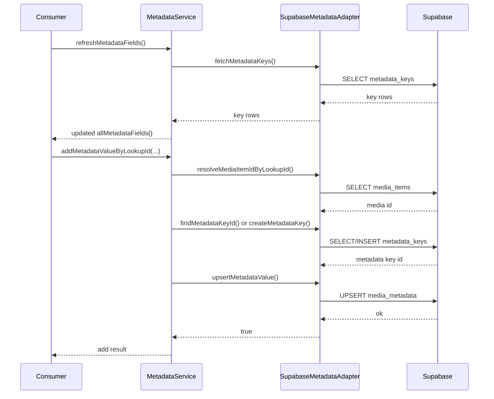

# Metadata Service

## What It Is

Metadata Service is the single canonical contract for metadata fields and metadata values used by sorting, grouping, filtering, search, and media-detail metadata editing.
It replaces and consolidates previous overlapping specs for custom properties, custom metadata, and property registry behavior.

## What It Looks Like

This is a service contract without direct UI rendering. In product behavior it appears as one consistent metadata model across dropdown operators and media detail flows. Built-in metadata fields and organization custom fields are merged into one field catalog with deterministic capability flags. Value resolution for built-in and custom fields follows one code path for sorting, grouping labels, and filtering values. Runtime labels and fallback strings are localized through the i18n service.

## Where It Lives

- Route: cross-cutting service used from map/workspace/media detail contexts
- Parent: core service layer
- Runtime module: apps/web/src/app/core/metadata/

## Actions

| #   | Trigger                                            | System Response                                                             | Contract Method                                                          |
| --- | -------------------------------------------------- | --------------------------------------------------------------------------- | ------------------------------------------------------------------------ |
| 1   | App or consumer requests metadata field catalog    | Returns built-in + custom metadata fields as one merged catalog             | allMetadataFields()                                                      |
| 2   | Consumer needs sortable fields                     | Returns only sortable fields                                                | sortableMetadataFields()                                                 |
| 3   | Consumer needs groupable fields                    | Returns only groupable fields                                               | groupableMetadataFields()                                                |
| 4   | Consumer needs filterable fields                   | Returns only filterable fields                                              | filterableMetadataFields()                                               |
| 5   | Consumer needs searchable fields                   | Returns only searchable fields                                              | searchableMetadataFields()                                               |
| 6   | Metadata keys loaded from DB                       | Maps DB keys to field definitions and updates custom field state            | setMetadataFieldsFromKeys(keys)                                          |
| 7   | Consumer requests metadata key refresh             | Fetches metadata keys and updates custom metadata fields                    | refreshMetadataFields()                                                  |
| 8   | Consumer requests sortable value for media + field | Resolves built-in value or custom parsed value                              | getSortableValue(media, fieldId)                                         |
| 9   | Consumer requests grouping label                   | Resolves built-in grouping labels or custom fallback labels                 | getGroupingLabel(media, fieldId)                                         |
| 10  | Consumer requests filter value                     | Resolves built-in/custom value as filter string                             | getFilterValue(media, fieldId)                                           |
| 11  | Media-detail flow loads values by lookup ids       | Loads media links + metadata values and returns lookupId keyed metadata map | loadMetadataValuesByLookupIds(lookupIds)                                 |
| 12  | Media-detail flow loads entries for one item       | Loads metadata entries for a media item                                     | loadMetadataEntriesForMediaItem(mediaItemId)                             |
| 13  | UI needs org key-name suggestions                  | Returns ordered key names for organization                                  | listMetadataKeyNamesForOrganization(organizationId)                      |
| 14  | User saves metadata value on existing key          | Upserts metadata value for resolved media item and key                      | saveMetadataValueByLookupId(lookupId, metadataKeyId, valueText)          |
| 15  | User adds metadata with key name                   | Finds or creates metadata key, then upserts metadata value                  | addMetadataValueByLookupId(lookupId, organizationId, keyName, valueText) |
| 16  | User removes metadata value                        | Deletes metadata value for resolved media item and key                      | removeMetadataValueByLookupId(lookupId, metadataKeyId)                   |

## Component Hierarchy

```text
MetadataService (facade)
|- metadata.types.ts (shared module contracts)
|- metadata.helpers.ts (pure mapping/build helpers)
`- adapters/
   |- built-in-metadata-fields.adapter.ts
   `- supabase-metadata.adapter.ts
```

## Data

### Data Flow



| Source            | Table / Layer                       | Fields                                                      | Operation            |
| ----------------- | ----------------------------------- | ----------------------------------------------------------- | -------------------- |
| Built-in fields   | built-in-metadata-fields.adapter.ts | fixed field ids, icons, value resolvers, grouping resolvers | read                 |
| Custom field keys | metadata_keys                       | id, key_name, key_type                                      | select               |
| Media value links | media_items                         | id, source_image_id                                         | select               |
| Metadata values   | media_metadata                      | media_item_id, metadata_key_id, value_text                  | select/upsert/delete |

## State

| Name                     | Type                                | Default            | Controls                      |
| ------------------------ | ----------------------------------- | ------------------ | ----------------------------- |
| customMetadataFields     | signal<MetadataFieldDefinition[]>   | []                 | runtime custom field catalog  |
| allMetadataFields        | computed<MetadataFieldDefinition[]> | built-ins + custom | merged metadata field catalog |
| sortableMetadataFields   | computed<MetadataFieldDefinition[]> | derived            | sortable subset               |
| groupableMetadataFields  | computed<MetadataFieldDefinition[]> | derived            | groupable subset              |
| filterableMetadataFields | computed<MetadataFieldDefinition[]> | derived            | filterable subset             |
| searchableMetadataFields | computed<MetadataFieldDefinition[]> | derived            | searchable subset             |

## File Map

| File                                                                        | Purpose                                  |
| --------------------------------------------------------------------------- | ---------------------------------------- |
| apps/web/src/app/core/metadata/metadata.service.ts                          | Facade and orchestration                 |
| apps/web/src/app/core/metadata/metadata.types.ts                            | Shared metadata contracts                |
| apps/web/src/app/core/metadata/metadata.helpers.ts                          | Pure mapping and aggregation helpers     |
| apps/web/src/app/core/metadata/adapters/built-in-metadata-fields.adapter.ts | Built-in field definitions and resolvers |
| apps/web/src/app/core/metadata/adapters/supabase-metadata.adapter.ts        | Supabase access adapter                  |
| apps/web/src/app/core/metadata/README.md                                    | Module index                             |
| docs/specs/service/metadata-service.md                                      | Canonical metadata service contract      |

## Wiring

### Injected Services

- I18nService: localized labels, fallback translations, date formatting
- SupabaseMetadataAdapter: all metadata table I/O

### Inputs / Outputs

- Input: media and lookup identifiers from consumers
- Output: field catalogs, resolved values, metadata maps, and CRUD operation results

### Subscriptions

- None. The service uses Angular signals/computed values and async method calls.

### Supabase Calls

- metadata_keys: select id/key_name/key_type, find key by org, list key names, create key
- media_items: resolve media item id by lookup id, resolve links for lookup ids
- media_metadata: select values/entries, upsert values, delete values



## Acceptance Criteria

- [ ] This file is the only active metadata behavior spec.
- [ ] Previous overlapping metadata specs are removed from active docs/specs.
- [ ] Metadata facade ownership is explicitly MetadataService.
- [ ] Property registry naming is treated as legacy and not used as canonical service contract.
- [ ] Built-in + custom fields are documented as one merged catalog.
- [ ] Value type contract is documented as text/select/number/date/checkbox.
- [ ] Service methods match current runtime implementation method names.
- [ ] Data tables match runtime adapter usage: metadata_keys, media_metadata, media_items.
- [ ] i18n translation behavior is part of the service contract.
- [ ] File map mirrors the runtime metadata module structure.
