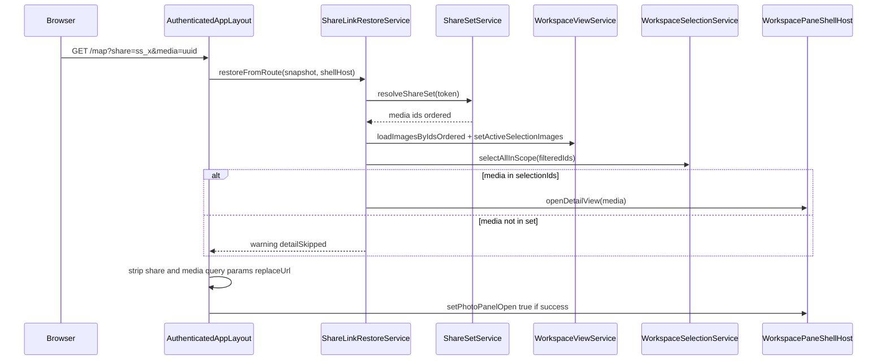
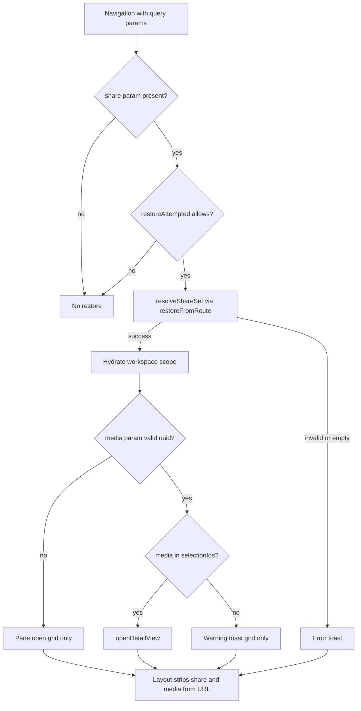

# Share Link Restore

## What It Is

Client orchestration that restores a **shared selection scope** into the layout-hosted workspace pane when the user opens a URL with a share token. Optional `media` query param opens pane detail when that id is in the post-RLS resolved set. Uses existing **`resolve_share_set`** RPC via [`ShareSetService`](share-set-service.md); no new database objects in v1.

**Terminology:** **Group** means workspace **selection scope** (`WorkspaceViewService` active images + `WorkspaceSelectionService` ids). It does **not** mean metadata grouping, sort order, or grid collapse keys.

## What It Looks Like

User pastes or opens `https://{origin}/?share=ss_…` or `/map?share=ss_…&media={uuid}`. The workspace pane opens on the **Selected items** tab with the shared media grid loaded. When `media` is valid for the set, detail view replaces the grid for that item. Query params are removed from the address bar after the attempt (`replaceUrl`).

## Where It Lives

- **Routes:** Any child of [`AuthenticatedAppLayoutComponent`](../../../../apps/web/src/app/layout/authenticated-app-layout.component.ts): `/`, `/map`, `/media`, `/projects`, `/settings/**`.
- **Orchestration:** Layout host (implements [`WorkspacePaneShellHost`](../../../../apps/web/src/app/core/workspace-pane/workspace-pane-shell-host.token.ts)).
- **Logic:** [`ShareLinkRestoreService`](../../../../apps/web/src/app/core/share-set/share-link-restore.service.ts) in `apps/web/src/app/core/share-set/`.
- **UI behavior:** [workspace-pane.md](../../ui/workspace/workspace-pane.md) § Restore from share URL.

## Actions

| # | User action | System response | Triggers |
| --- | --- | --- | --- |
| 1 | Opens URL with `share` only | Resolve token, hydrate scope, open pane (grid), strip params | Cold load or `NavigationEnd` |
| 2 | Opens URL with `share` + valid `media` | Same as #1 plus `openDetailView(media)` | `media` ∈ `selectionIds` |
| 3 | Opens URL with `share` + `media` not in set | Hydrate scope, grid only, warning toast | `media` ∉ `selectionIds` |
| 4 | Copies share link from workspace footer | URL includes `share`; adds `&media=` when detail open and id in scope | [`workspace-bulk-action.service.ts`](../../../../apps/web/src/app/shared/workspace-pane/workspace-bulk-action.service.ts) |
| 5 | Refreshes page after params stripped | No restore (no `share` in URL) | Param hygiene |

## Restore outcome matrix

| `share` | `media` | Pane | Scope | Detail | Toast |
| --- | --- | --- | --- | --- | --- |
| invalid / empty resolve | any | — | — | — | `share.restore.error.invalid` |
| resolve OK, zero loadable images | any | — | — | — | `share.restore.error.noImages` |
| RPC / unexpected error | any | — | — | — | `share.restore.error.resolveFailed` |
| valid | absent | Open | Restored | Grid | `share.restore.success.loaded` (count) |
| valid | ∈ `selectionIds` | Open | Restored | Detail for `media` | Success count only (no extra detail toast in v1) |
| valid | present, ∉ `selectionIds` | Open | Restored | Grid | `share.restore.warning.mediaNotInSet` |
| valid | present, malformed / empty uuid | Open | Restored | Grid | Treat as absent (no detail, no extra toast) |

**`selectionIds`:** Ordered share RPC ids filtered to ids returned from `loadImagesByIdsOrdered` (intersection with loaded images). Detail MUST NOT open for ids outside this set even if standalone RLS would allow read.

## Sequence (restore on navigation)



## Decision flow



## URL contract

| Query key | Required | Format | Semantics |
| --- | --- | --- | --- |
| `share` | Yes for restore | `ss_` + opaque token | Resolves curated set via [`resolve_share_set`](share-set-access-model.md) |
| `media` | No | UUID v4 shape | Detail target after scope hydration |

- v1: query params only (no `/map/selection/:token/...` paths).
- `media` without `share`: ignored; no restore.

### Copy-link shapes (creation)

| Condition | URL |
| --- | --- |
| Selection only | `{origin}/?share={token}` |
| Detail open, id in selection scope | `{origin}/?share={token}&media={id}` |
| Detail open, id not in scope | `{origin}/?share={token}` only |

## Normative API

```typescript
restoreFromRoute(
  snapshot: ActivatedRouteSnapshot,
  shellHost: WorkspacePaneShellHost,
): Promise<ShareLinkRestoreResult>
```

Do **not** use the name `restoreFromQuery`; the input is a full route snapshot.

### Layout host

[`AuthenticatedAppLayoutComponent`](../../../../apps/web/src/app/layout/authenticated-app-layout.component.ts) **implements** `WorkspacePaneShellHost` and registers:

```typescript
{ provide: WORKSPACE_PANE_SHELL_HOST, useExisting: AuthenticatedAppLayoutComponent }
```

Restore orchestration passes **`this`** as `shellHost`. [`MapShellComponent`](../../../../apps/web/src/app/features/map/map-shell/map-shell.component.ts) injects `WORKSPACE_PANE_SHELL_HOST` for pane mutations; restore does **not** go through map shell.

### Orchestration triggers (dual path)

| Trigger | When |
| --- | --- |
| `afterNextRender` | Once after first authenticated layout render (cold landing with `?share=`) |
| `Router.events` (`NavigationEnd`) | SPA navigation to a URL that still has `share` (e.g. paste while in app) |

Two entry points, one handler (`tryRestoreShareLinkFromRoute` on layout). Both MUST call the same guard and `restoreFromRoute`.

## Component Hierarchy

```text
AuthenticatedAppLayoutComponent (WorkspacePaneShellHost)
|- afterNextRender / NavigationEnd → tryRestoreShareLinkFromRoute
|- ToastService + I18nService (toasts from result)
`- ShareLinkRestoreService.restoreFromRoute(snapshot, this)
    |- ShareSetService.resolveShareSet
    |- WorkspaceViewService (hydrate scope)
    |- WorkspaceSelectionService.selectAllInScope
    `- shellHost.openDetailView (conditional)
```

## Data

| Source | Use |
| --- | --- |
| `resolve_share_set` | Ordered media ids for the token |
| `WorkspaceViewService.loadImagesByIdsOrdered` | Hydrate `setActiveSelectionImages` |
| `WorkspaceSelectionService.selectAllInScope` | Checkbox selection in grid |

## State

### `restoreAttempted`

| Mechanism | Role |
| --- | --- |
| **Param strip (primary)** | After any restore attempt, layout clears `share` and `media` with `replaceUrl: true`. Without params, later navigations and history back do not re-trigger restore. |
| **`restoreAttempted` (secondary)** | Service sets flag after first attempt in session. Resets **only on full app bootstrap** (new document / fresh Angular bootstrap), **not** on in-app route changes. Prevents double RPC if `afterNextRender` and immediate `NavigationEnd` both fire before strip completes. |

**History:** User restores → params stripped → navigates away → Back to stripped URL → no `share` → no restore (correct).

### Post-restore URL hygiene

Layout-owned (after `restoreFromRoute` returns):

```typescript
router.navigate([], {
  queryParams: { share: null, media: null },
  queryParamsHandling: 'merge',
  replaceUrl: true,
});
```

Runs after success and failure paths that consumed `share`.

## Security

- [`share-set-access-model.md`](share-set-access-model.md) governs who may resolve a token.
- `media` query param MUST NOT widen scope beyond the resolved share set.
- No `media`-only restore in v1.

## i18n

| Key | English fallback | When |
| --- | --- | --- |
| `share.restore.error.invalid` | Share link invalid, expired, or not accessible. | Empty / invalid resolve |
| `share.restore.error.noImages` | Share link contains no available media. | Zero loadable images |
| `share.restore.error.resolveFailed` | Share link could not be resolved. | RPC / catch |
| `share.restore.success.loaded` | {count} media loaded from share link. | Success (interpolate count) |
| `share.restore.warning.mediaNotInSet` | That item is not in this shared set. Showing the group. | `media` ∉ `selectionIds` |

Phase 2 MUST migrate hardcoded German strings from legacy map-shell restore to these keys.

## Explicit non-goals (v1)

- Live URL sync as selection changes on map or grid.
- Metadata grouping / sort / collapse in URL.
- `media` without `share`.
- Map marker key sync after restore (optional Phase 2b; document as known gap).

## File Map

| File | Purpose |
| --- | --- |
| `apps/web/src/app/core/share-set/share-link-restore.service.ts` | `restoreFromRoute` |
| `apps/web/src/app/core/share-set/share-link-restore.types.ts` | Result types |
| `apps/web/src/app/core/share-set/share-link-restore.helpers.ts` | Param parsing |
| `apps/web/src/app/core/share-set/share-link-restore.service.spec.ts` | Unit tests |
| `apps/web/src/app/layout/authenticated-app-layout.component.ts` | Dual-trigger orchestration |
| `docs/specs/service/share-set/share-link-restore.md` | This contract |

## Wiring

- **Parent RPC facade:** [share-set-service.md](share-set-service.md) (`ShareSetService` only).
- **Pane UI:** [workspace-pane.md](../../ui/workspace/workspace-pane.md).
- **Selection hydration:** [workspace-view-system.md](../workspace-view/workspace-view-system.md) (stub defers here).

## Acceptance criteria

- [x] `restoreFromRoute` is the sole restore entrypoint; feature-local `ShareTokenSelectionService` removed.
- [x] Restore runs from layout on `afterNextRender` and `NavigationEnd` when `share` present.
- [x] Works on `/`, `/map`, `/media`, `/projects` (layout child routes).
- [x] Matrix rows implemented including `media` ∉ set warning.
- [x] Malformed `media` treated as absent.
- [x] `share` + `media` stripped after attempt with `replaceUrl`.
- [x] `restoreAttempted` resets only on bootstrap.
- [x] Copy link appends `&media=` when detail in scope.
- [x] i18n keys registered and legacy German toasts removed.
- [x] `ng build` passes; `share-link-restore.service.spec.ts` covers matrix cases.
