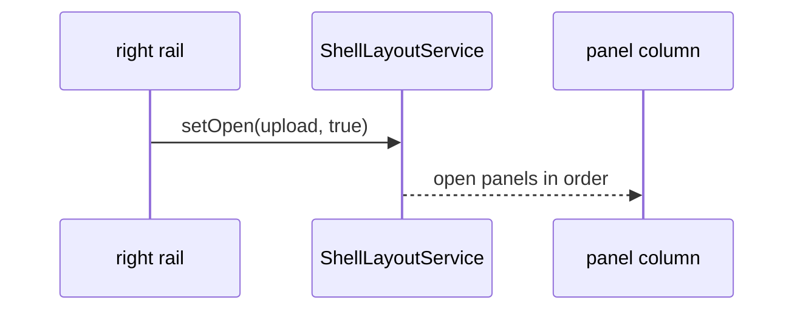
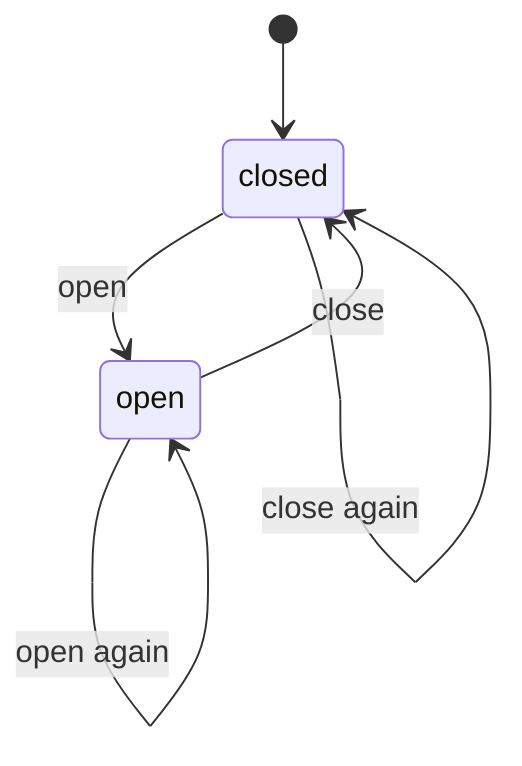

# Shell layout

## What It Is

The open/closed stack for the panel column. It knows `upload` and `help` only. It does not route the canvas.

## What It Looks Like

No UI. The panel column and the right rail read the same signal.

## Where It Lives

- **Code:** `apps/web/src/app/core/shell-layout/`.
- **Consumers:** `app-shell-control-area`, `app-shell-panel-column`, `app-grid-shell`.

## Actions

| # | User Action | System Response | Triggers |
| --- | --- | --- | --- |
| 1 | `open(id)` while closed | Panel becomes open with the next `order` | stack signal |
| 2 | `open(id)` while open | No change | idempotent |
| 3 | `close(id)` while open | Panel leaves the stack | stack signal |
| 4 | `close(id)` while closed | No change | idempotent |
| 5 | `setOpen(id, value)` at the current value | No change | idempotent |

## Component Hierarchy

```text
ShellLayoutService
├── shell-layout.types.ts
└── shell-layout.helpers.ts
```

No adapters. This module does not call Supabase or the router.

## Data

| Source | Contract | Operation |
| --- | --- | --- |
| In-memory signal | `{ id, open, order }[]` | Read and write |

Ids are `'upload' | 'help'`. An unknown id is ignored.

## State

| Name | Type | Default | Effect |
| --- | --- | --- | --- |
| `closed` | per id | yes | Panel unmounted |
| `open` | per id | no | Surface mounted |

Both states are reversible. There is no terminal state. Allowed transitions are `closed → open` and `open → closed`. Any other requested transition leaves the current state. `open` and `close` on an id already in that state are no-ops and do not change `order`.

## File Map

| File | Purpose |
| --- | --- |
| `core/shell-layout/shell-layout.service.ts` | Facade |
| `core/shell-layout/shell-layout.service.spec.ts` | Transition tests |
| `core/shell-layout/shell-layout.types.ts` | Panel id and stack row |
| `core/shell-layout/shell-layout.helpers.ts` | Pure transitions |
| `core/shell-layout/README.md` | Module index |

## Wiring





## Acceptance Criteria

- [ ] Upload and Help can be open at the same time.
- [ ] A second `open('upload')` does not change `order`.
- [ ] `close` on a closed id does not throw and does not emit a new list identity change beyond the no-op.
- [ ] The service exposes no canvas route method.
- [ ] An unknown id is ignored.
