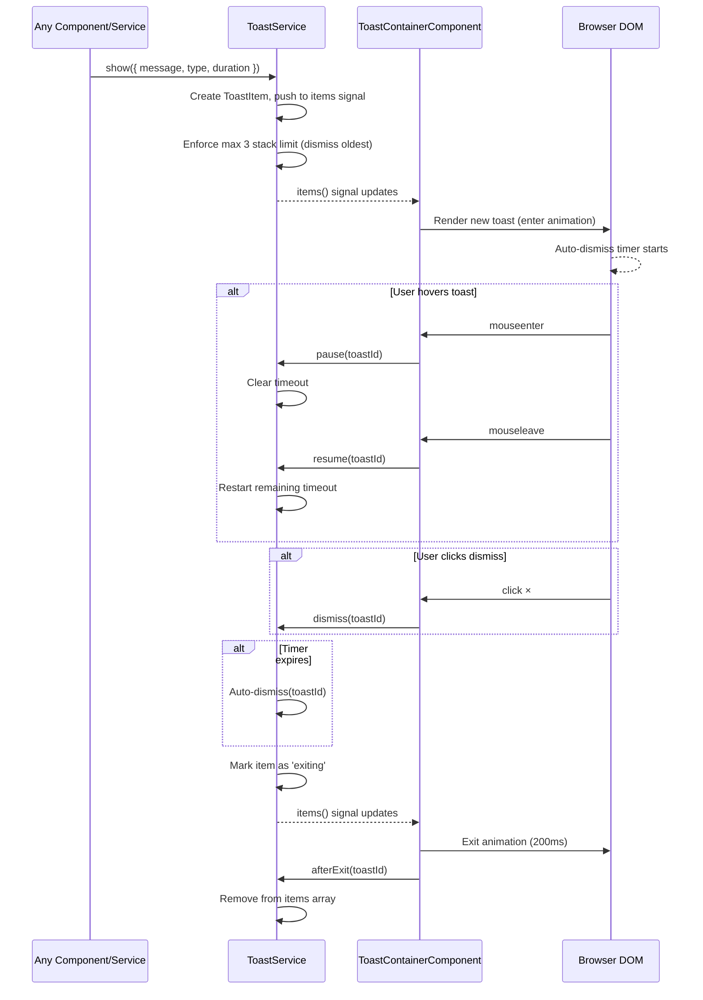

# Toast System

## What It Is

A global notification system that displays short, non-blocking feedback messages (success, error, warning, info) in response to user actions and system events. Toasts appear in the bottom-left corner of the viewport, stack vertically, and auto-dismiss after a configurable duration. Any service or component in the app can trigger a toast through the singleton `ToastService`.

## What It Looks Like

Compact horizontal bars, bottom-left of viewport (`position: fixed`, `left: 1rem`, `bottom: 1rem`, `width: min(24rem, calc(100vw - 2rem))`), max 3 stacked. Chrome: Spartan `hlmToast` + `toastVariants` CVA, leading severity icon, message text (3-line clamp, `word-break: break-word`), dismiss (×). Severity via tweakcn semantic tokens (`--success`, `--destructive`, `--warning`, `muted-foreground`). z-index `400` (between dropdown plane `300` and modal plane `500`; `--z-toast` removed — see [`docs/design/token-layers.md`](../../../design/token-layers.md)).

## Where It Lives

- **Route**: Global — available on every page
- **Parent**: `App` root component (`app.html`)
- **Appears when**: Any service calls `ToastService.show()`

## Actions

| #   | User Action              | System Response                                                                                                                 | Triggers                                            |
| --- | ------------------------ | ------------------------------------------------------------------------------------------------------------------------------- | --------------------------------------------------- |
| 1   | Toast appears            | Starts auto-dismiss timer (default 4s)                                                                                          | Timer countdown                                     |
| 2   | User hovers a toast      | Pauses auto-dismiss timer                                                                                                       | Timer paused                                        |
| 3   | User stops hovering      | Resumes auto-dismiss timer                                                                                                      | Timer resumes                                       |
| 4   | Clicks dismiss (×)       | Toast fades out immediately                                                                                                     | Toast removed from stack                            |
| 5   | Auto-dismiss timer fires | Toast fades out                                                                                                                 | Toast removed from stack                            |
| 6   | 4th toast arrives        | Oldest toast is immediately dismissed                                                                                           | Stack limit enforced                                |
| 7   | Error toast appears      | Default duration is **6s** (vs **4s** for other types) when the caller does not pass `duration`; same logic at all breakpoints unless a caller passes `duration: 0` | Longer auto-dismiss for errors unless overridden |

## Event Flow



### Timing details

- **`entering` → `visible`**: Transition happens on `animationend` of the enter animation (200ms ease-out). Do not use `setTimeout`.
- **`exiting` → removed**: Transition happens on `animationend` of the exit animation (200ms ease-in). `afterExit(toastId)` is called from the `animationend` handler, which then removes the item from the `items` signal.
- **Pause / Resume**: On `mouseenter`, record `remainingMs = duration - (Date.now() - startedAt)` and clear the timeout. On `mouseleave`, start a new timeout with the saved `remainingMs`. The `startedAt` timestamp is reset to `Date.now()` on resume so subsequent pauses calculate correctly.

## Component Hierarchy

```
ToastContainerComponent  ← position: fixed, bottom-left, z-index: 400
│   role="region", aria-label="Notifications", aria-live="polite"
│   width: min(24rem, calc(100vw - 2rem)), flex-direction: column
│
└── ToastItemComponent × N (max 3)
    ├── StatusIcon       ← check_circle / error / warning / info
    ├── MessageText      ← title (collapsed) + body + optional "Show details"
    │   codeRef          ← muted debug sub-line (file · fn)
    └── DismissButton    ← focusable, aria-label="Dismiss notification"
        ToastAction      ← optional footer CTA button
```

Error toasts set `aria-live="assertive"` on their host to interrupt screen readers.
Consumer wiring table: [`toast-authoring.supplement.md §7`](toast-authoring.supplement.md#7-event-inventory).

## Data

Active state: `ToastService.items()` → `Signal<ToastItem[]>` (default `[]`).

### ToastItem interface

Full definition in `apps/web/src/app/core/toast/toast.types.ts`.

```typescript
interface ToastItem {
  id: string;          // crypto.randomUUID() with Math.random() fallback
  message: string;     // Derived: title + body when structured fields set; flat message otherwise
  type: ToastType;     // 'success' | 'error' | 'warning' | 'info'
  duration: number;    // Auto-dismiss ms (0 = manual-only)
  state: 'entering' | 'visible' | 'exiting'; // Animation FSM
  createdAt: number;   // Date.now() for ordering
  startedAt: number;   // Date.now() when timer last (re)started — used for pause math
  remainingMs?: number; // Set on pause: duration - (Date.now() - startedAt)
  // Structured display (preferred over flat message)
  title?: string;      // One-line headline shown in collapsed state
  body?: string;       // One-to-two sentence user guidance shown below title
  detail?: string;     // Expandable technical detail (shown behind "Show details")
  codeRef?: ToastCodeRef; // { file: string; fn: string } — debug pointer shown below body
  action?: ToastAction;   // { label: string; onClick: () => void } — single footer CTA
}
```

### ToastOptions (show() input)

Full definition in `apps/web/src/app/core/toast/toast.types.ts`.

```typescript
interface ToastOptions {
  // Structured form (preferred — see toast-authoring.supplement.md)
  title?: string;    // Short headline. Shown collapsed. Required when body or detail is set.
  body?: string;     // User-facing guidance. Shown below title.
  detail?: string;   // Raw technical message. Hidden behind "Show details" expand control.
  codeRef?: ToastCodeRef; // { file, fn } — rendered as muted sub-line for debugging
  action?: ToastAction;   // Optional single CTA button in toast footer

  // Legacy flat form (still supported; used where body/title split is not needed)
  message?: string;  // Ignored when title is set. Shown as the full toast text.

  type?: 'success' | 'error' | 'warning' | 'info'; // default: 'info'
  duration?: number; // default: 4000ms (error: 6000ms). 0 = no auto-dismiss.
  dedupe?: boolean;  // default: false. Skip if identical title+type toast already visible.
}
```

> **Authoring rules, when-to-toast guidance, copy templates, i18n requirements, and the per-event inventory** live in
> [`toast-authoring.supplement.md`](toast-authoring.supplement.md).

## File Map

| File | Purpose |
| --- | --- |
| `apps/web/src/app/core/toast/toast.service.ts` | Singleton — queue, timers, signals, max-3 enforcement |
| `apps/web/src/app/core/toast/toast.types.ts` | `ToastItem`, `ToastOptions`, `ToastType` |
| `apps/web/src/app/shared/toast/toast-container.component.ts` | Host region + injects `ToastService` |
| `apps/web/src/app/shared/toast/toast-container.component.html` | `@for` over `toast.items()` |
| `apps/web/src/app/shared/toast/toast-container.component.scss` | Viewport-fixed stack layout (`:host`) |
| `apps/web/src/app/shared/toast/toast-item.component.ts` | Per-toast host classes + `animationend` → `markVisible` / `afterExit` |
| `apps/web/src/app/shared/toast/toast-item.component.html` | `hlmToast` surface + icon + message + dismiss |
| `apps/web/src/app/shared/toast/toast-item.component.scss` | Enter/exit keyframes, message clamp, dismiss/icon styling |
| `apps/web/src/app/core/toast/toast.service.spec.ts` | Unit tests — timers, stack limit, dedupe, pause/resume |

## Edge cases and consumer inventory

See [`toast-system.acceptance-criteria.md`](toast-system.acceptance-criteria.md) for edge-case behaviour (rapid calls, dedupe, route change, `crypto.randomUUID` fallback, `dismissAll`).

See [`toast-authoring.supplement.md §7`](toast-authoring.supplement.md#7-event-inventory) for the per-consumer event inventory and known copy debt.

**Shipped API:** `ToastService.show(options: ToastOptions)` only — no legacy `(message, duration)` overload.

**Root integration:** add `<ss-toast-container />` to `app.html` after `<router-outlet />` and import `ToastContainerComponent` in the root `App` component.

## Acceptance Criteria

- [ ] Full checklist in [`toast-system.acceptance-criteria.md`](toast-system.acceptance-criteria.md).
