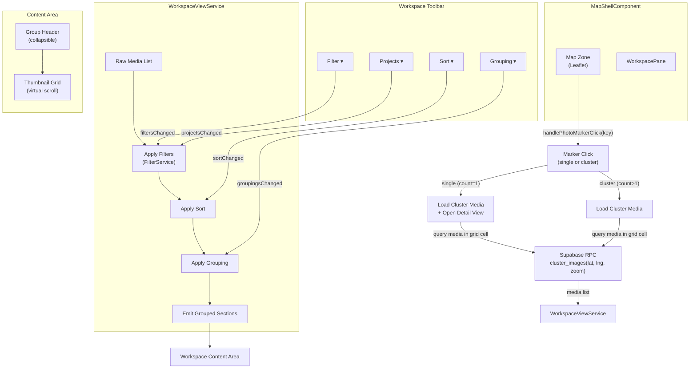
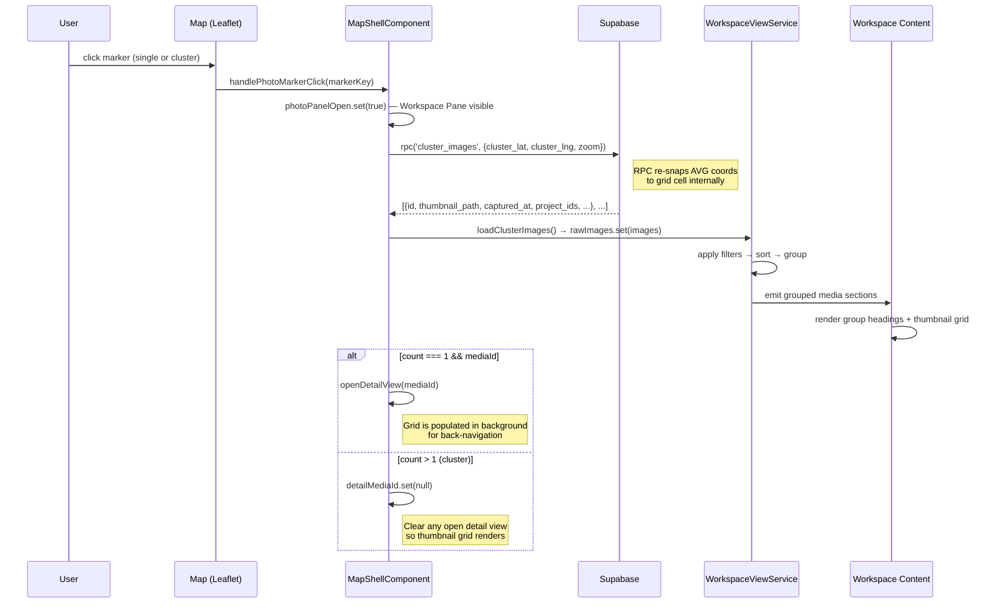
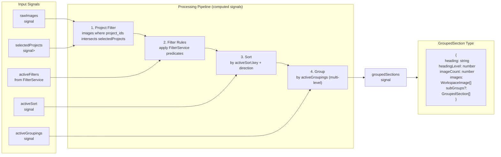
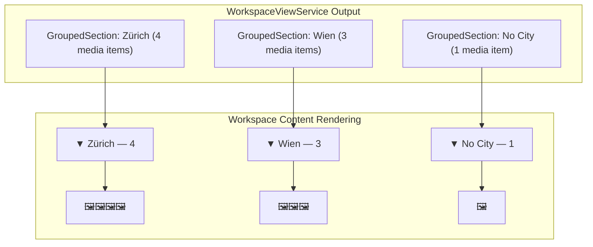
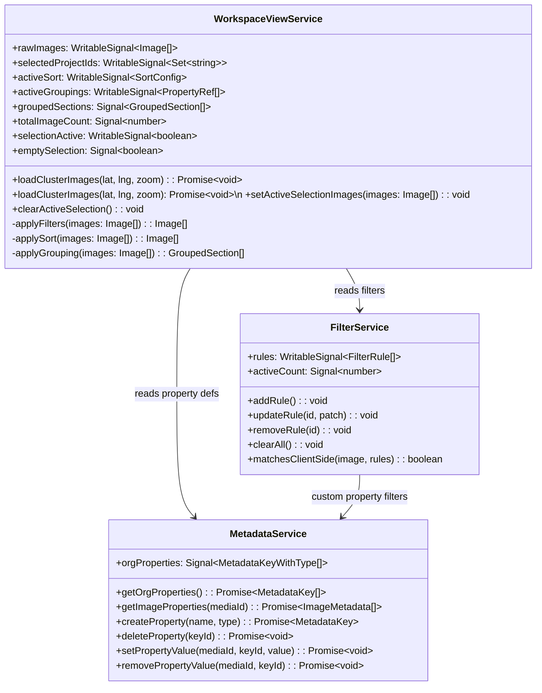
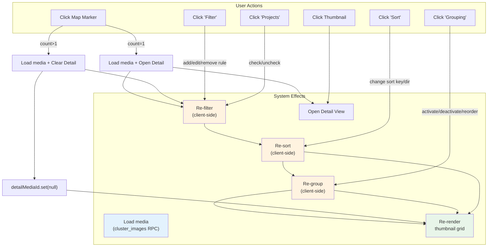

# Workspace View System — Deep Dive

> Parent overview: [workspace-view-system.md](./workspace-view-system.md)

> **Spec type:** Same as parent — system architecture / orchestration reference.

> **Diagram symbols:** In code, `photoPanelOpen` means the **Workspace Pane** is open. Prose and UX copy use **Workspace Pane**; the signal name is unchanged in `MapShellComponent`.

## 1. System Architecture



---

## 2. Cluster Click → Workspace Pane Flow

### Coordinate Mismatch (resolved)

`viewport_markers` returns `AVG(lat/lng)` for cluster positions (visually accurate), but the original `cluster_images` WHERE clause compared against grid-snapped values directly. Because `AVG(lat) ≠ ROUND(lat/cell_size)*cell_size`, the RPC returned 0 rows for every cluster click.

**Fix:** `cluster_images` now re-snaps incoming coordinates via a `snapped_input` CTE before comparing. The average position always falls within its source cell, so `ROUND(avg/cell_size)*cell_size` reliably recovers the correct grid cell.

### Solution: RPC `cluster_images`

A Supabase RPC that fetches all media rows within a specific grid cell. It takes the cluster's displayed coordinates (AVG) and zoom level, re-snaps them to the grid, and returns compatibility `image_id` plus canonical `media_item_id`.



### New RPC: `cluster_images`

```sql
CREATE OR REPLACE FUNCTION public.cluster_images(
  p_cluster_lat numeric,
  p_cluster_lng numeric,
  p_zoom integer
)
RETURNS TABLE(
  image_id uuid,
  media_item_id uuid,
  latitude numeric,
  longitude numeric,
  thumbnail_path text,
  storage_path text,
  captured_at timestamptz,
  created_at timestamptz,
  project_id uuid,
  project_name text,
  project_ids uuid[],
  project_names text[],
  direction numeric,
  exif_latitude numeric,
  exif_longitude numeric,
  address_label text,
  city text,
  district text,
  street text,
  country text,
  user_name text
)
AS $$
  SELECT
    COALESCE(m.source_image_id, m.id) AS image_id,
    m.id AS media_item_id,
    m.latitude,
    m.longitude,
    m.thumbnail_path,
    m.storage_path,
    m.captured_at,
    m.created_at,
    mp.project_ids[1] AS project_id,
    mp.project_names[1] AS project_name,
    COALESCE(mp.project_ids, '{}'::uuid[]) AS project_ids,
    COALESCE(mp.project_names, '{}'::text[]) AS project_names,
    NULL::numeric AS direction,
    m.exif_latitude,
    m.exif_longitude,
    m.address_label,
    m.city,
    m.district,
    m.street,
    m.country,
    pr.full_name AS user_name
  FROM public.media_items m
  LEFT JOIN LATERAL (
    SELECT
      array_agg(p.id ORDER BY p.name) AS project_ids,
      array_agg(p.name ORDER BY p.name) AS project_names
    FROM public.media_projects mp
    JOIN public.projects p ON p.id = mp.project_id
    WHERE mp.media_item_id = m.id
  ) mp ON TRUE
  LEFT JOIN public.profiles pr ON pr.id = m.created_by
  WHERE m.organization_id = public.user_org_id();
$$ LANGUAGE sql STABLE SECURITY DEFINER;
```

---

## 3. WorkspaceViewService — Data Pipeline



### Key Design Decisions

1. **Signals, not RxJS**: The entire pipeline uses Angular computed signals. When any input changes, the pipeline re-evaluates. This is efficient because Angular only recomputes what changed.

2. **Client-side grouping, not server-side**: Media items are loaded once (from cluster query or viewport query), then grouped/sorted/filtered in-memory. This avoids redundant server round-trips when the user drags properties up/down in the Grouping dropdown.

3. **Group headings are virtual**: They're data structures, not DOM elements. The thumbnail grid uses virtual scrolling and renders headings as part of the scroll stream.

---

## 4. Grouped Content Rendering



### Group Header Component

```
GroupHeader                                ← sticky within scroll container
├── CollapseToggle (▼/▶)                   ← rotates 90° on collapse
├── GroupName                              ← e.g., "Zürich"
├── ImageCount                             ← e.g., "4 media items", --text-caption
└── .ui-spacer
```

- Group headers are **sticky** (`position: sticky; top: 0`) within the virtual scroll container
- Collapsible: clicking the header toggles visibility of the thumbnail grid below
- Multi-level grouping creates nested indentation (level 2 → `padding-left: 1.5rem`)

---

## 5. Service Architecture



---

## 6. Complete Interaction Map



---

## 7. File Map (all new files across features)

| File                                                                   | Purpose                             | Spec                 |
| ---------------------------------------------------------------------- | ----------------------------------- | -------------------- |
| `features/map/workspace-pane/workspace-toolbar.component.ts/html/scss` | Toolbar with 4 buttons              | workspace-toolbar.md |
| `features/map/workspace-pane/grouping-dropdown.component.ts/html/scss` | Grouping dropdown with drag-reorder | grouping-dropdown.md |
| `features/map/workspace-pane/sort-dropdown.component.ts/html/scss`     | Sort dropdown with search           | sort-dropdown.md     |
| `features/map/workspace-pane/filter-dropdown.component.ts/html/scss`   | Notion-style filter builder         | filter-dropdown.md   |
| `features/map/workspace-pane/filter-rule-row.component.ts`             | Single filter rule row              | filter-dropdown.md   |
| `features/map/workspace-pane/projects-dropdown.component.ts/html/scss` | Projects checklist dropdown         | projects-dropdown.md |
| `features/map/workspace-pane/group-header.component.ts`                | Collapsible group heading           | (this doc)           |
| `features/map/workspace-pane/property-picker.component.ts`             | Floating property picker            | docs/specs/service/metadata/metadata-service.md  |
| `features/settings/property-manager/property-manager.component.*`      | Settings page property CRUD         | docs/specs/service/metadata/metadata-service.md  |
| `core/workspace-view.service.ts`                                       | Media pipeline: filter→sort→group   | (this doc)           |
| `core/filter.service.ts`                                               | Filter rule state + query building  | filter-dropdown.md   |
| `core/metadata.service.ts`                                             | Property CRUD + value management    | docs/specs/service/metadata/metadata-service.md  |
| `supabase/migrations/XXXXX_cluster_images_rpc.sql`                     | New RPC for cluster media loading   | (this doc)           |
| `supabase/migrations/XXXXX_metadata_key_types.sql`                     | value_type + chip_options columns   | docs/specs/service/metadata/metadata-service.md  |

---

## 8. Implementation Priority

```mermaid
gantt
    title Implementation Order
    dateFormat  X
    axisFormat %s

    section Foundation
    cluster_images RPC                :crit, a1, 0, 1
    WorkspaceViewService              :crit, a2, 1, 2
    MetadataService                   :a3, 1, 2
    FilterService                     :a4, 1, 2

    section Workspace Pane
    Cluster click → load media        :crit, b1, 2, 3
    WorkspaceToolbar (4 buttons)      :b2, 2, 3
    ThumbnailGrid + ThumbnailCard     :b3, 3, 4
    GroupHeader (collapsible)          :b4, 4, 5

    section Dropdowns
    Sort Dropdown                     :c1, 3, 4
    Projects Dropdown                 :c2, 3, 4
    Grouping Dropdown (drag-reorder) :c3, 4, 5
    Filter Dropdown (Notion-style)    :c4, 5, 6

    section Properties
    DB migration (value_type + chip_options)  :d1, 5, 6
    Property Manager (Settings)        :d2, 6, 7
    Property Picker (Detail View)      :d3, 6, 7
```



### Phase 1 — Foundation (critical path)

1. `cluster_images` RPC migration
2. `WorkspaceViewService`, `FilterService`, `MetadataService`
3. Wire cluster click → load media → display in workspace

### Phase 2 — Workspace Pane

4. `WorkspaceToolbar` with 4 buttons
5. `ThumbnailGrid` + `ThumbnailCard` components
6. `GroupHeader` component

### Phase 3 — Dropdowns

7. `SortDropdown` (simplest)
8. `ProjectsDropdown` (checklist)
9. `GroupingDropdown` (drag-reorder, most complex dropdown)
10. `FilterDropdown` (Notion-style rules, most complex feature)

### Phase 4 — Custom Properties

11. DB migration for `value_type` + `chip_options`
12. `PropertyManager` in Settings page
13. `PropertyPicker` in Media Detail View
