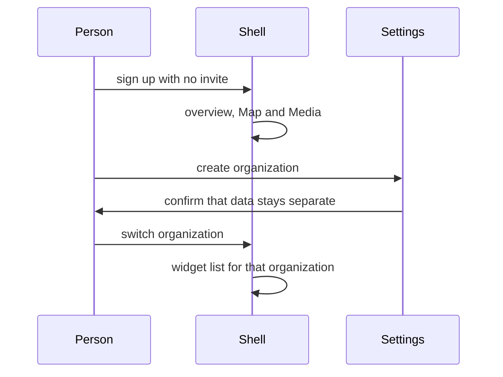
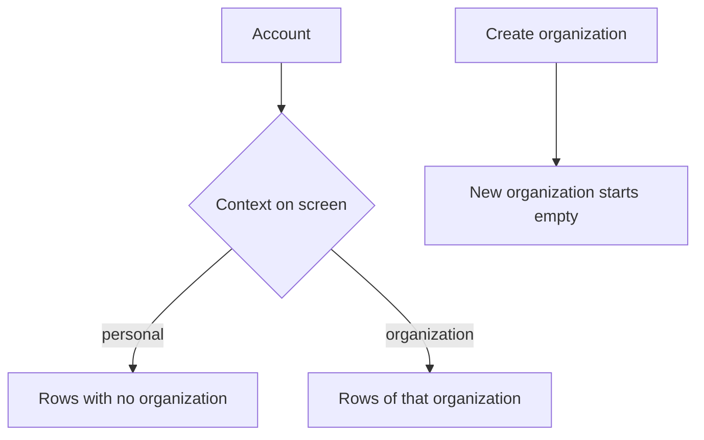

# Account context

## What It Is

An account is one person. An organization is optional. The canvas shows an overview when no organization is on screen. This spec does not change the database yet.

## What It Looks Like

A self-employed person sees the overview and Map and Media. “Create an organization” and “enter an invite” are available and not required. Creating an organization asks the person to confirm that the new organization’s data is separate. A shell control switches organization without logging out, in the same way Slack does. Colleagues appears only when an organization is on screen.

## Where It Lives

Signup is `handle_new_user()` in `supabase/migrations/20260616085726_invite_signups_display_name.sql`. It rejects a missing invite and writes one `profiles.organization_id`. That column is `not null`. The overview and the switcher do not exist yet. Widget settings will hold “create new organization” when that screen is built.

## Actions

| # | Situation | Rule |
| --- | --- | --- |
| 1 | Signup with no invite | Create the account and the profile. No organization is attached. |
| 2 | No organization on screen | The canvas shows an overview. Map and Media are available. Colleagues is not. |
| 3 | Create organization | The control is in the widget’s settings. The person must confirm that existing data stays where it is and the new organization starts separate. |
| 4 | Invite | The account joins that organization. |
| 5 | Switch organization | A shell control. No logout. The widget list is the one for the organization now on screen. |
| 6 | Lone account again | The switcher can return to the personal context. Personal rows are visible. Organization rows are not. |

Files is not a widget and not a page to add. Media already covers that job. Renaming Media is not decided. Do not delete `docs/specs/page/files-page.md` in this step. Media folder code still cites it.

## Component Hierarchy

```text
Account
  personal context          no organization on screen
  organization context      one organization selected
    shell switcher          changes context, does not copy rows
    widget settings         create organization, with the separation confirm
```



## Data

`user_org_id()` returns one uuid today, from `profiles.organization_id`. `[A]` STUDY-018. This spec requires a later migration where that helper returns the organization on screen, or no organization when the personal context is on screen.

| Context | Which rows are visible |
| --- | --- |
| Personal | Rows with no organization, owned by this account. |
| Organization | Rows of the organization now on screen, for a member. |

Creating an organization does not copy or move personal rows. The new organization starts empty of that person’s existing data. An invite does not pull personal rows into the organization.



## State

| Name | Meaning |
| --- | --- |
| personal | No organization is on screen. |
| organization | One organization is on screen. |
| confirm-separate | The create control is waiting for the separation confirm. |

## File Map

| File | Purpose |
| --- | --- |
| `docs/specs/system/account-context.md` | This contract. |
| `supabase/migrations/20260616085726_invite_signups_display_name.sql` | Current trigger. Not changed here. |
| `docs/specs/page/files-page.md` | Still cited by Media folder code. Not a product app. |

## Wiring

No client call and no migration ship with this file. The next change is the migration that lets a profile exist with no organization, and RLS that matches the table above. `20260924120000_widget_install.sql` assumes every profile has one organization. Do not add columns to those tables in that migration.

## Acceptance Criteria

- [ ] Signup with no invite creates a profile and no organization.
- [ ] The personal context shows the overview, Map, and Media, and does not show Colleagues.
- [ ] Create organization requires the separation confirm, then the new organization has none of the personal rows.
- [ ] The switcher changes context without logout.
- [ ] An invite joins the organization and does not move personal rows.
- [ ] No Files route is added. Media is not renamed in this spec.
