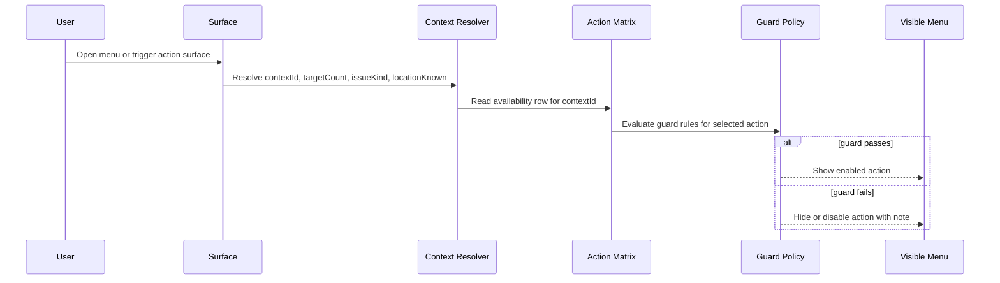

# Action Context Matrix

> **Related specs:** [upload-panel](component/upload-panel.md), [map-secondary-click-system](map-secondary-click-system.md), [workspace-actions-bar](workspace/workspace-actions-bar.md), [media-detail-actions](media-detail-actions.md), [upload-manager-pipeline](upload-manager-pipeline.md)

## What It Is

The Action Context Matrix is the canonical cross-surface contract for which actions exist in which UI context.
It prevents drift between map, media detail, workspace, and upload menus by giving every action a single availability table.

## What It Looks Like

The matrix is read column-first by context ID. Each row is one action, and each cell records whether the action is available, guarded, or blocked in that context.
Context-specific guards are written directly in the table so the contract stays testable: upload-only gates, count guards, batch policies, target-resolution rules, and device capability checks are visible in one place.
The visual shell is still the shared dropdown/action-sheet shell, but section order is driven by this matrix rather than local menu code.

## Where It Lives

- **Docs location**: `docs/element-specs/action-context-matrix.md`
- **Used by**: map menus, media detail menus, workspace thumbnail actions, workspace footer actions, upload row menus, and `/media` page actions
- **Trigger**: Any feature work that adds, removes, renames, or reorders actions

## Actions & Interactions

| #   | User Action                            | System Response                                                                       | Trigger              |
| --- | -------------------------------------- | ------------------------------------------------------------------------------------- | -------------------- |
| 1   | Adds a new action to any surfaced menu | The action must be placed into the matrix before implementation work starts           | Spec update workflow |
| 2   | Moves an action between contexts       | The matrix decides whether the action is kept, adapted, or blocked in the new context | Context migration    |
| 3   | Introduces a guarded batch action      | The matrix records the batch policy, count guard, or target-resolution rule           | Safety contract      |
| 4   | Adds an upload issue prompt action     | The matrix keeps it upload-internal unless a consumer spec explicitly reuses it       | Upload issue routing |

### Canonical Context Definitions

| Context ID          | Description                                                 |
| ------------------- | ----------------------------------------------------------- |
| `map_single`        | Right-click / long-press on a single marker                 |
| `map_cluster`       | Right-click / long-press on a marker cluster                |
| `map_point`         | Right-click on empty map surface                            |
| `media_detail`      | 3-dot menu in the open Media Detail View                    |
| `ws_grid_thumbnail` | Tap / right-click on a thumbnail in the Workspace Pane grid |
| `ws_footer_single`  | Footer toolbar for a single selection in Workspace          |
| `ws_footer_multi`   | Footer toolbar for a multi-selection in Workspace           |
| `upload_row`        | 3-dot menu in the Upload Panel row                          |
| `media_page`        | Actions in the `/media` library view                        |

### Action Matrix

Legend: `✅` available, `⚠️` available with guard or policy, `—` not available.

| Action ID                   | map_single | map_cluster      | map_point | media_detail | ws_grid_thumbnail | ws_footer_single | ws_footer_multi       | upload_row                  | media_page      | Notes                                                                       |
| --------------------------- | ---------- | ---------------- | --------- | ------------ | ----------------- | ---------------- | --------------------- | --------------------------- | --------------- | --------------------------------------------------------------------------- |
| `open_details_or_selection` | ✅         | ✅               | —         | —            | ✅                | —                | —                     | ✅ (after upload)           | —               | Upload row only after upload; cluster opens selection                       |
| `open_in_media`             | ✅         | —                | —         | ✅           | ✅                | —                | —                     | ✅ (after upload)           | ✅              | Opens /media focus or selection target                                      |
| `create_marker_here`        | —          | —                | ✅        | —            | —                 | —                | —                     | —                           | —               | Empty-map creation only                                                     |
| `zoom_house`                | ✅         | ✅               | —         | ✅           | ✅                | ✅               | —                     | ✅ (if location exists)     | ✅              | Single and cluster zoom; upload row only when a location exists             |
| `zoom_street`               | ✅         | ✅               | —         | ✅           | ✅                | ✅               | —                     | ✅ (if location exists)     | ✅              | Same availability as `zoom_house`                                           |
| `copy_address`              | ✅         | ✅               | —         | ✅           | —                 | ✅               | ⚠️ target rule needed | —                           | ✅              | Footer multi needs deterministic target policy                              |
| `copy_gps`                  | ✅         | ✅               | —         | ✅           | —                 | ✅               | ⚠️ target rule needed | —                           | ✅              | Same availability as `copy_address`                                         |
| `open_google_maps`          | ✅         | ✅               | —         | ✅           | —                 | ✅               | —                     | ✅ (if location exists)     | ✅              | No meaningful link for dispersed footer-multi points                        |
| `assign_to_project`         | ✅         | ✅ (count guard) | ✅        | ✅           | ✅                | ✅               | ✅ (count guard)      | ✅                          | ✅              | All contexts; cluster and footer-multi require count guard                  |
| `change_location_map`       | ✅         | ⚠️ batch policy  | —         | ✅           | —                 | ✅               | —                     | ✅                          | ✅              | Workspace multi uses batch policy only through explicit bulk flows          |
| `change_location_address`   | ✅         | ⚠️ batch policy  | —         | ✅           | —                 | ✅               | ⚠️ batch UI           | ✅                          | ✅              | Footer multi uses a bulk editor UI                                          |
| `remove_from_project`       | ✅         | ✅               | —         | ✅           | ✅                | ✅               | ✅                    | ✅                          | ✅              | All contexts except `map_point`; cluster and multi need target resolution   |
| `delete_media`              | ✅         | ✅ (count guard) | —         | ✅           | ✅                | ✅               | ✅ (count guard)      | ✅                          | ✅              | All contexts except `map_point`; cluster and multi need count guard         |
| `download`                  | ✅         | ✅ (ZIP)         | —         | ✅           | ✅                | ✅               | ✅ (ZIP)              | ✅ (after upload)           | ✅              | Multi-target contexts resolve to ZIP behavior; upload row only after upload |
| `share_link`                | ✅         | ✅               | —         | ✅           | ✅                | ✅               | ✅                    | ✅ (after upload)           | ✅              | Not available before upload in upload row                                   |
| `copy_link`                 | ✅         | ✅               | —         | ✅           | ✅                | ✅               | ✅                    | ✅ (after upload)           | ✅              | Same availability as `share_link`                                           |
| `native_share`              | ✅         | ✅               | —         | ✅           | ✅                | ✅               | ✅                    | ✅ (after upload)           | ✅              | Supported devices only                                                      |
| `download_zip`              | —          | ✅               | —         | —            | —                 | —                | ✅                    | —                           | ✅ (multi only) | Explicit bulk-download action                                               |
| `select_all`                | —          | —                | —         | —            | —                 | ✅               | —                     | —                           | ✅              | Selection-control only                                                      |
| `select_none`               | —          | —                | —         | —            | —                 | ✅               | —                     | —                           | ✅              | Selection-control only                                                      |
| `candidate_select`          | —          | —                | —         | —            | —                 | —                | —                     | ✅ (address_ambiguous only) | —               | Upload-internal prompt action                                               |
| `manual_location_entry`     | —          | —                | —         | —            | —                 | —                | —                     | ✅ (address_ambiguous only) | —               | Upload-internal prompt action                                               |
| `cancel_location_prompt`    | —          | —                | —         | —            | —                 | —                | —                     | ✅ (address_ambiguous only) | —               | Upload-internal prompt action                                               |

### Action Decision Ledger (Pro/Contra + Use)

This ledger is mandatory for migration reviews and answers why an action is kept or blocked in each context family.
Use-policy is normative and must stay aligned with the matrix above.

| Action ID                   | Contexts in use                                                                                                                                             | Pro (context-specific)                                                  | Contra (context-specific)                                           | Use policy                                                                |
| --------------------------- | ----------------------------------------------------------------------------------------------------------------------------------------------------------- | ----------------------------------------------------------------------- | ------------------------------------------------------------------- | ------------------------------------------------------------------------- |
| `open_details_or_selection` | `map_single`, `map_cluster`, `ws_grid_thumbnail`, `upload_row(after upload)`                                                                                | Fast drill-in from dense surfaces; cluster flow reduces map click count | Adds mode-switch complexity if triggered from upload rows too early | Use exactly where matrix is `✅`; upload-row only after upload completion |
| `open_in_media`             | `map_single`, `media_detail`, `ws_grid_thumbnail`, `upload_row(after upload)`, `media_page`                                                                 | Unifies deep-link path to `/media`; preserves user orientation          | Duplicate affordance risk with detail-open action                   | Use in all allowed contexts; keep one canonical navigation target         |
| `create_marker_here`        | `map_point`                                                                                                                                                 | Enables intentional map-first creation flow                             | Dangerous in non-map contexts; no valid spatial anchor elsewhere    | Use only in `map_point`; blocked everywhere else                          |
| `zoom_house`                | `map_single`, `map_cluster`, `media_detail`, `ws_grid_thumbnail`, `ws_footer_single`, `upload_row(if location)`, `media_page`                               | Strong geo-navigation shortcut from any location-aware surface          | Misleading when location missing or ambiguous                       | Use where location is deterministic; enforce `locationKnown` guard        |
| `zoom_street`               | `map_single`, `map_cluster`, `media_detail`, `ws_grid_thumbnail`, `ws_footer_single`, `upload_row(if location)`, `media_page`                               | Predictable medium-distance zoom level for context inspection           | Same ambiguity risk as `zoom_house` without validated location      | Use with same guards as `zoom_house`                                      |
| `copy_address`              | `map_single`, `map_cluster`, `media_detail`, `ws_footer_single`, `ws_footer_multi(guarded)`, `media_page`                                                   | Fast export to external workflows (chat, PM tools, reports)             | Multi-target contexts need deterministic target rule                | Use where matrix allows; multi-target requires explicit target policy     |
| `copy_gps`                  | `map_single`, `map_cluster`, `media_detail`, `ws_footer_single`, `ws_footer_multi(guarded)`, `media_page`                                                   | Reliable machine-readable location export                               | Same multi-target ambiguity and stale-location risks                | Use with deterministic target-selection rule in multi contexts            |
| `open_google_maps`          | `map_single`, `map_cluster`, `media_detail`, `ws_footer_single`, `upload_row(if location)`, `media_page`                                                    | External navigation handoff for field teams                             | Poor value for dispersed multi-selection; broken without location   | Use in listed contexts; keep blocked for `ws_footer_multi`                |
| `assign_to_project`         | all except non-actionable map empty space (`map_point` uses guarded create path)                                                                            | Core organizational action across map/workspace/media/upload flows      | Bulk assignment can cause accidental large changes                  | Use broadly with count guards and explicit confirmation in bulk paths     |
| `change_location_map`       | `map_single`, `map_cluster(guarded)`, `media_detail`, `ws_footer_single`, `upload_row`, `media_page`                                                        | Accurate visual correction path for geodata                             | Batch edits are risky without clear preview/undo semantics          | Use where matrix allows; cluster/bulk requires batch policy               |
| `change_location_address`   | `map_single`, `map_cluster(guarded)`, `media_detail`, `ws_footer_single`, `ws_footer_multi(guarded)`, `upload_row`, `media_page`                            | Efficient textual correction flow for non-map operators                 | Ambiguous geocoding in bulk operations                              | Use with deterministic batch UI + policy in guarded contexts              |
| `remove_from_project`       | `map_single`, `map_cluster`, `media_detail`, `ws_grid_thumbnail`, `ws_footer_single`, `ws_footer_multi`, `upload_row`, `media_page`                         | Safe reversible de-association without deleting media                   | Risk of unintended bulk detach in multi contexts                    | Use where allowed; keep target-resolution + bulk confirmation             |
| `delete_media`              | `map_single`, `map_cluster(guarded)`, `media_detail`, `ws_grid_thumbnail`, `ws_footer_single`, `ws_footer_multi(guarded)`, `upload_row`, `media_page`       | Necessary terminal cleanup action                                       | Highest destructive risk, especially in cluster/multi               | Use with strongest guard set (count guard + confirmation)                 |
| `download`                  | `map_single`, `map_cluster(ZIP)`, `media_detail`, `ws_grid_thumbnail`, `ws_footer_single`, `ws_footer_multi(ZIP)`, `upload_row(after upload)`, `media_page` | Universal export capability                                             | Mixed single vs ZIP semantics can confuse users                     | Use everywhere allowed; explicitly label ZIP behavior in multi contexts   |
| `share_link`                | `map_single`, `map_cluster`, `media_detail`, `ws_grid_thumbnail`, `ws_footer_single`, `ws_footer_multi`, `upload_row(after upload)`, `media_page`           | Fast collaboration flow with minimal friction                           | Invalid before upload or when permissions/signed URLs unavailable   | Use after availability checks; upload-row only post-upload                |
| `copy_link`                 | `map_single`, `map_cluster`, `media_detail`, `ws_grid_thumbnail`, `ws_footer_single`, `ws_footer_multi`, `upload_row(after upload)`, `media_page`           | Deterministic clipboard fallback when native share is absent            | Same readiness constraints as `share_link`                          | Use with same readiness guard as `share_link`                             |
| `native_share`              | `map_single`, `map_cluster`, `media_detail`, `ws_grid_thumbnail`, `ws_footer_single`, `ws_footer_multi`, `upload_row(after upload)`, `media_page`           | Best UX on supported devices                                            | Platform variability and capability fragmentation                   | Use only when `nativeShareSupported`; always provide fallback action      |
| `download_zip`              | `map_cluster`, `ws_footer_multi`, `media_page(multi)`                                                                                                       | Explicit bulk export intent reduces ambiguity                           | Can duplicate generic `download` mental model                       | Keep as explicit bulk action in multi contexts only                       |
| `select_all`                | `ws_footer_single`, `media_page`                                                                                                                            | Improves throughput for large review sets                               | Risk of accidental mass operations                                  | Use only on explicit selection surfaces with visible count feedback       |
| `select_none`               | `ws_footer_single`, `media_page`                                                                                                                            | Fast recovery from accidental broad selection                           | Could hide user intent if feedback is weak                          | Use only with immediate visible selection-state update                    |
| `candidate_select`          | `upload_row(address_ambiguous only)`                                                                                                                        | Precise human resolution for ambiguous address candidates               | Not meaningful outside upload triage lifecycle                      | Keep upload-internal only                                                 |
| `manual_location_entry`     | `upload_row(address_ambiguous only)`                                                                                                                        | Guarantees a manual fallback path when parsing/geocoding fails          | Slower and error-prone if overused                                  | Keep upload-internal only                                                 |
| `cancel_location_prompt`    | `upload_row(address_ambiguous only)`                                                                                                                        | Lets user defer a difficult decision without data loss                  | Can leave unresolved backlog if overused                            | Keep upload-internal only with unresolved-state tracking                  |

### Upload-Only / Upload-Internal Actions

These actions stay inside upload issue handling unless a consumer spec explicitly documents otherwise.

| Action ID             | Upload scope               | Reason                  |
| --------------------- | -------------------------- | ----------------------- |
| `view_file_details`   | Uploading rows only        | Lifecycle inspection    |
| `cancel_upload`       | Uploading rows only        | Lifecycle cancellation  |
| `open_existing_media` | Duplicate-photo issue only | Duplicate review path   |
| `upload_anyway`       | Duplicate-photo issue only | Duplicate override path |
| `retry`               | Upload issues only         | Pipeline retry          |
| `dismiss`             | Upload issues only         | Terminal triage         |

## Component Hierarchy

```text
ActionContextMatrixSpec
├── Context registry
│   ├── map_single
│   ├── map_cluster
│   ├── map_point
│   ├── media_detail
│   ├── ws_grid_thumbnail
│   ├── ws_footer_single
│   ├── ws_footer_multi
│   ├── upload_row
│   └── media_page
├── Action registry
├── Guard registry
└── Consumer specs
    ├── upload-panel
    ├── map-secondary-click-system
    ├── media-detail-actions
    ├── workspace-actions-bar
    └── upload-manager-pipeline
```

## Data

### Context Resolution Pipeline

```mermaid
flowchart TD
  A[User gesture] --> B[Resolve surface context]
  B --> C{Context ID}
  C -->|map_single| D[Marker target]
  C -->|map_cluster| E[Cluster target]
  C -->|map_point| F[Empty-map target]
  C -->|media_detail| G[Open detail view]
  C -->|ws_grid_thumbnail| H[Workspace thumbnail target]
  C -->|ws_footer_single| I[Single selection target]
  C -->|ws_footer_multi| J[Multi selection target]
  C -->|upload_row| K[Upload row target]
  C -->|media_page| L[/media library target]
  D --> M[Evaluate action row]
  E --> M
  F --> M
  G --> M
  H --> M
  I --> M
  J --> M
  K --> M
  L --> M
  M --> N{Guard satisfied?}
  N -->|yes| O[Action is visible and enabled]
  N -->|no| P[Action is hidden or disabled]
```

| Field                  | Source            | Type        | Purpose                                                            |
| ---------------------- | ----------------- | ----------- | ------------------------------------------------------------------ |
| `contextId`            | resolver          | string enum | Selects the correct availability column                            |
| `issueKind`            | upload pipeline   | string enum | Narrows upload-only actions and prompts                            |
| `targetCount`          | resolver          | number      | Count guard for cluster and multi actions                          |
| `locationKnown`        | resolver          | boolean     | Controls location-dependent actions                                |
| `selectionCount`       | resolver          | number      | Controls footer and multi-selection actions                        |
| `supportedShareDevice` | device capability | boolean     | Enables native share only on supported devices                     |
| `afterUpload`          | upload state      | boolean     | Prevents pre-upload row actions from leaking into upload row menus |
| `addressSource`        | upload pipeline   | string enum | Records file vs folder vs country precedence                       |

## State

| Name                   | TypeScript Type | Default        | What it controls                                                           |
| ---------------------- | --------------- | -------------- | -------------------------------------------------------------------------- |
| `contextId`            | context enum    | per invocation | Which availability column is read                                          |
| `issueKind`            | issue-kind enum | `null`         | Upload prompt and issue-specific action gates                              |
| `targetCount`          | `number`        | `0`            | Count guards and batch policies                                            |
| `selectionCount`       | `number`        | `0`            | Selection-driven footer and page actions                                   |
| `locationKnown`        | `boolean`       | `false`        | Location-dependent actions such as zoom, maps, and download fallback rules |
| `afterUpload`          | `boolean`       | `false`        | Upload row visibility for post-upload actions                              |
| `nativeShareSupported` | `boolean`       | `false`        | Native share eligibility                                                   |

## File Map

| File                                                           | Purpose                                                                     |
| -------------------------------------------------------------- | --------------------------------------------------------------------------- |
| `docs/element-specs/action-context-matrix.md`                  | Canonical cross-context action contract                                     |
| `docs/element-specs/upload-manager/upload-manager-pipeline.md` | Full upload location-resolution algorithm and upload-internal issue routing |
| `docs/element-specs/component/upload-panel.md`                           | Upload row consumer of the matrix                                           |
| `docs/element-specs/map-secondary-click-system.md`             | Map consumer of the matrix                                                  |
| `docs/element-specs/media-detail/media-detail-actions.md`      | Media detail consumer of the matrix                                         |
| `docs/element-specs/workspace/workspace-actions-bar.md`        | Workspace footer multi-selection consumer                                   |
| `docs/element-specs/media-page.md`                             | `/media` page consumer                                                      |

## Wiring

### Integration Sequence



- `upload-manager-pipeline.md` owns the full upload location-resolution algorithm, including the `file > folder > country` precedence rule.
- `address_ambiguous` stays upload-internal and does not become a map or workspace issue kind.
- `map_cluster` and `ws_footer_multi` require explicit count or batch guards for project assignment, destructive actions, and location edits.
- `media_page` and `ws_footer_multi` may expose the same action ID with different execution shape, but the matrix entry remains the same canonical contract.

### Upload Location Precedence

| Source order | Rule                     | Notes                                                                   |
| ------------ | ------------------------ | ----------------------------------------------------------------------- |
| File         | Wins first               | File-level address or title candidate overrides folder-derived hints    |
| Folder       | Wins when file is absent | Folder-derived hints are fallback only                                  |
| Country      | Last fallback            | Country-level fallback is only used when file and folder do not resolve |

### Upload-Internal Issue Kind: `address_ambiguous`

| Scope             | Actions                                                               | Notes                                     |
| ----------------- | --------------------------------------------------------------------- | ----------------------------------------- |
| `upload_row` only | `candidate_select`, `manual_location_entry`, `cancel_location_prompt` | No map, workspace, or media-page exposure |

### Upload Pipeline Reference

Use [upload-manager-pipeline](upload-manager-pipeline.md) for the full resolution algorithm, prompt order, and issue-state transitions. The matrix only decides action availability; the pipeline decides how unresolved locations become `missing_gps`, `document_unresolved`, or `address_ambiguous` flows.

## Acceptance Criteria

- [ ] All nine context IDs are present exactly as `map_single`, `map_cluster`, `map_point`, `media_detail`, `ws_grid_thumbnail`, `ws_footer_single`, `ws_footer_multi`, `upload_row`, and `media_page`.
- [ ] The action table has one column per context ID and every listed action is mapped in that table.
- [ ] `open_details_or_selection`, `open_in_media`, `zoom_house`, `zoom_street`, `copy_address`, `copy_gps`, `open_google_maps`, `assign_to_project`, `change_location_map`, `change_location_address`, `remove_from_project`, `delete_media`, `download`, `share_link`, `copy_link`, `native_share`, `download_zip`, `select_all`, `select_none`, `candidate_select`, `manual_location_entry`, and `cancel_location_prompt` are all present as action IDs.
- [ ] `address_ambiguous` is documented as upload-internal only, with exactly `candidate_select`, `manual_location_entry`, and `cancel_location_prompt`.
- [ ] `file > folder > country` is documented as the address-source precedence rule and points to [upload-manager-pipeline](upload-manager-pipeline.md).
- [ ] `map_point` excludes all actions except `create_marker_here`.
- [ ] Cluster and multi-target actions include explicit count guards, batch policies, or target-resolution rules where required.
- [ ] Multi-target download behavior is separated from the explicit `download_zip` action.
