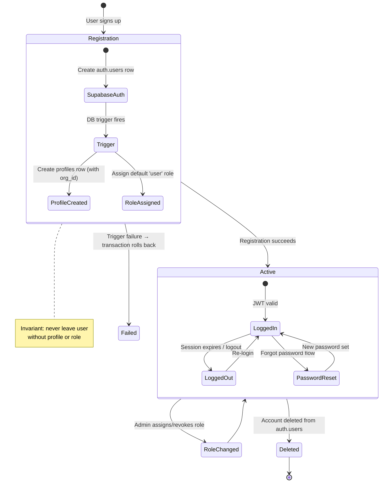
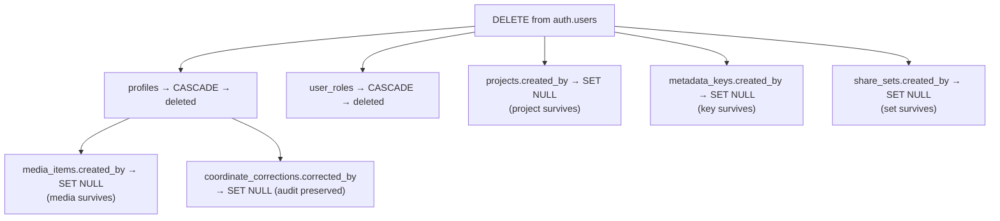

# User Lifecycle Documentation

**Who this is for:** engineers working on authentication, onboarding, and account management.  
**What you'll get:** the end-to-end flow of how users are created, authenticated, assigned roles, and deleted, and which invariants must always hold.

See also: `glossary.md`, `security-boundaries.md`, `database-schema.md`.

### User Lifecycle Overview

---

## 1. Registration Flow

1. User registers via Supabase Auth.
2. Supabase creates an entry in `auth.users`.
3. A database trigger automatically:
   - Creates a row in `profiles` with the user's `organization_id` (see below).
   - Assigns a default role (for example, `user`) via `user_roles`.

This ensures system consistency without any client-side orchestration.

### Organization Assignment

Every user must belong to exactly one organization (see D12). During MVP:

- A single organization row is seeded in the `organizations` table during setup.
- The registration trigger sets `profiles.organization_id` to that default org.
- Future: invite-link or admin-managed org assignment.

### Registration Trigger Contract

- Trigger timing: runs immediately after a new row is created in `auth.users`.
- Trigger responsibilities:
  - Create exactly one `profiles` row for the new `auth.users.id`, including `organization_id`.
  - Assign the default `user` role in `user_roles`.
- Failure behavior:
  - If profile creation or role assignment fails, registration transaction must fail.
  - The system must never leave a user without a profile or without a role.
- Operational requirement:
  - `roles` must already contain `user` before registration is allowed.
  - `organizations` must contain at least one row before registration is allowed.
- Idempotency requirement:
  - Trigger logic must avoid duplicate `profiles` / `user_roles` rows if retried.

**Invariants**

- Every `auth.users` row has exactly one `profiles` row.
- Every user has at least one role (default: `user`).
- Every profile has a non-null `organization_id`.

---

## 2. Login Flow

1. User logs in via Supabase Auth.
2. Supabase issues a JWT session token.
3. Angular stores the session (for example, in memory or local storage).
4. All database and storage requests include the JWT automatically (via Supabase client).

**Invariants**

- Only requests with a valid, unexpired JWT reach RLS-protected tables.
- Angular is not trusted for identity checks; it only forwards the token.

---

## 3. Role Assignment

Default behavior:

- All new users receive role `user`.

Admin role assignment:

- Must be performed manually via:
  - SQL, or
  - Admin interface (future extension).

**Invariants**

- Roles are defined in `roles` and linked to users via `user_roles`.
- RLS checks rely on `user_roles` and `roles` (see `security-boundaries.md`).
- Role revocation must be blocked if it would leave a user with zero roles.

---

## 4. Password Reset

1. User clicks "Forgot Password" on the login screen.
2. Angular calls `supabase.auth.resetPasswordForEmail(email, { redirectTo })`.
3. Supabase sends a reset link to the user's email.
4. User clicks the link → redirected to the app with a recovery token.
5. Angular detects `SIGNED_IN` event with `recovery` type and shows the "Set New Password" form.
6. User enters a new password → `supabase.auth.updateUser({ password })`.
7. On success: redirect to the main app; on failure: display error and allow retry.

**Invariants**

- Reset emails use Supabase's built-in email templates (configurable in Supabase dashboard).
- The `redirectTo` URL must be in the Supabase allowed redirect list.
- Password requirements follow Supabase Auth defaults (minimum 6 characters) unless overridden in config.

---

## 5. Account Deletion

### Deletion Cascade Flow

When a user is deleted from `auth.users`:

| Table                      | Behavior                                                            | Rationale                                                              |
| -------------------------- | ------------------------------------------------------------------- | ---------------------------------------------------------------------- |
| `profiles`                 | **CASCADE** — row is deleted.                                       | 1:1 with auth.users; no reason to keep.                                |
| `user_roles`               | **CASCADE** — all role entries for the user are deleted.            | Roles are meaningless without the user.                                |
| `media_items.created_by`   | **SET NULL** — media rows survive; ownership field is cleared.      | Media may be referenced by projects/share sets and must remain stable. |
| `projects.created_by`      | **SET NULL** — projects remain; `created_by` becomes null.          | Projects may be shared org resources; don't orphan or destroy them.    |
| `metadata_keys.created_by` | **SET NULL** — keys remain; `created_by` becomes null.              | Keys may be used by other users' media items.                          |
| `share_sets.created_by`    | **SET NULL** — persisted share sets remain valid.                   | Existing export links should not be invalidated by account removal.    |
| `coordinate_corrections`   | **Preserved** — audit entries remain (`corrected_by` becomes null). | Audit logs should not be deleted.                                      |

### Storage Cleanup

When media items are deleted (for example via explicit lifecycle cleanup), corresponding Storage files should also be removed. Options:

1. **Database trigger on `media_items` DELETE** — calls a Supabase Edge Function to delete the Storage object.
2. **Scheduled cleanup job** — periodically scans for Storage objects without a matching `media_items` row.

MVP uses option 2 (simpler; avoids trigger-to-HTTP coupling).

### Organization Constraint

- `profiles.organization_id` has `ON DELETE RESTRICT` on the `organizations` table.
- This means an organization cannot be deleted while it still has members.
- To delete an org: first delete or reassign all users, then delete the org.

**Invariants**

- There is no orphaned profile or role data for deleted users.
- Media ownership fields are nulled safely without deleting shared runtime media rows.
- Projects and metadata keys survive user deletion (SET NULL on `created_by`).
- Deletion is initiated only from `auth.users`; other tables do not delete users directly.
- Storage cleanup may be eventually consistent (a short delay between DB deletion and file removal is acceptable).
