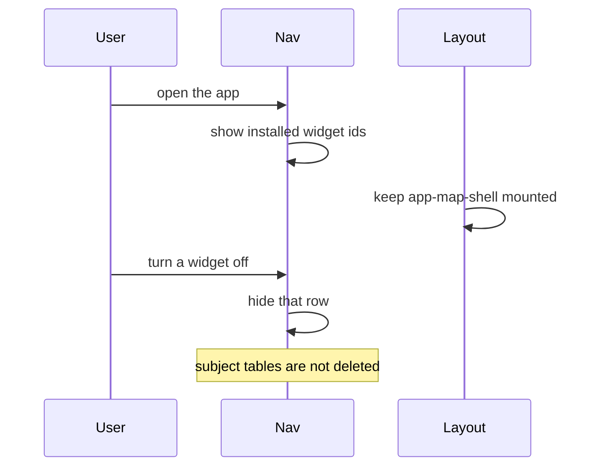
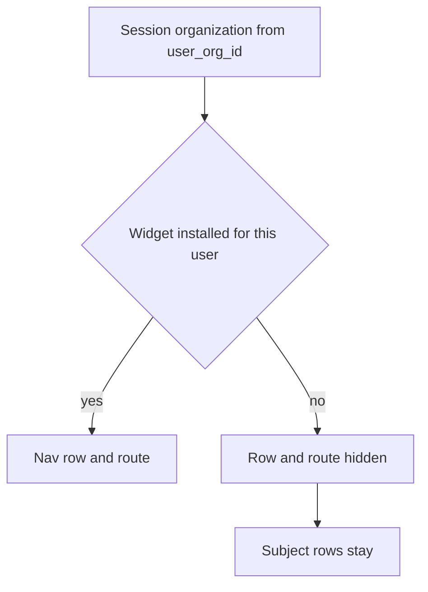

# Widget install

## What It Is

A widget is an addable app on the left nav. Install is stored per user in the organization `user_org_id()` returns. Hiding a widget does not delete subject data.

## What It Looks Like

The left nav shows the widgets installed for this user. A profile with no install rows shows Map and Media. A profile that already had Projects, Colleagues, or Organization keeps them unless that widget's `installed` value is false or the organization set `allowed` false. Settings and Account stay on the shell. The map host stays mounted.

## Where It Lives

Nav rows come from `WidgetInstallService.installedIds`. The catalog of ids is `map`, `media`, `projects`, `colleagues`, `organization`. Chat stays on `/colleagues` until a later page spec. `/`, `/map`, `/media`, `/projects`, `/colleagues`, and `/organization` are the link names. Opening one does not write an install row. `handle_new_user()` is unchanged.

## Actions

| # | Situation | Rule |
| --- | --- | --- |
| 1 | New signup, no widgets added yet | Map and Media are installed. Projects, Colleagues, Organization, and Chat are not, until the person adds them or an invite or an organization push turns them on. |
| 2 | Person already uses Projects, Colleagues, or Organization on the day this ships | Those stay installed. They come off only when the organization turned them off. |
| 3 | User turns a widget off | The nav row and the route hide. Subject rows stay. The UI must not say the data is gone. |
| 4 | Organization saves preinstall again | A user who turned that widget off stays off. |
| 5 | Organization pushes a widget to all users | That push turns it on, including for users who had turned it off. |
| 6 | Organization locks a preinstalled widget | The user cannot turn it off. |
| 7 | Organization does not allow a widget | The user cannot install it. |
| 8 | Shared link | The path is the widget name. Opening it does not write `user_widget_installs`. It does not bypass RLS. |
| 9 | Map is not the active route | `app-map-shell` stays mounted. |
| 10 | Signup | `handle_new_user()` does not write install rows. No rows means Map and Media. |

Widget ids: `map`, `media`, `projects`, `colleagues`, `organization`. Files is not a product app. Media covers that job. Renaming Media is not decided. `chat` is not a separate id in this change.

## Component Hierarchy

```text
Authenticated app layout
  app-nav                         left nav. Reads installs only after a later phase.
  app-upload-shell                present when Media is installed. Still mounted today.
  app-map-shell                   stays mounted. Hidden when the route is not map.
  router-outlet                   page for the active shell
```



## Data

Two tables. Both are scoped by `organization_id = user_org_id()`. `user_org_id()` is unchanged.

| Table | Columns | Who writes |
| --- | --- | --- |
| `organization_widget_policies` | `widget_id`, `allowed`, `preinstalled`, `locked` | `has_permission('org.settings.edit')` |
| `user_widget_installs` | `widget_id`, `installed` | The user, through `set_own_widget_installed`. Push uses `push_organization_widget`. |

`locked` requires `preinstalled` and `allowed`. Push sets `installed` true for every profile in the organization. Saving `preinstalled` does not. Uninstall does not delete `locations`, `media_item_location_links`, `media_items`, chat rows, `projects`, or `media_projects`.

Several organizations per email are not in these tables.



## State

| Name | Meaning | Default for a new signup |
| --- | --- | --- |
| installed | Nav row and route are available | `map`, `media` |
| off | User turned it off. Preinstall does not turn it back on | not set |
| locked | User cannot turn a preinstalled widget off | not set |
| temporary | Open from a shared link until logout | not a stored install |

Chat stays on the colleagues route. This spec does not add a `chat` widget id.

## File Map

| File | Purpose |
| --- | --- |
| `docs/specs/system/widget-install.md` | This contract. |
| `supabase/migrations/20260924120000_widget_install.sql` | Tables, RLS, backfill, push, and own-install function. |
| `apps/web/src/app/core/widget-install/` | Read model and `effectiveWidgetIds`. |
| `apps/web/src/app/features/nav/nav.component.ts` | Renders `installedIds`. |

## Wiring

The nav calls `WidgetInstallService`, which calls `SupabaseService`. A failed read keeps the five current apps so a database without this migration does not go blank. A successful read with no user rows shows Map and Media.

Permission key: `org.settings.edit`. Tables: `organization_widget_policies` and `user_widget_installs`. Link name: the existing path. Colleagues keeps chat. Membership stays one `profiles.organization_id`.

## Acceptance Criteria

- [ ] A profile with no `user_widget_installs` rows resolves to Map and Media.
- [ ] The backfill inserts `installed = true` for existing profiles for all five ids.
- [ ] `set_own_widget_installed` does not delete subject tables.
- [ ] `push_organization_widget` sets `installed` true. Updating `preinstalled` does not.
- [ ] A widget with `allowed = false` is not in `effectiveWidgetIds`.
- [ ] `authenticated-app-layout.component.html` still contains `app-map-shell`.
- [ ] `handle_new_user()` is not in `20260924120000_widget_install.sql`.
- [ ] `effectiveWidgetIds` tests cover the rows above.
