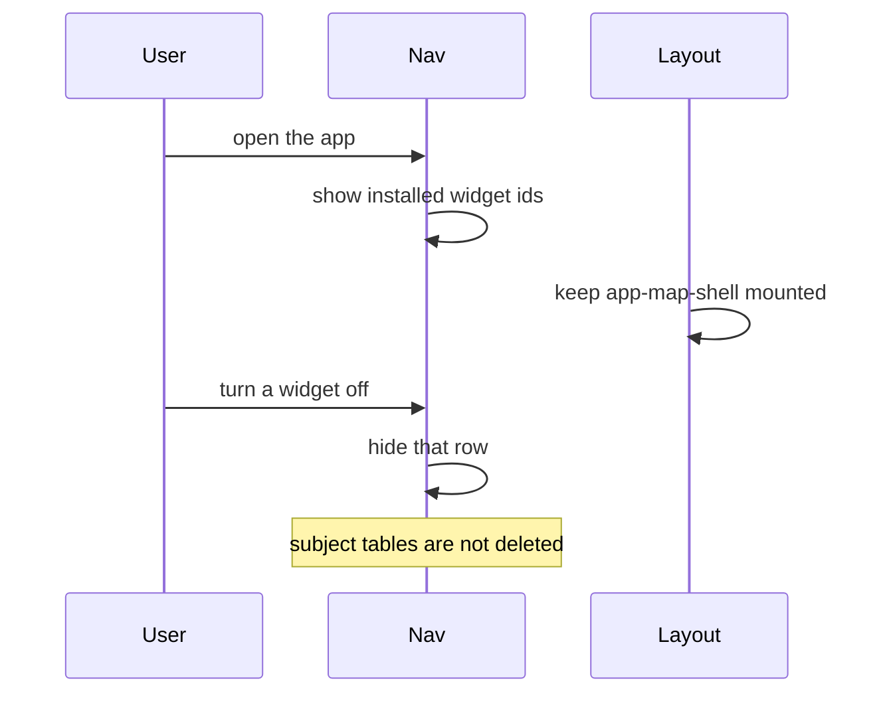
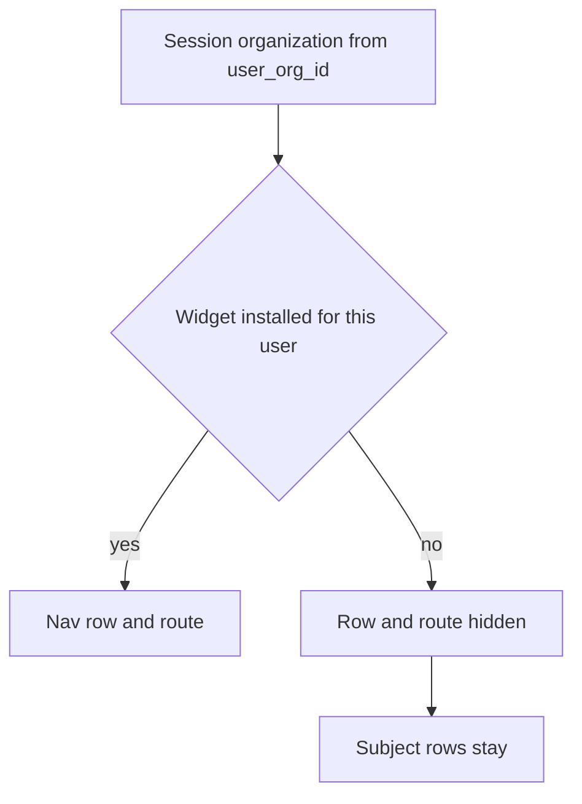

# Widget install

## What It Is

A widget is an addable app on the left nav. This spec says who has one installed, and what hiding it must not delete. It does not name tables and it does not change signup or the map mount.

## What It Looks Like

The left nav shows the widgets installed for the user in the organization they have entered. A new signup shows Map and Media. Someone who already uses Projects, Colleagues, or Organization keeps those rows unless that organization turned them off. Settings and Account stay on the shell. Upload is present when Media is present. The right side is not an install list.

## Where It Lives

Nav rows are built today from the fixed array in `apps/web/src/app/features/nav/nav.component.ts`. This spec does not replace that array. The layout still mounts `app-map-shell` and `app-upload-shell` on every authenticated route (`authenticated-app-layout.component.html`).

## Actions

| # | Situation | Rule |
| --- | --- | --- |
| 1 | New signup, no widgets added yet | Map and Media are installed. Projects, Colleagues, Organization, and Chat are not, until the person adds them or an invite or an organization push turns them on. |
| 2 | Person already uses Projects, Colleagues, or Organization on the day this ships | Those stay installed. They come off only when the organization turned them off. |
| 3 | User turns a widget off | The nav row and the route hide. Subject rows stay. The UI must not say the data is gone. |
| 4 | Organization saves preinstall again | A user who turned that widget off stays off. |
| 5 | Organization pushes a widget to all users | That push turns it on, including for users who had turned it off. |
| 6 | Organization locks a preinstalled widget | The user cannot turn it off. |
| 7 | Organization does not allow a widget | The user cannot install it. |
| 8 | Shared link to an app the user has not installed | Opens until logout. Not a durable install. Does not bypass RLS. How the link names the app is not specified. Do not build this until it is. |
| 9 | Map is not the active route | The map host stays mounted and may be hidden. Do not destroy `app-map-shell` in the install change. |
| 10 | Signup | `handle_new_user()` is unchanged by this spec. Invite-less registration and several organizations per email are out of scope here. |

Widget ids in this spec: `map`, `media`, `projects`, `colleagues`, `organization`, `chat`. Files is not one of them. Do not add a `/files` route from this spec.

## Component Hierarchy

```text
Authenticated app layout
  app-nav                         left nav. Reads installs only after a later phase.
  app-upload-shell                present when Media is installed. Still mounted today.
  app-map-shell                   stays mounted. Hidden when the route is not map.
  router-outlet                   page for the active shell
```



## Data

No install table is created by this spec. A later migration may add one only after this file names the permission key and the table shape. Until then, agents must not invent columns.

| Fact the future store must answer | Rule already locked |
| --- | --- |
| Is this widget installed for this user in the organization they entered? | Per user, inside that organization. |
| Did the organization preinstall it, allow it, or lock it? | All three may be true. Lock means the user cannot turn it off. |
| Did the organization push it? | Push is its own action. It turns the widget on again. |
| What must uninstall not delete? | `locations`, `media_item_location_links`, `media_items`, chat rows, `projects`, `media_projects`. |

`user_org_id()` still returns one uuid from `profiles.organization_id`. This spec does not change it. See STUDY-018.



## State

| Name | Meaning | Default for a new signup |
| --- | --- | --- |
| installed | Nav row and route are available | `map`, `media` |
| off | User turned it off. Preinstall does not turn it back on | not set |
| locked | User cannot turn a preinstalled widget off | not set |
| temporary | Open from a shared link until logout | not a stored install |

Chat is its own widget. What `/colleagues` shows once chat is split off that page is not specified. Do not move the chat UI from this spec.

## File Map

| File | Purpose |
| --- | --- |
| `docs/specs/system/widget-install.md` | This contract. |
| `apps/web/src/app/features/nav/nav.component.ts` | Still the fixed list. A later phase reads installs. Not in this change. |
| `supabase/migrations/` | No install migration until the blocks below are closed in this file. |

## Wiring

The nav does not read an install store yet. When it does, the component calls `SupabaseService`, not the Supabase client. RLS uses `user_org_id()`. The client must not decide that a widget is installed.

Blocks that close before any migration:

- The permission key that may preinstall, allow, lock, and push. No `org.widgets.manage` key exists.
- Whether user install and organization flags are one table or two, and the column names.
- How a shared link names the app.
- What `/colleagues` shows once Chat is its own widget.
- The membership change that replaces one `profiles.organization_id`. That is STUDY-018 and STUDY-020, not this file.

## Acceptance Criteria

- [ ] A new signup's nav shows Map and Media, and does not show Projects, Colleagues, Organization, or Chat until one of the turn-on rules in Actions row 1 happens.
- [ ] A person who already had Projects, Colleagues, or Organization still has them after the install migration, unless that organization turned them off.
- [ ] Turning Map off does not delete `locations`, `media_item_location_links`, or `media_items`.
- [ ] Turning Chat off does not delete chat rows.
- [ ] Saving preinstall again leaves a user who turned that widget off still off. A push turns it on.
- [ ] A widget the organization does not allow cannot be installed by the user.
- [ ] `app-map-shell` is still mounted when the install list is first read by the nav.
- [ ] `handle_new_user()` is unchanged by the install migration.
- [ ] No install table ships while any block in Wiring is still open.
