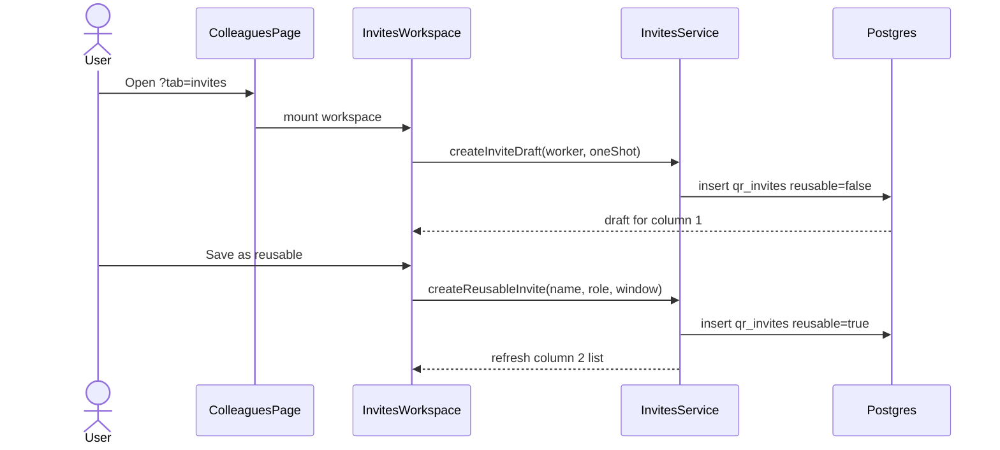
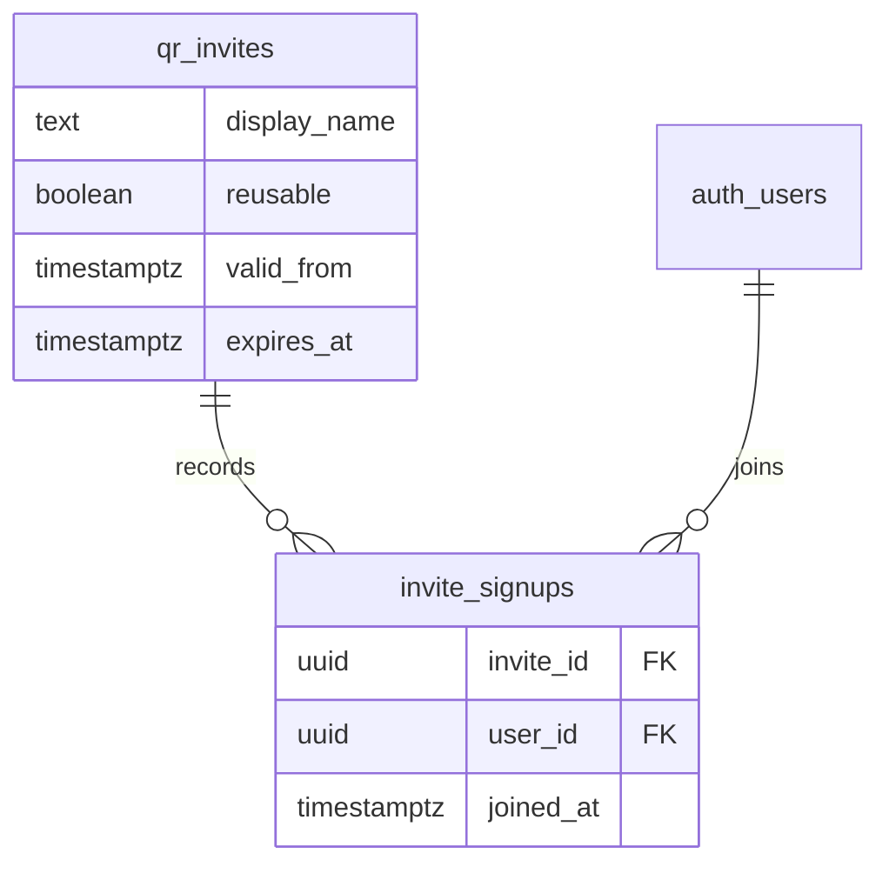

# Colleagues Invites Workspace

## What It Is

Three-column invite surface on Team (`/colleagues?tab=invites`): ephemeral one-shot QR (col. 1), named persistent reusables (col. 2), joined colleagues (col. 3). Child specs linked below.

## What It Looks Like

Desktop: `app-page-grid` keeps the left **Team** rail (channels + DMs). The **center** hosts `app-colleagues-invites-workspace` as a **two-column** grid (`minmax(0, 1fr)` tracks, `gap: var(--spacing-4)`): column 1 is the dual-mode editor; column 2 lists Active and Expired reusable links. The **right rail** hosts column 3 — joined colleagues with **Message**. Below `48rem` center columns stack, then the right rail.

**Links:** [use cases](./colleagues-invites-workspace.use-cases.supplement.md) · [reusable time](./colleagues-invites-workspace.reusable-time.supplement.md) · [acceptance criteria](./colleagues-invites-workspace.acceptance-criteria.supplement.md) · [qr-invite-flow](../settings-overlay/qr-invite-flow.md) · [invite-service](../../service/invites/invite-service.md)

## Domain

Invites add **employees to the organization** with a preset role (`worker` or `clerk`). Reusable link **labels** are internal names for the link (e.g. `April onboarding`, `Field team`) so inviters can tell links apart — not project sites and not the invitee's personal name.

## Where It Lives

- **Route:** `/colleagues` with `?tab=invites`
- **Parent:** `ColleaguesPageComponent` (`pageGridCenter`)
- **Trigger:** outline **Invites** button in `app-member-list` (members rail stays visible)
- **Also:** Settings overlay still hosts one-shot-only [qr-invite-flow](../settings-overlay/qr-invite-flow.md) without columns 2–3

## Actions

| # | User Action | System Response | Triggers |
| --- | --- | --- | --- |
| 1 | Opens Invites tab | Auto-creates one-shot draft (`reusable=false`, default role `worker`, 7-day expiry); renders column 1 | route `tab=invites` |
| 2 | Raises role on draft | Regenerates one-shot token/QR for selected role | `hlmSelect` change |
| 3 | Shares one-shot (copy/email/WhatsApp) | Same as qr-invite-flow; logs `invite_share_events` | share buttons |
| 4 | Clicks **Create link** (reusable compose) | Validates label + validity; creates `reusable=true` row in column 2; column 1 opens selected link with QR + share | footer CTA |
| 5 | Clicks reusable row in either list | Column 1 **edit reusable**; row highlighted | `app-rail-select-list` `itemSelected` |
| 6 | Clicks **Reuse** on expired row | Same as row select; column 1 opens with validity focused for reclaim | action `reuse` |
| 7 | Clicks **Save** (edit mode) | Persists changes; row moves between Active / Expired sections by date | footer CTA |
| 8 | Clicks **Cancel** or deselects | Returns to quick draft | cancel / Escape |
| 9 | Inline **pause** / **copy** / **reuse** | Pause toggles `active`↔`revoked`; copy to clipboard; reuse opens reclaim edit | `actionTriggered` |
| 10 | Clicks **Message** in column 3 | Opens DM | column 3 button |
| 11 | Selects channel/member in rail | Leaves `tab=invites` | colleagues navigation |



## Component Hierarchy

```text
app-colleagues-invites-workspace
├── column-1: app-invite-editor-panel
│   ├── compose kind toggle: oneTime | reusable [quickDraft only]
│   ├── mode quickDraft | editReusable
│   ├── [reusable] display name (hlmInput)
│   ├── role hlmSelect + app-chip status
│   ├── validity presets / custom dates [reusable compose + edit]
│   ├── QR canvas + link + share icons [oneTime + edit; placeholder until reusable created]
│   └── footer: Create link [reusable compose] | Save + Cancel + pause [edit]
├── column-2: app-invite-reusable-links-panel
│   ├── h3/p section chrome
│   ├── [Active links] app-rail-select-list (compact)
│   │   └── items: active | scheduled | paused (not expired)
│   └── [Expired links] app-rail-select-list (compact)
│       └── items: expires_at <= now(); action reuse + copy
└── column-3: app-colleagues-invite-referrals-panel [extend existing]
    └── row: avatar + name + joinedAt + hlmBtn Message
```

## Data

| Field | Source | Notes |
| --- | --- | --- |
| One-shot draft | `qr_invites` where `reusable=false` and current session draft | Not listed in column 2 |
| Reusable list | `qr_invites` where `reusable=true` and `created_by=auth.uid()` | Includes `display_name`, `valid_from`, `expires_at` |
| Joined (one-shot) | `qr_invites.accepted_*` where `created_by=auth.uid()` and `status=accepted` | Column 3 |
| Joined (reusable) | `invite_signups` joined to `profiles` | Column 3; see service spec |

Schema additions (migration required before implementation): `qr_invites.display_name`, table `invite_signups`. **No unlimited validity** for any role — see [reusable-time supplement](./colleagues-invites-workspace.reusable-time.supplement.md).



## State

| Name | Owner | Type | Controls |
| --- | --- | --- | --- |
| `sidebarTab` | ColleaguesPage | `'members' \| 'invites'` | Whether workspace mounts |
| `column1Mode` | editor panel | `'quickDraft' \| 'editReusable'` | Footer CTAs and visible fields |
| `selectedReusableId` | workspace | `string \| null` | Column 2 selection + edit target |
| `editDraft` | editor panel | form model | Unsaved edits until Save |
| `activeOneShot` | editor panel | `QrInviteViewModel \| null` | Quick-draft QR (stashed while editing) |
| `activeReusableItems` | column 2 | `RailSelectListItem[]` | Active section list |
| `expiredReusableItems` | column 2 | `RailSelectListItem[]` | Expired section list |
| `referrals` | column 3 | `InviteReferralViewModel[]` | Joined people |

## File Map

| File | Purpose |
| --- | --- |
| `apps/web/src/app/features/colleagues/invites/colleagues-invites-workspace.component.*` | Three-column layout owner |
| `apps/web/src/app/features/colleagues/invites/colleagues-invite-referrals-panel.component.*` | Column 3 (extend) |
| `apps/web/src/app/features/colleagues/invites/colleagues-invite-reusable-links-panel.component.*` | Column 2 sections + list mapping |
| `apps/web/src/app/features/colleagues/page/colleagues-page.component.*` | Host + routing |
| `apps/web/src/app/core/invites/invites.service.ts` | API per service spec |
| `supabase/migrations/*_invite_signups_and_display_name.sql` | Schema (TBD timestamp) |

## Wiring

- `ColleaguesPageComponent` renders workspace in `pageGridCenter` when `sidebarTab() === 'invites'`; column 3 (`app-colleagues-invite-referrals-panel`) mounts in `pageGridRight`.
- Reuse: `app-rail-select-list`, `app-inline-confirm-action` (if destructive confirm added), `app-chip` (status via `secondaryLabel` or decorative chip in label row), `hlmBtn`, `hlmSelect`, `hlmSwitch` (column 1 edit footer), `app-confirm-dialog`, `ToastService`.
- Column 2 list pattern: mirror [`projects-sidebar`](../../../../apps/web/src/app/features/projects/sidebar/projects-sidebar.component.html) grouped headings + compact `app-rail-select-list`.
- i18n: all visible strings in `docs/i18n/translation-workbench.csv`.

## Settings

- **Invite validity cap**: hard product maximum **365 days** from effective start (`valid_from` or creation). Not configurable to unlimited; applies to **admin** the same as clerk/worker.

## Acceptance Criteria

- [ ] Full checklist: [acceptance-criteria supplement](./colleagues-invites-workspace.acceptance-criteria.supplement.md).
