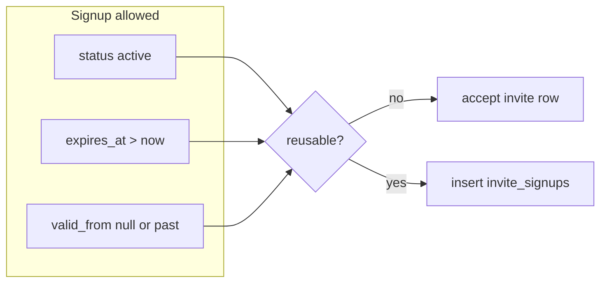

# Colleagues Invites Workspace — Reusable Time & Validity

Parent: [colleagues-invites-workspace.md](./colleagues-invites-workspace.md)

## Validity model

Signup is allowed when **all** hold (enforced in `handle_new_user()`):

1. `status = 'active'`
2. `expires_at > now()`
3. `valid_from IS NULL OR valid_from <= now()`

Interval semantics: **`[valid_from, expires_at)`** half-open (same as dev seeds — e.g. June = start 1 Jun 00:00 Europe/Vienna, end 1 Jul 00:00).

## One-shot vs reusable

| Property | One-shot (column 1) | Reusable (column 2) |
| --- | --- | --- |
| `reusable` | `false` | `true` |
| `display_name` | `NULL` | required (trimmed, max 80) |
| `valid_from` | always `NULL` | optional; `NULL` = effective immediately |
| `expires_at` default | `now() + 7 days` | `now() + 30 days` on create |
| After signup | `status → accepted` | stays `active`; row in `invite_signups` |
| Listed in column 2 | **never** | **always** (until deleted) |

## Maximum duration (no unlimited)

**Product rule:** There is **no** unlimited or open-ended invite validity — **including admin**.

| Rule | Value |
| --- | --- |
| Max span | **365 days** from effective start |
| Effective start | `coalesce(valid_from, created_at)` |
| Enforcement | DB `CHECK` on `qr_invites` + service validation before insert/update |
| UI presets | MUST NOT offer “Unlimited”; longest preset = **1 year** (capped at 365d) |

Local dev seeds with far-future `expires_at` (e.g. `2099`) are **dev-only** exceptions in `scripts/seed-dev-invites.mjs` and MUST NOT be creatable from product UI.

## Derived UI status (reusable rows)

Computed client-side; do not add extra DB status values for v1.

| UI status | Condition | `app-chip` variant |
| --- | --- | --- |
| Active | `status=active` ∧ in window | `status-success` |
| Scheduled | `status=active` ∧ `valid_from > now()` | `status-warning` |
| Paused | `status=revoked` | `neutral` |
| Expired | `expires_at <= now()` | `status-warning` |

Switch **ON** → `status = 'active'` (only if not expired). Switch **OFF** → `status = 'revoked'` (paused; same token when resumed). Switch disabled when expired until user extends validity.

## Column 2 — grouped lists (`app-rail-select-list`)

Reuse the **projects sidebar** pattern: section heading + compact `app-rail-select-list` per group. No custom row component.

### Section partition

| Section | Inclusion rule | Purpose |
| --- | --- | --- |
| **Active links** | `reusable=true` AND `expires_at > now()` | Active, scheduled, or paused links still inside validity window |
| **Expired links** | `reusable=true` AND `expires_at <= now()` | Past end date; eligible for **reclaim** (new validity window, same token) |

Paused (`status=revoked`) links stay in **Active** until `expires_at` passes. Scheduled (`valid_from > now()`) stay in **Active**.

Empty section: show heading + one-line empty hint (not a second list).

### Row mapping (`RailSelectListItem`)

| Field | Source |
| --- | --- |
| `id` | `inviteId` |
| `label` | `display_name` |
| `secondaryLabel` | Validity summary + derived status text (e.g. `Until Jun 30 · Paused`) |
| `leading` | `{ kind: 'icon', name: 'link' }` or status dot color |
| `actions` | See below |

### Inline actions (`actionTriggered`)

| `actionId` | Sections | Behavior |
| --- | --- | --- |
| `copy` | Active, Expired | Clipboard + toast; `stopPropagation` via list |
| `pause` | Active only | Toggle `status` `active` ↔ `revoked`; icon `pause` / `play_arrow`; `active` when paused |
| `reuse` | Expired only | Select row + column 1 edit mode; focus validity presets (reclaim slot) |

Row **click** (`itemSelected`): load column 1 edit mode (same as today). Action buttons do not open edit except `reuse` which is equivalent to select + validity focus.

**Reclaim (Wiederbelegung):** expired link keeps same `id` and token; user sets new `valid_from` / `expires_at` (≤365d span) and Saves → row moves to **Active links**.

## Column 1 — dual mode (edit flow)

Column 1 is the **single place** to create and edit reusables. Column 2 is the **list + selection**; no separate edit dialog.

### Mode `quickDraft` (default)

| UI | Behavior |
| --- | --- |
| Title | e.g. "Quick invite" |
| Role | `hlmSelect`, default `worker`; change regenerates one-shot token |
| QR + share | Ephemeral one-shot (`reusable=false`, 7d); **not** in column 2 |
| Footer primary | **Save as reusable** → inline name + validity (no extra dialog required if name field shown on confirm step) |
| Footer secondary | Regenerate · Revoke (one-shot only) |

### Mode `editReusable` (row selected in column 2)

| UI | Behavior |
| --- | --- |
| Title | Selected link label or "Edit invite link" |
| **Name** | `hlmInput` bound to `display_name`; helper text: label for your reference (e.g. onboarding batch name) |
| Role | `hlmSelect`; if role changes on **Save**, confirm then `regenerateInvite` (new token, QR updates) |
| Validity | Same presets as create (7d / 30d / 90d / month / custom); max 365d |
| Pause | `hlmSwitch` in footer (mirrors column 2 switch) |
| QR + share | **Same token/URL** as selected reusable (not a new row) |
| Footer primary | **`hlmBtn` Save** → `updateReusableInvite(id, payload)` |
| Footer secondary | **Cancel** → deselect row, return to `quickDraft`, fresh one-shot |

### Selection rules (column 2)

- **Click row** (not action button): select + load column 1 edit mode.
- Selected row: `selectedId` on the list that contains it.
- **Cancel** clears selection on both lists.
- Dirty edit + Cancel: `app-confirm-dialog`.

Pause in column 1 edit footer (`hlmSwitch`) mirrors inline `pause` action on the row.

### What is editable vs fixed

| Field | Editable | On Save |
| --- | --- | --- |
| `display_name` | yes | update row |
| `target_role` | yes | regenerate token if changed |
| `valid_from` / `expires_at` | yes | update; enforce 365d cap |
| `status` (pause) | yes (switch) | `active` / `revoked` |
| Token / URL | no direct edit | changes only via role regenerate |

## Create reusable (from quick-draft mode)

1. User clicks **Save as reusable** (quick-draft footer).
2. If name not yet filled in column 1, focus name field or short inline prompt (prefer **inline `hlmInput` above role** on save path — avoid modal if name visible).
3. Validity presets (i18n keys; English fallbacks): **Effective now, 30 days** (default) · 7 · 30 · 90 days · This month · Next month · Custom (max 365d).
4. New row: `target_role` from current one-shot; **new token**; appears in column 2.
5. One-shot in column 1 continues as separate ephemeral draft (unchanged).

## Edit reusable (column 2 → column 1)

Preferred flow (no separate validity dialog):

1. User clicks reusable in column 2.
2. Column 1 enters `editReusable`; form prefilled from row.
3. User changes name, role, dates, pause as needed.
4. **Save** persists; column 2 list refreshes; selection stays on same row.
5. **Cancel** returns to `quickDraft`.

**Extend expired / reclaim:** user selects row in **Expired links** (or clicks **Reuse**) → edit mode → new dates within cap → **Save** → row moves to **Active links**; may set `status=active` when resuming.

**Role change:** confirm copy warns printed QR/link changes; Save calls regenerate then field updates.

## Edit / extend validity (deprecated path)

Row-level **Edit validity** dialog is **removed** in favor of column-1 edit mode above.

## Timezone

- Storage: `timestamptz` (UTC).
- Presets **This month** / **Next month**: computed in **Europe/Vienna** calendar boundaries, stored as UTC.
- Display: user/org locale via Angular `DatePipe` (document `datetime` on `<time>`).

## `invite_signups` (reusable joins)

| Column | Type |
| --- | --- |
| `id` | uuid PK |
| `invite_id` | FK → `qr_invites.id` |
| `user_id` | FK → `auth.users.id` |
| `joined_at` | timestamptz default `now()` |
| Unique | `(invite_id, user_id)` |

`handle_new_user()` MUST `INSERT` into `invite_signups` for every successful reusable signup (in addition to profile/role creation).

Column 3 lists: union of one-shot `accepted_*` and reusable `invite_signups` for invites where `created_by = auth.uid()`, sorted by join time desc.

## Pause vs delete

| Action | DB | UI |
| --- | --- | --- |
| Pause (switch off) | `status = revoked` | Chip: Paused |
| Resume | `status = active` if in window | Chip: Active |
| Delete | soft: `revoked` + hide from list, or hard delete row (TBD: prefer **revoked** + filter hidden archived in v2) | `app-confirm-dialog` |

v1: pause uses `revoked`; list shows paused rows with resume switch.
