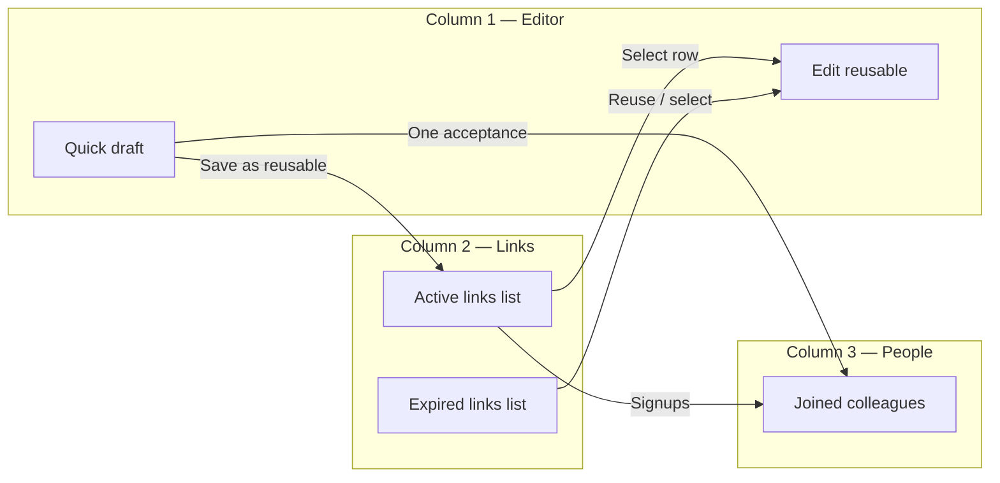

# Colleagues Invites Workspace — Use Cases

Parent: [colleagues-invites-workspace.md](./colleagues-invites-workspace.md)

## Purpose

These scenarios describe how **organization members** invite **new employees** into the company (same `organization_id`, role `worker` or `clerk`). The `display_name` on a reusable link is an **internal label for the inviter** (for example `April onboarding`, `Field crew`, `Office staff`) — not a project site, not the invitee's name, and not shown as a "worksite" in the product.

## UX model (sanity check)

| Column | Job | Makes sense because |
| --- | --- | --- |
| 1 — Editor | Create quick invite **or** edit a selected reusable | One familiar surface (QR + role + share); matches "I need a link now" and "I need to fix that link" |
| 2 — Reusable links | Named links the org can reuse for multiple hires | Hiring is recurring; labels help clerks tell links apart |
| 3 — Joined | Who registered through **my** invites | Closes the loop: invite → join → contact |

**One-shot never listed in column 2:** quick shares are disposable; cluttering the list would punish the common "show QR at lunch" case.

**Click row → edit in column 1:** avoids a second edit UI; QR and share stay in one place.

**Risk / mitigation**

| Risk | Mitigation |
| --- | --- |
| User thinks column-1 name is the new employee's name | Label copy: "Link label (for your reference)"; i18n examples use team/onboarding wording |
| User confuses expired with deleted | **Expired links** section + **Reuse** action; same URL after reclaim |
| Editing feels like editing a person | Column 3 owns people; column 2 owns **links** |
| Quick draft lost while editing | Stash one-shot; Cancel restores new quick draft |
| Role change breaks printed QR | Confirm on Save when role changes |

```mermaid
flowchart TB
  subgraph col1["Column 1 — Editor"]
    T[Kind toggle: one-time | reusable]
    F[Fields: role OR label + role + validity]
    Q[QR + link preview]
    A[Share icons OR Create link]
    T --> F --> Q --> A
    E[Edit reusable selected from col 2]
  end
  subgraph col2["Column 2 — Links"]
    A2[Active links list]
    X2[Expired links list]
  end
  A -->|Create link| A2
  A2 -->|Select row| E
  X2 -->|Reuse / select| E
```

**Column 1 vertical order (compose):**

1. **Kind toggle** — `One-time` vs `Reusable` (hidden while editing a row from column 2).
2. **Fields** — one-time: target role only; reusable: link label, role, validity preset.
3. **QR block** — live QR for one-time; placeholder until reusable is created.
4. **Actions** — one-time: share row (copy / email / WhatsApp); reusable compose: **Create link** only; after create or when editing: share row + Save/Cancel footer.



---

## UC-1: Invite one employee immediately (quick QR)

**Actor:** Clerk at the office  
**Goal:** New hire scans QR and joins as `worker` today.

1. Open Team → **Invites**.
2. Column 1 defaults to **One-time**; shows auto-generated quick invite (worker, 7 days).
3. Clerk shows QR or taps WhatsApp share.
4. New employee registers; appears in column 3 after acceptance.

**Success:** Employee in org with `worker` role; one-shot marked accepted; not listed in column 2.

---

## UC-2: Raise role before sharing (clerk invite)

**Actor:** Admin  
**Goal:** Invite future team lead as `clerk`, not `worker`.

1. Open Invites; default quick draft is `worker`.
2. Change role to **Clerk** in column 1 (token regenerates).
3. Share link.
4. Invitee joins with clerk role.

**Success:** `target_role=clerk` on the one-shot row; column 3 shows new member.

---

## UC-3: Create a reusable link for ongoing hiring

**Actor:** HR clerk  
**Goal:** Same link on intranet poster for multiple hires this quarter.

1. Set role to `worker` on quick draft (or switch to **Reusable** first).
2. Toggle **Reusable**.
3. Enter link label: `Q2 onboarding`.
4. Keep default validity (30 days) or pick 90 days.
5. Click **Create link**.
6. Row appears in column 2; column 1 opens the link with QR and share actions.

**Success:** Multiple signups allowed; each recorded in `invite_signups`; link stays in column 2.

---

## UC-4: Edit a reusable link (select row → column 1)

**Actor:** Clerk  
**Goal:** Rename link and extend validity.

1. Click `Q2 onboarding` in column 2.
2. Column 1 switches to edit mode with prefilled fields.
3. Rename to `Summer onboarding`; extend end date by 30 days.
4. Click **Save**.

**Success:** Same token/URL; column 2 shows updated label and dates; QR unchanged.

---

## UC-5: Pause hiring without deleting the link

**Actor:** Admin  
**Goal:** Temporarily stop new signups; resume later.

1. Toggle **pause** on row in column 2 (or in column 1 while editing).
2. New registration attempts fail server-side.
3. Later, toggle on and **Save** if editing.

**Success:** `status=revoked` while paused; existing members unaffected.

---

## UC-6: See who joined through my invites

**Actor:** Clerk who shared links  
**Goal:** Know who used my invites and when.

1. Open Invites; scan column 3 **Joined via your invite**.
2. See name + join timestamp for one-shot and reusable signups.

**Success:** List sorted by join time; only invites `created_by` current user.

---

## UC-7: Message someone who joined via my invite

**Actor:** Clerk  
**Goal:** Welcome new colleague in chat.

1. In column 3, click **Message** next to new member.
2. App opens DM thread (or creates DM channel).

**Success:** Navigates to chat with that `user_id`; invites tab may close per page rules.

---

## UC-8: Cancel editing a reusable (discard changes)

**Actor:** Clerk  
**Goal:** Abandon edits without corrupting the link.

1. Select reusable in column 2; change name in column 1.
2. Click **Cancel** (or deselect row).
3. Confirm if dirty.

**Success:** Reusable unchanged in DB; column 1 returns to fresh quick draft.

---

## UC-9: Reclaim an expired reusable link

**Actor:** Admin  
**Goal:** Put an expired link back into service with a new validity window (same URL on poster).

1. Open **Expired links** in column 2.
2. Click **Reuse** (or select row) → column 1 edit mode.
3. Set new end date (within 365d policy); turn pause off if needed.
4. **Save**.

**Success:** Row moves to **Active links**; same token/URL; signups work again.

---

## UC-10: Change role on reusable (token rotation)

**Actor:** Admin  
**Goal:** Link should grant `clerk` instead of `worker`.

1. Select reusable in column 2.
2. Change role to Clerk in column 1.
3. **Save** → confirm dialog ("QR and link will change").
4. New QR reflects new token.

**Success:** Old URL invalid; column 2 row keeps same `id` and label; new `token_hash`.

---

## Out of scope (v1)

- Inviting to a **project** or **site** (org-only).
- Unlimited validity (all roles capped at 365 days).
- Listing one-shot drafts in column 2.
- Admin changing role **after** join (member management elsewhere).

## Traceability

| Use case | Spec sections |
| --- | --- |
| UC-1, UC-2 | quickDraft, [qr-invite-flow](../settings-overlay/qr-invite-flow.md) |
| UC-3 | Create reusable |
| UC-4, UC-9, UC-10 | editReusable, column 1 dual mode |
| UC-5 | Pause / `revoked` |
| UC-6, UC-7 | Column 3, `invite_signups` |
| UC-8 | Cancel + dirty guard |
