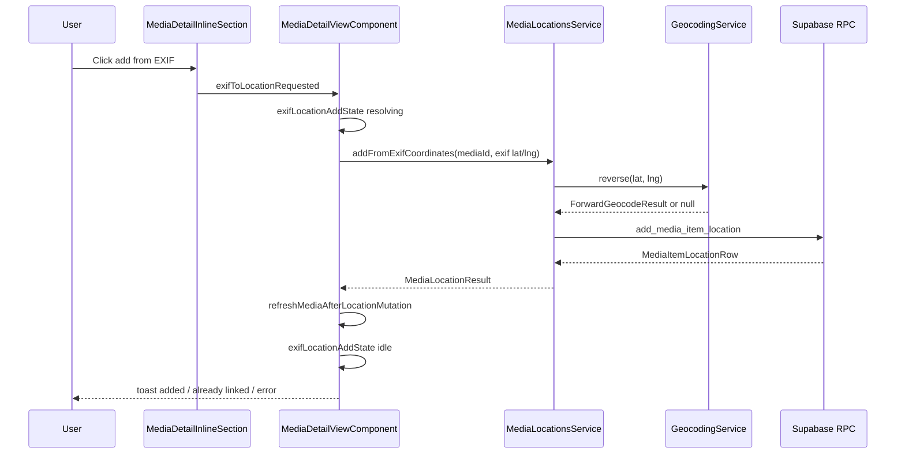
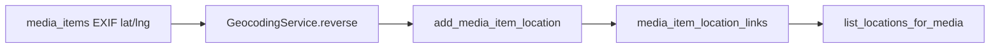

# Media Detail — Inline Section (Details block)

> **Parent:** [media-detail-view.md](media-detail-view.md)  
> **Sibling:** [media-detail-inline-editing.md](media-detail-inline-editing.md) (field-edit patterns)  
> **Location target:** [media-detail-location-section.md](media-detail-location-section.md)  
> **Service:** [media-locations-service.md](../../service/media-locations/media-locations-service.md)

## What It Is

Read-mostly **Details** rows under the quick-info chips: file type, **EXIF coordinates**, original filename, captured date, projects, and uploaded timestamp. Owns the **EXIF → location** affordance: reverse-geocode `media_items.exif_latitude` / `exif_longitude` and append a row in the Location section via `MediaLocationsService`.

Orchestration (geocode + RPC + list reload) lives in `MediaDetailViewComponent`; this component emits intent and renders row-level FSM.

## What It Looks Like

Standard five-slot `detail-row` grid (see `_detail-row-slots.scss`). EXIF row uses `photo_camera` icon, label "EXIF coordinates", monospace degree value on the right.

When EXIF GPS exists, **slot `l1`** shows a square ghost icon button (`add_location`, same rail as Captured/Projects edit). Slot `l2` stays a spacer. Full phrase **"Add as address to locations"** is exposed via `title` and `aria-label` (`workspace.imageDetail.action.addExifToLocations*`). Icon reveals on row hover/focus-within. While resolving, icon switches to `progress_activity` and the button is disabled.

When EXIF GPS is absent, `l2` stays an empty spacer; no button.

## Where It Lives

- **Code:** `apps/web/src/app/shared/workspace-pane/media-detail/media-detail-inline-section/`
- **Parent template:** `media-detail-view.component.html` (above Location section)
- **Appears when:** Media detail is open and `isImageLike()` is true

## Visual Behavior Contract

### Ownership matrix

| Behavior | Visual geometry owner | Stacking context owner | Interaction hit-area owner | Selector(s) | Layer | Test oracle |
| --- | --- | --- | --- | --- | --- | --- |
| EXIF row layout | `.detail-row` (EXIF branch) | `.detail-row` | `.detail-row__center` | `.detail-row--readonly` | content | mono coords right-aligned |
| Add-from-EXIF control | `.detail-row-action--l2` | `.detail-row` | `.detail-row-action--l2` button | `add_location` icon | actions | click starts resolve |
| Resolving emphasis | `.detail-row-action--l2` | `.detail-row` | same button | `progress_activity` icon | actions | disabled + busy |

### Ownership triad (EXIF add control)

| Behavior | Geometry | State | Visual | Same element? |
| --- | --- | --- | --- | --- |
| Add icon button | `.detail-row-action--l2` | `[attr.data-state]` on EXIF `.detail-row` | `.detail-row-action--l2` | ✅ |

### Pseudo-CSS (EXIF row)

```css
.detail-row--exif-location-add[data-state='resolving'] .detail-row-action--l2:is(button) { pointer-events: none; }
.detail-row--exif-location-add[data-state='hidden'] .detail-row-action--l2 { visibility: hidden; }
```

## Actions

| # | User action | System response | Triggers |
| --- | --- | --- | --- |
| 1 | Clicks **Add as address to locations** on EXIF row | Parent reverse-geocodes EXIF lat/lng, then `add_media_item_location` (or links deduped row) | `exifToLocationRequested` output |
| 2 | EXIF GPS missing | No button; row read-only | — |
| 3 | Click while parent `saving()` or row `resolving` | Ignored (disabled) | — |
| 4 | Geocode succeeds | Location list reload; success toast `location.toast.added` | parent handler |
| 5 | Geocode fails | Still creates/links location with EXIF coords; address fields null or coord fallback label | `addFromExifCoordinates` partial path |
| 6 | Deduped location already linked | Idempotent link; toast `location.picker.already_linked` when parent detects duplicate link | compare returned `location.id` to list |

## EXIF → location FSM

Normative state enum: `ExifLocationAddState = 'hidden' | 'idle' | 'resolving'`.

Host: EXIF `.detail-row` exposes `[attr.data-state]="exifLocationAddState()"`.

| State | Visual | Allowed transitions |
| --- | --- | --- |
| `hidden` | No add button (`l2` spacer) | → `idle` when `hasExifCoordinates` |
| `idle` | Compact add button enabled (unless parent saving) | → `resolving` on click |
| `resolving` | Button disabled; busy indicator | → `idle` on terminal success or error |

### Transition map (TypeScript authority)

```ts
const EXIF_LOCATION_ADD_TRANSITIONS: Record<ExifLocationAddState, ExifLocationAddState[]> = {
  hidden: ['idle'],
  idle: ['resolving'],
  resolving: ['idle'],
};
```

Parent owns transition calls; child displays `exifLocationAddState` input derived from parent signal during async work.

### Transition choreography

| Edge | Duration token | Notes |
| --- | --- | --- |
| `idle` → `resolving` | instant | disable button |
| `resolving` → `idle` | instant | re-enable after RPC + reload |

## Component hierarchy

```
MediaDetailInlineSection
└── detail-section "Details"
    ├── Type row (readonly)
    ├── EXIF row [image-like only]
    │   ├── l2: Add as address to locations (FSM)
    │   └── center: icon + label + mono coords
    ├── Original filename (readonly)
    ├── Captured (editable)
    ├── Projects (editable)
    └── Uploaded (readonly)
```

## Wiring



## Data requirements

| Source | Fields | Use |
| --- | --- | --- |
| `media_items` | `exif_latitude`, `exif_longitude` | Reverse-geocode input only (immutable EXIF) |
| `MediaLocationsService.addFromExifCoordinates` | — | New facade: reverse + `addLocation` / `addFromGeocodeSuggestion` |
| `list_locations_for_media` | — | Post-mutation reload (parent exit criterion) |



## State (component inputs/outputs)

| Name | Type | Default | Controls |
| --- | --- | --- | --- |
| `exifLocationAddState` | `ExifLocationAddState` | `hidden` | `[attr.data-state]` on EXIF row |
| `saving` | `boolean` | `false` | Disables add button in `idle` |
| `hasExifCoordinates` | computed | false | `hidden` vs `idle` |
| `exifToLocationRequested` | output | — | Parent starts pipeline |

## File map

| File | Purpose |
| --- | --- |
| `media-detail-inline-section.component.ts/html/scss` | EXIF row + FSM display |
| `media-detail-view.component.ts` | Handler + `exifLocationAddState` signal |
| `media-locations.service.ts` | `addFromExifCoordinates` |
| `_detail-row-slots.scss` | Shared square action rail (no EXIF-specific modifier) |
| `translation-workbench.csv` | i18n keys |

## i18n keys

| Key | English fallback |
| --- | --- |
| `workspace.imageDetail.action.addExifToLocations` | Add as address to locations |
| `workspace.imageDetail.action.addExifToLocations.aria` | Add reverse-geocoded address from EXIF coordinates to locations |
| `workspace.imageDetail.toast.exifLocationAdded` | Location added from EXIF coordinates |
| `workspace.imageDetail.toast.exifLocationGeocodeFailed` | Address could not be resolved; location saved with GPS coordinates only |

## Acceptance criteria

- [ ] EXIF row shows `add_location` icon in `l2` when `exif_latitude` and `exif_longitude` are set
- [ ] Click runs reverse geocode on EXIF coords (not corrected/display coords)
- [ ] Success appends a location row and refreshes list + merged `media()` display fields
- [ ] `resolving` disables the button until the parent handler finishes
- [ ] Reverse geocode failure still persists a location with EXIF lat/lng
- [ ] Already-linked deduped location shows `location.picker.already_linked` toast
- [ ] FSM transition map matches `EXIF_LOCATION_ADD_TRANSITIONS`
- [ ] Stable-state comments in TS/HTML/SCSS reference this spec
